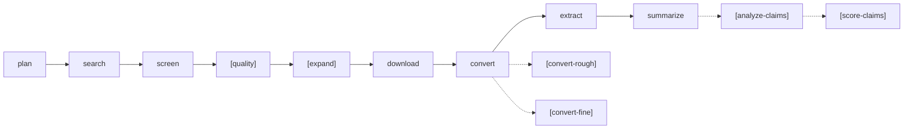
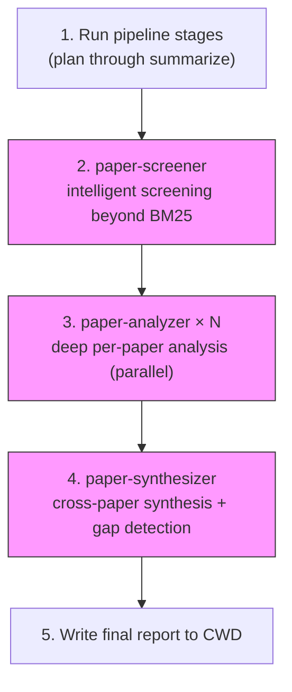

# Academic Paper Research

End-to-end academic paper research pipeline producing auditable, reproducible
artifacts. Searches arXiv, Google Scholar, and HuggingFace daily papers; screens relevance; evaluates
quality; expands via citation graph; downloads PDFs; converts to Markdown;
and generates evidence-backed summaries with sub-agent analysis.

## Prerequisites

| Requirement | Install Command | When Needed |
|-------------|----------------|-------------|
| CLI tool | `pipx install research-pipeline` | Always |
| Docling backend | `pipx inject research-pipeline docling` | Convert (MIT, good tables/equations) |
| Marker backend | `pipx inject research-pipeline marker-pdf` | Convert (best accuracy 95.7%, GPL-3.0) |
| PyMuPDF4LLM backend | `pipx inject research-pipeline pymupdf4llm` | Convert (fastest 10-50x, AGPL) |
| MinerU backend | `pipx inject research-pipeline magic-pdf` | Convert (TEDS 93.42% tables, MIT) |
| Scholar (free) | `pipx inject research-pipeline scholarly` | `--source scholar` or `--source all` |
| Scholar (paid) | `pipx inject research-pipeline google-search-results` + set `RESEARCH_PIPELINE_SERPAPI_KEY` | Production Scholar |

## CLI Invocation

**IMPORTANT**: `research-pipeline` is installed via **pipx** and available
globally. Always call it **directly** — never prefix with `uv run`, `python -m`,
or any other wrapper:

```bash
# CORRECT — call directly
research-pipeline plan "topic" --config ~/.claude/skills/research-pipeline/config.toml

# WRONG — do NOT use uv run (only for development in the source repo)
# uv run research-pipeline plan "topic" --config ...
```

**Every CLI invocation MUST pass `--config ~/.claude/skills/research-pipeline/config.toml`**
to load settings regardless of CWD. Abbreviated as `CFG` below.

## Pipeline Overview



7 core stages plus optional quality scoring, citation expansion, and tiered
conversion. After the pipeline, sub-agents (paper-screener, paper-analyzer,
paper-synthesizer) provide intelligent analysis. For system-building goals,
iterative synthesis fills gaps until implementation-ready.

## Command Reference

All commands accept `--config CFG` (required) and `--verbose` (optional).
Stage commands require `--run-id ID`.

| # | Stage | Command | Key Options |
|---|-------|---------|-------------|
| 1 | Plan | `research-pipeline plan "topic" --config CFG` | `--run-id ID` (optional, auto-generated) |
| 2 | Search | `research-pipeline search --run-id ID --config CFG` | `--source arxiv\|scholar\|huggingface\|all` |
| 3 | Screen | `research-pipeline screen --run-id ID --config CFG` | `--resume` |
| 3b | Quality | `research-pipeline quality --run-id ID --config CFG` | _(optional stage)_ |
| 3c | Expand | `research-pipeline expand --run-id ID --paper-ids "ID1,ID2" --config CFG` | `--direction both\|citations\|references`, `--limit N`, `--reference-boost F`, `--bfs-depth D`, `--bfs-top-k K`, `--bfs-query "term1,term2"`, `--snowball`, `--snowball-max-rounds N`, `--snowball-max-papers N`, `--snowball-decay-threshold F`, `--snowball-decay-patience N` |
| 4 | Download | `research-pipeline download --run-id ID --config CFG` | `--force` |
| 5 | Convert | `research-pipeline convert --run-id ID --config CFG` | `--backend docling\|marker\|pymupdf4llm\|mineru`, `--force` |
| 5b | Rough | `research-pipeline convert-rough --run-id ID --config CFG` | `--force` |
| 5c | Fine | `research-pipeline convert-fine --run-id ID --paper-ids "ID1,ID2" --config CFG` | `--backend B`, `--force` |
| 6 | Extract | `research-pipeline extract --run-id ID --config CFG` | — |
| 7 | Summarize | `research-pipeline summarize --run-id ID --config CFG` | — |
| 8 | Analyze Claims | `research-pipeline analyze-claims --run-id ID` | — |
| 9 | Score Claims | `research-pipeline score-claims --run-id ID` | — |
| All | Run | `research-pipeline run "topic" --config CFG` | `--source all`, `--profile quick\|standard\|deep\|auto` |
| — | Inspect | `research-pipeline inspect --run-id ID` | `--workspace PATH` |
| — | Convert File | `research-pipeline convert-file path.pdf --config CFG` | `-o DIR`, `--backend B` |
| — | Index | `research-pipeline index --list` | `--gc`, `--search QUERY`, `--search-limit N` |

All run artifacts stored under `runs/<run_id>/`.

### Pipeline Profiles (v0.12.6+)

Choose execution depth with `--profile`:

| Profile | Stages | Use Case |
|---------|--------|----------|
| `quick` | plan→search→screen→summarize | Fast overview from abstracts only (no PDFs) |
| `standard` | Full 7-stage pipeline | Default — full evidence-based analysis |
| `deep` | standard + expand + quality + claim analysis + TER loop | Comprehensive research with citation expansion |
| `auto` | Detected from query complexity | Short queries → quick; complex/survey → deep |

```bash
# Fast abstract-only overview
research-pipeline run --profile quick "transformer attention"

# Full pipeline (default)
research-pipeline run "local memory systems for AI agents"

# Deep research with citation expansion
research-pipeline run --profile deep "comprehensive survey of memory in LLMs"

# Auto-detect from query
research-pipeline run --profile auto "what is RLHF"
```

### Iterative Gap-Filling (v0.12.7+)

**THINK→EXECUTE→REFLECT (TER) loop** for the deep profile:
- **THINK**: Analyzes synthesis to identify coverage gaps and open questions
- **EXECUTE**: Generates targeted queries to fill gaps
- **REFLECT**: Checks convergence (max 3 iterations, stops when gaps stabilize)

Use `--ter-iterations 0` to disable, or `--ter-iterations 5` for more depth.

```bash
# Deep with default TER (3 iterations)
research-pipeline run --profile deep "survey of AI memory systems"

# More TER iterations for thorough gap-filling
research-pipeline run --profile deep --ter-iterations 5 "comprehensive LLM survey"

# Disable TER loop
research-pipeline run --profile deep --ter-iterations 0 "quick deep run"
```

### Phase-Aware Model Routing (v0.13.6+)

**Route LLM calls to different providers per pipeline phase:**

| Tier | Stages | Use Case |
|------|--------|----------|
| `mechanical` | plan, search, download, convert, extract, index | Cheap/local model (Ollama) |
| `intelligent` | screen, summarize, expand, quality, analyze, aggregate | Capable cloud model (GPT-4, Claude) |
| `critical_safety` | validate, compare, security | Premium model or multi-model consensus |

Configure in `config.toml`:
```toml
[llm_routing]
enabled = true

[llm_routing.mechanical]
provider = "ollama"
model = "llama3.2"

[llm_routing.intelligent]
provider = "openai"
model = "gpt-4o"
api_key = "sk-..."

[llm_routing.critical_safety]
provider = "openai"
model = "gpt-4o"
api_key = "sk-..."
```

When routing is disabled (default), all stages use the single `[llm]` provider.
Fallback: if a tier has no provider, it falls back to the next-higher tier.

### Human-in-the-Loop Gates (v0.13.7+)

**Interactive approval checkpoints between pipeline stages:**

By default, gates auto-approve. Use `--interactive` for manual review:
```bash
# Auto-approve (default — fully autonomous)
research-pipeline run "topic" --config CFG

# Interactive mode — pause after screen, download, summarize for review
research-pipeline run "topic" --interactive --config CFG
```

Configure gate positions in `config.toml`:
```toml
[gates]
enabled = true
auto_approve = false
gate_after = ["screen", "download", "summarize"]
```

At each gate, the pipeline shows a summary of completed work and prompts:
- `[a]pprove` — continue to next stage
- `[r]eject` — stop pipeline
- `[s]kip` — skip remaining gates (auto-approve rest)

### Multi-Session Coherence (v0.13.8+)

Evaluates knowledge coherence across multiple pipeline runs on the same or
related topics. Detects contradictions, tracks knowledge evolution, and
computes a composite coherence score.

**CLI usage:**
```bash
research-pipeline coherence <RUN_A> <RUN_B> [<RUN_C> ...]
```

**MCP tool:** `tool_coherence` — evaluates coherence across 2+ runs.

**Coherence dimensions:**
- **Factual Consistency** — findings that appear in multiple runs agree
- **Temporal Ordering** — knowledge evolution is chronologically sound
- **Knowledge Update Fidelity** — superseded findings are properly replaced
- **Contradiction Detection** — conflicting claims are surfaced
- **Overall Score** — weighted composite (0–1, higher is better)

**When to use:**
- After running the pipeline multiple times on the same/evolving topic
- After `expand` iterations to check if new papers contradict earlier findings
- To validate that gap-filling runs produced consistent results

### Memory Consolidation (v0.13.9+)

Episodic → semantic consolidation engine following the SEA/MLMF three-tier
memory architecture. Compresses old run episodes into thematic rules,
prunes stale knowledge, and tracks semantic drift between runs.

**CLI usage:**
```bash
# Scan workspace and consolidate automatically
research-pipeline consolidate

# Ingest specific runs, dry-run first
research-pipeline consolidate run1 run2 run3 --dry-run

# With custom thresholds
research-pipeline consolidate --capacity 50 --threshold 0.7 --min-support 3
```

**MCP tool:** `tool_consolidation` — consolidate cross-run memory.

**Consolidation operations:**
- **Episode Ingestion** — extracts synthesis results into episode store
- **Recurring Finding Detection** — fuzzy-matched findings across runs
- **Rule Promotion** — promotes recurring findings to stable semantic rules
- **Staleness Pruning** — removes old episodes covered by rules
- **Drift Tracking** — measures semantic shift between consecutive runs

**When to use:**
- After 5+ runs accumulate on similar topics
- Periodically as part of research hygiene
- Before starting a new research topic (consolidate old knowledge first)

### Epistemic Blinding Audits (v0.13.10+)

A/B blinding protocol for detecting LLM prior contamination in analysis outputs
(arXiv 2604.06013). Scans findings for identifying feature references (authors,
titles, venues, years, citations) and scores how much the analysis relies on
identity rather than evidence.

```bash
# Audit latest run in workspace
research-pipeline blinding-audit

# Audit specific run with custom threshold
research-pipeline blinding-audit --run-id <ID> --threshold 0.3

# Output raw JSON
research-pipeline blinding-audit --json
```

**MCP tool:** `tool_blinding_audit` — run epistemic blinding audit.

**Contamination detection:**
- **Author references** — findings mentioning author names (weight 0.30)
- **Title references** — findings echoing paper titles (weight 0.25)
- **Venue references** — findings citing specific venues (weight 0.20)
- **Citation patterns** — bracket/parenthetical citation use (weight 0.15)
- **Year references** — findings mentioning publication years (weight 0.10)

**Score interpretation:**
- `< 0.2` → LOW: analysis is evidence-based
- `0.2 – 0.4` → MEDIUM: some identity reliance, consider blinded re-analysis
- `> 0.4` → HIGH: strongly recommend re-analysis with blinded inputs

**When to use:**
- After every synthesis run to validate evidence quality
- When results seem suspiciously aligned with well-known papers
- As a quality gate before publishing research reports

## Step-by-Step Workflow

### Step 0: Check for Existing Report

Before starting, look for `<topic-slug>-research-report.md` in the CWD.
If found:

1. **Read it as prior context** — extract already-analyzed paper IDs, prior
   findings, confidence levels, and gap classifications.
2. **Do NOT append-merge** into the old report. Appending produces duplicated
   findings, stale conclusions, and patchwork reports.
3. **Generate a fresh report** from the current evidence state after all
   pipeline stages and sub-agent analysis complete.
4. Optionally include a **Prior Run Comparison** section in the new report:
   ```markdown
   ## Prior Run Comparison
   - Previous report: <filename>
   - Newly added papers: ...
   - Confidence changes: ...
   - Gaps resolved: ...
   - Remaining gaps: ...
   ```
5. The old report becomes a historical artifact — rename it to
   `<topic-slug>-research-report.<date>.md` before writing the new one.

### Step 1: Plan

```bash
research-pipeline plan "multimodal RAG for long-document QA" --config CFG
```

Output: `runs/<run_id>/plan/query_plan.json` with normalized topic,
must/nice/negative terms, time window (default: 6 months).
Report the run ID and parsed search terms to the user.

### Step 1.5: Validate the Query Plan (RECOMMENDED)

Since v0.4.0, the plan stage auto-generates reasonable defaults:
- **Stop words** are filtered (e.g., "with", "for", "the")
- **must_terms** capped at 3, overflow goes to **nice_terms**
- **query_variants** auto-generated (up to `max_query_variants` from config)

Use the verification gate to confirm structural validity:
```bash
research-pipeline verify --run-id <RUN_ID> --stage plan
```
This checks that `must_terms` (≥1) and `query_variants` (≥2) are present.

You should still review and refine:

1. **Verify `must_terms`** — ensure they capture the core concepts
2. **Cap `must_terms` to 2** if queries are still too narrow
3. **Expand query_variants** — add synonym-expanded variants using different
   vocabulary for each key concept (the auto-generated ones use term
   reordering; add vocabulary substitutions manually)
4. Include a "core-concept-only" variant without domain qualifiers
5. Cross-check: would a paper using different terminology still match?
6. Set `primary_months` to the user's requested time window

Write the improved plan back to `query_plan.json`.
Consult `references/query-optimization.md` for synonym tables and examples.

### Step 2: Search

```bash
research-pipeline search --run-id <RUN_ID> --source all --config CFG
```

`--source all` searches **arXiv + Google Scholar + HuggingFace daily papers**
in parallel. Results are deduplicated by arXiv ID and normalized title.

Available source values for `--source`:

| Value | Searches | Notes |
|-------|----------|-------|
| `arxiv` | arXiv API | Default source |
| `scholar` | Google Scholar | Requires `scholarly` or SerpAPI |
| `huggingface` | HuggingFace daily papers | Keyword-filtered, recent papers |
| `all` | arXiv + Scholar + HuggingFace | All searchable sources in parallel |

**Note**: Semantic Scholar, OpenAlex, and DBLP are used by the `expand`
(citation graph) and `quality` (author h-index) commands but are **not**
searchable via `--source`.

HuggingFace configuration in `config.toml`:
```toml
[sources]
huggingface_enabled = true
huggingface_min_interval = 0.5  # seconds between requests
huggingface_limit = 100         # max daily papers to fetch
```

Report: candidates per source, total unique after dedup, run ID.

### Step 3: Screen

```bash
research-pipeline screen --run-id <RUN_ID> --config CFG
```

BM25 title/abstract scoring + category matching + recency bonus.
Content is automatically sanitized (prompt injection patterns stripped)
before scoring. Output includes `depth_tiers.json` with confidence-gated
retrieval depth classification (high/medium/low) for adaptive expansion.
Report: total scored, shortlist count, top 5 papers with scores.

**Query refinement feedback** (v0.12.0+): After screening, the pipeline
automatically analyzes term overlap between the query and shortlisted
papers. Results are saved to `query_refinement.json` with:
- `suggested_additions`: domain terms frequent in top-K but absent from query
- `suggested_removals`: query terms with low coverage in results
- `emergent_terms`: newly discovered terms from the corpus
- `term_coverage`: per-term hit rate across shortlisted papers
Use this feedback to refine the query plan in iterative searches.

**Diversity-aware shortlisting** (v0.11.0+): Use `--diversity` to enable
MMR-style reranking that balances relevance with coverage of different
categories, time periods, and sources. Prevents echo-chamber shortlists.
```bash
research-pipeline screen --run-id <RUN_ID> --diversity --diversity-lambda 0.3 --config CFG
```
`--diversity-lambda` controls balance: 0.0 = pure relevance, 1.0 = pure
diversity, 0.3 (default) gives moderate diversity.

**LLM second-pass screening** (v0.11.0+): When LLM is configured
(`[llm] enabled = true`), the screen stage automatically runs a second
pass using the LLM judge on shortlisted papers. The final score becomes
a 60/40 blend of heuristic and LLM scores. When LLM is not configured,
screening uses heuristic-only mode (default).

**Known limitation**: BM25 screening can be noisy with broad topic terms
(e.g., "agent" + "evaluation"). If the shortlist contains many irrelevant
papers, use the paper-screener sub-agent for intelligent re-screening.

**User feedback loop** (v0.13.0+): After reviewing screening results,
record accept/reject decisions to improve future screening:
```bash
# Accept relevant papers
research-pipeline feedback --run-id <RUN_ID> --accept 2401.12345 --accept 2401.12346

# Reject irrelevant papers
research-pipeline feedback --run-id <RUN_ID> --reject 2401.99999 --reason "off-topic"

# View feedback stats and current adjusted weights
research-pipeline feedback --run-id <RUN_ID> --show

# Recompute ELO-adjusted BM25 weights from all accumulated feedback
research-pipeline feedback --run-id <RUN_ID> --adjust
```
Accumulated feedback automatically adjusts BM25 screening weights via
ELO-style learning. After ≥5 feedback entries (with both accepts and
rejects), the pipeline uses feedback-adjusted weights for future runs.

### Step 3.3: Three-Channel Eval Logging (Automatic)

Three evaluation channels capture pipeline execution for observability:

1. **Execution traces** — Structured JSONL flow with timing and causality
   (`logs/traces.jsonl`)
2. **Audit database** — SQLite who/what/when records (`logs/audit.db`)
3. **Environment snapshots** — Filesystem state at stage boundaries
   (`snapshots/`)

Eval logging is automatic during pipeline runs. To inspect:

```bash
# View all channels
research-pipeline eval-log --run-id <RUN_ID>

# View specific channel
research-pipeline eval-log --run-id <RUN_ID> --channel traces --stage screen
research-pipeline eval-log --run-id <RUN_ID> --channel audit --limit 20
research-pipeline eval-log --run-id <RUN_ID> --channel summary
```

Use `query_eval_log` MCP tool for programmatic access.

### Step 3.4: Evidence-Only Aggregation (Optional)

After synthesis, aggregate evidence while stripping rhetoric, normalizing
length, and requiring evidence citations. Merges duplicate statements.

```bash
# Run evidence aggregation on synthesis results
research-pipeline aggregate --run-id <RUN_ID>

# Require minimum evidence pointers
research-pipeline aggregate --run-id <RUN_ID> --min-pointers 1

# Output as JSON
research-pipeline aggregate --run-id <RUN_ID> --format json

# Disable rhetoric stripping
research-pipeline aggregate --run-id <RUN_ID> --no-strip-rhetoric
```

Output: `summarize/evidence_aggregation.json` and `evidence_aggregation.md`.
Use `aggregate_evidence` MCP tool for programmatic access.

### Step 3.5: HTML Report Export (Optional)

Export the synthesis report as a self-contained HTML document with citation
links, confidence badges, dark mode, and responsive design:

```bash
# From structured synthesis report
research-pipeline export-html --run-id <RUN_ID>

# From any Markdown file
research-pipeline export-html --markdown report.md -o report.html --title "My Research"
```

Output: `summarize/synthesis_report.html`.
Use `export_html` MCP tool for programmatic access.

### Step 3.6: Quality Evaluation (Optional)

```bash
research-pipeline quality --run-id <RUN_ID> --config CFG
```

Composite quality scoring: citation impact, venue reputation, author
credibility, and recency bonus. Papers flagged as retracted or fabricated
(safety_flag) are zeroed automatically — safety acts as a multiplicative
gate. Output: `quality/quality_scores.jsonl`.

### Step 3.7: Citation Graph Expansion (Optional)

```bash
research-pipeline expand --run-id <RUN_ID> --paper-ids "2401.12345,2402.67890" --direction both --limit 20 --config CFG
```

**`--paper-ids` is required.** Expand the candidate pool by traversing the
citation graph via Semantic Scholar. `--direction citations` finds papers
citing yours; `references` finds their references; `both` does both.

**Backward-preference**: Use `--reference-boost 2.0` when `--direction both`
to fetch 2× more references than citations. Research shows backward references
yield +10-20 pp higher recall because foundational papers curate high-quality
reference lists. Default 1.0 (equal treatment).

**BFS multi-hop expansion** (v0.10.0+): Use `--bfs-depth 2` to perform
breadth-first traversal with BM25 pruning at each hop (+24pp recall).
Requires `--bfs-query "term1,term2"` for relevance pruning. Example:
```bash
research-pipeline expand --run-id <RUN_ID> --paper-ids "2401.12345" \
  --bfs-depth 2 --bfs-top-k 10 --bfs-query "transformer,attention" --config CFG
```

**Snowball expansion** (v0.13.3+): Use `--snowball` for iterative bidirectional
snowball sampling with budget-aware stopping. Each round uses newly discovered
high-relevance papers as seeds for the next round. Stops automatically when:
- Max rounds reached (`--snowball-max-rounds`, default 5)
- Max papers reached (`--snowball-max-papers`, default 200)
- Marginal relevance decays below threshold (`--snowball-decay-threshold`, default 0.10)
- Category diversity saturates (no new categories for 3 consecutive rounds)

```bash
research-pipeline expand --run-id <RUN_ID> --paper-ids "2401.12345" \
  --snowball --bfs-query "harness,engineering" --snowball-max-rounds 5 --config CFG
```

Outputs `snowball_report.md` and `snowball_stats.json` alongside
`expanded_candidates.jsonl`.

### Step 4: Download

```bash
research-pipeline download --run-id <RUN_ID> --config CFG
```

Rate-limited, SHA-256 verified, idempotent. Report: count, size, failures.

The download stage uses **lenient shortlist parsing** — you can safely edit
`shortlist.json` to add or remove papers without providing every field.
A minimal entry needs only the `paper` object (with `arxiv_id`, `version`,
`title`, `authors`, `published`, `updated`, `categories`, `primary_category`,
`abstract`, `abs_url`, `pdf_url`), plus `download: true`. Missing fields
like `cheap`, `download_reason`, and `final_score` will be auto-filled
with sensible defaults.

### Step 5: Convert

```bash
research-pipeline convert --run-id <RUN_ID> --config CFG
```

Default backend: `docling`. Override with `--backend marker`, `--backend pymupdf4llm`, or `--backend mineru`.

**Two-tier conversion** (recommended for 10+ papers):

```bash
# Fast rough conversion of ALL PDFs
research-pipeline convert-rough --run-id <RUN_ID> --config CFG

# High-quality conversion of SELECTED papers only
research-pipeline convert-fine --run-id <RUN_ID> --paper-ids "2401.12345,2402.67890" --config CFG
```

Since v0.4.0, the extract stage **auto-merges** two-tier manifests. You no
longer need to manually create a unified `convert/` directory — just run
`extract` directly after `convert-rough` and/or `convert-fine`. Fine-tier
entries override rough-tier for the same paper.

### Step 6: Extract

```bash
research-pipeline extract --run-id <RUN_ID> --config CFG
```

Produces per-paper extraction files (`{arxiv_id}{version}.extract.json`) and
bibliography files (`{arxiv_id}{version}.bibliography.json`) in
`runs/<run_id>/extract/`. Bibliography entries contain parsed arXiv IDs and
DOIs that can seed citation graph expansion without the Semantic Scholar API.

**Cross-encoder reranking** (v0.12.1+): When `sentence-transformers` is installed,
chunk retrieval automatically applies cross-encoder reranking on the top BM25
candidates for higher precision. Use `--cross-encoder` to force enable/disable.

### Step 7: Summarize

Per-paper evidence-driven summarization + cross-paper synthesis.

**LLM-powered summarization** (v0.11.0+): When LLM is configured
(`[llm] enabled = true`), summarization uses the LLM provider for
structured per-paper summaries (objective, methodology, findings,
limitations) and cross-paper synthesis (agreements, disagreements,
open questions). When LLM is not configured, uses template mode
that extracts relevant sections and aggregates findings heuristically.

**Export formats** (v0.12.0+): Use `--output-format` to produce
additional output alongside the default synthesis JSON:
```bash
research-pipeline summarize --run-id <RUN_ID> -f json --config CFG
research-pipeline summarize --run-id <RUN_ID> -f bibtex --config CFG
research-pipeline summarize --run-id <RUN_ID> -f structured-json --config CFG
```
- `json`: full synthesis with metadata + evidence map
- `bibtex`: bibliography entries for all papers (paste into LaTeX)
- `structured-json`: flat claim list with explicit evidence chains
  (claim → paper → chunk → quote) and confidence levels

```bash
research-pipeline summarize --run-id <RUN_ID> --config CFG
```

Report: papers summarized, key findings.

### Step 8: Claim Decomposition (v0.12.3+)

**Claim decomposition**: After summarization, run `analyze-claims` to
decompose findings into atomic claims with evidence classification (supported/
partial/conflicting/inconclusive/unsupported). This helps identify which claims
are well-supported by source text.

```bash
research-pipeline analyze-claims --run-id <RUN_ID>
```

Report: claims per paper, evidence class distribution.

### Step 9: Confidence Scoring (v0.12.5+)

**Confidence scoring**: After claim decomposition, run `score-claims` to
compute multi-signal confidence scores per claim. Signals include evidence
strength, hedging language detection (LVU), citation density, and retrieval
quality. When an LLM is available, adds multi-sample consistency verification.

```bash
research-pipeline score-claims --run-id <RUN_ID>
```

Report: papers scored, total claims, average confidence.

### Step 10: Knowledge Graph (v0.12.4+)

**Knowledge graph**: The pipeline builds a typed knowledge graph in SQLite
tracking papers, concepts, methods, claims, and their relationships. Use
`kg-ingest` after summarization to populate, `kg-stats` to view, and
`kg-query <entity-id>` to explore relationships.

```bash
research-pipeline kg-ingest --run-id <RUN_ID>
research-pipeline kg-stats
research-pipeline kg-query 2401.12345
```

Report: entities and triples ingested, with provenance tracking.

### Three-Tier Memory (v0.12.8+)

**Three-tier memory**: Persistent research context across stages and runs:
- **Working memory**: Bounded per-stage context (auto-resets at stage boundaries)
- **Episodic memory**: Past run summaries (topic, papers found, gaps, decisions)
- **Semantic memory**: Cross-run knowledge via knowledge graph

Use `memory-stats`, `memory-episodes`, `memory-search <topic>` CLI commands
to inspect memory state.

```bash
research-pipeline memory-stats
research-pipeline memory-episodes --limit 5
research-pipeline memory-search "transformer"
```

### Content Security Gates (v0.12.9+)

**Content security gates**: Defense-in-depth for untrusted content:
- **Boundary classifiers**: risk-level classification (clean/low/medium/high) at each stage
- **Taint tracking**: content provenance and trust level propagation
- **Security gates**: classify → sanitize → quarantine at pipeline boundaries

Content entering the pipeline (abstracts, titles, PDFs, markdown) is automatically
classified, sanitized when suspicious patterns are detected, and quarantined when
high-risk injection patterns are found. Taint labels track provenance through
all pipeline stages.

### Schema-Grounded Evaluation (v0.12.10+)

**Schema evaluation**: Automated validation of pipeline outputs against their schemas:
- **Field completeness**: required fields present and non-empty
- **Score range validation**: numeric values within expected bounds
- **Cross-field consistency**: count fields match actual list lengths
- **Per-stage evaluators**: plan, search, screen, summarize

Evaluation runs automatically after each stage in the orchestrator (informational only —
never blocks pipeline execution). Use `research-pipeline evaluate --run-id <ID>` to
manually evaluate a run, or `--stage plan` for a specific stage.

### Self-Improving Retrieval (v0.12.11+)

**Iterative query refinement**: After screening, the pipeline runs a self-improving
retrieval (SIR) loop inspired by SiRe to refine query terms:
- **Term feedback**: drops low-signal terms, adds frequent terms from top results
- **Coverage tracking**: measures what fraction of query terms appear in results
- **Convergence detection**: stops on score plateau, term stability, or max iterations
- **No LLM required**: works entirely with heuristics (term frequency, coverage)

SIR runs automatically after the screen stage and writes `sir_result.json` to the
screen directory. Results include iteration history, convergence reason, and final
refined query terms. This helps later stages by identifying the most relevant
terminology for the research topic.

### Tiered Page Dispatch (v0.12.12+)

**Page-level difficulty classification** for intelligent PDF conversion routing:
- **Page analysis**: inspects each page for math equations, tables, images, text density
- **Three tiers**: SIMPLE (text-only), MODERATE (images/low density), COMPLEX (math/tables)
- **Backend recommendation**: pymupdf4llm for simple, marker for moderate, docling for complex
- **Per-document dispatch plan**: saves `page_dispatch.json` with per-PDF complexity analysis

Runs automatically before the convert stage. Enables informed conversion backend
selection based on actual page content rather than document-level guesses.

### Multi-Agent Architecture (v0.12.13+)

**Parallel paper analysis** using a MasterAgent + SubAgent coordination pattern:
- **MasterAgent**: orchestrates work distribution, aggregates results, detects conflicts
- **SubAgent**: processes individual papers or analysis tasks independently
- **Conflict detection**: identifies disagreements across sub-agent outputs with severity levels
- **Merge strategies**: "collect" (all results) or "evidence_only" (claims/evidence fields only)
- **Thread-based parallelism**: configurable worker count for concurrent execution

Runs automatically during the summarize stage. Results saved in `agent_analysis.json`
including conflict reports. Use `run_parallel_analysis()` directly for custom workflows.

### MCP Zero-Trust Security (v0.12.14+)

**4-layer defense** for MCP tool interactions (MCPSHIELD-inspired):
1. **Tool pinning**: SHA-256 hash verification of tool schemas — detects tampering
2. **Trust domains**: READ/WRITE/EXECUTE/NETWORK/SYSTEM classification
3. **Capability control**: caller-specific domain grants/revokes/deny-all
4. **Rate limiting + audit**: per-tool rate limits with full invocation audit trail

Initializes automatically at pipeline start. Audit summary saved in `mcp_audit.json`.
Use `McpGuard`, `ToolRegistry`, and `CapabilityPolicy` directly for custom security policies.

## Sub-Agent Analysis

After the pipeline completes, use three specialized sub-agents for intelligent
paper evaluation. Launch them via the task tool with the appropriate agent type.

**Model Requirement — Preferred-Model Policy**: All sub-agents SHOULD be
launched with the **strongest available reasoning model** for maximum quality.
Academic paper analysis demands high-quality reasoning — do not use fast or
cheap models for sub-agents.

**Model tiers**:
| Tier | Policy | Examples |
|------|--------|---------|
| Preferred | Strongest reasoning model available | `claude-opus-4.6`, `claude-opus-4.5` |
| Fallback | Approved secondary reasoning model | `claude-sonnet-4.5`, `gpt-4.1` |
| Minimum | Do not run synthesis below this tier | Any model weaker than the fallback tier |

If the preferred model is unavailable, use the best fallback and **annotate
reduced confidence** in the synthesis output. Log which model was actually
used in the run metadata (`subagent_model_used` field).

```python
# Example: launching a paper-analyzer sub-agent
task(
    agent_type="paper-analyzer",
    model="claude-opus-4.6",      # ← Preferred; agent will use best available
    mode="background",
    name="az-paper-name",
    prompt="...",
)
```

### Typical flow



All sub-agents SHOULD use the strongest available reasoning model
(see model tiers above).

Consult `references/sub-agents.md` for prompt templates, I/O specs, and
model configuration details.

### paper-screener

When to use: After screening, if BM25 shortlist quality is uncertain.

Provide: run directory path, run ID, research topic, and any focus areas
or exclusion criteria. Agent reads `search/candidates.jsonl` or
`screen/cheap_scores.jsonl` and returns: shortlist count, top papers,
coverage gaps. **Launch with the strongest reasoning model available.**

### paper-analyzer

When to use: After convert stage, for detailed individual paper analysis.

Launch **one agent per paper** in parallel for efficiency. Provide: path to
the paper's Markdown file, research topic, and analysis focus (methodology,
scalability, etc.). Agent returns: rating (1-5 stars), methodology assessment,
key findings, transferable patterns, limitations. **Launch with
the strongest reasoning model available.**

### paper-synthesizer

When to use: After all paper-analyzer agents complete.

Provide: all analysis summaries, research topic, and whether this is
system-building mode. Agent returns: themes, contradictions, gaps,
recommendations, and readiness assessment. **Launch with the strongest
reasoning model available.**

## Output Requirements

After each stage, report status to the user with a pipeline status table.
The final report MUST be written to the **CWD** (not `runs/`):

```
./<topic-slug>-research-report.md
```

### Formatting Rules

- Use **Mermaid** for all diagrams and flowcharts (never ASCII art)
- Use **LaTeX** for mathematical formulas: inline `$...$`, display `$$...$$`
- Use **Markdown tables** for structured comparisons

### Required Report Sections

The final report MUST include all **core sections** and should include
**conditional sections** when evidence justifies them (see
`references/output-templates.md` for the full template and trigger logic):

**Core sections** (always required):
1. **Executive Summary** — scope, confidence level, verdict
2. **Research Question** — precise scope boundaries
3. **Methodology** — search strategy, pipeline summary with Mermaid diagram
4. **Papers Reviewed** — table with quality scores and relevance
5. **Research Landscape** — themes with per-theme confidence and citations
6. **Research Gaps** — classified as ACADEMIC vs ENGINEERING with severity
7. **Practical Recommendations** — evidence-backed, with confidence level
8. **References** — full reference list
9. **Appendix: Run Metadata** — run ID, sources, version, date

**Conditional sections** (include when justified):
- **Methodology Comparison** — when 2+ distinct approaches are studied
- **Confidence-Graded Findings** — 🟢 High / 🟡 Medium / 🔴 Low with evidence
- **Trade-Off Analysis** — when real alternative approaches exist
- **Points of Agreement** — when 2+ papers materially agree
- **Points of Contradiction** — when 2+ papers materially disagree
- **Reproducibility Notes** — when code/data availability is relevant
- **Evidence Map** — for 5+ papers or when auditability is required
- **Readiness Assessment** — in system-building mode only
- **Future Directions** — when novel research directions emerge from the literature

### Confidence Level Rules (Heuristic Guidelines)

- **🟢 High**: 3+ papers, consistent methodology, reproducible results
- **🟡 Medium**: 1-2 papers, or consistent results with methodology caveats
- **🔴 Low**: single source, contradicted by other papers, or preliminary/unreproduced

These thresholds are operational heuristics, not epistemic guarantees.
Every finding, recommendation, and theme MUST include its confidence level.

### Report Validation

After writing the final report, validate it with:
```bash
research-pipeline validate --report ./<topic-slug>-research-report.md
```
This checks all 9 core sections, confidence annotations, evidence
citations, gap classifications, tables, Mermaid diagrams, and LaTeX formulas.
Conditional sections earn bonus credit when present.
The verdict is PASS (score ≥ 0.7 with all core sections present) or FAIL.

**RACE quality scoring** (v0.11.0+): Validation now includes RACE
dimension scores in the output:
- **R**eadability: sentence length, paragraph structure, heading density
- **A**ctionability: actionable recommendations, specific findings
- **C**omprehensiveness: section coverage, word count, citation diversity
- **E**vidence: citation density, evidence quotes, confidence annotations

The RACE overall score (0-1) appears in `validation_result.json` under
`race_score`. Use it to identify weak areas in the report.

**FACT citation verification** (v0.12.0+): When validating with `--run-id`,
the pipeline loads paper IDs from the run's shortlist and verifies that
citations in the report reference real papers in the corpus:
```bash
research-pipeline validate --run-id <RUN_ID> --workspace runs
```
FACT metrics in `validation_result.json` under `fact_score`:
- `citation_accuracy`: fraction of citations pointing to known papers
- `effective_citation_ratio`: fraction of corpus papers actually cited
- `unsupported_citations`: citation refs not matching any paper
- `uncited_papers`: papers in corpus never cited in the report

### Cross-Run Comparison

When running iterative synthesis, compare runs to track progress:
```bash
research-pipeline compare --run-a <PREV_RUN_ID> --run-b <NEW_RUN_ID>
```
This produces a structured diff: papers added/removed, gaps resolved/new,
confidence-level changes, and readiness progression.

**Enhanced comparison** (v0.12.0+): Comparison now includes:
- **Jaccard similarity**: overlap coefficient for paper sets
- **Quality summary**: mean/median/min/max composite scores per run
- **Topic drift detection**: TF-based analysis of title/abstract term shifts
- **Source distribution**: papers per source (arXiv, Scholar, S2, etc.)
  between runs to show search strategy evolution

## System-Building Mode

When the user's goal is to **build a system** (keywords: "build", "implement",
"design", "create", "develop", "architecture", "system"), the synthesis must
be evaluated for implementation-readiness:

- **Engineering gaps**: fill with own knowledge + web research
- **Academic gaps**: run new pipeline iterations with gap-specific queries
- **Max 3 iterations**, each narrowing the search
- Stop when synthesizer returns `IMPLEMENTATION_READY`, `NOT_APPLICABLE`, or no new gaps

After the final report, ask whether to hand over to `req-analysis` skill.
Consult `references/iterative-synthesis.md` for the full protocol.

## Troubleshooting

| Error | Cause | Solution |
|-------|-------|----------|
| `command not found: research-pipeline` | Not installed | `pipx install research-pipeline` |
| No candidates found | Query too narrow | Broaden terms, use `--source all`, expand time window |
| Shortlist mostly irrelevant | Broad must_terms | Use paper-screener sub-agent; refine must_terms to 2 |
| Conversion fails (docling) | Missing dependency | `pipx inject research-pipeline docling` |
| Scholar SKIPPED on `--source all` | scholarly not installed | `pipx inject research-pipeline scholarly` |
| 429 rate limit | Too many API calls | Automatic retry with backoff; wait and retry |
| PDF download fails | arXiv rate limit | Pipeline retries automatically; use `--force` to re-try |
| Extract fails after two-tier convert | Pipeline < v0.4.0 | Upgrade: `pipx install --force research-pipeline` |
| ValidationError on download | Manually-edited shortlist | v0.4.0+ uses lenient parsing; upgrade if needed |
| Empty `logs/` directory | Pipeline < v0.3.1 | Upgrade: `pipx install --force research-pipeline` |

Consult `references/troubleshooting.md` for full error table, rate limits,
caching, and configuration details.

## Logging

Since v0.3.1, all pipeline runs write structured JSONL logs to
`runs/<run_id>/logs/pipeline.jsonl`. These are useful for debugging
failures and auditing pipeline behavior. Use `--verbose` for DEBUG-level
output.

## Version History

| Version | Date | Type | Summary |
|---------|------|------|---------|
| v1.3.0 | 2026-04-16 | Feature | LLM provider abstraction (Ollama + OpenAI-compatible), LLM screening judge, LLM per-paper summarization, LLM cross-paper synthesis, diversity-aware shortlisting (`--diversity`), RACE report quality scoring |
| v1.2.0 | 2026-04-15 | Feature | Safety-as-multiplicative-gate, BFS citation expansion (`--bfs-depth`), content sanitization, confidence-gated retrieval depth, enhanced checkpoint/resume, hybrid BM25+SPECTER2 retrieval |
| v1.1.0 | 2026-04-14 | Feature | Backward-preference citation (`--reference-boost`), Q2D query augmentation, FTS5 index search (`--search`), bibliography extraction in extract stage, audit logging, tool integrity hashing |
| v1.0.3 | 2026-04-15 | Quality | Release polish: engineering-gap regenerate-in-place, extract filename example, search-vs-supporting-API separation, screener input label |
| v1.0.2 | 2026-04-15 | Quality | Final cleanup: version alignment, extract artifact naming ({arxiv_id}{version}.extract.json), quality_scores.jsonl extension fix, NOT_APPLICABLE in all readiness references |
| v1.0.1 | 2026-04-15 | Quality | Final consistency: unified synthesis→summarize/ paths, HuggingFace in all examples, NOT_APPLICABLE in final message contract, confidence heuristic qualifier |
| v1.0.0 | 2026-04-15 | Quality | Cross-file consistency: unified source contract, report policy, artifact paths, schema governance, execution vocabulary; fixed shortlist.json extension bugs in quality/compare commands |
| v0.9.0 | 2026-04-14 | Feature | Modular report template; preferred-model policy; regenerate-from-evidence; HuggingFace source; expanded query optimization; citation-granularity policy; license awareness |
| v0.7.1 | 2026-03-15 | Feature | Enhanced report template: methodology comparison, confidence-graded findings, trade-off analysis, gap classification, reproducibility notes; structured agent output schemas |
| v0.4.0 | 2026-02-01 | Feature | Auto-merge two-tier converts; auto-generate query_variants; lenient shortlist parsing; scholarly installed; preferred-model policy for sub-agents |
| v0.3.1 | 2026-01-15 | Fix | Per-run file logging; version detection fixes; write_jsonl arg order fix |
| v0.3.0 | 2026-01-01 | Feature | Multi-source search; quality scoring; citation graph expansion; cloud conversion backends |

## Key Constraints

- **Rate limits**: arXiv 1 req/3s (never parallel); Scholar 10s+
- **Query terms**: Cap `must_terms` at 2–3 for recall
- **Synonyms**: Always generate query variants with different vocabulary
- **Evidence**: Every summary claim must cite source (paper_id, section)
- **Cache**: `~/.cache/research-pipeline/` (PDF + Markdown, 6 months)
- **429 retry**: Automatic exponential backoff with jitter
