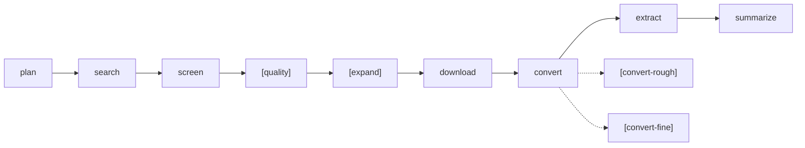
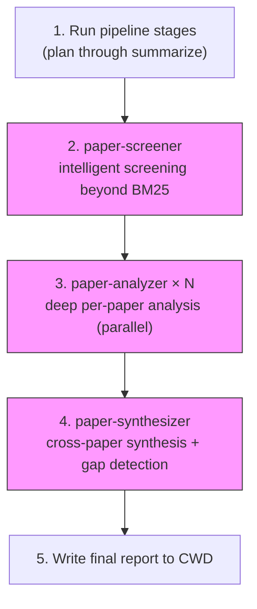

# Academic Paper Research

End-to-end academic paper research pipeline producing auditable, reproducible
artifacts. Searches arXiv and Google Scholar; screens relevance; evaluates
quality; expands via citation graph; downloads PDFs; converts to Markdown;
and generates evidence-backed summaries with sub-agent analysis.

## Prerequisites

| Requirement | Install Command | When Needed |
|-------------|----------------|-------------|
| CLI tool | `pipx install research-pipeline` | Always |
| Docling backend | `pipx inject research-pipeline docling` | Convert (MIT, good tables/equations) |
| Marker backend | `pipx inject research-pipeline marker-pdf` | Convert (best accuracy 95.7%, GPL-3.0) |
| PyMuPDF4LLM backend | `pipx inject research-pipeline pymupdf4llm` | Convert (fastest 10-50x, AGPL) |
| Scholar (free) | `pipx inject research-pipeline scholarly` | `--source scholar` or `--source all` |
| Scholar (paid) | `pipx inject research-pipeline google-search-results` + set `RESEARCH_PIPELINE_SERPAPI_KEY` | Production Scholar |

## CLI Invocation

**IMPORTANT**: `research-pipeline` is installed via **pipx** and available
globally. Always call it **directly** — never prefix with `uv run`, `python -m`,
or any other wrapper:

```bash
# CORRECT — call directly
research-pipeline plan "topic" --config ~/.claude/skills/research-pipeline/config.toml

# WRONG — do NOT use uv run (only for development in the source repo)
# uv run research-pipeline plan "topic" --config ...
```

**Every CLI invocation MUST pass `--config ~/.claude/skills/research-pipeline/config.toml`**
to load settings regardless of CWD. Abbreviated as `CFG` below.

## Pipeline Overview



7 core stages plus optional quality scoring, citation expansion, and tiered
conversion. After the pipeline, sub-agents (paper-screener, paper-analyzer,
paper-synthesizer) provide intelligent analysis. For system-building goals,
iterative synthesis fills gaps until implementation-ready.

## Command Reference

All commands accept `--config CFG` (required) and `--verbose` (optional).
Stage commands require `--run-id ID`.

| # | Stage | Command | Key Options |
|---|-------|---------|-------------|
| 1 | Plan | `research-pipeline plan "topic" --config CFG` | `--run-id ID` (optional, auto-generated) |
| 2 | Search | `research-pipeline search --run-id ID --config CFG` | `--source arxiv\|scholar\|all` |
| 3 | Screen | `research-pipeline screen --run-id ID --config CFG` | `--resume` |
| 3b | Quality | `research-pipeline quality --run-id ID --config CFG` | _(optional stage)_ |
| 3c | Expand | `research-pipeline expand --run-id ID --paper-ids "ID1,ID2" --config CFG` | `--direction both\|citations\|references`, `--limit N` |
| 4 | Download | `research-pipeline download --run-id ID --config CFG` | `--force` |
| 5 | Convert | `research-pipeline convert --run-id ID --config CFG` | `--backend docling\|marker\|pymupdf4llm`, `--force` |
| 5b | Rough | `research-pipeline convert-rough --run-id ID --config CFG` | `--force` |
| 5c | Fine | `research-pipeline convert-fine --run-id ID --paper-ids "ID1,ID2" --config CFG` | `--backend B`, `--force` |
| 6 | Extract | `research-pipeline extract --run-id ID --config CFG` | — |
| 7 | Summarize | `research-pipeline summarize --run-id ID --config CFG` | — |
| All | Run | `research-pipeline run "topic" --config CFG` | `--source all` |
| — | Inspect | `research-pipeline inspect --run-id ID` | `--workspace PATH` |
| — | Convert File | `research-pipeline convert-file path.pdf --config CFG` | `-o DIR`, `--backend B` |
| — | Index | `research-pipeline index --list` | `--gc` |

All run artifacts stored under `runs/<run_id>/`.

## Step-by-Step Workflow

### Step 0: Check for Existing Report

Before starting, look for `<topic-slug>-research-report.md` in the CWD.
If found: read it, extract already-analyzed paper IDs, and **merge** new
findings into the existing report at the end.

### Step 1: Plan

```bash
research-pipeline plan "multimodal RAG for long-document QA" --config CFG
```

Output: `runs/<run_id>/plan/query_plan.json` with normalized topic,
must/nice/negative terms, time window (default: 6 months).
Report the run ID and parsed search terms to the user.

### Step 1.5: Validate the Query Plan (RECOMMENDED)

Since v0.4.0, the plan stage auto-generates reasonable defaults:
- **Stop words** are filtered (e.g., "with", "for", "the")
- **must_terms** capped at 3, overflow goes to **nice_terms**
- **query_variants** auto-generated (up to `max_query_variants` from config)

You should still review and refine:

1. **Verify `must_terms`** — ensure they capture the core concepts
2. **Cap `must_terms` to 2** if queries are still too narrow
3. **Expand query_variants** — add synonym-expanded variants using different
   vocabulary for each key concept (the auto-generated ones use term
   reordering; add vocabulary substitutions manually)
4. Include a "core-concept-only" variant without domain qualifiers
5. Cross-check: would a paper using different terminology still match?
6. Set `primary_months` to the user's requested time window

Write the improved plan back to `query_plan.json`.
Consult `references/query-optimization.md` for synonym tables and examples.

### Step 2: Search

```bash
research-pipeline search --run-id <RUN_ID> --source all --config CFG
```

`--source all` searches **arXiv + Google Scholar** in parallel. Results are
deduplicated by arXiv ID and normalized title.

**Supplemental — HuggingFace daily papers**: The pipeline does not search
HuggingFace directly. Manually check for recent high-impact papers:

```bash
curl -s "https://huggingface.co/api/daily_papers?limit=100" | \
  python3 -c "import json,sys; [print(p['paper']['id'], p['paper']['title']) for p in json.load(sys.stdin)]" | \
  grep -i "<key_terms>"
```

Download supplemental PDFs manually to `runs/<RUN_ID>/supplemental/` and
convert with `research-pipeline convert-file`.

Report: candidates per source, total unique after dedup, run ID.

### Step 3: Screen

```bash
research-pipeline screen --run-id <RUN_ID> --config CFG
```

BM25 title/abstract scoring + category matching + recency bonus.
Report: total scored, shortlist count, top 5 papers with scores.

**Known limitation**: BM25 screening can be noisy with broad topic terms
(e.g., "agent" + "evaluation"). If the shortlist contains many irrelevant
papers, use the paper-screener sub-agent for intelligent re-screening.

### Step 3.5: Quality Evaluation (Optional)

```bash
research-pipeline quality --run-id <RUN_ID> --config CFG
```

Composite quality scoring: citation impact, venue reputation, author
credibility, and recency bonus. Output: `quality/quality_scores.jsonl`.

### Step 3.6: Citation Graph Expansion (Optional)

```bash
research-pipeline expand --run-id <RUN_ID> --paper-ids "2401.12345,2402.67890" --direction both --limit 20 --config CFG
```

**`--paper-ids` is required.** Expand the candidate pool by traversing the
citation graph via Semantic Scholar. `--direction citations` finds papers
citing yours; `references` finds their references; `both` does both.

### Step 4: Download

```bash
research-pipeline download --run-id <RUN_ID> --config CFG
```

Rate-limited, SHA-256 verified, idempotent. Report: count, size, failures.

The download stage uses **lenient shortlist parsing** — you can safely edit
`shortlist.json` to add or remove papers without providing every field.
A minimal entry needs only the `paper` object (with `arxiv_id`, `version`,
`title`, `authors`, `published`, `updated`, `categories`, `primary_category`,
`abstract`, `abs_url`, `pdf_url`), plus `download: true`. Missing fields
like `cheap`, `download_reason`, and `final_score` will be auto-filled
with sensible defaults.

### Step 5: Convert

```bash
research-pipeline convert --run-id <RUN_ID> --config CFG
```

Default backend: `docling`. Override with `--backend marker` or `--backend pymupdf4llm`.

**Two-tier conversion** (recommended for 10+ papers):

```bash
# Fast rough conversion of ALL PDFs
research-pipeline convert-rough --run-id <RUN_ID> --config CFG

# High-quality conversion of SELECTED papers only
research-pipeline convert-fine --run-id <RUN_ID> --paper-ids "2401.12345,2402.67890" --config CFG
```

Since v0.4.0, the extract stage **auto-merges** two-tier manifests. You no
longer need to manually create a unified `convert/` directory — just run
`extract` directly after `convert-rough` and/or `convert-fine`. Fine-tier
entries override rough-tier for the same paper.

### Step 6: Extract

```bash
research-pipeline extract --run-id <RUN_ID> --config CFG
```

### Step 7: Summarize

```bash
research-pipeline summarize --run-id <RUN_ID> --config CFG
```

Report: papers summarized, key findings.

## Sub-Agent Analysis

After the pipeline completes, use three specialized sub-agents for intelligent
paper evaluation. Launch them via the task tool with the appropriate agent type.

**CRITICAL — Model Requirement**: All sub-agents **MUST** be launched with
`model: "claude-opus-4.6"` for maximum reasoning quality. Academic paper
analysis demands the highest-quality reasoning available. Never use cheaper
or faster models for sub-agents.

```python
# Example: launching a paper-analyzer sub-agent
task(
    agent_type="paper-analyzer",
    model="claude-opus-4.6",      # ← REQUIRED for all sub-agents
    mode="background",
    name="az-paper-name",
    prompt="...",
)
```

### Typical flow



All sub-agents **MUST** use `model: "claude-opus-4.6"`.

Consult `references/sub-agents.md` for prompt templates, I/O specs, and
model configuration details.

### paper-screener

When to use: After screening, if BM25 shortlist quality is uncertain.

Provide: run directory path, run ID, research topic, and any focus areas
or exclusion criteria. Agent reads `search/candidates.jsonl` or
`screen/cheap_scores.jsonl` and returns: shortlist count, top papers,
coverage gaps. **Launch with `model: "claude-opus-4.6"`.**

### paper-analyzer

When to use: After convert stage, for detailed individual paper analysis.

Launch **one agent per paper** in parallel for efficiency. Provide: path to
the paper's Markdown file, research topic, and analysis focus (methodology,
scalability, etc.). Agent returns: rating (1-5 stars), methodology assessment,
key findings, transferable patterns, limitations. **Launch with
`model: "claude-opus-4.6"`.**

### paper-synthesizer

When to use: After all paper-analyzer agents complete.

Provide: all analysis summaries, research topic, and whether this is
system-building mode. Agent returns: themes, contradictions, gaps,
recommendations, and readiness assessment. **Launch with
`model: "claude-opus-4.6"`.**

## Output Requirements

After each stage, report status to the user with a pipeline status table.
The final report MUST be written to the **CWD** (not `runs/`):

```
./<topic-slug>-research-report.md
```

### Formatting Rules

- Use **Mermaid** for all diagrams and flowcharts (never ASCII art)
- Use **LaTeX** for mathematical formulas: inline `$...$`, display `$$...$$`
- Use **Markdown tables** for structured comparisons

Consult `references/output-templates.md` for status table format and
final report template.

## System-Building Mode

When the user's goal is to **build a system** (keywords: "build", "implement",
"design", "create", "develop", "architecture", "system"), the synthesis must
be evaluated for implementation-readiness:

- **Engineering gaps**: fill with own knowledge + web research
- **Academic gaps**: run new pipeline iterations with gap-specific queries
- **Max 3 iterations**, each narrowing the search
- Stop when synthesizer returns `IMPLEMENTATION_READY` or no new gaps

After the final report, ask whether to hand over to `req-analysis` skill.
Consult `references/iterative-synthesis.md` for the full protocol.

## Troubleshooting

| Error | Cause | Solution |
|-------|-------|----------|
| `command not found: research-pipeline` | Not installed | `pipx install research-pipeline` |
| No candidates found | Query too narrow | Broaden terms, use `--source all`, expand time window |
| Shortlist mostly irrelevant | Broad must_terms | Use paper-screener sub-agent; refine must_terms to 2 |
| Conversion fails (docling) | Missing dependency | `pipx inject research-pipeline docling` |
| Scholar SKIPPED on `--source all` | scholarly not installed | `pipx inject research-pipeline scholarly` |
| 429 rate limit | Too many API calls | Automatic retry with backoff; wait and retry |
| PDF download fails | arXiv rate limit | Pipeline retries automatically; use `--force` to re-try |
| Extract fails after two-tier convert | Pipeline < v0.4.0 | Upgrade: `pipx install --force research-pipeline` |
| ValidationError on download | Manually-edited shortlist | v0.4.0+ uses lenient parsing; upgrade if needed |
| Empty `logs/` directory | Pipeline < v0.3.1 | Upgrade: `pipx install --force research-pipeline` |

Consult `references/troubleshooting.md` for full error table, rate limits,
caching, and configuration details.

## Logging

Since v0.3.1, all pipeline runs write structured JSONL logs to
`runs/<run_id>/logs/pipeline.jsonl`. These are useful for debugging
failures and auditing pipeline behavior. Use `--verbose` for DEBUG-level
output.

## Version History

| Version | Key Changes |
|---------|-------------|
| v10.4.0 | Sub-agents MUST use `model: "claude-opus-4.6"` for maximum reasoning quality |
| v0.4.0 | Auto-merge two-tier converts; auto-generate query_variants; lenient shortlist parsing; scholarly installed |
| v0.3.1 | Per-run file logging; version detection fixes; write_jsonl arg order fix |
| v0.3.0 | Multi-source search; quality scoring; citation graph expansion; cloud conversion backends |

## Key Constraints

- **Rate limits**: arXiv 1 req/3s (never parallel); Scholar 10s+
- **Query terms**: Cap `must_terms` at 2–3 for recall
- **Synonyms**: Always generate query variants with different vocabulary
- **Evidence**: Every summary claim must cite source (paper_id, section)
- **Cache**: `~/.cache/research-pipeline/` (PDF + Markdown, 6 months)
- **429 retry**: Automatic exponential backoff with jitter
