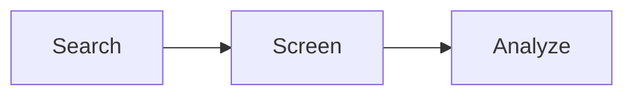
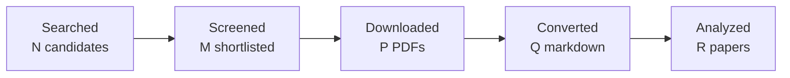

# Output Templates

## Formatting Guidelines

All generated reports (final research report, synthesis, analysis) MUST use:

- **Mermaid** for diagrams and flowcharts (never ASCII art — it breaks easily)
- **LaTeX** for mathematical formulas and equations (inline `$...$` or display `$$...$$`)
- **Markdown tables** for structured data comparisons

Examples:

```markdown
<!-- Mermaid diagram -->


<!-- LaTeX formula -->
The composite quality score is computed as:

$$Q = w_c \times C + w_v \times V + w_a \times A + w_r \times R$$

where $w_c = 0.35$, $w_v = 0.25$, $w_a = 0.25$, $w_r = 0.15$.
```

## Pipeline Status (after each stage)

```
## Pipeline Status — Run <RUN_ID>

| Stage | Status | Details |
|-------|--------|---------|
| Plan | ✅ Done | Topic: "...", N query variants |
| Search | ✅ Done | N candidates (arXiv: X, Scholar: Y, HuggingFace: Z) |
| Screen | ✅ Done | N → M shortlisted |
| Quality | ⬜ Optional | — |
| Expand | ⬜ Optional | — |
| Download | ✅ Done | N/N PDFs (size) |
| Convert | ✅ Done | N/N Markdown files |
| Extract | ⬜ Pending | — |
| Summarize | ⬜ Pending | — |

Run directory: runs/<RUN_ID>/
```

## Final Report Location

Write the final report to the **current working directory**:
```
./<topic-slug>-research-report.md
```
Example: `./local-memory-system-for-ai-agents-research-report.md`

NOT inside `runs/<run_id>/`.

## Final Research Report Template

The final report MUST follow this structure. Sections are divided into
**core** (always required) and **conditional** (include when evidence
justifies them). Sections marked **[EVIDENCE REQUIRED]** must cite
specific papers with `[arxiv_id]` or `[Author, Year]` references.

### Section Classification

**Core sections** — always required:
1. Executive Summary
2. Research Question
3. Methodology
4. Papers Reviewed
5. Research Landscape
6. Research Gaps
7. Practical Recommendations
8. References
9. Appendix: Run Metadata

**Conditional sections** — include only when justified by evidence:
| Section | Include When |
|---------|-------------|
| Methodology Comparison | 2+ distinct approaches studied |
| Confidence-Graded Findings | Meaningful distinctions exist between confidence levels |
| Trade-Off Analysis | Real alternative approaches with evidence-backed pros/cons |
| Points of Agreement | 2+ papers materially agree on a finding |
| Points of Contradiction | 2+ papers materially disagree |
| Reproducibility Notes | Code/data availability is relevant to the research goal |
| Evidence Map | Medium/large studies (5+ papers) or when explicit auditability is required |
| Readiness Assessment | System-building mode only |
| Future Directions | Clear research directions emerge from findings |

**Citation-granularity policy**: every evidence claim must indicate its
support level:
- **Paper-level**: `[arxiv_id]` — general finding from the paper
- **Section-level**: `[arxiv_id, §3]` — specific section reference
- **Agent inference**: mark with *(inferred)* — not directly stated in any paper
- **Cross-paper consensus**: mark with *(N papers agree)* — convergent finding

````markdown
# Research Report: [Topic]

## Executive Summary

[3-5 sentences: research question, scope (N papers from M sources),
key conclusion, and confidence level. Must mention the strongest finding
and the most significant gap.]

**Scope**: N papers analyzed from [sources] over [date range]
**Overall Confidence**: High / Medium / Low
**Verdict**: [IMPLEMENTATION_READY | HAS_GAPS | NOT_APPLICABLE]

## Research Question

[Precise statement of what was investigated. Include scope boundaries:
what's in vs. out.]

## Methodology

### Search Strategy
- **Search sources**: [arXiv, Google Scholar, HuggingFace, ...]
- **Supporting APIs/services used during analysis**: [Semantic Scholar, OpenAlex, DBLP, ...]
- **Query variants**: [list the key queries used]
- **Time window**: [date range]
- **Screening**: [BM25 + sub-agent / BM25 only]

### Pipeline Summary



| Metric | Count |
|--------|-------|
| Total candidates | N |
| After screening | M |
| Downloaded | P |
| Successfully converted | Q |
| Deeply analyzed | R |
| Iterations (if system-building) | I |

## Papers Reviewed

| # | Title | Authors | Year | Venue | Quality Score | Relevance |
|---|-------|---------|------|-------|--------------|-----------|
| 1 | [Title] [arxiv_id] | First Author et al. | YYYY | Venue | X.X/5 | HIGH / MEDIUM / LOW |

## Research Landscape

### Theme 1: [Theme Name]

**Coverage**: N papers | **Confidence**: High / Medium / Low
**Supporting papers**: [arxiv_id_1], [arxiv_id_2], ...

[Narrative description of the theme with evidence citations.] **[EVIDENCE REQUIRED]**

Key findings:
1. [Finding with citation: "Paper A [arxiv_id] demonstrated X with Y% improvement"]
2. [Finding with citation]

### Theme 2: [Theme Name]
[Same structure as Theme 1]

## Methodology Comparison

| Approach | Papers | Strengths | Weaknesses | Best For | Performance |
|----------|--------|-----------|------------|----------|-------------|
| [Approach A] | [ids] | ... | ... | ... | [metric if available] |
| [Approach B] | [ids] | ... | ... | ... | [metric if available] |

## Confidence-Graded Findings

### 🟢 High Confidence (supported by 3+ papers with consistent results — heuristic guideline)

1. **[Finding]** — Supported by [paper_1], [paper_2], [paper_3].
   [Brief evidence summary with specific numbers if available.]

### 🟡 Medium Confidence (supported by 1-2 papers or with caveats)

1. **[Finding]** — Reported by [paper_1]. [Caveat or limitation.]

### 🔴 Low Confidence (preliminary, single-source, or contradicted)

1. **[Finding]** — Only reported by [paper_1]. [Why confidence is low.]

## Trade-Off Analysis

| Decision | Option A | Option B | Recommendation |
|----------|----------|----------|----------------|
| [Design choice] | [Pros/cons with evidence] | [Pros/cons with evidence] | [Which and why] |

## Points of Agreement **[EVIDENCE REQUIRED]**

1. [Consensus finding] — Confirmed by [paper_1], [paper_2], [paper_3].

## Points of Contradiction **[EVIDENCE REQUIRED]**

1. **[Topic]**: [Paper A] claims X, but [Paper B] shows Y.
   - **Possible explanation**: [Why they disagree — different datasets, metrics, scope]
   - **Implication**: [What this means for the reader]

## Research Gaps

| # | Gap | Type | Severity | Impact on Goals |
|---|-----|------|----------|----------------|
| 1 | [What's missing] | ACADEMIC / ENGINEERING | HIGH / MEDIUM / LOW | [Why it matters] |

### Academic Gaps (require more papers)

1. **[Gap]**: [Description]. Suggested queries: `"query 1"`, `"query 2"`.

### Engineering Gaps (fillable without papers)

1. **[Gap]**: [Description]. Suggested resolution: [approach].

## Reproducibility Notes

| Paper | Code Available | Data Available | Sufficient Detail | License |
|-------|---------------|----------------|-------------------|---------|
| [arxiv_id] | ✅ [link] / ❌ | ✅ [link] / ❌ | ✅ / ⚠️ / ❌ | [license] |

## Practical Recommendations **[EVIDENCE REQUIRED]**

1. **[Recommendation]** — Based on [evidence from papers].
   *Confidence*: High / Medium / Low

## Future Directions

1. [Research direction enabled by current findings]

## Readiness Assessment (System-Building Mode)

### Verdict: [IMPLEMENTATION_READY | HAS_GAPS | NOT_APPLICABLE]

### Assessment Summary
[2-3 sentences: Is the synthesis sufficient to design and build the system?]

### Coverage Matrix

| Dimension | Status | Evidence |
|-----------|--------|----------|
| Architecture patterns | ✅ Sufficient / ⚠️ Partial / ❌ Missing | [papers] |
| Technology stack | ✅ / ⚠️ / ❌ | [papers] |
| Performance baselines | ✅ / ⚠️ / ❌ | [papers] |
| Security model | ✅ / ⚠️ / ❌ | [papers] |
| Trade-off map | ✅ / ⚠️ / ❌ | [papers] |

### Gap Resolution Plan

| # | Gap | Type | Severity | Resolution |
|---|-----|------|----------|------------|
| 1 | ... | ENGINEERING / ACADEMIC | HIGH / MEDIUM / LOW | [action] |

## Evidence Map

| Research Question Aspect | Paper 1 | Paper 2 | Paper 3 | ... |
|--------------------------|---------|---------|---------|-----|
| [Aspect 1]               | ✓ (§3)  |         | ✓ (§4)  | ... |
| [Aspect 2]               |         | ✓ (§2)  |         | ... |

## References

1. [arxiv_id] — [Title]. [Authors]. [Year]. [Venue].
2. ...

## Appendix: Run Metadata

- **Run ID**: <RUN_ID>
- **Search sources**: [list]
- **Supporting APIs**: [list, if any]
- **Pipeline version**: [version]
- **Date**: [date]
- **Artifacts**: `runs/<RUN_ID>/`
````

## Final Summary (in chat)

After writing the full report file, provide this condensed summary in chat:

```
## Research Summary — "<topic>"

**Run ID**: <RUN_ID>
**Sources**: arXiv, Google Scholar, HuggingFace
**Timeline**: <start_time> → <end_time>
**Iterations**: <N> (if system-building mode)

### Pipeline Results
- **Searched**: <N> candidates from <sources>
- **Screened**: <N> → <M> shortlisted (top relevance: <score>)
- **Downloaded**: <N> PDFs (<size>)
- **Converted**: <N> Markdown files
- **Errors**: <list or "None">

### Key Findings (Confidence-Graded)
1. 🟢 <high-confidence finding with paper citation>
2. 🟡 <medium-confidence finding with paper citation>
3. ...

### Top Papers
| # | Paper | Score | Key Contribution |
|---|-------|-------|------------------|
| 1 | <title> (arxiv_id) | <score> | <one-line summary> |

### Artifacts
- Final report: ./<topic-slug>-research-report.md
- Run data: runs/<RUN_ID>/
```
