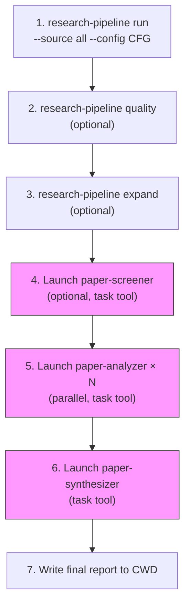

# Sub-Agent Orchestration

Three specialized sub-agents extend the pipeline with intelligent analysis.
Each runs in its **own context window** via the task tool, reads artifacts
from disk, and returns a summary.

## Launching Sub-Agents

Use the task tool with the appropriate agent type. Each agent should be
given the full file paths to its input artifacts — agents are stateless
and do not share context with the main conversation.

### Model Configuration (RECOMMENDED)

**All sub-agents SHOULD be launched with the strongest available reasoning
model** for maximum quality. Academic paper analysis demands high-quality
reasoning — do not use fast or cheap models.

```
task(
  agent_type: "paper-screener" | "paper-analyzer" | "paper-synthesizer",
  model: "claude-opus-4.6",   # ← Preferred; use best available
  mode: "background",
  ...
)
```

| Agent | Preferred Model | Rationale |
|-------|----------------|-----------|
| paper-screener | Strongest reasoning model | Nuanced relevance judgments require deep understanding |
| paper-analyzer | Strongest reasoning model | Methodology assessment and critique need expert-level reasoning |
| paper-synthesizer | Strongest reasoning model | Cross-paper synthesis, contradiction detection, and gap analysis are the most demanding tasks |

**Model tiers**:
- **Preferred**: strongest reasoning model (e.g., `claude-opus-4.6`, `claude-opus-4.5`)
- **Fallback**: approved secondary model (e.g., `claude-sonnet-4.5`, `gpt-4.1`)
- **Minimum**: do not run synthesis below the fallback tier

If the preferred model is unavailable, use the best fallback and annotate
reduced confidence in outputs. Always log `subagent_model_used` in run metadata.

## paper-screener

Intelligent relevance screening beyond keyword matching.

**When to use**: After search/screen stage, when BM25 shortlist quality is
uncertain or when broad topic terms produce noisy results.

**Agent type**: `paper-screener`

**Prompt template**:
```
Screen the search candidates for the research topic below.

RUN DIRECTORY: /absolute/path/to/runs/<run_id>
RESEARCH TOPIC: <topic>
SHORTLIST FILE: /absolute/path/to/runs/<run_id>/screen/cheap_scores.jsonl

CUSTOM INSTRUCTIONS:
<focus areas, exclusion criteria, etc.>

Return: total screened, shortlist count, top papers with relevance, coverage gaps.
```

**Reads**: `runs/{run_id}/search/candidates.jsonl` or `screen/cheap_scores.jsonl`
**Writes**: screening assessment (returned in agent output)

## paper-analyzer

Deep per-paper analysis after PDF-to-Markdown conversion.

**When to use**: After convert stage, for detailed individual paper analysis.
Launch **one agent per paper** in parallel for efficiency.

**Agent type**: `paper-analyzer`

**Outputs**: `{arxiv_id}_analysis.md` (human-readable) + `{arxiv_id}_analysis.json` (structured)

**Prompt template** (one per paper):
```
Analyze this paper for the research topic below.

RESEARCH TOPIC: <topic>
PAPER FILE: /absolute/path/to/runs/<run_id>/convert/markdown/<arxiv_id>.md

CUSTOM INSTRUCTIONS:
<focus on methodology, evaluate scalability, compare architectures, etc.>

Return: title, rating (1-5 stars), methodology assessment, key findings,
transferable patterns, limitations, and key quotes with section references.
Write both the Markdown analysis and the structured JSON output.
```

**Reads**: Individual Markdown files from `convert/markdown/`
**Writes**: Analysis returned in agent output; optionally written to `analysis/`

## paper-synthesizer

Cross-paper synthesis: themes, contradictions, gaps, recommendations.

**When to use**: After paper-analyzer agents have completed for all papers.

**Agent type**: `paper-synthesizer`

**Outputs**: `synthesis_report.md` (human-readable) +
`synthesis_report.json` (structured), with `synthesis_traceability.json`
when generated by the CLI.

**Prompt template**:
```
Synthesize findings from N analyzed papers on "<topic>".

## Paper Summaries
<paste the summary output from each paper-analyzer agent>

## Paper Analysis JSON Files
<list paths to {arxiv_id}_analysis.json files for structured data>

## Analysis Requirements
1. Design pattern convergence across papers
2. Unified metric/framework synthesis
3. Gap analysis
4. Confidence-graded findings (High/Medium/Low with evidence counts)
5. Methodology comparison table
6. Trade-off analysis for key design decisions
7. Reproducibility assessment per paper
8. Readiness assessment (if system-building mode):
   IMPLEMENTATION_READY | HAS_GAPS | NOT_APPLICABLE
   Classify gaps as ENGINEERING or ACADEMIC (if HAS_GAPS)
9. Human-readable Markdown: concise sections, LaTeX for formulas, vertical
   Mermaid diagrams (`flowchart TD`/`TB`) for charts, and internal links
   between contents, themes, papers, evidence, gaps, and recommendations

Write both the Markdown synthesis and the structured JSON output to:
/absolute/path/to/runs/<run_id>/summarize/
```

**Reads**: Paper analysis summaries (provided in prompt)
**Writes**: `runs/{run_id}/summarize/synthesis_report.md`

## Typical Orchestration Flow



## Artifact Layout Reference

Canonical directory structure for a pipeline run. All paths are relative to
`{workspace}/runs/{run_id}/`:

| Stage | Directory | Key Files |
|-------|-----------|-----------|
| plan | `plan/` | `query_plan.json` |
| search | `search/` | `candidates.jsonl` |
| screen | `screen/` | `shortlist.json`, `cheap_scores.jsonl`, `screening_report.md`, `screening_results.json` |
| download | `download/pdf/` | `{arxiv_id}.pdf`, `download_manifest.json` |
| convert | `convert/markdown/` | `{arxiv_id}.md`, `convert_manifest.json` |
| extract | `extract/` | `{arxiv_id}{version}.extract.json` (e.g., `2301.12345v1.extract.json`) |
| summarize | `summarize/` | `extractions/*.extraction.json`, `synthesis_report.md`, `synthesis_report.json`, `synthesis_traceability.json`, legacy `synthesis.json` |
| quality | `quality/` | `quality_scores.jsonl` |
| analysis | `analysis/` | `{arxiv_id}_analysis.md`, `{arxiv_id}_analysis.json` |

**Important**: `download/pdf/` and `convert/markdown/` include their
subdirectory — never append `/pdf` or `/markdown` again when constructing
paths from `STAGE_SUBDIRS` in code.

## Schema Governance

All sub-agents produce structured JSON output. These conventions ensure
consistency across agents and compatibility with the pipeline's lenient parsers:

| Data Type | Absent / Unknown | Checked & Absent | Convention |
|-----------|-----------------|-----------------|------------|
| Scalar (string/number) | `null` | Value-specific (e.g., `false`, `0`) | Use `null` for genuinely unknown, concrete value if checked |
| Array | `[]` | `[]` | Always use empty array `[]`, never `null` or omission |
| Enum field | Use schema default | Use schema default | Never omit; always set to a valid enum value |
| Object | Include with `null` fields | Include with concrete fields | Never omit top-level objects |

**Shared rules**:
1. **All fields are REQUIRED** — never omit a field from the schema
2. **Severity levels**: `"high"`, `"medium"`, `"low"` (lowercase)
3. **Confidence levels**: `"high"`, `"medium"`, `"low"` (lowercase)
4. **Gap types**: `"ACADEMIC"`, `"ENGINEERING"` (uppercase)
5. **Readiness verdicts**: `"IMPLEMENTATION_READY"`, `"HAS_GAPS"`, `"NOT_APPLICABLE"` (uppercase)
6. **Scores**: use the numeric range specified per-agent (1-5 for ratings, 0.0-10.0 for screening)
7. **Justifications**: minimum word counts are specified per-agent; never leave empty
