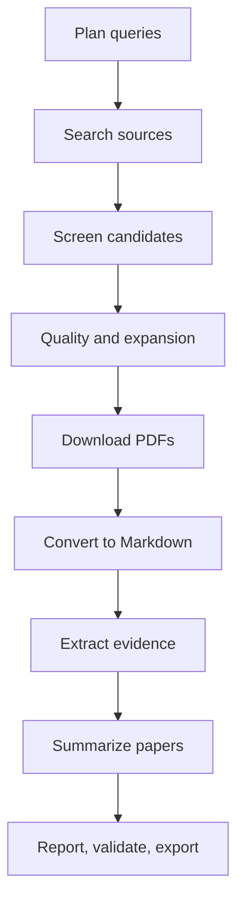

# research-pipeline

[](https://github.com/grammy-jiang/research-pipeline/actions/workflows/ci.yml)
[](https://codecov.io/gh/grammy-jiang/research-pipeline)
[](https://pypi.org/project/research-pipeline/)
[](https://pypi.org/project/research-pipeline/)
[](https://opensource.org/licenses/MIT)
[](https://mypy-lang.org/)
[](https://github.com/astral-sh/ruff)
[](https://grammy-jiang.github.io/research-pipeline/)

`research-pipeline` is a deterministic Python 3.12+ workflow for finding,
screening, downloading, converting, and synthesizing academic papers. It is
useful when you need an auditable literature review, not just a one-off paper
search.

It ships as both a Typer CLI and an MCP server for agent-driven research.

## Contents

- [What It Does](#what-it-does)
- [Installation](#installation)
- [Quick Start](#quick-start)
- [Pipeline](#pipeline)
- [CLI Commands](#cli-commands)
- [Readable Reports](#readable-reports)
- [MCP Server](#mcp-server)
- [AI Skill And Agents](#ai-skill-and-agents)
- [Configuration](#configuration)
- [Artifacts](#artifacts)
- [Development](#development)

## What It Does

- Searches arXiv, Google Scholar, Semantic Scholar, OpenAlex, DBLP, and
  HuggingFace daily papers, with cross-source deduplication.
- Screens candidates with BM25 heuristics, optional SPECTER2 semantic reranking,
  optional LLM judging, diversity-aware selection, and feedback-adjusted weights.
- Downloads PDFs politely with rate limits, retry, caching, and manifest tracking.
- Converts PDFs to Markdown through local or cloud backends: Docling, Marker,
  PyMuPDF4LLM, MinerU, Mathpix, Datalab, LlamaParse, Mistral OCR, or OpenAI
  Vision.
- Supports two-tier conversion: fast rough conversion for all papers and
  high-quality fine conversion for selected papers.
- Extracts structured chunks, bibliography data, citation contexts, and retrieval
  indexes from converted papers.
- Produces schema-first per-paper extraction records, design-neutral
  cross-paper synthesis, confidence scoring, evidence aggregation, BibTeX
  exports, templated Markdown reports, and self-contained HTML reports.
- Adds research quality layers: citation expansion, quality scoring, claim
  decomposition, knowledge graph ingestion, report validation, multi-run
  comparison, coherence checks, memory consolidation, blinding audits, Pass@k /
  Pass[k] metrics, case-based strategy reuse, KG quality checks, adaptive
  stopping, and 4-layer confidence calibration.

## Installation

```bash
# Base package
pip install research-pipeline

# Recommended local converter
pip install 'research-pipeline[docling]'

# Other local converters
pip install 'research-pipeline[marker]'       # high accuracy, GPL-3.0
pip install 'research-pipeline[pymupdf4llm]'  # fast CPU conversion, AGPL
pip install 'research-pipeline[mineru]'       # scientific PDF parser

# Search and reranking extras
pip install 'research-pipeline[scholar]'      # Google Scholar via scholarly
pip install 'research-pipeline[serpapi]'      # Google Scholar via SerpAPI
pip install 'research-pipeline[reranker]'     # sentence-transformers reranker

# Cloud conversion extras
pip install 'research-pipeline[datalab]'
pip install 'research-pipeline[llamaparse]'
pip install 'research-pipeline[mistral-ocr]'
pip install 'research-pipeline[openai-vision]'

# Development checkout
uv sync --extra dev --extra docling --extra scholar --extra reranker
```

## Quick Start

```bash
# Fast abstract-only pass
research-pipeline run --profile quick "transformer architectures for time series"

# Full evidence-backed pipeline
research-pipeline run "local memory systems for AI agents"

# Deep profile with quality, expansion, claim analysis, and TER gap filling
research-pipeline run --profile deep "comprehensive survey of AI memory systems"

# Search every configured source family
research-pipeline run --source all "long-context retrieval augmented generation"
```

Run stages independently when you want control over review points:

```bash
research-pipeline plan "multimodal RAG for long-document QA"
research-pipeline search --run-id <RUN_ID> --source all
research-pipeline screen --run-id <RUN_ID> --diversity
research-pipeline quality --run-id <RUN_ID>
research-pipeline download --run-id <RUN_ID>
research-pipeline convert-rough --run-id <RUN_ID>
research-pipeline convert-fine --run-id <RUN_ID> --paper-ids "2401.12345"
research-pipeline extract --run-id <RUN_ID>
research-pipeline summarize --run-id <RUN_ID>
research-pipeline report --run-id <RUN_ID> --template structured_synthesis
research-pipeline validate --run-id <RUN_ID>
```

## Pipeline



Profiles:

| Profile | Stages | Use Case |
|---|---|---|
| `quick` | plan, search, screen, summarize | Fast abstract-only scan |
| `standard` | plan through summarize | Default full pipeline |
| `deep` | standard plus quality, expand, claim analysis, TER loop | Comprehensive literature review |
| `auto` | selected by query complexity | Mixed workloads |

Search sources:

| Source | Notes |
|---|---|
| `arxiv` | Polite arXiv API client with cache and rate limits |
| `scholar` | Google Scholar through `scholarly` or SerpAPI |
| `semantic_scholar` | Broad metadata, citations, and abstracts |
| `openalex` | Open bibliographic metadata |
| `dblp` | Computer science bibliography |
| `huggingface` | Recent HuggingFace daily papers |
| `all` | arXiv, Scholar, Semantic Scholar, OpenAlex, DBLP, HuggingFace |

## CLI Commands

| Group | Commands |
|---|---|
| Core pipeline | `plan`, `search`, `screen`, `download`, `convert`, `extract`, `summarize`, `run`, `inspect` |
| Search expansion and organization | `quality`, `expand`, `cluster`, `enrich`, `watch` |
| Conversion and export | `convert-file`, `convert-rough`, `convert-fine`, `export-bibtex`, `export-html`, `report` |
| Analysis and validation | `analyze`, `analyze-claims`, `score-claims`, `confidence-layers`, `aggregate`, `validate`, `compare`, `evaluate` |
| Feedback and memory | `feedback`, `index`, `coherence`, `consolidate`, `memory-stats`, `memory-episodes`, `memory-search` |
| Knowledge graph | `kg-ingest`, `kg-stats`, `kg-query`, `kg-quality`, `cite-context` |
| Reliability checks | `blinding-audit`, `dual-metrics`, `adaptive-stopping`, `cbr-lookup`, `cbr-retain` |
| Setup | `setup` installs the bundled skill and paper-analysis agents |

Useful examples:

```bash
# Citation graph expansion
research-pipeline expand --run-id <RUN_ID> --paper-ids "2401.12345" \
  --direction both --bfs-depth 2 --bfs-query "memory,agents"

# Evidence-only aggregation
research-pipeline aggregate --run-id <RUN_ID> --min-pointers 1

# Multi-run comparison and coherence
research-pipeline compare --run-a <RUN_A> --run-b <RUN_B>
research-pipeline coherence <RUN_A> <RUN_B> <RUN_C>

# Knowledge graph
research-pipeline kg-ingest --run-id <RUN_ID>
research-pipeline kg-stats
research-pipeline kg-query 2401.12345
```

## Readable Reports

The pipeline can produce machine-readable synthesis JSON and human-readable
Markdown or HTML reports. For human-facing reports, prefer:

- clear headings and a contents section with internal links;
- Mermaid diagrams for process charts, usually vertical `flowchart TD` charts;
- LaTeX for formulas, using `$...$` inline and `$$...$$` for display equations;
- tables for comparisons and coverage matrices;
- paper links that jump to references or evidence-map entries;
- recommendations linked back to findings, gaps, and evidence.

```bash
# Render Markdown from structured synthesis JSON
research-pipeline report --run-id <RUN_ID> --template structured_synthesis

# Export self-contained HTML
research-pipeline export-html --run-id <RUN_ID>

# Validate report completeness and readability signals
research-pipeline validate --run-id <RUN_ID>
```

## MCP Server

Run the MCP server with:

```bash
python -m mcp_server
# or, from a development checkout
uv run python -m mcp_server
```

Current MCP surface:

- 42 tools covering pipeline stages, conversion, quality, expansion,
  validation, reporting, memory, KG, reliability, and the server-driven
  `research_workflow`.
- 15 resources for run manifests, plans, candidates, shortlists, PDFs,
  Markdown, summaries, synthesis, quality scores, config, index, workflow
  state, telemetry, and budget.
- 6 prompts for topic planning, workflow orchestration, paper analysis,
  comparison, search refinement, and quality assessment.

The `research_workflow` tool adds harness engineering: telemetry, bounded
context, governance gates, structural verification, doom-loop monitoring, and
crash recovery.

## AI Skill And Agents

Install the bundled skill for Claude Code / GitHub Copilot and Codex, plus
Claude Code sub-agent definitions:

```bash
research-pipeline setup              # skills + agents
research-pipeline setup --symlink    # symlink for development
research-pipeline setup --force      # overwrite existing files
research-pipeline setup --skip-agents
research-pipeline setup --skip-skill
```

Installed files:

- Claude/GitHub Copilot skill: `~/.claude/skills/research-pipeline/`
- Codex skill: `~/.codex/skills/research-pipeline/`
- Agents: `~/.claude/agents/paper-screener.md`,
  `~/.claude/agents/paper-analyzer.md`,
  `~/.claude/agents/paper-synthesizer.md`

## Configuration

Start from the example config:

```bash
cp config.example.toml config.toml
```

High-impact settings:

```toml
profile = "standard"          # quick, standard, deep, auto
workspace = "runs"

[sources]
enabled = ["arxiv"]           # or include scholar, semantic_scholar, openalex, dblp, huggingface
scholar_backend = "scholarly" # or "serpapi"

[screen]
diversity = false
use_semantic_reranking = false

[conversion]
backend = "docling"
fallback_backends = []

[llm]
enabled = false               # enables LLM screening/summarization when configured
provider = "ollama"           # ollama or openai-compatible

[gates]
enabled = false
auto_approve = true
```

Environment overrides:

| Variable | Purpose |
|---|---|
| `RESEARCH_PIPELINE_CONFIG` | Config file path |
| `RESEARCH_PIPELINE_CACHE_DIR` | Override cache directory |
| `RESEARCH_PIPELINE_WORKSPACE` | Override workspace directory |
| `RESEARCH_PIPELINE_DISABLE_LLM` | Force LLM features off |
| `RESEARCH_PIPELINE_LLM_PROFILE` | Select LLM profile |

## Artifacts

Each run writes auditable outputs under `runs/<run_id>/`:

```text
runs/<run_id>/
├── plan/query_plan.json
├── search/candidates.jsonl
├── screen/shortlist.json
├── download/pdf/*.pdf
├── convert/markdown/*.md
├── convert_rough/markdown/*.md
├── convert_fine/markdown/*.md
├── extract/*.extract.json
├── extract/*.bibliography.json
├── summarize/extractions/*.extraction.json
├── summarize/extractions/*.extraction.md
├── summarize/extractions/extraction_quality.json
├── summarize/*.summary.json
├── summarize/synthesis_report.json
├── summarize/synthesis_report.md
├── summarize/synthesis_traceability.json
├── summarize/synthesis_quality.json
├── summarize/synthesis.json
├── summarize/synthesis_confidence.json
├── quality/quality_scores.jsonl
├── expand/expanded_candidates.jsonl
├── analysis/
├── comparison/
└── logs/
```

The `runs/` and `workspace/` directories are generated outputs and are not
tracked by git.

## Development

```bash
uv sync --extra dev --extra docling --extra scholar --extra reranker
uv run pytest tests/unit/ -xvs
uv run ruff format .
uv run ruff check . --fix
uv run mypy src/
uv run pre-commit run --all-files
```

See [docs/architecture.md](docs/architecture.md) for architecture details and
[docs/user-guide.md](docs/user-guide.md) for the full user guide.

## License

MIT
