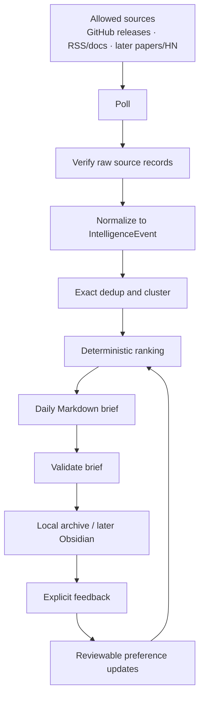
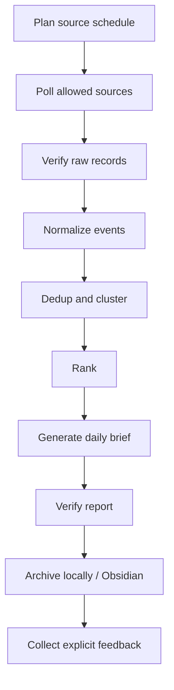
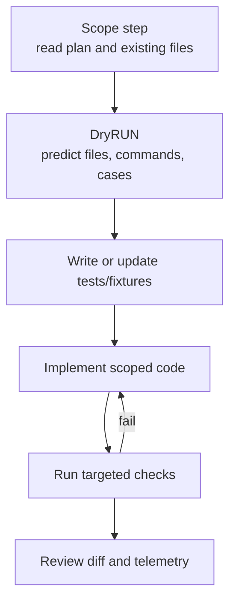

# Daily AI Intelligence Implementation Plan

## Purpose

Build a private daily AI intelligence system on top of `research-pipeline` that
collects sanctioned AI-related signals, remembers topic history, produces a short
daily briefing, optionally prepares deeper hot-topic reports, archives knowledge
into Obsidian, and improves ranking from explicit feedback.

This should **not** replace the existing academic-paper research workflow. The
current pipeline remains the serious evidence/literature-review engine. The new
work should add a parallel **briefing pipeline** that reuses shared
infrastructure where appropriate: source adapters, workspace storage, SQLite
patterns, telemetry, report rendering, validation, memory, KG primitives, and
harness-engineered workflow ideas.

## Feasibility judgment from the review

The review's main point is correct: the architecture direction is strong, but
the first implementation slice was too large. The current repository has enough
infrastructure to build a thin daily briefing workflow, but it is still
paper-centric and does not yet have a generic event model, GitHub/RSS/HN source
adapters, briefing storage, Obsidian export, or briefing-specific MCP tools.

Therefore, the execution strategy should be:

1. Build the smallest reliable daily Markdown brief first.
2. Prove the report is worth reading.
3. Add memory/fatigue only after the thin brief exists.
4. Add Obsidian after report shape and topic IDs are stable.
5. Add explicit feedback before behavioral feedback.
6. Add dossiers after daily brief quality is stable.
7. Add noisy/social sources last.

After the v3 review updates in this document, **freeze Phase A**. New ideas
should go into later-phase notes or future considerations, not into Phase A. The
next useful action is to convert Phase A into implementation tickets and start
building the thin daily report.

## Updated design principles

1. **Thin daily brief first**
   - The MVP should prove that the system can produce a useful 20-minute morning
     report.
   - Do not start with a dashboard, full KG, behavioral tracking, or multi-source
     social ingestion.
   - Enforce an editorial budget from the beginning.

2. **Memory-first architecture, incremental implementation**
   - The design should reserve stable IDs, topic IDs, and memory hooks early.
   - Complex lifecycle logic should wait until repeated-topic pain appears in
     real briefings.
   - Durable topic merges, aliases, and preference promotions must be reviewable
     and reversible.

3. **Primary artifacts over social chatter**
   - Prefer official docs, release notes, GitHub releases, repositories, papers,
     benchmarks, demos, specs, and packages.
   - Treat HN, Reddit, Bluesky, and X as discussion/corroboration layers, not as
     the backbone.
   - Social-only items should usually move to weekly synthesis unless they link
     to primary artifacts.

4. **Agent-readable reports**
   - Reports should be easy for a human to read and easy for an AI agent to parse.
   - Use stable IDs, YAML frontmatter, clear section names, evidence tables,
     bounded bullets, and explicit machine-readable summaries.
   - Avoid clever prose that hides source, novelty, confidence, or actionability.

5. **Harness engineering for quality**
   - Treat the briefing system as a governed runtime, not a summarizer prompt.
   - Put policy in deterministic layers: source registry, schemas, allowlists,
     budgets, verification gates, telemetry, and audit logs.
   - LLM calls should happen after source governance, deduplication, ranking, and
     evidence-pack construction.

## Comparison with the current repository

| Need | Current implementation | Reuse | Missing work |
|---|---|---|---|
| Academic sources | arXiv, Scholar, Semantic Scholar, OpenAlex, DBLP, Hugging Face daily papers | Reuse paper adapters and candidate models for paper events | Map paper candidates into a broader event model |
| Daily watch | `watch` command for arXiv saved queries | Reuse state-file and cron-friendly pattern | Generalize to multi-source polling and source cadence |
| HTTP/retry/rate limit | Shared `requests` session, retry, rate limit helpers | Reuse for new source adapters | Add source-specific policies and quotas |
| Storage | Workspace dirs, JSONL manifests, SQLite global paper index | Reuse layout and SQLite style | Add briefing run layout and event/topic stores |
| Reports | Markdown/HTML report commands and templates | Reuse rendering/export concepts | Add daily, dossier, weekly, monthly templates |
| Memory/KG | Existing memory and KG components are paper/claim-oriented | Reuse concepts and low-level storage patterns | Add event/topic/source graph and Obsidian export |
| Feedback | Existing feedback is paper accept/reject | Reuse explicit-feedback idea | Add cluster/topic/source feedback events |
| MCP workflow | Existing MCP server and workflow are academic-paper oriented | Reuse implementation patterns | Add namespaced briefing tools without confusing paper tools |
| Skill | Existing skill is academic-paper research | Keep it separate | Add a dedicated daily-intelligence skill |

## Packaging, skill, and MCP strategy

### Recommendation

Use the **same Python package and same CLI binary**, but keep the daily briefing
workflow separate at the user/agent-facing layer.

Do this:

- Add CLI commands under a new command group: `research-pipeline brief ...`.
- Add MCP tools to the existing server, but namespace them as `brief_*`.
- Add a **separate bundled skill** named something like
  `daily-ai-intelligence`.
- Reuse shared infrastructure from `research_pipeline`, but keep briefing code in
  a separate package namespace such as `research_pipeline/briefing/`.

Do **not** create a separate Python package or MCP server for the MVP unless
security, deployment, or source-policy isolation later requires it.

### Why not mix it into the existing research skill?

The existing `research-pipeline` skill is optimized for academic literature
reviews: query planning, paper screening, PDF download/conversion, evidence
extraction, gap closure, and structured synthesis. Daily intelligence has a
different trigger, cadence, report shape, risk profile, and success metric.

Mixing both into one skill would confuse agents:

- A request for "daily AI brief" should not trigger PDF download/conversion.
- A request for "literature review" should not trigger RSS/GitHub polling.
- Daily reports value brevity and novelty; research reports value depth and
  evidence completeness.
- Daily intelligence needs source governance and memory/fatigue; academic
  synthesis needs paper evidence and gap closure.

### MCP layout

Use one server process initially:

```text
research-pipeline mcp serve
```

Add briefing tools with explicit names:

| Tool | Purpose |
|---|---|
| `brief_poll_sources` | Poll configured briefing sources and write raw/normalized events |
| `brief_rank_events` | Deduplicate, cluster, and rank events |
| `brief_generate_daily` | Generate the daily Markdown/HTML brief |
| `brief_validate_report` | Verify length, links, sections, duplicates, and evidence |
| `brief_export_obsidian` | Export daily/topic notes to the configured vault |
| `brief_record_feedback` | Record explicit feedback on cluster/topic/source |
| `brief_generate_dossier` | Generate one selected hot-topic dossier |
| `brief_weekly_synthesis` | Generate weekly trend memo |

Keep tool descriptions explicit that these are **technical intelligence** tools,
not academic-paper research tools. Use MCP annotations carefully:

- Polling tools are open-world/networked.
- Ranking and validation tools are local and deterministic.
- Obsidian export writes only to configured archive paths.
- Feedback writes only to the local feedback store.

### Skill layout

Add a separate bundled skill:

```text
src/research_pipeline/skill_data/daily-ai-intelligence/
  SKILL.md
  config.toml
  references/
    command-reference.md
    source-policy.md
    report-templates.md
    feedback-loop.md
    troubleshooting.md
```

Skill trigger examples:

- "Generate today's AI intelligence brief"
- "Run the daily AI briefing"
- "Check AI agent/coding-agent updates today"
- "Prepare my MCP/Copilot/Claude Code daily brief"
- "Create a weekly AI tooling trend memo"

Skill non-triggers:

- "Do a literature review"
- "Find papers and synthesize them"
- "Download and convert these PDFs"
- "Expand citations"

Agent guidance:

- Use `brief_*` MCP tools or `research-pipeline brief ...` commands.
- Never send raw unclustered source dumps to cloud models.
- Use only ranked evidence packs for synthesis.
- Keep daily reports short.
- Record explicit feedback after user review.
- For deep paper-only questions, hand off to the existing academic
  `research-pipeline` skill.

## Target architecture



Later phases add topic memory, Obsidian graph notes, dossiers, expanded sources,
and richer MCP workflow orchestration.

## Data models

### `IntelligenceEvent`

Use this as the common normalized record for releases, docs, RSS items, papers,
HN posts, and later social/discussion items.

Required source fields:

- `event_id`
- `source_name`
- `source_type`
- `source_policy`
- `item_type`
- `canonical_url`
- `title`
- `retrieved_at`
- `collection_method`
- `content_hash`
- `dedup_key`

Optional source fields:

- `author_or_org`
- `published_at`
- `updated_at`
- `source_native_id`
- `identifiers`
- `summary_hint`
- `excerpt`

Derived fields:

- `topics`
- `relevance_score`
- `novelty_score`
- `artifact_links`
- `inferred_entities`
- `ranking_explanation`
- `confidence`
- `evidence_type`

Retention-sensitive fields:

- `raw_metadata`
- `raw_social_text`
- `comments`
- `discussion_threads`
- `author_profile_metadata`

Policy:

- Do not require derived or retention-sensitive fields in the MVP.
- Store minimal raw data for sources with policy/privacy risk.
- Keep full raw payloads only when source terms and local privacy policy allow it.

### Stable ID policy

Phase A IDs must be deterministic so deduplication, memory, feedback, and tests
do not drift across runs.

Use these rules unless a later migration explicitly changes them:

```text
event_id =
  stable hash of source_id + source_native_id when source_native_id exists,
  otherwise stable hash of source_id + canonical_url

content_hash =
  stable hash of normalized title + canonical_url + published_at + summary_hint

dedup_key =
  strongest available key in order:
    source_native_id
    canonical_url
    repo/tag for GitHub release events
    RSS/Atom guid/id
    normalized title

cluster_id =
  stable hash of primary dedup_key
```

Normalize titles, URLs, and timestamps before hashing. Keep the hash algorithm
fixed in code and include migration notes if it ever changes.

### `BriefingCluster`

Clusters one underlying event across one or more records.

Fields:

- `cluster_id`
- `title`
- `primary_event_id`
- `event_ids`
- `topic_ids`
- `canonical_urls`
- `first_seen_at`
- `last_seen_at`
- `source_classes`
- `primary_artifact_present`
- `novelty_score`
- `authority_score`
- `engineering_usefulness_score`
- `personal_interest_score`
- `hype_penalty`
- `rank_score`
- `ranking_explanation`

### `TopicMemory`

Tracks durable topic state across days. Implement after the thin daily report.

Fields:

- `topic_id`
- `name`
- `aliases`
- `first_seen_at`
- `last_seen_at`
- `status`: `new`, `active`, `cooling`, `dormant`, `resurfaced`
- `summary`
- `key_entities`
- `canonical_clusters`
- `obsidian_note`
- `interest_score`
- `fatigue_score`
- `last_reported_at`
- `report_count_7d`
- `report_count_30d`

Rules:

- A new `TopicMemory` entry may be created automatically.
- Aliases, durable merges, and long-term preference changes require review.
- Topic splits and merges must be reversible.
- Model-suggested aliases should be stored as suggestions before promotion.

### `TopicDossier`

Prepared single-topic report linked from the daily brief. Implement after daily
brief quality is stable.

Fields:

- `dossier_id`
- `topic_id`
- `cluster_ids`
- `title`
- `why_it_matters`
- `what_changed`
- `prior_context`
- `evidence_timeline`
- `linked_artifacts`
- `open_questions`
- `try_next`
- `obsidian_note`

### `FeedbackEvent`

Captures explicit and, later, weak behavioral preference signals.

Fields:

- `feedback_id`
- `timestamp`
- `target_type`: `event`, `cluster`, `topic`, `source`, `dossier`
- `target_id`
- `signal_type`
- `strength`
- `reason`
- `context`

MVP explicit signals:

- `keep`
- `hide`
- `more_like_this`
- `less_like_this`
- `too_noisy`
- `already_known`
- `not_actionable`

Later behavioral signals:

- `opened_link`
- `opened_dossier`
- `saved_item`
- `read_time`
- `topic_note_edited`

Behavioral feedback must remain weak evidence unless repeated and confirmed.

## Source class policy

Every source and event should have a source class:

| Source class | Examples | Ranking posture |
|---|---|---|
| Primary artifact | Official doc, release note, spec change, package, benchmark, demo | Strongly prefer |
| Academic source | arXiv, OpenAlex, Semantic Scholar, Crossref | Prefer when relevant |
| Implementation source | GitHub repo, release, changelog, package registry | Strongly prefer |
| Technical discussion | HN thread with technical links, curated forum thread | Allow if useful |
| Social signal | Reddit, Bluesky, X | Weak unless corroborated |
| Media/news | News article, broad media | Low priority |
| Newsletter | Sanctioned/curated newsletter feed | Medium if trusted |
| Video/audio | YouTube, podcasts | Weekly context, not daily backbone |

Daily inclusion should normally require a primary artifact or implementation
artifact. Social-only clusters should be suppressed or moved to weekly synthesis
unless corroborated.

## Source registry

The source registry is the first governance layer. No source should be polled
unless it has an explicit registry entry. This prevents source ingestion from
becoming ad hoc as more feeds, APIs, and social sources are added.

### `BriefingSourceConfig`

Fields:

- `source_id`
- `source_name`
- `source_class`
- `access_method`: `github_releases`, `rss_atom`, `arxiv`, `api`, `manual`
- `official_url`
- `auth_required`
- `rate_limit_policy`
- `cadence`
- `retention_policy`
- `allowed_raw_storage`
- `trust_weight`
- `noise_weight`
- `enabled`
- `last_reviewed_at`
- `max_events_per_run`
- `tags`

Phase A must support only:

- `github_releases`
- `rss_atom`
- optionally `manual` for hand-curated URLs during calibration

Manual source means a local config entry containing a title, URL, source class,
and optional `summary_hint`. It does not mean browser scraping, pasted
social-media dumps, copied comment threads, or a bypass around source policy.
Manual items must still pass normalization, deduplication, ranking, validation,
and report-budget checks.

Do not add browser scraping. Do not add a source because it is merely
interesting. Add it only when the registry entry defines access, cadence,
retention, and expected value.

### Initial MVP watchlist policy

The MVP should start with a small curated source list, not an open feed universe.
Use only sources with clean sanctioned access. GitHub releases are feasible via
the GitHub API or release feeds. RSS/Atom is feasible with the existing
`requests` and `lxml` dependencies.

Candidate categories:

| Category | Phase A rule |
|---|---|
| OpenAI docs/changelog | Include only if a stable RSS/feed/API or manually reviewed source exists |
| Anthropic docs/changelog | Include only if a stable RSS/feed/API or manually reviewed source exists |
| GitHub Copilot changelog/docs | Include if a stable feed or release source exists |
| Microsoft developer AI/blog feeds | Include selected official RSS feeds only |
| Google/Gemini developer updates | Include selected official RSS feeds only |
| Model Context Protocol docs/spec/repos | Prefer GitHub releases/repo feeds and official spec update feeds |
| Selected local/coding-agent repos | Include only explicitly whitelisted repos |
| arXiv/Hugging Face/HN | Not Phase A unless manually requested; add in Phase F |

Phase A discussion items are allowed only if they come from already-allowed
official/RSS sources. HN, Reddit, Bluesky, and X are not part of Phase A.

### GitHub source boundary

Phase A supports **GitHub releases only**.

Future GitHub source types may include:

- tags
- PRs
- issues
- discussions
- changelog files
- README/spec changes
- examples directory changes

Each future GitHub source type requires its own source registry policy, cadence,
retention rule, offline fixtures, and noise evaluation. Do not silently expand
the GitHub adapter from releases into general repository surveillance.

### RSS/Atom adapter boundary

The Phase A RSS/Atom adapter should support a conservative subset:

- channel/feed title
- item/entry title
- link
- guid/id
- pubDate/updated/published
- summary/description when available

Malformed feeds should fail per source, not fail the whole daily run. The adapter
should emit a telemetry event and continue polling other enabled sources.

### HTTP politeness policy

Source adapters should:

- set a clear `User-Agent`
- use `ETag` / `If-None-Match` when available
- use `Last-Modified` / `If-Modified-Since` when available
- cache responses where source policy allows
- isolate per-source failures
- never retry aggressively

In Phase A, keep caching small and explicit: store `etag`, `last_modified`,
`retrieved_at`, `status_code`, and either `body_hash` or `body_path`. Do not build
a general HTTP cache framework until source behavior proves it is needed.

## Ranking and hype penalty

### Deterministic ranking inputs

- Topic/watchlist match.
- Source class and authority.
- Presence of primary artifact.
- Novelty versus recent archive.
- Engineering usefulness.
- Implementation availability.
- Cross-source confirmation.
- Explicit feedback preferences.
- Fatigue score.
- Hype penalty.

### Phase A ranking formula

Start with a deterministic, inspectable score:

```text
rank_score =
  source_class_weight
+ trust_weight
- noise_weight
+ primary_artifact_bonus
+ watchlist_match_bonus
- hype_penalty
- duplicate_penalty
```

Phase A should not use hidden LLM judgment for ranking. Later phases may add:

- novelty
- fatigue
- memory context
- explicit feedback
- cross-source confirmation

Use deterministic tie-breaking whenever `rank_score` ties:

```text
rank_score desc
source_class_weight desc
published_at desc
trust_weight desc
title asc
event_id asc
```

This tie-breaker order is part of the Phase A test contract. It prevents report
churn when source order or JSONL read order changes.

### Phase A LLM policy

Phase A report generation should be template-based and extractive by default.
LLM summarization is disabled unless explicitly enabled by configuration.

If LLM summarization is enabled:

- send only ranked evidence packs, never raw unclustered source dumps
- keep source URLs and evidence labels attached to every generated item
- validate the final report with the same deterministic validator
- treat the LLM text as presentation, not as a source of new facts

### Hype penalty applies when

- No primary artifact exists.
- Only social discussion exists.
- Benchmark claim lacks reproducible data.
- Source uses vague superlatives without evidence.
- No code, paper, release note, documentation, demo, or spec is linked.
- Same claim appears across low-quality reposts.

## Memory and Obsidian knowledge graph

### Memory tiers

| Tier | Lifetime | Store | Purpose |
|---|---|---|---|
| Working memory | One daily run | run workspace JSON/JSONL | Today's events, clusters, rank decisions |
| Episodic memory | Days/weeks | SQLite plus archived JSONL | Topic appearances, daily reports, feedback |
| Semantic memory | Long-term | KG plus Obsidian notes | Durable topics, entities, source relationships |

### Topic lifecycle logic

The daily brief should eventually know whether a topic is:

- **New**: no prior memory or materially different from prior clusters.
- **Active**: appeared recently and has new primary evidence.
- **Cooling**: recent attention but no meaningful new evidence today.
- **Dormant**: absent for a configured window.
- **Resurfaced**: dormant topic has new evidence and should link to prior history.

Report policy:

- Mention `new`, `active with new evidence`, and `resurfaced`.
- Suppress `cooling` unless useful for weekly synthesis.
- Penalize high-fatigue topics unless new evidence is strong.
- Link to prior Obsidian notes when a topic resurfaces.

### Obsidian output

Suggested vault layout:

```text
AI-Intelligence/
  Daily/
    2026-04-27.md
  Topics/
    mcp-agent-protocol.md
    claude-code.md
    coding-agent-evals.md
  Dossiers/
    2026-04-27-claude-code-new-release.md
  Sources/
    github-anthropics-claude-code.md
    openai-docs.md
  Weekly/
    2026-W18.md
  Monthly/
    2026-04.md
```

Each note should include YAML frontmatter and stable IDs so AI agents can parse
it without relying on prose.

```yaml
---
type: daily-brief
date: 2026-04-27
brief_id: brief_2026_04_27
topics:
  - "[[claude-code]]"
  - "[[mcp-agent-protocol]]"
clusters:
  - cluster_abc123
sources:
  - github
  - openai-docs
agent_summary:
  item_count: 8
  link_count: 12
  has_suppressed_section: true
---
```

## Report formats and templates

Reports should be dual-use: readable by a human, structured enough for AI agents.
Use predictable headings, stable IDs, short paragraphs, evidence tables, and
frontmatter. Every report should have an `Agent Read Map` section near the top.

### Daily brief template

Target:

- 900-1,400 words.
- 6-10 primary items on active days.
- Fewer than 15 links.
- Max 3 papers.
- Max 3 GitHub/release items.
- Max 2 discussion items.
- Max 1 speculative/hype item.

### Low-signal day policy

The system must not pad the daily brief.

If fewer than 6 high-quality primary items exist, generate a shorter low-signal
brief with:

- Executive Signal
- 0-5 Top Items
- No Material Updates section
- Watchlist Quiet section
- Follow-up Queue if useful

A low-signal day is valid output, not a pipeline failure. The end-to-end offline
tests must cover both "low-signal day" and "no material updates found today".

Template:

```markdown
---
type: daily-brief
date: YYYY-MM-DD
brief_id: brief_YYYY_MM_DD
status: draft|validated
item_count: 0
link_count: 0
source_mix:
  github: 0
  rss: 0
  papers: 0
  discussion: 0
---

# Daily AI Intelligence Brief — YYYY-MM-DD

## Agent Read Map

| Field | Value |
|---|---|
| Primary purpose | 20-minute daily technical brief |
| Best sections for action | Executive Signal, Top Items, Follow-up Queue |
| Machine targets | cluster IDs, topic IDs, evidence URLs, feedback IDs |

## Executive Signal

- 3-5 bullets on what materially changed.

## Top Items

If this is a low-signal day, use 0-5 items and do not add filler.

### 1. <Title> `{cluster_id}`

| Field | Value |
|---|---|
| Topic | `topic_id` / [[topic-note]] |
| Source class | primary artifact / implementation source / academic source |
| Novelty | new / active / resurfaced |
| Confidence | high / medium / low |
| Suggested action | read / try / watch / ignore |

**What changed:** ...

**Why it matters:** ...

**Evidence:** [source title](url)

**Agent note:** one machine-friendly sentence about why this item was included.

## Papers Worth Scanning

0-3 paper items only.

## Repos / Releases Worth Opening

0-3 implementation items only.

## Discussions Worth Watching

0-2 discussion items only; prefer discussions with primary links.

## Follow-up Queue

3-5 concrete links or tasks.

## Suppressed / Not Reported

Short list of repeated, low-novelty, or hype-heavy topics.

## No Material Updates

Use this section on no-news days. State that no primary artifact passed the daily
inclusion threshold.

## Watchlist Quiet

Use this section to list high-priority watched sources that had no material
updates, if useful.

## Feedback Targets

| Target | ID | Suggested feedback command |
|---|---|---|
| Item title | cluster_id | `research-pipeline brief feedback --cluster cluster_id --signal keep` |
```

### Hot-topic dossier template

Purpose: deeper reading for one selected topic. Do not generate automatically in
the MVP. Later, generate at most one per day, then at most three.

Requirements:

- Must have at least one primary artifact.
- Must cite all major claims.
- Must include prior context from topic memory when available.
- Must stay focused on one topic.

Template:

```markdown
---
type: topic-dossier
date: YYYY-MM-DD
dossier_id: dossier_YYYY_MM_DD_slug
topic_id: topic_slug
cluster_ids:
  - cluster_id
status: draft|validated
---

# Hot Topic Dossier — <Topic>

## Agent Read Map

| Field | Value |
|---|---|
| Use when | User wants depth beyond daily brief |
| Core question | What changed and what should we do with it? |
| Evidence standard | Primary artifact required |

## One-paragraph Summary

Brief, direct summary.

## What Changed

Concrete changes only.

## Why It Matters Technically

Engineering implications, compatibility, evaluation, workflow, cost, or risk.

## Prior Context

Links to previous daily briefs, topic notes, and related clusters.

## Evidence Timeline

| Date | Evidence | Source class | Note |
|---|---|---|---|

## Artifacts To Open

Docs, releases, repos, papers, benchmarks, demos, packages.

## What To Try / Watch / Ignore

Actionable next steps.

## Open Questions

Bounded unanswered questions.

## Agent Notes

Machine-readable bullets: topic IDs, source IDs, confidence, missing evidence.
```

### Weekly synthesis template

Purpose: trend memo, not seven daily briefs stapled together.

Target:

- 1,500-2,500 words.
- 5-8 major themes.
- Max 25 links.

Sections:

- Agent Read Map.
- What changed this week.
- Themes that strengthened.
- Themes that weakened.
- Repos/protocols/vendors with durable movement.
- Papers that translated into code.
- What was noise.
- Watchlist updates.
- Feedback and source-quality notes.

### Monthly retrospective template

Purpose: durable signal and preference calibration.

Target:

- 2,000-3,500 words.
- 5-10 durable trends.

Sections:

- Agent Read Map.
- Durable trends.
- Key repos/releases/papers.
- Missed signals.
- Noisy sources.
- Topic fatigue review.
- Source-quality review.
- Personal watchlist updates.
- Memory promotions requiring review.

### Source note template

Purpose: make source reliability inspectable.

Fields:

- Source name.
- Source class.
- Access method.
- Policy notes.
- Cadence.
- Historical usefulness.
- Noise patterns.
- Current weight.
- Last reviewed date.

## Feedback and preference learning

### Explicit feedback first

Add CLI commands before behavioral tracking:

```bash
research-pipeline brief feedback --cluster <ID> --signal more-like-this
research-pipeline brief feedback --topic <ID> --signal too-noisy
research-pipeline brief feedback --source <ID> --signal less-like-this
```

Preference changes must be auditable and reversible.

### Behavioral feedback later

Behavioral signals can be added after explicit feedback works:

- Dossier opened.
- Link clicked or copied.
- Topic note edited.
- Daily item saved.
- Item ignored repeatedly.
- Read-time proxy from a local UI or Obsidian plugin.

Rules:

- Behavioral feedback never directly changes durable ranking alone.
- Treat behavioral signals as weak evidence.
- Promote only repeated, reviewed patterns.

### Reviewable memory promotion

Good durable rule:

```text
Down-rank HN-only benchmark drama unless there is a linked repo, paper, or vendor doc.
```

Bad durable rule:

```text
I like agent topics.
```

Only promote a rule when it has:

1. A concrete trigger condition.
2. A ranking or filtering procedure.
3. An observable effect.
4. A rollback path.
5. A review record.

## Harness-engineered briefing workflow

### Briefing stages



Later phases insert memory lookup, dossier generation, weekly synthesis, and
Obsidian KG updates.

### Tool DAG

| Node | Allowed capabilities |
|---|---|
| Plan | Read config and previous local state |
| Poll | Network only to source allowlist |
| Normalize | Read raw events, write normalized JSONL |
| Dedup | Read normalized events, write clusters |
| Rank | Read clusters and preferences, write ranked clusters |
| Synthesize | Local/cloud model only on ranked evidence packs |
| Verify | Deterministic checks only |
| Archive | Write only configured archive paths |
| Feedback | Write only to local feedback store |

### Telemetry

Reuse the repository's three-surface telemetry idea:

- Cognitive: model prompts/responses, ranking rationales, synthesis decisions.
- Operational: source polling counts, errors, latency, artifact counts.
- Contextual: token budgets, memory hits, prior-topic links, feedback applied.

Write append-only JSONL per daily run:

```text
workspace/briefings/YYYY-MM-DD/telemetry.jsonl
```

### Verification gates

| Stage | Verification |
|---|---|
| Raw records | Parseable JSONL, allowed source, canonical URL, retrieved timestamp |
| Normalized events | Schema-valid `IntelligenceEvent`, required fields present |
| Clusters | Duplicate titles detected, exact dedup keys stable |
| Ranking | Score fields present, top-N budget enforced, hype penalty present |
| Daily brief | 6-10 primary items on active days or valid low-signal/no-news output, 900-1,400 words on active days, fewer than 15 links, required sections |
| Links | External links syntactically valid; optional live check when network allowed |
| Factuality | Important claims map to evidence URLs or are marked inference/speculation |
| Dossiers | Primary artifact exists, evidence links resolve, claims carry evidence/inference labels |
| Obsidian export | Frontmatter valid, wiki-links stable, paths inside allowlist |

Factuality rule:

- Generated summaries must distinguish `supported_fact`, `inference`, and
  `speculation_or_watch_item`.
- Every important factual claim should map to at least one evidence URL.
- If no evidence URL exists, the report must explicitly label the statement as an
  inference or speculation.
- A deterministic verifier can check labels and links; it should not claim to
  prove that no unsupported claim exists.

### Budget and privacy rules

- Send only ranked evidence packs to cloud models.
- Keep raw archives, feedback, reading behavior, and Obsidian notes local-first.
- Redact secrets and private paths from telemetry.
- Cache only allowed public/source metadata.
- Set hard budgets for source calls, LLM tokens, dossier count, and report length.

## Repository architecture and dependency policy

Respect the current repository architecture:

- Put implementation under `src/research_pipeline/briefing/`.
- Put CLI handlers under `src/research_pipeline/cli/cmd_brief.py` or a small
  `cli/briefing/` package if the command group grows.
- Register the Typer command group in `src/research_pipeline/cli/app.py`.
- Add Pydantic domain models either under `src/research_pipeline/briefing/models.py`
  for briefing-only models, or under `src/research_pipeline/models/` only if the
  model becomes broadly shared.
- Keep MCP schemas in `src/research_pipeline/mcp_server/schemas.py` and tool
  wrappers in `src/research_pipeline/mcp_server/tools.py` when adding `brief_*`
  tools.
- Keep bundled skill data under
  `src/research_pipeline/skill_data/daily-ai-intelligence/`.
- Put unit tests in `tests/unit/test_briefing_<module>.py` or
  `tests/unit/test_<module>.py` following existing naming style.

Use existing dependencies by default:

| Need | Default choice |
|---|---|
| HTTP | `requests` via existing session helpers |
| XML/RSS/Atom parsing | `lxml` |
| Data schemas | Pydantic v2 |
| CLI | Typer |
| Storage | JSONL plus `sqlite3` |
| Paths | `pathlib.Path` |
| Logging | `logging`, never `print()` for operational output |
| Retry/rate limit | existing `infra.retry` and `infra.rate_limit` patterns |
| Markdown rendering | existing report/template patterns before adding new deps |

Do not add `feedparser`, GitHub SDKs, schedulers, vector databases, or UI
frameworks in Phase A unless the existing dependencies cannot satisfy a concrete
requirement. Prefer small adapters built on `requests` and `lxml`.

## Phase A artifact and CLI contracts

Phase A should use one stable run layout so CLI behavior, tests, debugging, and
agent inspection all point at the same files.

```text
workspace/briefings/YYYY-MM-DD/
  source_registry_snapshot.json
  raw/
    <source_id>.jsonl
  normalized/
    events.jsonl
  clusters/
    clusters.jsonl
  ranked/
    ranked_clusters.jsonl
  reports/
    daily.md
  validation/
    validation.json
  telemetry.jsonl
```

Command contracts:

| Command | Input | Output |
|---|---|---|
| `brief poll` | source registry | `source_registry_snapshot.json`, `raw/*.jsonl`, `normalized/events.jsonl`, `telemetry.jsonl` |
| `brief rank` | `normalized/events.jsonl` | `clusters/clusters.jsonl`, `ranked/ranked_clusters.jsonl` |
| `brief generate-daily` | `ranked/ranked_clusters.jsonl` | `reports/daily.md` |
| `brief validate` | `reports/daily.md`, `ranked/ranked_clusters.jsonl` | `validation/validation.json` |
| `brief run` | source registry | all Phase A artifacts, in command-contract order |

Exit-code policy:

| Code | Meaning |
|---|---|
| 0 | Success |
| 1 | Validation failed |
| 2 | Source polling failed but partial output exists |
| 3 | Configuration or source registry error |
| 4 | Unexpected internal error |

MCP tools should mirror these contracts after the CLI stabilizes. Until then,
Phase A implementation should focus on the CLI and filesystem artifacts.

## Testing and coverage policy

Testing is part of the harness, not an afterthought. Every implementation phase
must have a DryRUN prediction before code changes and deterministic verification
after code changes.

DryRUN means the implementing agent must list:

- files expected to be added or modified
- public CLI/API/MCP/skill surfaces expected to change
- test fixtures to be created
- validation commands to run
- positive, negative, and edge failure cases expected to be handled
- predicted outputs, exceptions, database effects, and telemetry events

Coverage targets:

- **Core deterministic briefing modules:** at least 95% line coverage.
- **Source adapters:** 85-90% line coverage is acceptable when offline fixtures
  cover normal, malformed, empty, duplicate, rate-limited, and policy-denied
  cases.
- **Other new modules:** at least 90% line coverage.
- Coverage gaps must be justified in code review.

Core deterministic modules include:

- event models and validation
- source registry
- normalization
- deduplication
- ranking
- report generation
- report validation
- feedback weighting when implemented
- topic memory when implemented

Source adapter modules include:

- GitHub releases adapter
- RSS/Atom adapter
- future HN, paper, Reddit, Bluesky, X, YouTube, and podcast adapters

Test levels:

| Level | Required coverage |
|---|---|
| Unit | Normal input, boundary input, malformed input, missing fields, exceptions, empty source results, duplicate records, policy-denied sources |
| Integration offline | Adapter fixtures, registry-to-poll flow, poll-to-report flow, validation failures, SQLite persistence |
| End-to-end offline | User scenarios: first daily run, no-news day, duplicate source event, noisy/hype item suppressed, report validation failure, explicit feedback changes ranking |
| Live/network | Optional and marked live; never required for normal CI |

Default validation commands for implementation work:

```bash
uv run pytest tests/unit/test_briefing_*.py -xvs --cov=src/research_pipeline/briefing --cov-report=term-missing
uv run ruff format .
uv run ruff check . --fix
uv run mypy src/
```

When integration tests exist:

```bash
uv run pytest tests/integration_offline/ -xvs
```

Do not rely only on snapshots. Snapshot-style expected reports are useful, but
tests must also assert schema fields, links, counts, section presence, ranking
scores, and validation errors.

## Implementation roadmap

Each phase below follows the harness guide, but the harness grows progressively.
Not all files, modules, MCP tools, skills, or workflow-state components exist at
the beginning. Do not pretend later harness layers are available in earlier
phases. Add only the minimum deterministic wrapper needed for the current phase,
then strengthen it when the phase adds new risk.

- **L0 supply chain:** use existing pinned dependencies; avoid new dependencies.
- **L1 telemetry:** emit JSONL records for important operational decisions.
- **L2 manifests/context:** make configuration explicit and reviewable.
- **L4 governance:** use allowlists, path scopes, budgets, and source policies.
- **L5 verification:** add deterministic verifiers before trusting outputs.
- **L7 evaluation:** define measurable success criteria.
- **Memory promotion:** promote only reviewed, reversible, causal rules.

### Agent execution contract for every phase

For every implementation step, a GitHub Copilot or other AI agent should know:

| Field | Requirement |
|---|---|
| Current phase | Name the phase and why this step belongs there |
| Target | State the one behavior or artifact being added |
| Existing surfaces | List files/modules that already exist and can be reused |
| New surfaces | List files/modules that will be created by this step |
| Harness available now | Use only harness pieces already built in this or prior phases |
| Verification | Name the exact unit/integration/e2e tests and validators |
| Stop condition | Stop when the target behavior passes deterministic checks |
| Non-goals | Do not pull later-phase functionality into the current step |

The implementation order inside a phase should follow this task-level tool DAG:



Rules:

- No network calls in tests except explicit live tests.
- No write outside planned paths.
- No source expansion without a registry entry.
- No later-phase modules unless the phase explicitly creates them.
- If verification fails, treat the verifier as authoritative until proven wrong.

### Phase A - Thin daily report with minimal governance

Goal: prove the brief is worth reading.

Deliverables:

- Basic source registry.
- Source allowlist.
- Per-source cadence.
- Per-source maximum event count.
- Fixed Phase A artifact layout under `workspace/briefings/YYYY-MM-DD/`.
- Source registry snapshot per run.
- GitHub releases adapter.
- RSS/Atom adapter for official docs/blogs/changelogs.
- HTTP politeness state for ETag/Last-Modified when supported.
- `IntelligenceEvent` model with required source/audit fields.
- Stable ID generation for events, content hashes, dedup keys, and clusters.
- Raw JSONL output per source.
- JSONL output for normalized events.
- Exact dedup by canonical URL, repo/tag, RSS GUID, and normalized title.
- Simple deterministic ranking with tie-breakers.
- Source class and hype penalty.
- Template/extractive Markdown daily brief.
- Basic telemetry for source counts, errors, and run duration.
- Basic validation:
  - word count
  - link count
  - item count
  - required sections
  - duplicate titles
  - evidence links present
  - low-signal/no-news day accepted when item count is below target

Implementation steps:

1. Create `src/research_pipeline/briefing/`.
2. Add `models.py` with `IntelligenceEvent`, `BriefingSourceConfig`,
   `SourceClass`, `AccessMethod`, and `BriefingRunMetadata`.
3. Add `registry.py` to load and validate source registry configuration.
4. Add `sources/base.py` with a small `BriefingSource` protocol.
5. Add `sources/github_releases.py` using `requests`; parse release API/feed
   responses into `IntelligenceEvent`. Phase A supports releases only; tags,
   issues, PRs, discussions, changelog file diffs, and README/spec changes are
   future source types.
6. Add `sources/rss_atom.py` using `requests` and `lxml`; support common RSS and
   Atom fields without adding dependencies. Malformed feeds fail per source and
   do not fail the whole run.
7. Add `normalize.py` for stable `event_id`, `content_hash`, `dedup_key`, and
   `cluster_id` inputs.
8. Add `dedup.py` for exact URL/repo-tag/RSS GUID/title dedup.
9. Add `rank.py` for deterministic ranking from source class, trust/noise
   weights, primary artifact presence, watchlist match, duplicate penalty, and
   hype penalty, with deterministic tie-breakers.
10. Add `report.py` to render the daily Markdown template.
11. Add `validate.py` for deterministic report/event checks.
12. Add `cli/cmd_brief.py` with `brief poll`, `brief rank`,
     `brief generate-daily`, `brief validate`, and `brief run`.
13. Register the command group in `cli/app.py`.
14. Add unit tests before implementation for each core module.
15. Add an offline end-to-end fixture with GitHub release JSON and RSS/Atom XML.
16. Add low-signal and no-news-day fixtures.

Harness controls:

- Tool DAG: poll may use network only for registry-allowed sources; report
  generation reads only ranked JSONL.
- DryRUN: before implementation, list expected files, CLI commands, fixtures,
  validation commands, failure cases, and telemetry events.
- Verification: report is not accepted unless validation passes.
- Telemetry: write `workspace/briefings/YYYY-MM-DD/telemetry.jsonl`.
- Budget: enforce source count, event count, item count, link count, word count.
- HTTP politeness: use clear User-Agent, conditional request headers, conservative
  caching where permitted, and non-aggressive retries.
- LLM use: disabled by default; if explicitly enabled, send only ranked evidence
  packs and still run deterministic validation.

Do not include:

- Obsidian graph.
- Hot-topic dossiers.
- Feedback learning.
- Behavioral tracking.
- Full knowledge graph.
- X, Reddit, Bluesky, Hacker News.
- Full workflow engine.
- Cloud summarization of raw source dumps.
- Hidden LLM judgment in ranking or default report generation.

Done when:

```text
For 10 consecutive weekdays, the system produces a Markdown brief under 1,400
words, with 6-10 ranked items on active days or a valid shorter low-signal brief,
fewer than 15 links, no obvious duplicates, no filler items, and at least 70% of
primary items marked useful by explicit review.
```

Usefulness review:

After each daily brief, manually label each primary item as:

- `useful`
- `neutral`
- `not_useful`
- `already_known`
- `noisy`
- `wrong_cadence`

Compute:

```text
usefulness = useful / total_primary_items
```

### Phase B - Memory and fatigue

Goal: stop repetition.

Deliverables:

- `TopicMemory`.
- `last_reported_at`.
- `report_count_7d`.
- `report_count_30d`.
- Fatigue penalty.
- Resurfaced-topic detection.
- Prior-topic references in the daily brief.
- Reviewable topic alias and merge suggestions.

Implementation steps:

1. Add `topic_memory.py` with `TopicMemory` and lifecycle classification.
2. Add SQLite-backed `TopicMemoryStore` using `sqlite3`, following existing store
   patterns.
3. Add `memory_lookup.py` to retrieve recent clusters by topic ID, title tokens,
   and explicit links.
4. Extend ranking to apply fatigue penalty and resurfaced-topic boost.
5. Extend report template to show prior context only when it changes inclusion.
6. Add review queue for model- or heuristic-suggested aliases.
7. Add validation that no durable alias/merge is applied without a review record.

Harness controls:

- Existing harness at phase start: Phase A registry, telemetry, ranking, report
  validation, low-signal handling, and offline fixtures.
- New harness introduced: memory write audit records and alias/merge review gate.
- Memory is evidence, not truth: re-check current evidence before ranking.
- Durable aliases and merges require review.
- Every memory write must include trigger, effect, and rollback metadata.
- Add regression fixtures for false merges and topic splits.

Done when:

```text
The system can suppress repeated low-novelty topics and correctly flag
resurfaced topics without irreversible automatic topic merges.
```

### Phase C - Obsidian archive

Goal: make output searchable and reviewable.

Deliverables:

- Daily notes.
- Topic notes.
- Source notes.
- YAML frontmatter.
- Wiki-links and backlinks.
- Stable local paths.
- Agent-readable `Agent Read Map` in every note.

Implementation steps:

1. Add `obsidian.py` with path allowlist validation.
2. Add Markdown writers for daily, topic, and source notes.
3. Generate YAML frontmatter with stable IDs and source/topic/cluster links.
4. Preserve wiki-links exactly; do not convert them to Markdown links.
5. Add validators for frontmatter, required headings, and path safety.
6. Add fixtures for existing notes to verify idempotent updates.
7. Add CLI `brief export-obsidian`.

Harness controls:

- Existing harness at phase start: Phase A/B validation plus topic memory audit.
- New harness introduced: archive path allowlist and note ID/frontmatter checks.
- Archive writes only under configured vault path.
- No generated note may overwrite unrelated human notes without explicit
  matching frontmatter ID.
- Documentation-only playbook applies: preserve wiki-links and report exactly
  which notes changed.

Done when:

```text
Daily reports and topic notes are archived consistently with valid links,
stable IDs, and useful metadata.
```

### Phase D - Explicit feedback loop

Goal: improve relevance.

Deliverables:

- CLI feedback command.
- Feedback event store.
- Weekly preference update.
- Source/topic weight adjustment.
- Negative preferences.
- Rollback mechanism.

Implementation steps:

1. Add `feedback.py` models and `FeedbackStore`.
2. Add CLI `brief feedback --cluster/--topic/--source --signal ...`.
3. Add manual review labels from Phase A as first-class feedback records.
4. Add `preference_update.py` to compute reversible source/topic adjustments.
5. Store each adjustment with before/after weights and rollback metadata.
6. Add weekly report section for feedback and source-quality notes.
7. Add tests for insufficient feedback, conflicting feedback, rollback, and
   malformed target IDs.

Harness controls:

- Existing harness at phase start: archive, topic memory, source registry, and
  daily report validation.
- New harness introduced: preference adjustment audit and rollback checks.
- Explicit feedback only in this phase.
- No behavioral signal changes ranking in Phase D.
- Preference promotion follows memory promotion rules: trigger, procedure,
  observable effect, rollback, owner/review record.

Done when:

```text
Explicit feedback can audibly and reversibly change future ranking.
```

### Phase E - Hot-topic dossiers

Goal: support deeper reading.

Deliverables:

- Single-topic dossier template.
- Evidence timeline.
- Prior context.
- "What changed".
- "Why it matters".
- "What to try next".
- Manual dossier generation first.
- Later: max 1 automatic dossier per day, then max 3.

Implementation steps:

1. Add `dossier.py` renderer using the dossier template.
2. Add manual CLI `brief dossier --cluster <ID>` before automatic selection.
3. Require at least one primary artifact before generating a dossier.
4. Add evidence timeline extraction from cluster events and topic memory.
5. Add factuality labels for supported facts, inferences, and watch items.
6. Add dossier validation for required sections, evidence URLs, and link counts.
7. Add tests for primary-artifact absence, missing evidence links, repeated topic
   context, and long-report rejection.

Harness controls:

- Existing harness at phase start: feedback audit, memory audit, archive
  validation, and report validation.
- New harness introduced: dossier factuality/evidence validation.
- Dossier generation reads only one selected cluster plus relevant topic memory.
- It must not expand into a general literature review; hand off to the academic
  skill for paper-only deep research.
- Automatic dossiers remain disabled until manual dossiers are useful.

Done when:

```text
The system can generate one high-quality dossier from primary evidence without
bloating the daily brief.
```

### Phase F - Source expansion

Goal: increase coverage without increasing noise.

Add selectively:

- Hacker News.
- Hugging Face Papers.
- Existing arXiv adapter mapped into events.
- OpenAlex enrichment.
- Semantic Scholar enrichment.
- Crossref enrichment.
- Targeted Reddit.
- Targeted Bluesky.
- X only under strict budget and corroboration requirements.
- YouTube/podcast context for weekly synthesis, not daily briefing.

Implementation steps:

1. Add one source class at a time.
2. Require a source registry entry before implementation.
3. Add offline fixtures before enabling the source.
4. Add source-specific retention policy and rate-limit tests.
5. Add ranking impact evaluation using held-out daily brief fixtures.
6. Keep source disabled by default until it improves explicit feedback without
   increasing noise.

Harness controls:

- Existing harness at phase start: source registry, HTTP politeness, ranking
  evaluation, feedback, and report validation.
- New harness introduced: per-source enablement evaluation and side-by-side
  report comparison.
- No automatic source expansion.
- Network remains allowlisted.
- New source adapters are treated as untrusted until parsed and validated.
- Compare reports with and without the new source before enabling.

Done when:

```text
New sources improve explicit feedback without increasing report length or noise.
```

### Phase G - Harness hardening and agent workflows

Goal: make the pipeline replayable, auditable, and agent-safe.

Deliverables:

- Briefing workflow state machine.
- Stage verifiers.
- Telemetry JSONL.
- Source/network allowlist.
- Report validation gates.
- Budget enforcement.
- Held-out evaluation set for ranking and report quality.
- Namespaced MCP tools.
- Dedicated daily-intelligence skill.

Implementation steps:

1. Add briefing workflow state model only after CLI workflow stabilizes.
2. Add `brief_*` MCP schemas and tools mirroring stable CLI commands.
3. Add resources for daily brief, ranked clusters, telemetry, and validation
   results.
4. Add a separate `daily-ai-intelligence` skill with trigger/non-trigger rules.
5. Add skill references for command usage, source policy, report templates, and
   feedback loop.
6. Add workflow telemetry and replay/diagnosis documentation.
7. Add held-out agent evaluation tasks:
   - run a thin daily brief
   - validate a malformed report
   - record feedback
   - export Obsidian notes
   - refuse unsupported source expansion
   - hand off paper-only request to academic skill

Harness controls:

- Existing harness at phase start: stable CLI workflow, validation, telemetry,
  feedback audit, source registry, and source expansion gates.
- New harness introduced: MCP/skill tool-scope governance and held-out agent
  evaluation tasks.
- Namespaced MCP tools prevent confusion with paper-research tools.
- Tool annotations must reflect network/write behavior.
- Agent-facing skill must say when not to trigger.
- Harness changes are evaluated by holding model/runtime fixed and comparing
  traces, not only final output.

Done when:

```text
An AI agent can run, inspect, validate, and summarize a briefing workflow using
briefing-specific tools without confusing it with the academic research workflow.
```

## Suggested first implementation slice

Start with this narrower vertical slice:

1. Add `research_pipeline/briefing/` package.
2. Add `IntelligenceEvent` with required source/audit fields and optional derived
   fields.
3. Add `BriefingSourceConfig` source registry with allowlist, cadence, retention,
   and per-source maximum event count.
4. Add GitHub releases adapter.
5. Add RSS/Atom adapter.
6. Write raw, normalized, cluster, ranked, report, validation, and telemetry
   artifacts to the fixed Phase A artifact layout.
7. Generate stable `event_id`, `content_hash`, `dedup_key`, and `cluster_id`
   values.
8. Deduplicate by canonical URL, repo/tag, RSS GUID, and normalized title.
9. Implement simple deterministic ranking with source class, hype penalty, and
   tie-breakers.
10. Generate one template/extractive Markdown daily brief.
11. Validate report length, link count, item count, required sections, duplicate
    titles, and evidence-link presence.
12. Emit basic telemetry for source counts, errors, and run duration.
13. Support low-signal/no-news days without padding the report.
14. Use HTTP politeness metadata for ETag/Last-Modified and clear User-Agent.
15. Keep LLM summarization disabled unless explicitly configured, and never send
    raw unclustered source dumps.

Phase A implementation tickets:

1. Add briefing package skeleton and models.
2. Add source registry loader and validation.
3. Add GitHub releases adapter with fixtures.
4. Add RSS/Atom adapter with fixtures.
5. Add normalization and stable ID generation.
6. Add exact deduplication.
7. Add deterministic ranking and tie-breakers.
8. Add Markdown daily report renderer.
9. Add report/event validator.
10. Add CLI command group and fixed artifact layout.
11. Add telemetry JSONL.
12. Add offline end-to-end tests for normal, low-signal, and no-news days.

This slice intentionally delays:

- Dossiers.
- Obsidian graph.
- Behavioral feedback.
- KG ingestion.
- Complex topic lifecycle.
- HN/X/Reddit/Bluesky.
- Cloud summarization of raw source dumps.

## Non-goals for the first version

- No browser scraping.
- No X integration.
- No full social firehose.
- No dashboard.
- No complex vector database unless local search starts failing.
- No cloud model calls on raw unclustered source dumps.
- No automatic topic merges.
- No automatic promotion of vague preferences into durable memory.
- No automatic source expansion. New sources require source registry entry,
  cadence, retention policy, and review.
