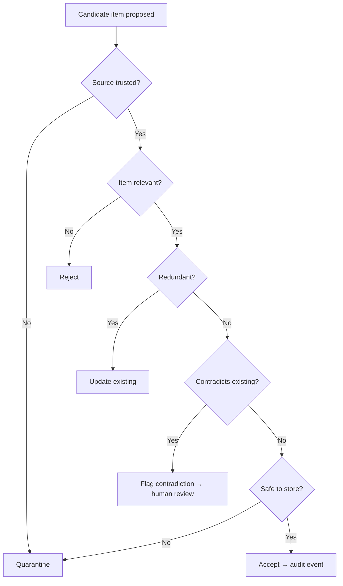
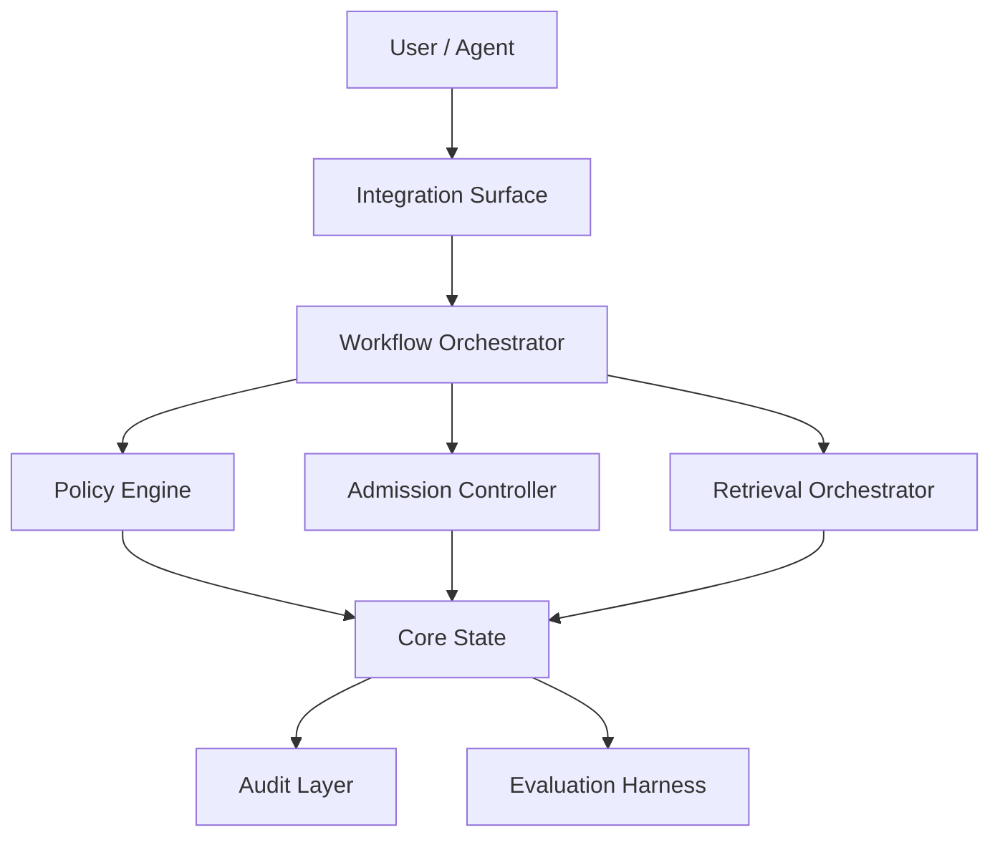
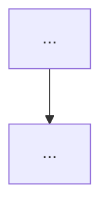
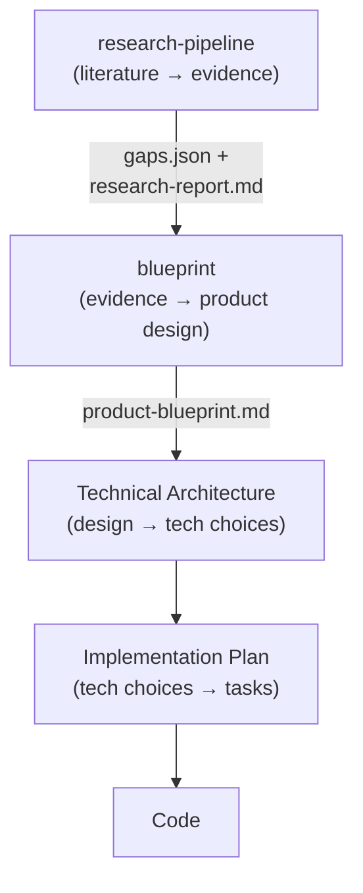

# Design Document: `blueprint` Skill

## 0. Document Control

**Skill name:** `blueprint`

**Skill version:** `0.1.0`

**Display name:** Research-to-Product Blueprint

**Document purpose:**

This document defines a local AI-agent skill named `blueprint`. The
skill converts a research synthesis report into an implementation-neutral
product blueprint.

**Intended reader:**

A local AI coding/research agent that will implement or generate the skill.

**Primary output of the skill:**

A Markdown product blueprint that translates academic ideas, methods,
mechanisms, benchmarks, and gaps into a coherent product concept,
workflow model, logical architecture, MVP boundary, evaluation plan,
and technical-design handoff.

**Important boundary:**

This skill must not select a programming language, framework, database,
cloud provider, vector database, UI library, deployment platform,
package structure, or concrete implementation plan. Those belong to
later skills.

---

## 1. Executive Summary

The `blueprint` skill is a second-stage transformation skill in a
research-driven software-development workflow.

It consumes a research synthesis report produced by the upstream
`research-pipeline` skill and generates a product-level blueprint.
The upstream report contains confidence-graded findings, recurring
mechanisms, gap classifications (`ACADEMIC` / `ENGINEERING`),
contradiction maps, risk items, readiness assessments, and evidence
citations.

The skill's role is not to summarise papers again. Its role is to
convert research findings into product design language.

The central transformation is:

```text
Research mechanisms / confidence-graded findings / gap classifications
        ↓
Product primitives
        ↓
Core capabilities
        ↓
Workflows
        ↓
Logical architecture
        ↓
MVP boundary
        ↓
Evaluation strategy
        ↓
Technical-design handoff
```

The output must be actionable for a later technical architecture or
implementation-planning skill, while staying independent of tech-stack
decisions.

---

## 2. Skill Position in the Larger Workflow

### 2.1 Upstream Skill: `research-pipeline`

The upstream `research-pipeline` skill performs academic paper
extraction and synthesis across iterative gap-closure rounds, commonly
up to the configured maximum used by the current `research-pipeline`
version.

Its canonical output is `<topic-slug>-research-report.md` together
with optional machine-readable artifacts in `runs/<run_id>/`.

The report answers:

```text
What does the literature say?
What mechanisms exist?
What evidence supports them (with confidence grades: HIGH / MEDIUM / LOW)?
Where do papers agree or disagree?
What gaps remain (ACADEMIC / ENGINEERING)?
What risks are known?
Which ideas appear implementation-ready?
```

The report contains a canonical set of required and recommended
sections (see §4.3 for the mapping). Findings should be backed by
citations traceable to the screened shortlist.

### 2.2 This Skill: `blueprint`

The `blueprint` skill answers:

```text
What real product, workflow, or system can be derived from this research?
What are the product capabilities?
What workflows should exist?
What conceptual components are required?
What should be in MVP?
What should be deferred?
What must later technical design decide?
```

### 2.3 Downstream Skill: Technical Architecture

A later technical architecture / implementation-planning skill answers:

```text
How should this be implemented?
Which language, framework, database, API style, deployment model,
and repository structure should be used?
What are the implementation phases and tasks?
```

### 2.4 Recommended Pipeline

```text
Academic papers
   ↓
Skill 1: research-pipeline  (plan → search → screen → download →
                              convert → extract → summarize → report,
                              configured gap-closure rounds)
   ↓
<topic-slug>-research-report.md  +  gaps.json  [+  synthesis_report.json]
   ↓
Skill 2: blueprint
   ↓
<topic-slug>-product-blueprint.md
   ↓
Skill 3: Technical Architecture
   ↓
Skill 4: Implementation Plan
   ↓
Coding Agent / Human Implementation
```

### 2.5 Handover Trigger

The `research-pipeline` skill explicitly offers handover at the end
of its iterative-synthesis loop (`references/iterative-synthesis.md`,
section "System-Design Handover"):

> *"For system-building requests, after the iterative loop converges:
> ... Ask the user whether to proceed to the next skill for requirements
> clarification → story generation → architecture design."*

The `blueprint` skill is the natural successor at this handover point.
It should be triggered when:

- The user accepts the research-pipeline handover offer.
- The user explicitly says: "create a blueprint", "design the product",
  "turn this research into a product", "what should we build?", or
  "generate a product design from this report".
- A `<topic-slug>-research-report.md` file exists in the working
  directory and the user's intent is product design, not more research.

---

## 3. Skill Goals and Non-Goals

### 3.1 Goals

The skill must:

1. Identify the product opportunity implied by a research report.
2. Extract confidence-graded findings, mechanisms, methodologies,
   patterns, contradictions, assumptions, risks, and gaps.
3. Translate research items into product primitives.
4. Merge overlapping ideas into coherent product capabilities.
5. Decide which ideas are adopted, adapted, merged, deferred, or rejected.
6. Define the product thesis.
7. Define target users, system actors, and use cases.
8. Define implementation-neutral workflows.
9. Define logical architecture and conceptual component responsibilities.
10. Define conceptual information objects.
11. Define decision policies and governance rules.
12. Define MVP scope and future roadmap.
13. Define evaluation strategy and success criteria.
14. Define open questions and validation requirements.
15. Produce a clean Markdown blueprint suitable for downstream
    technical design.

### 3.2 Non-Goals

The skill must not:

1. Select a programming language.
2. Select a framework.
3. Select a database.
4. Select a vector database.
5. Select a cloud provider.
6. Select a UI library.
7. Define concrete package/module structure.
8. Define physical deployment architecture.
9. Produce code.
10. Produce detailed implementation tasks.
11. Produce vendor-specific architecture.
12. Replace the technical architecture skill.
13. Replace the implementation planning skill.
14. Treat research gaps as solved without explicit validation.

### 3.3 Allowed vs Forbidden Output

**Clearly allowed:**

```text
The product needs a durable record store.
The product needs an admission-control workflow.
The product needs an agent integration surface.
The product needs a retrieval workflow.
The product needs an evaluation harness.
The product needs a governance layer.
```

**Clearly forbidden:**

```text
Use Python.
Use FastAPI.
Use PostgreSQL.
Use Chroma.
Use React.
Use AWS.
Create table memory_records.
Implement class MemoryAdmissionController.
Install package X.
Deploy with Docker Compose.
```

**Borderline cases — how to resolve them:**

| Statement | Verdict | Reason |
|---|---|---|
| The product needs an append-only event ledger | ✅ Allowed | Conceptual behaviour, not a technology |
| The product needs a distributed messaging layer | ✅ Allowed | Conceptual responsibility, not a vendor |
| The product needs Kafka | ❌ Forbidden | Named technology choice |
| The product needs a document store | ✅ Allowed | Conceptual storage type |
| The product needs MongoDB | ❌ Forbidden | Named vendor |
| The product needs efficient vector similarity search | ✅ Allowed | Conceptual capability |
| The product needs FAISS | ❌ Forbidden | Named library |
| The product should be deployed as microservices | ⚠️ Borderline | Leans toward deployment architecture; defer to technical design |
| The product needs process isolation between tenants | ✅ Allowed | Conceptual security boundary, not an infrastructure choice |

**Decision rule for borderline cases:**
If removing the specific term and replacing it with its purpose still
conveys the constraint clearly, the conceptual version is preferred.
If the statement cannot be expressed without naming a specific product,
vendor, or deployment model, it belongs in the technical architecture
skill.

The skill may use neutral conceptual names such as `Memory Admission
Controller` or `Retrieval Orchestrator` as logical components. It must
not turn those into concrete source-code modules unless explicitly asked
by a downstream technical-design task.

---

## 4. Input Contract

### 4.1 Required Input

The skill requires one primary input:

```text
A research synthesis report in Markdown, produced by research-pipeline
or a compatible research workflow.
```

The canonical filename pattern is `<topic-slug>-research-report.md`.

### 4.2 Optional Inputs

The skill may also accept:

```yaml
project_name: optional string
target_domain: optional string
target_users: optional list
product_direction: optional string
constraints: optional list
excluded_scopes: optional list
mvp_bias: optional enum [small, balanced, ambitious]
risk_tolerance: optional enum [low, medium, high]
output_language: optional enum [english, chinese, bilingual]
output_detail: optional enum [concise, standard, detailed]
```

The skill may also read supplementary machine-readable artifacts
produced by `research-pipeline` if they exist in the working directory
or `runs/<run_id>/` (see §4.6).

### 4.3 Research-Pipeline Output Sections — Mapping to Blueprint Inputs

The following table maps each required section of a
`research-pipeline` report to the blueprint input it primarily feeds.

| Research-Pipeline Section | Blueprint Input Role |
|---|---|
| `## Executive Summary` | Product opportunity framing; confidence baseline |
| `## Research Question` | Product thesis seed; scope boundaries |
| `## Methodology` | Evidence quality signal (how many papers, sources) |
| `## Papers Reviewed` | Evidence quality; citation traceability |
| `## Research Landscape` (themes) | Core mechanism extraction per theme |
| `## Confidence-Graded Findings` (🟢🟡🔴) | ADOPT/DEFER/REJECT signal for each idea |
| `## Research Gaps` (ACADEMIC / ENGINEERING) | Gap-type-specific product actions (see §6.4) |
| `## Practical Recommendations` | Priority product requirements |
| `## Points of Contradiction` | Design decisions; contradiction resolution |
| `## Trade-Off Analysis` | Decision policy inputs |
| `## Readiness Assessment` (`IMPLEMENTATION_READY` / `HAS_GAPS`) | MVP feasibility signal |
| `## Evidence Map` | Traceability matrix inputs |
| `## References` | Authoritative citation list for traceability appendix |

The `## Round History` section tells the skill how many gap-closure
iterations were needed — a long round history with many remaining gaps
signals a speculative product space that requires more conservative MVP
scoping.

### 4.4 Input Quality Detection

The skill must classify input quality before proceeding:

```yaml
input_quality:
  has_research_question: true/false
  has_confidence_graded_findings: true/false
  has_mechanisms: true/false
  has_evidence: true/false
  has_assumptions: true/false
  has_contradictions: true/false
  has_gaps_classified: true/false     # ACADEMIC/ENGINEERING labels present
  has_risks: true/false
  has_operational_implications: true/false
  has_architecture_hints: true/false
  has_readiness_assessment: true/false
  overall: strong | usable | weak | insufficient
```

**Concrete classification thresholds:**

| Overall | Condition |
|---|---|
| `strong` | `has_research_question` AND `has_confidence_graded_findings` AND `has_gaps_classified` AND `has_evidence` |
| `usable` | `has_research_question` AND (`has_mechanisms` OR `has_confidence_graded_findings`) AND `has_evidence` |
| `weak` | `has_research_question` AND (`has_mechanisms` OR `has_evidence`) |
| `insufficient` | No research question, no identifiable mechanisms/findings, or no evidence. The skill MUST stop and report this to the user. |

If the input contains only a research question with no mechanisms,
findings, evidence, or gaps, classify it as `insufficient`.

If the input is `weak` but not `insufficient`, the skill should
proceed and explicitly mark missing areas as assumptions or open
questions in the blueprint. It must not stop unless the input is
truly `insufficient`.

**Insufficient-input failure output:**

```markdown
# Blueprint Generation Failed: Insufficient Research Input

## Reason

The source report does not contain enough evidence to generate a
research-grounded product blueprint.

## Missing Inputs

- Research question: present / missing
- Mechanisms or findings: present / missing
- Evidence or citations: present / missing
- Gap classification: present / missing

## Recommended Next Step

Run or re-run the `research-pipeline` skill to produce a complete
research report before invoking `blueprint`.
```

### 4.5 Multi-Domain Research Reports

If the research report covers multiple unrelated product domains
(e.g., a report on "AI memory" that covers both personal-assistant
memory and autonomous-robot memory as entirely separate problems), the
skill must:

1. Detect the domain split from the research landscape themes.
2. When a reasonable default can be inferred from the report, proceed
   with that default and document the assumption. Use the domain with
   the highest coverage (most papers / highest-confidence findings)
   as the default signal.
3. Scope the blueprint to one domain only. Cross-domain features may
   be noted as future extensions.
4. Document the domain selection decision in §2 of the output
   (Source Research Interpretation).

Ask the user only when multiple domains have similar evidence coverage
and would lead to materially different product theses.

Do not attempt to produce a blueprint that covers all domains in one
pass — it will produce an incoherent product thesis.

### 4.6 Supplementary Artifacts from research-pipeline

The skill may read the following artifacts for richer input if they
exist:

| Artifact | Purpose |
|---|---|
| `runs/<run_id>/summarize/synthesis_report.json` | Machine-readable findings and gap objects |
| `gaps.json` | Structured gap classification (`ACADEMIC` / `ENGINEERING` / `OUT_OF_SCOPE`) with priorities |
| `runs/<run_id>/screen/screened.jsonl` | Paper metadata for traceability citations |
| `runs/<run_id>/plan/query_plan.json` | Original topic framing |

These are supplementary only. The Markdown report is authoritative.
If the JSON artifacts are absent, the skill proceeds using only the
Markdown report.

If supplementary JSON artifacts conflict with the Markdown report,
prefer the Markdown report and add a note in Source Research
Interpretation. If the Markdown report is missing structured details
that exist in JSON, use the JSON fields but mark them as supplementary.

---

## 5. Output Contract

### 5.1 Primary Output

The skill outputs one Markdown document:

```text
<topic-slug>-product-blueprint.md
```

Written to the current working directory (same convention as the
upstream research report).

If `<topic-slug>` cannot be inferred, derive it from the source report
filename. If no filename is available, derive a lowercase hyphenated
slug from the product thesis. If the agent cannot write files, emit the
full Markdown blueprint and state the recommended filename.

### 5.2 Required Output Sections

The blueprint must contain:

```markdown
# Product Blueprint: <Project Name>

## 1. Executive Product Thesis
## 2. Source Research Interpretation
## 3. Target Users and System Actors
## 4. Product Goals and Non-Goals
## 5. Research-to-Product Translation Map
## 6. Adopt / Adapt / Merge / Defer / Reject Decisions
## 7. Core Product Capabilities
## 8. Workflow Model
## 9. Logical Architecture
## 10. Conceptual Information Model
## 11. Decision Policies
## 12. Risk, Governance, and Safety Model
## 13. Evaluation Strategy
## 14. MVP Scope
## 15. Roadmap and Future Extensions
## 16. Open Questions and Validation Plan
## 17. Handoff Notes for Technical Design
## 18. Traceability Appendix
```

### 5.3 Output Style

The output must be:

```text
implementation-neutral
structured
explicit
traceable
skeptical
actionable
not over-engineered
not vendor-specific
not tech-stack-specific
```

The output must also follow these formatting conventions, matching the
upstream research-pipeline report style:

- A `## Contents` section at the top with internal Markdown links to
  all required sections.
- **Mermaid** diagrams for the main end-to-end workflow and logical
  architecture, with additional workflow diagrams only for complex,
  safety-critical, or high-risk workflows.
- **Markdown tables** for translation maps, decisions, risks,
  evaluations, and policies.
- Implementation-neutral prose for all descriptive sections.

### 5.4 Traceability Requirement

Every major product capability should be traceable to at least one of:

```text
Research mechanism (cite as [arxiv_id] or [Author, Year])
Recurring pattern (cite as [arxiv_id] or [Author, Year])
Evidence-backed finding from Confidence-Graded Findings section
Engineering gap from Research Gaps section
Research gap from Research Gaps section
Risk register item
Assumption
Contradiction resolution
Explicit product decision
```

Use the citation format `[arxiv_id]` (e.g., `[2312.01234]`) or
`[Author, Year]` (e.g., `[Park et al., 2023]`) to match the upstream
report's reference style. Citations must be traceable to the
`## References` section of the source report.

If no trace exists, the skill must mark the capability as:

```text
Design hypothesis — requires validation.
```

An explicit design decision may be used only when the capability is
necessary to connect, operationalize, or govern research-backed
capabilities. It must include a rationale and must not replace research
traceability for core product claims.

### 5.5 Section Length Guidance

The following table gives recommended content targets per detail level.
These prevent both under-filled sections (placeholder tables with no
rows) and over-filled sections (bloated prose).

| Section | Concise | Standard | Detailed |
|---|---|---|---|
| §1 Executive Thesis | 1 paragraph + thesis sentence | 1 paragraph + 4 sub-items | 2 paragraphs + full context |
| §2 Research Interpretation | 3–5 bullets | 3–5 bullets + paragraph | Full narrative per theme |
| §3 Users and Actors | 2–4 table rows | 3–6 table rows | 5–10 rows + use-case notes |
| §5 Translation Map | Top 10 items | All items ≥ medium relevance | All classified items |
| §6 Decisions | Core ideas only | All adopted/rejected ideas | All ideas with rationale |
| §7 Capabilities | 3–5 capabilities | 4–8 capabilities | Full capability inventory |
| §8 Workflow Model | 2–3 workflows | 3–6 workflows | All relevant workflows |
| §9 Architecture | 1 diagram + 3–5 components | 1–2 diagrams + full table | Full section per §10 spec |
| §10 Information Model | Top 4–6 objects | All objects needed for MVP | Full object inventory |
| §11 Decision Policies | 3–5 critical policies | All MVP policies | Full policy inventory |
| §12 Risk Model | Top 5 risks | All HIGH/MEDIUM risks | Full risk register |
| §13 Evaluation | 3–5 core scenarios | One per capability | Full harness spec |
| §14 MVP Scope | Bullet lists only | Bullets + success definition | Full narrative |
| §16 Open Questions | 3–5 questions | All unresolved questions | Questions + validation plans |

Default is `standard` unless the user specifies otherwise.

---

## 6. Core Transformation Model

> **Note on schemas in §6.1–6.3:**
> The YAML schemas below are instructional guides for the agent's
> reasoning — they describe the fields to think about for each item.
> They are not strict serialisation contracts. The agent should reason
> using these as conceptual frameworks and produce the output in the
> natural prose and table formats defined in §5. Do not emit raw YAML
> blocks in the final blueprint.

### 6.1 Research Item Types

The skill should classify each extracted item:

```yaml
research_item:
  id: string
  name: string
  source_section: string        # e.g. "Confidence-Graded Findings §3"
  source_citation: string       # e.g. "[2312.01234]" or "[Park et al., 2023]"
  type:
    - taxonomy
    - mechanism
    - algorithm
    - workflow_pattern
    - benchmark
    - security_method
    - data_structure
    - empirical_result
    - assumption
    - contradiction
    - academic_gap
    - engineering_gap
    - risk
    - operational_implication
    - architecture_hint
  confidence_grade:             # from upstream research-pipeline report
    - HIGH                      # 🟢 supported by 3+ papers
    - MEDIUM                    # 🟡 1-2 papers or with caveats
    - LOW                       # 🔴 preliminary or contradicted
    - unknown
  summary: string
  product_relevance:
    - critical
    - useful
    - optional
    - weak
    - out_of_scope
```

### 6.2 Product Primitive Types

Each research item should be translated into one or more product primitives:

```yaml
product_primitive:
  id: string
  name: string
  primitive_type:
    - capability
    - workflow
    - policy
    - conceptual_component
    - information_object
    - evaluation_requirement
    - governance_rule
    - risk_control
    - user_interaction
    - lifecycle_state
    - integration_surface
  derived_from: list[research_item_id]
  rationale: string
  mvp_candidate: true/false
```

### 6.3 Translation Rules

Use this mapping:

| Research Item | Product Translation |
|---|---|
| Taxonomy | Conceptual domain model |
| Mechanism | Product capability or decision policy |
| Algorithm | Decision rule, scoring policy, or workflow step |
| Workflow pattern | User/system workflow |
| Benchmark | Evaluation strategy |
| Security method | Governance or safety control |
| Data structure | Conceptual information object |
| Empirical result | Priority signal (HIGH confidence → ADOPT; LOW → DEFER) |
| Assumption | Validation requirement |
| Contradiction | Explicit design decision |
| Academic gap | Research risk or future validation — NOT a product requirement |
| Engineering gap | Product requirement or MVP risk — map to capability or policy |
| Risk | Mitigation and governance rule |
| Operational implication | Runtime/product constraint |
| Architecture hint | Logical component or integration surface |

### 6.4 Research-Pipeline Gap Classification Mapping

The research-pipeline skill classifies every open gap as `ACADEMIC`,
`ENGINEERING`, or `OUT_OF_SCOPE`. These classifications have specific
product implications:

| Gap Classification | Product Action |
|---|---|
| `ENGINEERING` (HIGH severity) | Becomes a product requirement; candidate for MVP |
| `ENGINEERING` (MEDIUM severity) | Becomes a product requirement; candidate for Phase 2 |
| `ENGINEERING` (LOW severity) | Becomes a future extension |
| `ACADEMIC` (any severity) | Becomes a validation requirement or open question; must NOT become an MVP requirement unless the product's purpose is to answer the research question |
| `OUT_OF_SCOPE` | Note as a non-goal; do not include in the blueprint |

### 6.5 Example Transformation

**Example from an AI-agent memory report:**

```text
Research item: Evaluator-gated writes [2312.01234]
Type: mechanism  /  Confidence: HIGH (🟢)
Product primitive: Memory Admission Workflow
Rationale: The product must prevent low-value, redundant, unsafe,
  or poisoned memory from entering long-term state.
```

**Example from a code-search tooling report:**

```text
Research item: BM25+embedding hybrid retrieval [Park et al., 2023]
Type: mechanism  /  Confidence: MEDIUM (🟡)
Product primitive: Hybrid Code Search Capability
Rationale: Pure keyword search misses semantic matches; pure embedding
  search misses exact-token matches. The product needs both.
```

**Example from a distributed systems report:**

```text
Research item: Three-layer sharing model (local / project / team) [2401.05678]
Type: architecture_hint  /  Confidence: HIGH (🟢)
Product primitive: Scoped Sharing and Promotion Model
Rationale: The product must control information movement across
  personal, project, and team contexts to prevent leakage.
```

---

## 7. Idea Resolution Model

The skill must not blindly include every research idea. It must
classify the treatment of each idea.

### 7.1 Resolution Categories

```text
ADOPT
Use the idea directly because it is central, evidence-backed,
and aligned with the product.

ADAPT
Use the idea, but modify it for the target product context.

MERGE
Combine multiple related ideas into one coherent product capability.

DEFER
Keep the idea for a later version because it is valuable but
not MVP-critical.

REJECT
Exclude the idea because it is weak, redundant, unsafe,
too speculative, or out of scope.
```

### 7.2 Required Decision Table

The blueprint must include a table like:

| Source Idea | Research Citation | Decision | Product Translation | Rationale | MVP? |
|---|---|---|---|---|---|
| Idea A | [2312.01234] | ADOPT | Capability X | HIGH confidence, central to product | Yes |
| Idea B | [Park, 2023] | MERGE | Capability Y | Similar to Idea C and D | Yes |
| Idea E | [2401.05678] | DEFER | Future Extension Z | Valuable but not MVP-critical | No |
| Idea F | [LOW confidence] | REJECT | None | Evidence weak or out of scope | No |

### 7.3 Decision Discipline

The skill should be conservative.

Rules:

1. `HIGH`-confidence and product-critical ideas should usually be
   ADOPT or MERGE.
2. `MEDIUM`-confidence ideas should usually be ADAPT or DEFER.
3. `LOW`-confidence ideas should usually be DEFER unless they are
   cheap and low-risk.
4. Academic gaps must not become MVP requirements unless the product's
   purpose is research validation.
5. Security-critical gaps must become risk controls or release gates.
6. Any idea requiring model retraining, infrastructure-heavy work,
   or exotic capability should usually be DEFER.
7. Any idea that makes the MVP too large should be DEFER unless it
   is required for safety or correctness.
8. If the `research-pipeline` report's `## Round History` reaches
   the configured gap-closure maximum with many remaining gaps, the
   product space is speculative — apply more conservative DEFER/REJECT
   pressure.
9. If the `Readiness Assessment` verdict is `HAS_GAPS`, flag the
   relevant capabilities as requiring validation before release.

---

## 8. Product Thesis Generation

### 8.1 Required Thesis Template

**Single-domain product:**

```text
This product is a <system type> for <target users or systems> that
helps them <primary outcome> by using <core research-derived mechanisms>,
while controlling <main risks>.
```

**Multi-domain platform:**

```text
This product is a <platform type> that provides <primary outcome A>
for <user group A> and <primary outcome B> for <user group B>, built on
<shared research-derived mechanisms>, while managing <main risks>.
```

**Research-validation product** (when the research has `ACADEMIC` gaps
that are central to the product's purpose):

```text
This product is a <system type> for <target users> that validates
<unresolved research question> in a production context by implementing
<research-derived mechanisms>, with explicit measurement of <evaluation
criteria> to close the remaining gap.
```

### 8.2 Thesis Quality Rules

The thesis must be:

```text
specific
short
product-oriented
not a paper summary
not a list of technologies
not a vague research ambition
```

### 8.3 Bad Thesis

```text
This product implements ideas from many academic papers about AI memory.
```

### 8.4 Good Thesis (diverse examples)

**AI agent memory system:**

```text
This product is a local-first shared memory system for AI coding agents
that gives agents persistent, governed, cross-session memory through
scoped memory records, evaluator-gated writes, hybrid retrieval,
lifecycle management, and security controls against poisoning and
leakage.
```

**Code-search tooling:**

```text
This product is a developer code-search service that surfaces relevant
code snippets from large codebases through hybrid BM25+embedding
retrieval, scope-filtered ranking, and usage-frequency signals, while
controlling for result staleness and privacy boundaries.
```

**Distributed configuration management:**

```text
This product is a configuration governance layer for distributed services
that enforces schema validation, drift detection, and rollback policies
on runtime configuration, making configuration changes auditable and
reversible without requiring service restarts.
```

---

## 9. Workflow Model Specification

The skill must generate implementation-neutral workflows.

### 9.1 Required Workflow Fields

Each workflow must include:

```yaml
workflow:
  name: string
  purpose: string
  trigger: string
  actors: list
  inputs: list
  preconditions: list
  decision_gates: list
  steps: list
  outputs: list
  failure_modes: list
  success_criteria: list
  related_capabilities: list
  traceability: list    # cite as [arxiv_id] or [Author, Year]
```

### 9.2 Common Workflow Categories

The skill should consider these workflow categories:

```text
Intake / ingestion workflow
Classification workflow
Admission / approval workflow
Retrieval / read workflow
Update / consolidation workflow
Conflict-resolution workflow
Forgetting / deletion workflow
Sharing / promotion workflow
Evaluation workflow
Audit / recovery workflow
Human review workflow
Agent integration workflow
Migration workflow
```

Not every product needs every workflow. The skill should include only
relevant workflows based on what the research report describes.

### 9.3 Workflow Design Rules

1. Each workflow must start from a clear trigger.
2. Each workflow must end with an explicit output.
3. Decision gates must be visible.
4. Human review points must be explicit when risk exists.
5. Failure modes must be named.
6. Workflows must not assume a particular implementation technology.
7. Workflows must be usable by a downstream implementation-planning agent.
8. The blueprint must include at least one Mermaid diagram for the main
   end-to-end workflow and at least one Mermaid diagram for logical
   architecture. Additional workflow diagrams should be added only for
   complex, safety-critical, or high-risk workflows.

### 9.4 Example Workflow

````markdown
### Workflow: Candidate Knowledge Admission

**Purpose:**
Decide whether a candidate knowledge item should become durable product state.

**Trigger:**
An agent, user, or automated process proposes a new knowledge item.

**Inputs:**
- Candidate item
- Source context
- Target scope
- Existing related records
- Confidence signal

**Decision Gates:**
1. Is the source trusted?
2. Is the item relevant to future work?
3. Is the item redundant?
4. Does it contradict existing knowledge?
5. Is it safe to store?
6. Should it be added, updated, rejected, quarantined, or deferred?

**Outputs:**
- Accepted record
- Updated existing record
- Rejected proposal
- Quarantined item
- Audit event

**Failure Modes:**
- Low-value information is stored
- Poisoned information is stored
- Useful information is rejected
- Contradiction is ignored
- No audit trail exists

**Success Criteria:**
- Useful information is retained
- Harmful or low-value information is blocked
- Contradictions are visible
- Decisions are traceable


````

---

## 10. Logical Architecture Specification

### 10.1 Purpose

The logical architecture describes conceptual responsibilities and
boundaries, not implementation components.

Conceptual component names may sound software-like, but they describe
responsibility boundaries only; they must not imply classes, services,
packages, processes, or deployable units.

### 10.2 Required Architecture Sections

```markdown
## Logical Architecture

### System Context
### Actors
### External Systems
### Core Logical Components
### Component Responsibilities
### Control Flow
### Information Flow
### Policy Boundaries
### Trust Boundaries
### Extension Points
```

### 10.3 Logical Component Schema

```yaml
component:
  name: string
  responsibility: string
  inputs: list
  outputs: list
  owns_decisions: list
  does_not_own: list
  related_workflows: list
  traceability: list    # cite as [arxiv_id] or [Author, Year]
```

### 10.4 Component Naming Rules

Allowed names (conceptual, technology-neutral):

```text
Admission Controller
Retrieval Orchestrator
Lifecycle Manager
Governance Layer
Evaluation Harness
Integration Surface
Audit Layer
Policy Engine
Scope Controller
Index Manager
Classification Engine
Conflict Resolver
```

Avoid names that imply code or infrastructure too early:

```text
FastAPI service
PostgreSQL database
Redis queue
React dashboard
Docker container
Python module
TypeScript package
gRPC server
REST endpoint
```

### 10.5 Architecture Diagram Requirement

The logical architecture section must include at least one Mermaid
diagram showing the high-level component relationships and data flow.

**Example:**



---

## 11. Conceptual Information Model

### 11.1 Purpose

The skill should define conceptual objects that the product must reason
about, without defining a database schema.

### 11.2 Required Fields for Each Conceptual Object

```yaml
object:
  name: string
  purpose: string
  key_fields_conceptual: list
  lifecycle_states: list
  relationships: list
  governance_notes: list
  traceability: list    # cite as [arxiv_id] or [Author, Year]
```

### 11.3 Example Conceptual Objects by Domain

**AI-agent memory product:**

```text
Memory Record, Candidate Memory, Source Episode, Scope,
Policy Decision, Retrieval Result, Evaluation Scenario,
Audit Event, Tombstone, Promotion Request
```

**Code-search tooling:**

```text
Code Snippet, Search Query, Result Set, Relevance Score,
Scope Filter, Index Entry, Staleness Signal, Privacy Boundary
```

**Configuration governance:**

```text
Configuration Item, Schema Definition, Drift Event, Rollback Target,
Audit Record, Approval Request, Enforcement Policy, Service Binding
```

The skill must infer appropriate objects from the source report, not
assume any particular domain.

### 11.4 Rules

1. Use conceptual names, not database table names.
2. Define object purpose before fields.
3. Include lifecycle states when relevant.
4. Include relationships between objects.
5. Include governance notes for sensitive objects.
6. Avoid storage technology.

---

## 12. Decision Policies

### 12.1 Purpose

Many research ideas become decision policies. The skill must make
those policies explicit.

### 12.2 Policy Schema

```yaml
policy:
  name: string
  purpose: string
  applies_to: string
  inputs: list
  decision_options: list
  default_decision: string
  escalation_rule: string
  failure_mode: string
  traceability: list    # cite as [arxiv_id] or [Author, Year]
```

### 12.3 Common Policy Types

```text
Admission policy
Retrieval policy
Ranking policy
Conflict-resolution policy
Forgetting policy
Promotion policy
Security policy
Human-review policy
Abstention policy
Evaluation policy
MVP inclusion policy
```

### 12.4 Policy Design Rules

1. Decision options must be explicit.
2. Default behaviour must be explicit.
3. Escalation rules must be explicit.
4. The policy must not depend on a specific implementation mechanism.
5. Safety-critical policies must fail closed, not open.
6. Any policy derived from `MEDIUM` or `LOW` confidence research must
   be labelled as requiring validation.

---

## 13. Risk, Governance, and Safety Model

### 13.1 Required Risk Table

The blueprint must include:

| Risk | Likelihood | Impact | Mitigation | Release Gate? | Traceability |
|---|---|---|---|---|---|

### 13.2 Risk Sources

The skill should extract risks from:

```text
Risk Register (if present in research report)
Security Considerations (if present)
Research Gaps — ENGINEERING severity HIGH
Research Gaps — ACADEMIC for safety-critical domains
Contradiction Map (contradictions = design risk)
Assumption Map (unvalidated assumptions = product risk)
Operational Implications
Readiness Assessment gaps
```

### 13.3 Governance Requirements

For each high-impact risk, the skill should define:

```text
prevention control
detection control
recovery control
human-review requirement
evaluation requirement
release gate
```

### 13.4 Risk Rules

1. Do not minimise security or governance risks.
2. Do not treat "we can prompt the model better" as a sufficient mitigation.
3. Any cross-user, multi-tenant, shared, or persistent-state product
   requires explicit trust boundaries.
4. Any product that stores or retrieves user-specific knowledge requires
   explicit deletion and correction flows.
5. Any agent-facing product requires poisoning, prompt-injection, or
   malicious-input risk analysis.
6. Any deferred safety item must become a release blocker if the
   product would otherwise be unsafe.
7. Risks derived from `ACADEMIC` gaps must acknowledge that the
   research does not yet confirm the mitigation works.

---

## 14. Evaluation Strategy

### 14.1 Purpose

The blueprint must define how to know whether the product works.

### 14.2 Evaluation Dimensions

The skill should consider:

```text
Task success
Precision / recall
User utility
Workflow completion
Latency or operational cost (conceptual only — no numbers)
Safety
Security
Robustness
Abstention correctness
Forgetting / deletion correctness
Human-review burden
Regression risk
```

If the upstream research report includes benchmarks, methodology
comparisons, benchmark tables, paper-specific performance data, or
evaluation findings, those should be translated into concrete product
evaluation scenarios.

### 14.3 Evaluation Schema

```yaml
evaluation:
  name: string
  purpose: string
  scenario: string
  input_data: string
  expected_behavior: string
  success_metric: string
  failure_condition: string
  mvp_required: true/false
  traceability: list    # cite as [arxiv_id] or [Author, Year]
```

### 14.4 Rules

1. Every core capability needs at least one evaluation criterion.
2. Every HIGH-impact risk needs at least one evaluation or audit check.
3. If the source report contains benchmarks, translate them into
   product evaluation scenarios.
4. If no benchmark exists, define a scenario-based evaluation harness.
5. Evaluation must not assume implementation technology.
6. For capabilities derived from `ACADEMIC` gap items, the evaluation
   scenario must explicitly measure whether the gap assumption holds.

---

## 15. MVP Scoping Model

### 15.1 Purpose

The skill must prevent research bloat. Not every paper idea belongs
in MVP.

### 15.2 MVP Inclusion Criteria

An item belongs in MVP if it is:

```text
central to the product thesis
required for the main workflow
required for safety or correctness
strongly supported by evidence (HIGH confidence)
small enough to implement in an initial version
necessary for evaluation
```

### 15.3 Defer Criteria

An item should be deferred if it is:

```text
research-interesting but not product-critical
highly complex
LOW or MEDIUM confidence
requires specialised infrastructure
requires model retraining
requires multi-user scaling before single-user value is proven
only useful after core workflows exist
derived from an ACADEMIC gap (unless the product validates that gap)
```

### 15.4 MVP Sizing Signal from Round History

If the upstream report's `## Round History` shows:

- A single round with no remaining gaps → product space is well-understood;
  standard MVP scope is appropriate.
- Multiple rounds below the configured gap-closure maximum with few
  remaining gaps → moderate uncertainty; lean toward smaller MVP.
- Reaching the configured gap-closure maximum with remaining gaps, or
  `Readiness: HAS_GAPS` → product space is speculative; MVP must be
  minimal and explicitly validation-oriented.

### 15.5 MVP Output Format

```markdown
## MVP Scope

### MVP Must Include
- Capability A
- Workflow B
- Policy C
- Evaluation D

### MVP Must Not Include
- Feature E
- Advanced mechanism F
- Large-scale deployment G

### MVP Success Definition
The MVP is successful if...
```

---

## 16. Roadmap Model

### 16.1 Recommended Phases

```text
Phase 0: Product clarification and validation
Phase 1: Core workflow MVP
Phase 2: Governance and evaluation hardening
Phase 3: Multi-user or multi-agent expansion
Phase 4: Advanced optimisation and research extensions
```

### 16.2 Roadmap Rules

1. Phase 1 must be small.
2. Safety-critical items must not be deferred beyond the point where
   they are needed.
3. Advanced research mechanisms should be placed after the baseline
   product works.
4. Evaluation should start in MVP, not after production.
5. The roadmap must remain implementation-neutral.
6. Any capability derived from an `ACADEMIC` gap must not enter Phase 1
   unless it is explicitly the product's validation purpose.

---

## 17. Handoff Notes for Technical Design

### 17.1 Purpose

The final section must explicitly hand off to a later technical-design
skill.

### 17.2 Required Handoff Content

```markdown
## Handoff Notes for Technical Design

This blueprint intentionally does not choose a tech stack.

The next technical-design stage must decide:

- Runtime architecture
- Programming language
- Storage system
- Indexing/search strategy
- API style
- Agent integration mechanism
- UI or CLI surface
- Deployment model
- Repository structure
- Testing strategy
- Security implementation details
- Migration strategy
```

### 17.3 Handoff Inputs

The handoff section should provide:

```text
Core workflows (with diagrams)
Core conceptual components (with responsibility table)
Required information objects (with lifecycle states)
Decision policies (with defaults and escalation rules)
MVP boundary
Evaluation requirements
Major risks
Open questions
Unresolved ACADEMIC gaps that still apply
```

---

## 18. Blueprint Update Model

When a research report is updated (a new round of `research-pipeline`
closes additional gaps and regenerates the report), the blueprint must
also be updated. The update model mirrors the research-pipeline's
resume-on-top pattern.

### 18.1 Update Trigger

The blueprint update should be triggered when:

- A new `<topic-slug>-research-report.md` replaces the prior one, AND
- The user asks to update or regenerate the blueprint.

Do not automatically update the blueprint every time the research
report changes. Require explicit user confirmation.

### 18.2 Update Procedure

1. Rename the existing blueprint to
   `<topic-slug>-product-blueprint.<YYYY-MM-DD>.md` as a snapshot.
2. Read the new research report.
3. Compare the new confidence-graded findings against the decisions
   recorded in the prior blueprint's §6 (Adopt/Adapt/Merge/Defer/Reject
   table).
4. For each prior decision:
   - If new evidence upgrades a `MEDIUM`→`HIGH` confidence item,
     consider promoting from DEFER to ADOPT/MERGE.
   - If new evidence downgrades a `HIGH`→`MEDIUM` or `LOW` item,
     consider demoting from ADOPT to ADAPT or DEFER.
   - If a new round closed an `ACADEMIC` gap with HIGH-confidence
     evidence, the corresponding validation requirement may become
     a product requirement.
5. Carry forward open questions that the new report did not resolve.
6. Regenerate the full blueprint from scratch incorporating all changes.
   Do not append changes to the existing blueprint.
7. The old snapshot is preserved for audit. The new blueprint may
   mention the previous version only in the Update History table (§2);
   the main design body should be regenerated from the latest research
   report rather than patched incrementally.

### 18.3 Change Summary

The updated blueprint must include a brief change summary in §2
(Source Research Interpretation):

```markdown
### 2.x Update History

| Date | Research Report Version | Key Changes |
|---|---|---|
| YYYY-MM-DD | Round 1 | Initial blueprint |
| YYYY-MM-DD | Round 2 | Upgraded [idea] from DEFER → ADOPT based on new evidence [arxiv_id] |
```

---

## 19. Skill Runtime Algorithm

The local AI agent implementing this skill should follow this
algorithm.

### 19.1 High-Level Algorithm

```text
1. Read the source research report.
2. Check for supplementary artifacts (synthesis_report.json, gaps.json).
3. Detect report structure and available sections.
4. Classify input quality (see §4.4). Stop if insufficient.
5. Detect domain count. If multi-domain, resolve target domain (see §4.5).
6. Extract research question and target domain.
7. Extract mechanisms, methods, patterns, benchmarks, assumptions,
   contradictions, gaps (with ACADEMIC/ENGINEERING classification),
   risks, and architecture hints.
8. Classify extracted items by research item type and confidence grade.
9. Apply gap-type mapping (§6.4): ENGINEERING → requirements;
   ACADEMIC → validation.
10. Translate research items into product primitives.
11. Merge overlapping primitives.
12. Resolve contradictions into explicit design decisions.
13. Decide ADOPT / ADAPT / MERGE / DEFER / REJECT for each major idea.
14. Apply MVP sizing signal from Round History (§15.4).
15. Generate product thesis.
16. Define actors and use cases.
17. Define product goals and non-goals.
18. Define core capabilities.
19. Define workflows with required Mermaid coverage.
20. Define logical architecture with a Mermaid diagram.
21. Define conceptual information model.
22. Define decision policies.
23. Define risks and governance controls.
24. Define evaluation strategy.
25. Define MVP and roadmap.
26. Define open questions and validation plan.
27. Generate Markdown blueprint (including Contents section).
28. Run quality gates (§21).
29. If quality gates fail, revise and re-run gates.
    Maximum revision attempts: 3. After 3 failures, surface
    specific failing gates to the user and stop.
```

### 19.2 Pseudocode

The following pseudocode describes the intent of each step. The agent
must fill in the reasoning for each function — these are not
pre-implemented subroutines:

```pseudo
function generate_product_blueprint(report, options):
    # Step 1-5: Intake and quality check
    parsed = parse_report_sections(report)
    supplementary = load_supplementary_artifacts_if_present()
    input_quality = assess_input_quality(parsed)
    if input_quality == "insufficient":
        # Use the standardized failure output from §4.4.
        return render_insufficient_input_failure(parsed)
    target_domain = resolve_target_domain(parsed, options)

    # Step 6-9: Extraction and classification
    research_items = extract_all_items(parsed, supplementary)
    classified_items = classify_by_type_and_confidence(research_items)
    gap_mapped_items = apply_gap_type_mapping(classified_items)

    # Step 10-14: Translation and decisions
    primitives = translate_all_to_product_primitives(gap_mapped_items)
    merged_primitives = merge_overlapping_primitives(primitives)
    decisions = resolve_ideas(
        items=gap_mapped_items,
        primitives=merged_primitives,
        criteria=[evidence_confidence, product_relevance, complexity,
                  safety_criticality, mvp_fit, round_history_signal]
    )

    # Step 15-27: Blueprint composition
    thesis = generate_product_thesis(decisions, target_domain, options)
    blueprint = compose_all_sections(thesis, decisions, options)

    # Step 28-29: Quality gates with bounded retry
    revision_count = 0
    max_revisions = 3
    while revision_count < max_revisions:
        result = run_quality_gates(blueprint)
        if result.passed:
            break
        blueprint = revise_failing_sections(blueprint, result)
        revision_count += 1

    if not result.passed:
        surface_failing_gates_to_user(result)
        stop()

    return blueprint
```

---

## 20. Required Prompts for the Skill

The implementing agent may use these internal prompt templates.

### 20.1 Extraction Prompt

```text
You are extracting product-relevant research items from a research
synthesis report produced by the research-pipeline skill.

The report uses confidence grades: 🟢 HIGH (3+ papers), 🟡 MEDIUM
(1-2 papers), 🔴 LOW (preliminary or contradicted).
Gaps are classified as ACADEMIC or ENGINEERING.

Extract:
- research question and scope
- mechanisms (with confidence grade and citation)
- methodologies
- recurring patterns (with citation)
- benchmarks, methodology comparisons, benchmark tables,
  paper-specific performance data, and evaluation findings
- assumptions
- contradictions (from Points of Contradiction section)
- evidence-strength claims (from Confidence-Graded Findings section)
- academic gaps (from Research Gaps section, type ACADEMIC)
- engineering gaps (from Research Gaps section, type ENGINEERING)
- risks (from any Risk Register or Security Considerations section)
- operational implications
- architecture hints (from Readiness Assessment or Recommendations)

For each item, assign:
- item id
- item name
- source section
- source citation ([arxiv_id] or [Author, Year])
- item type
- confidence grade (HIGH / MEDIUM / LOW / unknown)
- product relevance
- one-sentence summary

Do not design the product yet. Do not select a tech stack.
```

### 20.2 Translation Prompt

```text
You are translating research items into product primitives.

For each research item:
- HIGH-confidence items: bias toward ADOPT or MERGE
- MEDIUM-confidence items: bias toward ADAPT or DEFER
- LOW-confidence items: bias toward DEFER unless cheap and safe
- ACADEMIC gap items: translate to validation requirements, not product requirements
- ENGINEERING gap items: translate to product requirements

For each research item, produce one or more product primitives.

Allowed primitive types:
- capability
- workflow
- policy
- conceptual component
- information object
- evaluation requirement
- governance rule
- risk control
- user interaction
- lifecycle state
- integration surface

Each primitive must include:
- name
- type
- derived_from (with citation)
- rationale
- MVP candidate yes/no

Stay implementation-neutral.
Do not name programming languages, frameworks, databases, or cloud
services. Use the borderline-case guidance in §3.3 when uncertain.
```

### 20.3 Resolution Prompt

```text
You are resolving research-derived ideas into product-design decisions.

For each major idea, choose one:
- ADOPT
- ADAPT
- MERGE
- DEFER
- REJECT

Use these criteria:
- evidence confidence grade (HIGH / MEDIUM / LOW)
- relevance to product thesis
- MVP necessity
- complexity
- risk
- dependency on unresolved research (ACADEMIC gaps)
- safety or governance impact
- Round History signal (many remaining rounds → conservative)
- Readiness Assessment verdict (HAS_GAPS → flag affected capabilities)

Return a decision table with:
- source idea
- research citation
- decision
- product translation
- rationale
- MVP yes/no
- related risks
```

### 20.4 Blueprint Composition Prompt

```text
You are composing an implementation-neutral product blueprint.

The document must start with a ## Contents section with internal
Markdown links to all sections.

Use the following required sections:
1. Executive Product Thesis
2. Source Research Interpretation
3. Target Users and System Actors
4. Product Goals and Non-Goals
5. Research-to-Product Translation Map
6. Adopt / Adapt / Merge / Defer / Reject Decisions
7. Core Product Capabilities
8. Workflow Model
9. Logical Architecture
10. Conceptual Information Model
11. Decision Policies
12. Risk, Governance, and Safety Model
13. Evaluation Strategy
14. MVP Scope
15. Roadmap and Future Extensions
16. Open Questions and Validation Plan
17. Handoff Notes for Technical Design
18. Traceability Appendix

Formatting requirements:
- Use Mermaid diagrams for the main end-to-end workflow and logical
  architecture. Add additional workflow diagrams only for complex,
  safety-critical, or high-risk workflows.
- Use Markdown tables for translation maps, decisions, risks,
  evaluations, and policies.
- Cite research evidence as [arxiv_id] or [Author, Year].
- Apply section length guidance per the output_detail setting (§5.5).

Do not select a tech stack. Do not write code.
Do not create implementation tasks.
Make the document actionable for a later technical-design skill.
```

### 20.5 Quality Gate Prompt

```text
Review the generated product blueprint against these gates.

Flag MVP scope for review if it contains more than 6 capabilities
without justification. Fail only if the MVP no longer represents a
small, testable core value path.

Fail the blueprint if ANY of the following are true:
- It chooses a programming language, framework, database, cloud provider,
  or vendor.
- It contains code or implementation tasks.
- Major capabilities lack traceability (no [arxiv_id] or constrained
  explicit design decision with rationale).
- MVP scope no longer represents a small, testable core value path.
- MVP scope is too vague (no success definition).
- Risks are missing or softened.
- Open research gaps are treated as solved without validation evidence.
- Workflows lack triggers, inputs, decision gates, outputs, failure
  modes, or success criteria.
- Logical architecture is replaced with technical architecture.
- The handoff to technical design is missing.
- The Contents section is absent.
- No Mermaid diagram exists for the main end-to-end workflow.
- No Mermaid diagram exists for logical architecture.
- ACADEMIC gap items appear as MVP product requirements without
  explicit justification.

For each failure, state:
- Gate name and number
- Specific location in the document (section and paragraph)
- Required fix

List only genuine failures. Do not flag style issues.
```

---

## 21. Quality Gates

The skill output must pass these gates. Gates are checked in order;
earlier gates may be pre-conditions for later ones.

**Maximum revision attempts:** 3. After 3 failed revisions, surface
all failing gates to the user and stop. Do not deliver an unvalidated
blueprint.

### 21.1 Gate 1: Input Understanding

Pass criteria:

```text
The blueprint identifies the source report's main research question.
The blueprint acknowledges input quality level and missing sections.
If multi-domain, the targeted domain is documented.
```

### 21.2 Gate 2: Research-to-Product Traceability

Pass criteria:

```text
Every major product capability traces back to a research item with
a citation ([arxiv_id] or [Author, Year]) or an explicit design decision.
```

An explicit design decision may be used only when the capability is
necessary to connect, operationalize, or govern research-backed
capabilities. It must include a rationale and must not replace research
traceability for core product claims.

### 21.3 Gate 3: Implementation Neutrality

Fail if the blueprint includes:

```text
programming language choice
framework choice
database choice (including specific DB products)
cloud provider choice
vendor-specific service
package/module structure
deployment commands
code
implementation tickets
```

Use the borderline-case table in §3.3 when uncertain.

### 21.4 Gate 4: Workflow Completeness

Each major workflow must include all of:

```text
trigger
inputs
decision gates
steps (or a Mermaid diagram showing the flow)
outputs
failure modes
success criteria
```

### 21.5 Gate 5: MVP Discipline

Pass criteria:

```text
MVP is small enough to build.
MVP contains the core value path.
MVP excludes advanced or speculative research extensions.
Safety-critical baseline controls are included.
MVP success is explicitly defined.
ACADEMIC gap items are not in MVP unless product validates that gap.
MVP scope is flagged for review if it contains more than 6 capabilities
without justification. This is a warning, not a failure by itself; fail
only if the MVP no longer represents a small, testable core value path.
```

### 21.6 Gate 6: Risk Honesty

Pass criteria:

```text
HIGH-impact risks are explicit.
Mitigations are realistic (not "prompt the model better").
Open risks are not hidden.
Safety-critical deferred items are flagged as release gates.
Risks from unvalidated ACADEMIC items are flagged accordingly.
```

### 21.7 Gate 7: Downstream Usefulness

Pass criteria:

```text
A later technical-design agent can use the document to choose a tech
stack and produce an implementation plan without needing to re-read
the original research papers.
The Contents section exists and all section links are valid.
At least one Mermaid diagram exists for the main end-to-end workflow.
At least one Mermaid diagram exists for logical architecture.
```

---

## 22. Output Template

The implementing agent should use the following template.

````markdown
# Product Blueprint: <Project Name>

## Contents

- [1. Executive Product Thesis](#1-executive-product-thesis)
- [2. Source Research Interpretation](#2-source-research-interpretation)
- [3. Target Users and System Actors](#3-target-users-and-system-actors)
- [4. Product Goals and Non-Goals](#4-product-goals-and-non-goals)
- [5. Research-to-Product Translation Map](#5-research-to-product-translation-map)
- [6. Adopt / Adapt / Merge / Defer / Reject Decisions](#6-adopt--adapt--merge--defer--reject-decisions)
- [7. Core Product Capabilities](#7-core-product-capabilities)
- [8. Workflow Model](#8-workflow-model)
- [9. Logical Architecture](#9-logical-architecture)
- [10. Conceptual Information Model](#10-conceptual-information-model)
- [11. Decision Policies](#11-decision-policies)
- [12. Risk, Governance, and Safety Model](#12-risk-governance-and-safety-model)
- [13. Evaluation Strategy](#13-evaluation-strategy)
- [14. MVP Scope](#14-mvp-scope)
- [15. Roadmap and Future Extensions](#15-roadmap-and-future-extensions)
- [16. Open Questions and Validation Plan](#16-open-questions-and-validation-plan)
- [17. Handoff Notes for Technical Design](#17-handoff-notes-for-technical-design)
- [18. Traceability Appendix](#18-traceability-appendix)

---

## 1. Executive Product Thesis

### 1.1 Product Thesis

<One-sentence thesis using the template from §8.1.>

### 1.2 Product Type

<System type — e.g., "local-first service", "governance layer",
"developer toolchain component".>

### 1.3 Primary Outcome

<What the product helps users/systems achieve.>

### 1.4 Main Risks Controlled

<Key risks from the research report's Risk Register or Gap items.>

### 1.5 Research Basis

**Source report:** `<topic-slug>-research-report.md`

**Research-pipeline rounds:** <N>

**Readiness verdict:** `IMPLEMENTATION_READY` / `HAS_GAPS`

**Input quality:** strong / usable / weak

### 1.6 Generation Metadata

| Field | Value |
|---|---|
| Source report | `<topic-slug>-research-report.md` |
| Source report version/hash | `<hash or timestamp>` |
| Generated at | `<date>` |
| Blueprint skill version | `<version>` |
| Output detail | concise / standard / detailed |
| Target domain | `<domain>` |

---

## 2. Source Research Interpretation

### 2.1 Source Report Summary

<Brief interpretation of the research report — what was studied,
how many papers, main themes.>

### 2.2 Research-Derived Opportunity

<What product opportunity is implied by the findings.>

### 2.3 Strongest Evidence

<List highest-confidence mechanisms and findings with citations.>

| Finding | Confidence | Citation |
|---|---|---|
| ... | HIGH 🟢 | [arxiv_id] |

### 2.4 Weak or Unresolved Evidence

<List MEDIUM/LOW confidence items and ACADEMIC gaps that affect
product feasibility.>

### 2.5 Update History *(include only if this is an updated blueprint)*

| Date | Research Report Version | Key Changes |
|---|---|---|
| YYYY-MM-DD | Round 1 | Initial blueprint |

---

## 3. Target Users and System Actors

| Actor | Role | Needs | Interaction with Product |
|---|---|---|---|

---

## 4. Product Goals and Non-Goals

### 4.1 Goals

- ...

### 4.2 Non-Goals

- ...

---

## 5. Research-to-Product Translation Map

| Research Item | Type | Confidence | Product Primitive | Product Relevance | Citation |
|---|---|---|---|---|---|

---

## 6. Adopt / Adapt / Merge / Defer / Reject Decisions

| Source Idea | Citation | Decision | Product Translation | Rationale | MVP? |
|---|---|---|---|---|---|

---

## 7. Core Product Capabilities

### Capability 1: <Name>

**Purpose:**
...

**Derived From:**
[cite research items and citations]

**Confidence Basis:**
HIGH 🟢 / MEDIUM 🟡 / LOW 🔴

**Required for MVP:** Yes/No

**Notes:**
...

---

## 8. Workflow Model

### Workflow 1: <Name>

**Purpose:**
...

**Trigger:**
...

**Actors:**
...

**Inputs:**
...

**Preconditions:**
...

**Decision Gates:**
1. ...
2. ...

**Steps:**
1. ...
2. ...

**Outputs:**
...

**Failure Modes:**
...

**Success Criteria:**
...

**Traceability:**
[cite research items]



---

## 9. Logical Architecture

### 9.1 System Context

...

### 9.2 Architecture Overview


### 9.3 Core Logical Components

| Component | Responsibility | Inputs | Outputs | Owns Decisions | Does Not Own |
|---|---|---|---|---|---|

### 9.4 Control Flow

```text
...
```

### 9.5 Information Flow

```text
...
```

### 9.6 Trust and Policy Boundaries

...

---

## 10. Conceptual Information Model

| Object | Purpose | Key Conceptual Fields | Lifecycle States | Relationships |
|---|---|---|---|---|

---

## 11. Decision Policies

| Policy | Purpose | Inputs | Decision Options | Default | Escalation | Traceability |
|---|---|---|---|---|---|---|

---

## 12. Risk, Governance, and Safety Model

| Risk | Likelihood | Impact | Mitigation | Release Gate? | Traceability |
|---|---|---|---|---|---|

---

## 13. Evaluation Strategy

| Evaluation | Purpose | Scenario | Expected Behaviour | Success Metric | MVP Required? | Traceability |
|---|---|---|---|---|---|---|

---

## 14. MVP Scope

### 14.1 MVP Must Include

- ...

### 14.2 MVP Must Not Include

- ...

### 14.3 MVP Success Definition

...

---

## 15. Roadmap and Future Extensions

### Phase 0: Product Clarification

...

### Phase 1: Core Workflow MVP

...

### Phase 2: Governance and Evaluation Hardening

...

### Phase 3: Expansion

...

### Phase 4: Advanced Research Extensions

...

---

## 16. Open Questions and Validation Plan

| Question | Why It Matters | Validation Method | Blocks MVP? | Gap Source |
|---|---|---|---|---|

---

## 17. Handoff Notes for Technical Design

This document intentionally does not choose a tech stack.

The next technical-design stage must decide:

- Runtime architecture
- Programming language
- Storage system
- Indexing/search strategy
- API style
- Agent integration mechanism
- UI or CLI surface
- Deployment model
- Repository structure
- Testing strategy
- Security implementation details
- Migration strategy

### Inputs for Technical Design

- Core workflows (§8)
- Core logical components (§9)
- Conceptual information model (§10)
- Decision policies (§11)
- Risk model (§12)
- MVP boundary (§14)
- Evaluation requirements (§13)
- Open questions (§16)
- Unresolved ACADEMIC gaps: [list any that still apply]

---

## 18. Traceability Appendix

| Product Element | Derived From | Research Citation | Decision | Notes |
|---|---|---|---|---|
````

---

## 23. Example Application Patterns

The following examples show the transformation for different research
domains. These are illustrative — the skill must adapt to the actual
input report.

### 23.1 AI-Agent Memory System

```text
Research mechanisms (HIGH confidence 🟢):
- Memory type taxonomy [2310.05338]
- Evaluator-gated writes [2312.01234]
- Hybrid retrieval [2401.05678]
- CRUD memory updates [2310.05338]

Research mechanisms (MEDIUM confidence 🟡):
- Pyramid retrieval hierarchy [2401.05679]
- Selective forgetting [2402.01234]

ENGINEERING gaps:
- Deletion verification in production systems
- Cross-session deduplication at scale

ACADEMIC gaps:
- Optimal memory consolidation frequency (no consensus)

Product capabilities (ADOPT/MERGE from HIGH confidence):
- Scoped Memory Model
- Candidate Memory Admission
- Retrieval and Context Assembly
- Memory Update and Consolidation

Product capabilities (ADAPT from MEDIUM confidence):
- Deletion and Forgetting Verification
- Memory Trust and Governance

Deferred (from ACADEMIC gap):
- Automatic consolidation scheduling (validate before shipping)

MVP: Core write/read/delete workflows + admission policy + audit trail
```

### 23.2 Code-Search Tooling

```text
Research mechanisms (HIGH confidence 🟢):
- Hybrid BM25 + dense embedding retrieval [Park et al., 2023]
- Scope-filtered ranking reduces noise [2402.05678]

ENGINEERING gap:
- Efficient index refresh for monorepos > 10M LOC

ACADEMIC gap:
- Optimal embedding model for code (benchmark fragmentation)

Product capabilities:
- Hybrid Code Search (ADOPT)
- Scope Filter Layer (ADOPT)
- Index Staleness Management (ADOPT — from ENGINEERING gap)
- Embedding Model Selection (DEFER — ACADEMIC gap, validate separately)

MVP: BM25 + basic embedding + scope filter + index update workflow
```

### 23.3 Configuration Governance

```text
Research mechanisms (HIGH confidence 🟢):
- Schema-validated configuration prevents drift [2311.09876]
- Audit log enables rollback in <5 minutes [Xu et al., 2022]

ENGINEERING gap:
- Hot-reload without service restart (resolvable without papers)

ACADEMIC gap:
- Formal verification of configuration policies (research-only)

Product capabilities:
- Schema Validation Gateway (ADOPT)
- Drift Detection and Alerting (ADOPT)
- Rollback Workflow (ADOPT)
- Hot-Reload Integration Surface (ADAPT from ENGINEERING gap)
- Policy Formal Verification (DEFER / VALIDATE — ACADEMIC gap, not yet implementation-ready)

MVP: Schema validation + drift alert + rollback + audit trail
```

---

## 24. Recommended Skill File Structure

A reasonable skill package structure:

```text
blueprint/
  SKILL.md                          # Skill definition (this section's draft)
  manifest.json                     # Workflow task graph and gate definitions
  prompts/
    01_extract_research_items.md
    02_translate_to_product_primitives.md
    03_resolve_ideas.md
    04_generate_blueprint.md
    05_quality_gate.md
  templates/
    product_blueprint_template.md   # The output template from §22
    translation_map_template.md
    workflow_template.md
    logical_architecture_template.md
    evaluation_strategy_template.md
  references/
    input-mapping.md                # §4.3 mapping table
    borderline-cases.md             # §3.3 extended examples
    gap-type-mapping.md             # §6.4 mapping table
    troubleshooting.md
  tests/
    expected_sections_checklist.md  # §21 gate checklist
    forbidden_content_checklist.md  # §3.2 non-goals checklist
    sample_inputs/
      strong_report_excerpt.md
      weak_report_excerpt.md
    sample_outputs/
      product_blueprint_example.md
```

The `manifest.json` should follow the same pattern as the upstream
`research-pipeline` manifest: a list of tasks with `id`, `type`,
`depends_on`, `executor`, `output`, `validation`, and
`failure_policy` fields.

Minimal example:

```json
{
  "tasks": [
    {
      "id": "extract_research_items",
      "type": "llm",
      "depends_on": [],
      "executor": "prompts/01_extract_research_items.md",
      "output": "intermediate/research_items.json",
      "validation": "must_contain_research_question_or_fail",
      "failure_policy": "stop_with_insufficient_input_template"
    },
    {
      "id": "translate_to_primitives",
      "type": "llm",
      "depends_on": ["extract_research_items"],
      "executor": "prompts/02_translate_to_product_primitives.md",
      "output": "intermediate/product_primitives.json",
      "validation": "no_tech_stack_terms_selected",
      "failure_policy": "revise"
    },
    {
      "id": "resolve_ideas",
      "type": "llm",
      "depends_on": ["translate_to_primitives"],
      "executor": "prompts/03_resolve_ideas.md",
      "output": "intermediate/idea_decisions.json",
      "validation": "all_major_ideas_have_decisions",
      "failure_policy": "revise"
    },
    {
      "id": "generate_blueprint",
      "type": "llm",
      "depends_on": ["resolve_ideas"],
      "executor": "prompts/04_generate_blueprint.md",
      "output": "<topic-slug>-product-blueprint.md",
      "validation": "quality_gates_pass",
      "failure_policy": "revise_max_3_then_stop"
    }
  ]
}
```

---

## 25. `SKILL.md` Draft

The following is a directly usable `SKILL.md` draft that follows the
same frontmatter and structure conventions as the `research-pipeline`
SKILL.md.

````markdown
---
name: blueprint
version: 0.1.0
description: >
  Convert a research synthesis report produced by the research-pipeline
  skill into an implementation-neutral product blueprint. Transforms
  confidence-graded findings, mechanism taxonomies, ACADEMIC/ENGINEERING
  gap classifications, and risk items into a product concept, workflow
  model, logical architecture, MVP boundary, evaluation strategy, and
  technical-design handoff. Use when the user has a research report and
  wants to define what product to build.
license: MIT
compatibility:
  - Claude Code
  - GitHub Copilot CLI
  - Codex CLI
aliases:
  - product-blueprint
  - research-blueprint
  - research-to-product
---

# Research-to-Product Blueprint

## When To Trigger

- "Create a blueprint from this research report"
- "Design the product based on this research"
- "Turn this research into a product design"
- "What should we build from these findings?"
- "Generate a product blueprint"
- "Convert the research to an MVP plan"
- "product-blueprint", "research-blueprint", or "research-to-product" (aliases)
- Accepting the research-pipeline handover offer at the end of
  iterative gap-closure (see `research-pipeline/references/iterative-synthesis.md`)

Do **not** trigger for:
- More research (use `research-pipeline`)
- Technical architecture or stack selection (use a later tech-arch skill)
- Requirements clarification with user stories (use `req-analysis`)
- Single-paper explanation (use `paper-analyzer`)

## Inputs

**Required:**
- One research synthesis report: `<topic-slug>-research-report.md`
  (produced by `research-pipeline` or compatible research workflow)

**Optional:**
- `gaps.json` from `research-pipeline` classify-gaps step
- `runs/<run_id>/summarize/synthesis_report.json`
- Project name, target domain, target users
- Constraints and excluded scopes
- `mvp_bias`: small / balanced / ambitious
- `output_detail`: concise / standard / detailed
- `output_language`: english / chinese / bilingual

If supplementary JSON artifacts conflict with the Markdown report,
prefer the Markdown report and note the conflict in Source Research
Interpretation. If JSON contains structured details missing from the
Markdown report, use them only as supplementary inputs.

## Output

One Markdown document written to the current working directory:

`<topic-slug>-product-blueprint.md`

If `<topic-slug>` cannot be inferred, derive it from the source report
filename. If no filename is available, derive a lowercase hyphenated
slug from the product thesis. If files cannot be written, emit the full
Markdown blueprint and state the recommended filename.

Required sections (18 total):
1. Executive Product Thesis
2. Source Research Interpretation
3. Target Users and System Actors
4. Product Goals and Non-Goals
5. Research-to-Product Translation Map
6. Adopt / Adapt / Merge / Defer / Reject Decisions
7. Core Product Capabilities
8. Workflow Model
9. Logical Architecture
10. Conceptual Information Model
11. Decision Policies
12. Risk, Governance, and Safety Model
13. Evaluation Strategy
14. MVP Scope
15. Roadmap and Future Extensions
16. Open Questions and Validation Plan
17. Handoff Notes for Technical Design
18. Traceability Appendix

Formatting requirements:
- `## Contents` section with internal Markdown links
- At least one Mermaid diagram for the main end-to-end workflow
- At least one Mermaid diagram for logical architecture
- Markdown tables for translation maps, decisions, risks, evaluations
- Citations as `[arxiv_id]` or `[Author, Year]`

## Non-Goals

Do not select:
- programming languages, frameworks, databases, vector databases,
  cloud providers, deployment platforms, UI libraries, or concrete
  package structure

Do not produce:
- code, database schema, deployment plan, vendor-specific architecture,
  implementation tickets, or detailed coding tasks

## Method

1. Read the source report and optional supplementary artifacts.
2. Classify input quality (strong/usable/weak/insufficient). Stop if
   insufficient using the standardized failure template.
3. Detect domain count; resolve target domain if multi-domain. Proceed
   with a reasonable default and document the assumption; ask the user
   only when the choice would materially change the product thesis.
4. Extract and classify research items with confidence grades.
5. Apply gap-type mapping (ENGINEERING → requirements; ACADEMIC →
   validation).
6. Translate research items into product primitives.
7. Resolve each major idea as ADOPT / ADAPT / MERGE / DEFER / REJECT.
8. Apply MVP sizing signal from Round History.
9. Generate product thesis. Define users, actors, goals, non-goals.
10. Define core capabilities, workflows with required Mermaid coverage,
    architecture with Mermaid, information model, policies, risks, and
    evaluation.
11. Define MVP boundary and roadmap.
12. Define open questions and handoff notes.
13. Run quality gates. Revise failing sections (max 3 attempts).
    Surface failures to user if all 3 attempts fail.

## Decision Categories

- **ADOPT**: use directly (HIGH confidence, product-critical)
- **ADAPT**: use with modification (MEDIUM confidence or partial fit)
- **MERGE**: combine related ideas into one capability
- **DEFER**: valuable but not MVP-critical; or MEDIUM/LOW confidence
- **REJECT**: weak evidence, out of scope, unsafe, or incompatible
  with the product thesis.
- **DEFER / VALIDATE**: unresolved ACADEMIC gaps that may be valuable
  but are not ready to become product requirements.

## Quality Gates

Pass only if ALL of the following hold:

- All 18 sections are present with a Contents section.
- Every major capability has a research citation or explicit design
  decision. An explicit design decision may be used only to connect,
  operationalize, or govern research-backed capabilities; it must include
  a rationale and must not replace research traceability for core product
  claims.
- No tech stack is chosen (programming language, framework, database,
  cloud provider, vendor).
- No code is generated.
- All workflows have: trigger, inputs, decision gates, outputs, failure
  modes, and success criteria. The main end-to-end workflow and the
  logical architecture each have a Mermaid diagram. Additional Mermaid
  diagrams are present for complex, safety-critical, or high-risk workflows.
- MVP scope is small and has an explicit success definition.
- If MVP has more than 6 capabilities without justification, flag it
  for review. Fail only if MVP no longer represents a small, testable
  core value path.
- ACADEMIC gap items are not in MVP without explicit justification.
- Risks are explicit and mitigations are realistic.
- Handoff notes tell the next agent what technical design must decide.

Fail immediately if:
- The blueprint recommends, selects, depends on, or assumes a specific
  programming language, framework, database, cloud provider, deployment
  platform, or vendor technology.
- Code is written.
- Implementation tickets are created.
- No Mermaid diagram exists for the main end-to-end workflow.
- No Mermaid diagram exists for logical architecture.
- Unresolved research gaps are silently treated as solved.
- Risks are omitted.
- The output is a generic essay without structured sections.

Maximum revision attempts: 3. After 3 failures, surface specific
failing gates to the user and stop.

## Style

- Direct, structured, skeptical, practical.
- Mark assumptions explicitly.
- Mark weak-evidence items explicitly.
- Prefer smaller MVP over research bloat.
- Use tables for maps, decisions, risks, evaluations.
- Use Mermaid for workflows and architecture.
- Use [arxiv_id] or [Author, Year] citations throughout.
- Apply section length guidance per output_detail setting.

## Final Reminder

This skill bridges research synthesis and technical architecture.

It answers: *"What product should exist, how should it behave, and
what workflow should it implement?"*

It does not answer: *"What tech stack should implement it?"*
````

---

## 26. Acceptance Criteria for the Implemented Skill

The implemented skill is acceptable if it can take a research synthesis
report and produce a blueprint that satisfies the following checklist:

```text
[ ] The document has a ## Contents section with working internal links.
[ ] The document has all 18 required sections.
[ ] The product thesis is clear and specific (not a paper summary).
[ ] Research mechanisms are translated into product primitives.
[ ] Major ideas are classified as ADOPT / ADAPT / MERGE / DEFER / REJECT.
[ ] Each research-derived decision includes a research citation.
[ ] Each non-research design decision includes an explicit rationale and
    is limited to connecting, operationalizing, or governing
    research-backed capabilities.
[ ] Core capabilities are explicit (not vague).
[ ] Workflows include triggers, inputs, decision gates, steps, outputs,
    failure modes, and success criteria.
[ ] Main end-to-end workflow has a Mermaid diagram.
[ ] Logical architecture is conceptual (not technical) with a Mermaid diagram.
[ ] Complex, safety-critical, or high-risk workflows have additional Mermaid diagrams.
[ ] Conceptual information objects are defined with lifecycle states.
[ ] Decision policies are explicit with defaults and escalation rules.
[ ] Risks and governance controls are explicit and realistic.
[ ] ACADEMIC gaps are mapped to validation requirements, not MVP features.
[ ] ENGINEERING gaps are mapped to product requirements.
[ ] Evaluation strategy exists with at least one scenario per capability.
[ ] MVP scope is small and has an explicit success definition.
[ ] Future roadmap exists with deferred items justified.
[ ] Open questions are not hidden.
[ ] Handoff notes explicitly list what technical design must decide.
[ ] No tech stack is selected.
[ ] No code is generated.
[ ] No implementation tasks are generated.
[ ] Quality gates run and pass (or failures are surfaced to user after
    max 3 revision attempts).
```

Once this design document passes the acceptance checklist, do not keep
expanding the design. Generate the skill package and validate it against
sample research reports.

---

## 27. Final Design Position

The `blueprint` skill should be a separate skill, not an extension of
the research synthesis skill.

Reason:

```text
Research synthesis and product blueprint generation are different
cognitive tasks requiring different reasoning modes.
```

Research synthesis is about understanding the literature: what papers
say, how confident the evidence is, where gaps exist, what contradicts
what.

Product blueprint generation is about converting the literature into
product behaviour, workflows, capabilities, architecture, and scope —
a design reasoning task that requires product judgment, not more
literature review.

The `research-pipeline` skill explicitly hands over to a downstream
design skill at the end of its iterative loop. The `blueprint` skill
is the natural recipient of that handover.

Keeping them separate creates a cleaner, more reliable AI-agent
workflow:



This separation prevents premature tech-stack selection and reduces the
risk of building an impressive but unfocused research demo instead of
a practical product.
