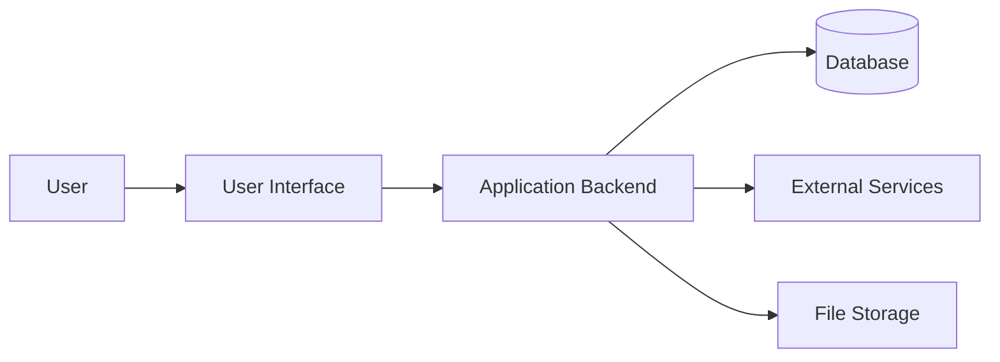
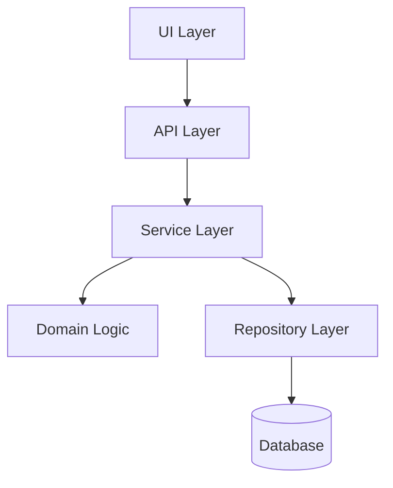
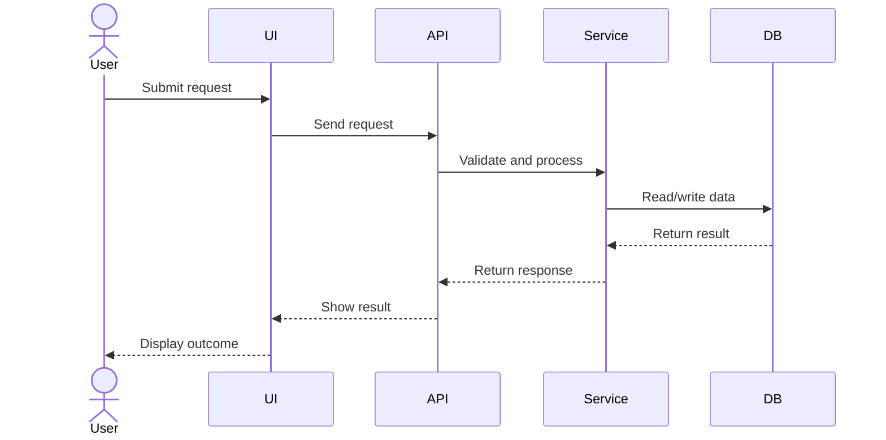
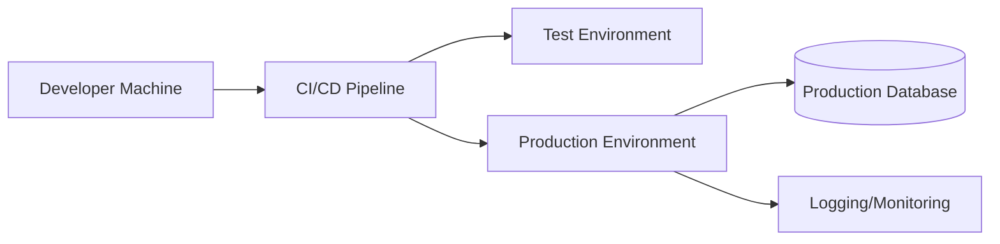

# Methodology for Rebuilding an Out-of-Date Software Design Document

**Version:** 1.0
**Purpose:** Provide a practical methodology for using a local AI agent to rebuild an accurate, comprehensive, up-to-date design document for an existing software system.
**Recommended Audience:** Software engineers, architects, technical leads, support engineers, product owners, and AI agents assisting with documentation reconstruction.

---

## 1. Core Principle

Do **not** ask an AI agent to simply "rewrite the old design document."

That is a weak workflow. It usually produces a polished but still incorrect document.

The old design document should be treated as **historical evidence**, not as the source of truth.

The new documentation should be reconstructed from current evidence, especially:

1. Running system behaviour
2. Source code
3. Configuration files
4. Database schemas
5. API definitions
6. Tests
7. Deployment scripts
8. Operational notes
9. User workflows
10. The old design document

The old document is useful, but it is not authoritative.

---

## 2. Recommended Documentation Set

For an existing software system, especially one whose current design document is out of date, the output should not be one giant document.

At minimum, create these documents:

```text
docs/
  index.md
  system-design.md
  user-manual.md
  developer-guide.md
  operations-runbook.md
  adr/
```

Recommended expanded structure:

```text
docs/
  index.md
  system-design.md
  user-manual.md
  developer-guide.md
  operations-runbook.md
  api-reference.md
  data-model.md
  security-model.md
  testing-strategy.md
  adr/
    0001-example-architecture-decision.md
```

| Document | Purpose |
|---|---|
| `index.md` | Entry point for all documentation |
| `system-design.md` | Main architecture and design document |
| `user-manual.md` | Task-based guide for end users |
| `developer-guide.md` | Guide for developers modifying the system |
| `operations-runbook.md` | Deployment, monitoring, troubleshooting, and maintenance guide |
| `api-reference.md` | API contracts, examples, and integration rules |
| `data-model.md` | Database schema, entities, relationships, and lifecycle |
| `security-model.md` | Authentication, authorization, audit, secrets, and threat model |
| `testing-strategy.md` | Test strategy and validation approach |
| `adr/` | Architecture Decision Records |

If the project is small, start with:

1. `system-design.md`
2. `user-manual.md`
3. `developer-guide.md`
4. `operations-runbook.md`
5. `adr/`

---

## 3. Methodology Overview

The recommended workflow has seven phases:

1. Define the documentation goal
2. Build an evidence pack
3. Produce a system inventory
4. Perform old-vs-current gap analysis
5. Separate current-state design from target-state design
6. Draft the new documents
7. Review, validate, and maintain the documents

The AI agent should not jump directly to the final design document. The correct sequence is:

```text
Evidence Inventory
      ↓
System Inventory
      ↓
Old-vs-Current Gap Analysis
      ↓
Current-State Architecture Summary
      ↓
Target-State Architecture, if applicable
      ↓
System Design Document
      ↓
User Manual
      ↓
Developer / Operations Documentation
```

---

## 4. Phase 0 — Define the Documentation Goal

Before asking the AI agent to write anything, clarify the documentation goal.

| Question | Decision Needed |
|---|---|
| Who is the audience? | Developers, architects, support, business users, auditors, or end users |
| What is the purpose? | Maintenance, migration, onboarding, compliance, refactoring, troubleshooting |
| What is the scope? | Whole system, one module, backend only, UI only, data model only |
| What is the required depth? | High-level architecture, detailed component design, API-level detail |
| What is the time horizon? | Current system only, or current + future target state |

A good design document should answer this question:

> If a competent engineer joins this project tomorrow, can they understand the system safely and make changes without breaking production?

If the answer is no, the document is not good enough.

---

## 5. Phase 1 — Build an Evidence Pack

The AI agent needs evidence. Give it structured material instead of vague instructions.

Recommended sources:

| Source | Purpose |
|---|---|
| Old design document | Historical intent and previous architecture |
| Source code | Actual implementation |
| README / wiki / notes | Existing human explanation |
| Config files | Runtime behaviour and environment assumptions |
| Database schema | Data model truth |
| API definitions | Internal and external contracts |
| Test cases | Expected behaviour |
| Deployment scripts | Real deployment process and topology |
| CI/CD files | Build, test, and release process |
| Logs / errors / incidents | Operational reality |
| User screenshots | Actual workflow and UI behaviour |
| Support tickets | Real pain points and common failures |
| Recent commits | Current development direction |

### 5.1 Evidence Reliability Ranking

Use the following ranking when evidence conflicts:

1. Production behaviour
2. Source code
3. Configuration, schema, and deployment scripts
4. Automated tests
5. Recent operational notes and tickets
6. Current README / wiki
7. Old design document
8. Personal memory or assumptions

The old design document should be treated as a hypothesis, not as truth.

---

## 6. Phase 2 — Produce a System Inventory

Before writing the design document, ask the AI agent to produce a system inventory.

The inventory should answer:

| Area | Questions |
|---|---|
| Product purpose | What problem does the software solve? |
| Users | Who uses it? What user roles exist? |
| Core workflows | What are the main user journeys? |
| Modules | What major components exist? |
| Data model | What entities and relationships exist? |
| APIs | What internal and external interfaces exist? |
| Dependencies | Databases, queues, file systems, third-party services |
| Runtime | How is the system started and operated? |
| Security | Authentication, authorization, secrets, audit logging |
| Failure modes | What commonly breaks? |
| Technical debt | What is fragile, outdated, or unclear? |

The system inventory should be reviewed before the full document is written.

---

## 7. Phase 3 — Perform Old-vs-Current Gap Analysis

The AI agent should compare the old design document against current system evidence.

Use this table format:

| Old Document Claim | Current Evidence | Status | Action |
|---|---|---|---|
| System uses database X | Code now uses database Y | Outdated | Replace |
| Module A owns calculation logic | Logic moved to module B | Outdated | Update architecture |
| API v1 is the main interface | API v2 is now used | Partially valid | Document both |
| Feature Z was planned | No implementation found | Planned / Historical | Move to appendix |

### 7.1 Gap Status Categories

| Status | Meaning |
|---|---|
| Valid | Still accurate |
| Partially valid | Some parts are correct, but correction is needed |
| Outdated | Should be replaced |
| Unknown | Needs human review |
| Removed | Historical only |
| Planned | Future state, not current implementation |
| Deprecated | Still exists but should not be used for new work |

This step is mandatory. Without it, the new document may inherit old mistakes.

---

## 8. Phase 4 — Separate Current-State and Target-State Design

A common documentation failure is mixing what the system **does today** with what people **wish it did**.

Use separate sections:

1. **Current-State Architecture**
   - What exists now
   - How it actually works
   - Known limitations
   - Operational risks

2. **Target-State Architecture**
   - Desired future structure
   - Planned refactoring
   - Migration approach
   - Open decisions

Every future-looking statement should be labelled clearly.

| Label | Meaning |
|---|---|
| Current | Already implemented |
| Planned | Approved but not implemented |
| Proposed | Suggested but not approved |
| Deprecated | Exists but should be removed |
| Unknown | Needs investigation |

---

## 9. Recommended Structure for `system-design.md`

```markdown
# System Design Document: <Software Name>

## 1. Document Control
- Version
- Date
- Owner
- Reviewers
- Status
- Related documents

## 2. Executive Summary
- What the system does
- Who uses it
- Why it exists
- Current maturity
- Major risks
- Major planned changes

## 3. Product and Business Context
- Problem statement
- Business/domain background
- Key users
- Main use cases
- Success criteria

## 4. Scope
### 4.1 In Scope
### 4.2 Out of Scope
### 4.3 Non-goals

## 5. System Overview
- High-level architecture
- Main components
- Main data flows
- External dependencies

## 6. User Roles and Permissions
- User types
- Capabilities
- Access boundaries
- Admin/support roles

## 7. Core Workflows
For each workflow:
- Trigger
- Actor
- Preconditions
- Step-by-step flow
- System behaviour
- Outputs
- Failure cases

## 8. Architecture
### 8.1 Current-State Architecture
### 8.2 Target-State Architecture
### 8.3 Architecture Principles
### 8.4 Key Design Decisions

## 9. Component Design
For each component:
- Responsibility
- Inputs
- Outputs
- Dependencies
- Internal logic
- Error handling
- Known limitations

## 10. Data Design
- Data model
- Main entities
- Relationships
- Database schema
- Data lifecycle
- Data validation
- Migration rules
- Retention policy

## 11. API and Integration Design
- Internal APIs
- External APIs
- Protocols
- Authentication
- Rate limits
- Error responses
- Compatibility rules

## 12. UI / UX Design
- Main screens
- Navigation model
- User interaction patterns
- Accessibility considerations
- Important UI constraints

## 13. Security Design
- Authentication
- Authorization
- Secrets management
- Audit logging
- Data sensitivity
- Threat model
- Security assumptions

## 14. Deployment Design
- Environments
- Build process
- Deployment process
- Configuration
- Infrastructure dependencies
- Rollback procedure

## 15. Operations and Observability
- Logging
- Metrics
- Alerts
- Health checks
- Monitoring dashboards
- Common incidents
- Troubleshooting entry points

## 16. Testing Strategy
- Unit tests
- Integration tests
- End-to-end tests
- Regression tests
- Performance tests
- Manual test procedures
- Test data

## 17. Performance and Scalability
- Current performance characteristics
- Bottlenecks
- Expected load
- Scaling strategy
- Resource limits

## 18. Error Handling and Failure Modes
- Known failure cases
- User-visible errors
- Recovery behaviour
- Retry logic
- Data consistency handling

## 19. Technical Debt and Known Limitations
- Known weak areas
- Workarounds
- Deprecated components
- Refactoring candidates
- Risk ranking

## 20. Roadmap
- Short-term improvements
- Medium-term architecture changes
- Long-term direction
- Migration plan

## 21. Open Questions
- Unresolved decisions
- Areas needing investigation
- Missing information

## 22. Appendices
- Glossary
- Diagrams
- Configuration reference
- API examples
- ADR links
- Historical notes
```

---

## 10. Recommended Structure for `user-manual.md`

The user manual should not explain internal architecture. It should explain how users complete tasks.

```markdown
# User Manual: <Software Name>

## 1. Introduction
- What this software is for
- Who should use it
- What problems it helps solve

## 2. Getting Started
- Accessing the software
- Login
- First-time setup
- Required permissions
- Supported browsers/platforms

## 3. User Interface Overview
- Main screen
- Navigation
- Menus
- Search
- Filters
- Settings
- Notifications

## 4. Common Tasks
For each task:
- Purpose
- When to use it
- Step-by-step instructions
- Expected result
- Common mistakes
- Troubleshooting

Example:

### 4.1 Create a New Record

1. Open the application.
2. Click **Create New Record**.
3. Enter the required fields.
4. Click **Save**.
5. Confirm that the new record appears in the list.

Expected result:
- The record appears in the main list.
- The status becomes `Created`.

Common problems:
- If the Save button is disabled, check the required fields.
- If validation fails, check the error message next to each field.

## 5. Main Workflows
- Workflow A
- Workflow B
- Workflow C

Each workflow should include screenshots if possible.

## 6. Reports and Outputs
- How to generate reports
- Report types
- Export formats
- Where files are saved
- How to interpret results

## 7. Search and Filtering
- Basic search
- Advanced search
- Sorting
- Filtering
- Saved views

## 8. User Settings
- Profile settings
- Preferences
- Notifications
- Display options

## 9. Error Messages
For each common error:
- Error message
- Meaning
- Likely cause
- What the user should do
- When to contact support

## 10. FAQ
- Common user questions
- Short answers
- Links to detailed sections

## 11. Support
- How to report an issue
- What information to include
- Support contact
- Escalation path

## 12. Glossary
- Business terms
- System terms
- Acronyms
```

### 10.1 User Manual Writing Rule

Bad:

> The system persists the entity through the repository layer.

Good:

> Click **Save**. The new item will appear in the list within a few seconds.

The user manual should describe user intent, user action, expected result, and recovery path.

---

## 11. Recommended Structure for `developer-guide.md`

```markdown
# Developer Guide: <Software Name>

## 1. Purpose
- Who this guide is for
- What developers need to know before changing the system

## 2. Repository Structure
- Main directories
- Important packages/modules
- Generated code
- Configuration files

## 3. Local Development Setup
- Prerequisites
- Environment setup
- Dependency installation
- Local database setup
- Running the application locally

## 4. Build and Test
- Build commands
- Unit tests
- Integration tests
- End-to-end tests
- Test data setup
- Common test failures

## 5. Architecture Overview for Developers
- Major modules
- Dependency direction
- Extension points
- Important abstractions

## 6. Coding Conventions
- Style rules
- Naming conventions
- Error handling patterns
- Logging rules
- Dependency management rules

## 7. Common Development Tasks
- Add a new feature
- Add a new API endpoint
- Add a database migration
- Add a new UI screen
- Add a new background job
- Add a new test

## 8. Debugging
- Local debugging
- Remote debugging
- Log locations
- Common failure points

## 9. Release Process
- Branching model
- Versioning
- Release checklist
- Rollback process

## 10. Known Technical Debt
- Fragile areas
- Legacy modules
- Refactoring warnings
- High-risk change areas
```

---

## 12. Recommended Structure for `operations-runbook.md`

```markdown
# Operations Runbook: <Software Name>

## 1. Purpose
- Who should use this runbook
- What operational tasks it covers

## 2. System Runtime Overview
- Services
- Processes
- Ports
- Databases
- Queues
- File paths
- External dependencies

## 3. Environments
- Development
- Test
- Staging
- Production

## 4. Deployment
- Build process
- Deployment process
- Configuration
- Secrets
- Rollback

## 5. Monitoring
- Health checks
- Metrics
- Logs
- Dashboards
- Alerts

## 6. Common Incidents
For each incident:
- Symptom
- Likely cause
- Diagnosis steps
- Resolution steps
- Escalation path

## 7. Backup and Recovery
- Backup schedule
- Restore procedure
- Data validation after restore

## 8. Maintenance Tasks
- Scheduled jobs
- Cleanup tasks
- Database maintenance
- Certificate renewal
- Dependency updates

## 9. Security Operations
- Access review
- Secret rotation
- Audit log review
- Incident handling

## 10. Emergency Procedures
- Production outage
- Data corruption
- Failed deployment
- External dependency outage
```

---

## 13. AI Agent Master Prompt

Use this prompt to instruct your local AI agent.

```markdown
You are helping me rebuild the documentation for an existing software system.

The old design document is outdated. Treat it as historical input, not as ground truth.

Your job is to reconstruct the current design from evidence, including:
- source code
- configuration files
- database schema
- API definitions
- tests
- deployment scripts
- README/wiki files
- old design document
- screenshots or user workflow notes
- operational notes, if available

Rules:
1. Do not invent facts.
2. Every important technical claim must be supported by evidence.
3. When evidence is missing, mark the item as UNKNOWN.
4. Separate current-state design from target-state design.
5. Separate implemented behaviour from proposed future behaviour.
6. Identify gaps between the old document and the current system.
7. Produce a gap analysis before writing the final document.
8. Produce a clear system design document for engineers.
9. Produce a separate user manual for end users.
10. Keep business/domain language separate from implementation details.

Deliverables:
1. Evidence inventory
2. System inventory
3. Old-vs-current gap analysis
4. Current-state architecture summary
5. Target-state architecture proposal, if enough evidence exists
6. Full system design document
7. User manual
8. Open questions list
9. Risk and technical debt list

Output format:
- Markdown
- Clear headings
- Tables where useful
- Diagrams in Mermaid where useful
- Mark uncertain items clearly
```

---

## 14. Step-by-Step Agent Workflow Prompts

### Step 1 — Evidence Collection

```markdown
Review the available materials and produce an evidence inventory.

For each source, identify:
- file/document name
- what information it contains
- how reliable it appears
- whether it describes current behaviour or historical behaviour
- key facts extracted
- uncertainties

Do not write the final design document yet.
```

### Step 2 — System Inventory

```markdown
Based on the evidence inventory, produce a system inventory.

Cover:
- product purpose
- users and roles
- core workflows
- modules/components
- data model
- APIs/integrations
- deployment/runtime model
- security model
- testing model
- known limitations
- unclear areas

Mark all uncertain items as UNKNOWN.
```

### Step 3 — Gap Analysis

```markdown
Compare the old design document against the current evidence.

Produce a table with:
- old claim
- current evidence
- status: valid / partially valid / outdated / unknown / removed / planned / deprecated
- recommended documentation action

Do not write the final design document yet.
```

### Step 4 — Design Document Outline

```markdown
Create a proposed outline for the new system design document.

The outline must separate:
- current-state design
- target-state design
- confirmed facts
- assumptions
- open questions
- known risks
- technical debt

Do not write the full document yet.
```

### Step 5 — Full System Design Draft

```markdown
Using the approved outline, write the full system design document.

Requirements:
- Be comprehensive but not verbose.
- Use diagrams where useful.
- Mark unknowns explicitly.
- Do not hide technical debt.
- Do not mix user instructions with internal design.
- Include current-state and target-state sections separately.
- Include a risk and limitation section.
```

### Step 6 — User Manual

```markdown
Write a separate user manual for end users.

Requirements:
- Focus on user tasks, not internal architecture.
- Use step-by-step instructions.
- Include expected results.
- Include common errors and troubleshooting.
- Include FAQ and glossary.
- Assume the user does not know the internal implementation.
```

### Step 7 — Developer Guide

```markdown
Write a developer guide for engineers who need to modify and maintain the software.

Requirements:
- Explain repository structure.
- Explain local setup.
- Explain how to build and test.
- Explain major modules.
- Explain common development tasks.
- Explain debugging and troubleshooting.
- Identify dangerous or fragile areas.
```

### Step 8 — Operations Runbook

```markdown
Write an operations runbook.

Requirements:
- Explain runtime services.
- Explain deployment.
- Explain configuration.
- Explain monitoring and logging.
- Explain common incidents.
- Explain diagnosis and recovery procedures.
- Include rollback and emergency procedures.
```

---

## 15. Quality Checklist for the System Design Document

Before accepting the final document, check the following:

| Question | Pass/Fail |
|---|---|
| Does it clearly explain what the software does? |  |
| Does it identify all major users and roles? |  |
| Does it separate current state from future state? |  |
| Does it explain the main workflows? |  |
| Does it describe the major components? |  |
| Does it explain the data model? |  |
| Does it document APIs and integrations? |  |
| Does it explain deployment and runtime behaviour? |  |
| Does it cover security and permissions? |  |
| Does it cover testing? |  |
| Does it cover observability and troubleshooting? |  |
| Does it identify technical debt honestly? |  |
| Does it mark unknowns clearly? |  |
| Can a new engineer use it to understand the system? |  |
| Can a support engineer use it to troubleshoot? |  |
| Can future maintainers update it easily? |  |

The most important rule:

> A good design document should reduce operational and engineering risk. If it only looks polished, it has failed.

---

## 16. Quality Checklist for the User Manual

| Question | Pass/Fail |
|---|---|
| Does it explain how to access the software? |  |
| Does it explain the main user interface? |  |
| Does it describe common tasks step by step? |  |
| Does it explain expected results after each task? |  |
| Does it include common mistakes? |  |
| Does it include error messages and recovery actions? |  |
| Does it avoid unnecessary internal technical detail? |  |
| Does it use user-facing terminology? |  |
| Does it include support and escalation instructions? |  |
| Can a new user complete the main workflows using only this manual? |  |

---

## 17. Recommended Mermaid Diagrams

The design document should include diagrams where useful.

### 17.1 System Context Diagram



### 17.2 Component Diagram



### 17.3 Workflow Diagram



### 17.4 Deployment Diagram



---

## 18. Architecture Decision Records

Important design decisions should be stored as ADRs.

Recommended ADR template:

```markdown
# ADR-0001: <Decision Title>

## Status
Proposed / Accepted / Deprecated / Superseded

## Date
YYYY-MM-DD

## Context
What problem are we solving?

## Decision
What decision did we make?

## Alternatives Considered
- Option A
- Option B
- Option C

## Consequences
Positive:
- ...

Negative:
- ...

## Related Documents
- ...
```

Use ADRs for decisions such as:

- Database selection
- Major framework selection
- Authentication model
- Deployment model
- API design style
- Message queue selection
- Major refactoring direction
- Backward compatibility policy

---

## 19. Practical Warnings

### 19.1 Do Not Let the AI Agent Invent Missing Details

If the agent cannot find evidence, it should write:

```text
UNKNOWN: No evidence found in the provided materials.
```

Not:

```text
The system probably uses...
```

### 19.2 Do Not Hide Technical Debt

A useful design document should identify dangerous areas honestly.

Examples:

- Fragile module boundaries
- Unclear ownership
- Missing tests
- Undocumented configuration
- Manual deployment steps
- Hard-coded environment assumptions
- Data migration risks
- Deprecated APIs still used by production

### 19.3 Do Not Mix User Manual and Design Document

These are different audiences.

Design document:

> The request is validated by the service layer before persistence.

User manual:

> After entering all required fields, click **Save**. If any required field is missing, the application will show a validation message.

### 19.4 Do Not Mix Current State and Future State

This is one of the most common causes of bad design documents.

Use explicit labels:

- Current
- Planned
- Proposed
- Deprecated
- Unknown

---

## 20. 中文总结

这个流程的核心不是“让 AI 重新写旧文档”，而是让 AI 根据当前证据重建系统事实。

正确顺序是：

1. 收集证据
2. 建立系统清单
3. 对比旧文档和当前系统
4. 标记哪些内容仍然正确、哪些已经过时、哪些无法确认
5. 区分当前状态和目标状态
6. 编写新的系统设计文档
7. 单独编写用户手册
8. 单独编写开发和运维文档
9. 通过人工 review 验证准确性
10. 建立长期维护机制

最重要的原则：

> 旧设计文档只能作为历史参考，不能作为当前系统的真相来源。

真正可靠的来源应该是：

1. 当前运行行为
2. 源代码
3. 配置文件
4. 数据库结构
5. API 定义
6. 测试
7. 部署脚本
8. 运行日志
9. 用户实际工作流
10. 最近的修改记录

最终至少建议生成：

```text
docs/
  index.md
  system-design.md
  user-manual.md
  developer-guide.md
  operations-runbook.md
  adr/
```

其中：

| 文档 | 作用 |
|---|---|
| `system-design.md` | 解释系统内部设计 |
| `user-manual.md` | 教用户如何使用软件 |
| `developer-guide.md` | 教开发人员如何理解和修改代码 |
| `operations-runbook.md` | 教支持和运维人员如何部署、监控、排障 |
| `adr/` | 记录重要架构决策 |

一个好的设计文档不只是“看起来专业”。它必须降低工程风险、维护风险、上线风险和知识传承风险。

如果文档很漂亮，但不能帮助新工程师理解系统、不能帮助支持人员排查问题、不能帮助开发人员安全修改代码，那么它就是失败的。

---

## 21. Final Recommendation

Use the AI agent as a documentation reconstruction assistant, not as a blind writer.

The minimum acceptable workflow is:

1. Ask the agent for an evidence inventory.
2. Ask the agent for a system inventory.
3. Ask the agent for an old-vs-current gap analysis.
4. Review and correct the gap analysis.
5. Ask the agent for the full system design document.
6. Ask the agent for a separate user manual.
7. Ask the agent for a developer guide and operations runbook.
8. Keep the documents updated through ADRs and release checklists.

The control point is the gap analysis. If the gap analysis is weak, the final document will be unreliable.
