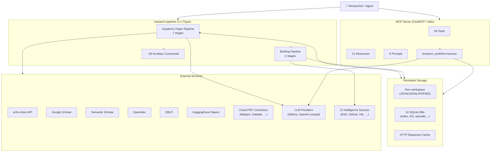
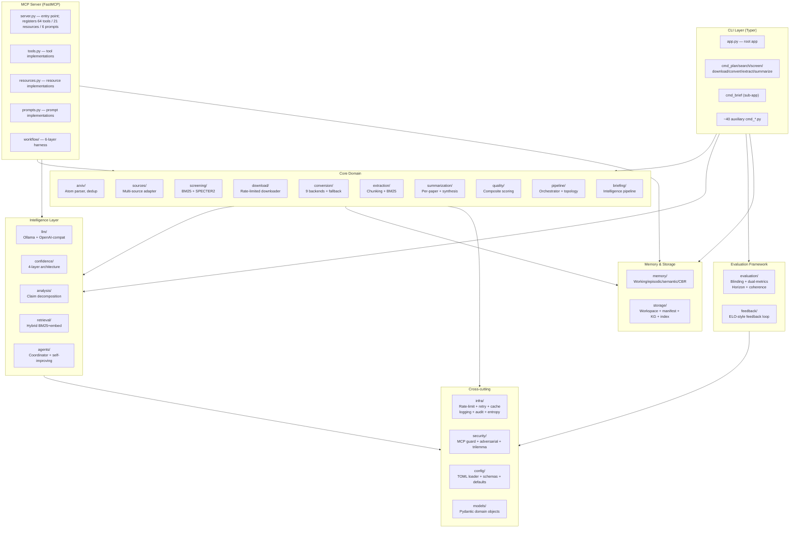
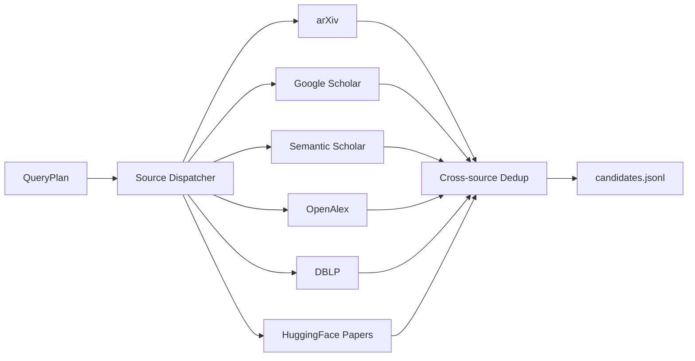
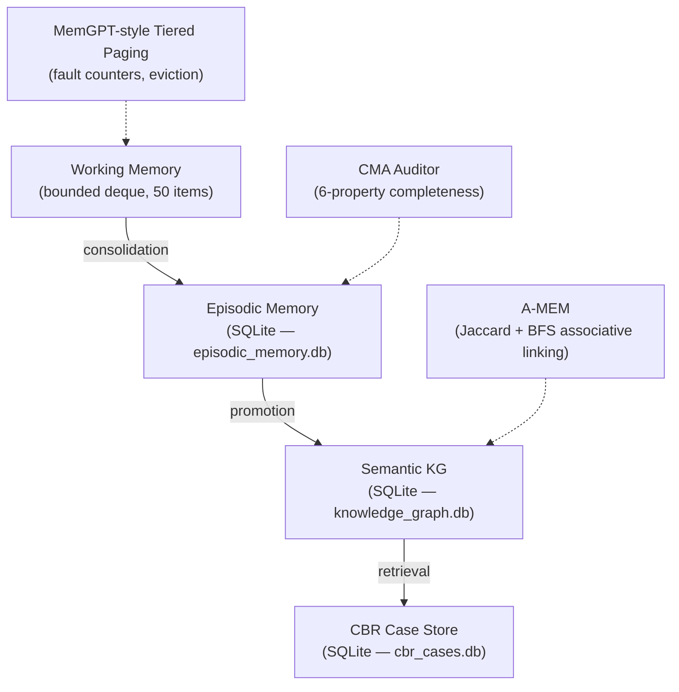
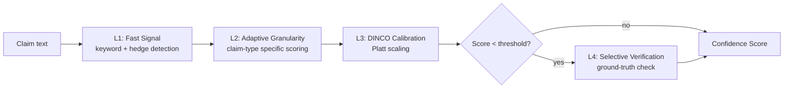

# System Design Document: research-pipeline

## 1. Document Control

| Field | Value |
|-------|-------|
| Document | System Design — research-pipeline |
| Version | 0.17.15 |
| Status | *Current* |
| Last Updated | 2026-07-01 |
| Source of Truth | Codebase at `src/research_pipeline/` |

Changes to this document should accompany corresponding code changes in the same commit.

---

## 2. Executive Summary

**research-pipeline** is a deterministic, stage-based Python library and CLI for end-to-end academic paper research and daily AI intelligence briefing. It operates in two parallel modes:

1. **Academic Paper Research Pipeline** — searches multiple academic databases, screens candidates, downloads PDFs, converts to Markdown, extracts structured content, and synthesises a cross-paper research report across 7 sequential stages.
2. **Daily AI Intelligence Briefing Pipeline** — polls 12 heterogeneous intelligence sources, deduplicates and ranks events, and generates a concise daily brief across 4 stages.

Both modes are exposed via a Typer CLI (`research-pipeline`), an MCP (Model Context Protocol) server with 64 tools, and a bundled AI skill/sub-agent package for Claude Code and GitHub Copilot.

---

## 3. Product and Business Context

| Dimension | Detail |
|-----------|--------|
| Primary users | Researchers, engineers, analysts who need systematic literature reviews |
| Secondary users | AI agent operators embedding the tool in automated workflows (MCP) |
| Problem solved | Manual literature review is slow, inconsistent, and incomplete; daily AI tracking is fragmented |
| Distribution | PyPI package `research-pipeline`; MIT license |
| Integration surface | CLI, Python API, MCP server (stdio transport for Claude/Copilot integration) |

---

## 4. Scope

**In scope:**
- Searching, screening, downloading, converting, and summarising academic papers
- Daily AI intelligence polling, ranking, and brief generation
- Multi-source academic search (arXiv, Scholar, S2, OpenAlex, DBLP, HuggingFace)
- PDF-to-Markdown conversion (9 backends + fallback)
- LLM-assisted screening, summarisation, and claim analysis
- MCP server for agent-driven research workflows
- Quality evaluation, confidence architecture, and evaluation framework

**Out of scope:**
- Web scraping of arbitrary websites
- Persistent user accounts or multi-user access control
- Real-time data streaming
- Browser-based UI

---

## 5. System Overview



---

## 6. User Roles and Workflows

| Role | Primary Workflow | Key Commands |
|------|-----------------|--------------|
| Researcher | End-to-end literature review | `research-pipeline run "topic"` |
| Analyst | Targeted stage re-runs | Individual stage commands |
| AI Agent (MCP) | Orchestrated workflow | `research_workflow` MCP tool |
| Daily briefing consumer | Automated daily brief | `research-pipeline brief run` |
| Developer / integrator | Python API, custom backends | Import `research_pipeline.*` |

**Typical researcher workflow:**
```
run "topic" → inspect --run-id X → export-html --run-id X → validate --report report.md
```

**Iterative deep research:**
```
plan → search → screen (feedback loop) → download → convert-rough → convert-fine
    → extract → summarize → compare --run-a A --run-b B → expand (citation graph)
```

---

## 7. Academic Paper Research Pipeline

### 7.1 Stage I/O Contracts

All stages are idempotent and store artifacts under `<workspace>/<run-id>/`.

| Stage | Primary Input | Primary Output | Key Model |
|-------|--------------|----------------|-----------|
| **plan** | topic string | `plan/query_plan.json` | `QueryPlan` |
| **search** | `query_plan.json` | `search/candidates.jsonl` | `CandidateRecord` |
| **screen** | `candidates.jsonl` | `screen/shortlist.json` + `screened.jsonl` | `RelevanceDecision` |
| **download** | `shortlist.json` | `download/pdf/*.pdf` + `download_manifest.json` | `DownloadManifestEntry` |
| **convert** | PDF files | `convert/markdown/*.md` + `convert_manifest.json` | `ConvertManifestEntry` |
| **extract** | Markdown files | `extract/*.extract.json` | `MarkdownExtraction` |
| **summarize** | extract JSON files | `summarize/*.summary.json` + `synthesis_report.{md,json}` | `PaperSummary`, `SynthesisReport` |


**Stage details:**

**plan** — Normalises the topic string, generates query variants and candidate arXiv categories. Produces a `QueryPlan` with primary and variant queries.

**search** — Fans out to all enabled sources (arXiv, Scholar, S2, OpenAlex, DBLP, HuggingFace). Deduplicates across sources by arXiv ID → DOI → normalised title. Rate-limited and retry-wrapped per source.

**screen** — Two-phase: BM25 heuristic scoring (`CheapScoreBreakdown`) then optional SPECTER2 semantic re-ranking. Diversity-aware MMR selection balancing relevance, category, source, and year. Produces a shortlist (default 10 papers).

**download** — Fetches PDFs from arXiv with 3-second polite floor. Tracks per-paper retry state. Skips already-downloaded files (idempotent). Writes `DownloadManifestEntry` per paper.

**convert** — Dispatches each PDF to configured backend(s). Supports two-tier conversion: fast Tier-2 (`convert-rough`, pymupdf4llm) and high-quality Tier-3 (`convert-fine`, primary backend). Multi-account rotation and cross-service fallback.

**extract** — Chunks Markdown into sections with metadata. Builds BM25 + optional embedding index for downstream retrieval.

**summarize** — Generates per-paper summaries with chunk citations, then a cross-paper `SynthesisReport` with evidence-backed findings, gaps, and confidence annotations.

### 7.2 Pipeline Profiles

| Profile | Description | Stages |
|---------|-------------|--------|
| `quick` | Abstract-only, no PDF download | plan → search → screen → summarize |
| `standard` | Full 7-stage pipeline | All 7 stages |
| `deep` | Standard + citation expansion + quality + claim analysis + TER loop | 7 stages + expand + quality + analyze |
| `auto` | `DifficultyRouter` picks profile from query complexity heuristics | Depends on classification |

> **Current**: `auto` profile uses keyword heuristics (word count, `"comprehensive"`, `"survey"`, etc.) to classify. An LLM-based variant using `ComplexityFeatures` extractor is available via `classify_query_complexity_with_llm()`.

### 7.3 Run Manifest and Artifact Tracking

Every run produces a `run_manifest.json` at the workspace root:

- **`RunManifest`** — top-level record of all stages and artifacts
- **`StageRecord`** — per-stage: start/end timestamps, success flag, error message
- **`ArtifactRecord`** — per-file: path, SHA-256 hash, byte size, produced-by stage

The manifest is updated atomically after each stage. All re-runs verify existing artifact hashes before skipping.

### 7.4 Auxiliary Commands Overview

~40 auxiliary CLI commands extend the core pipeline:

| Category | Commands |
|----------|----------|
| Analysis | `analyze`, `analyze-claims`, `score-claims`, `confidence-layers`, `aggregate`, `cluster`, `cite-context` |
| Evaluation | `evaluate`, `compare`, `dual-metrics`, `blinding-audit`, `horizon`, `rrp`, `coherence`, `pre-commitment` |
| Quality | `quality`, `kg`, `kg-quality`, `enrich` |
| Memory | `memory`, `cbr`, `consolidate` |
| Export | `export-html`, `export-bibtex`, `report`, `validate` |
| Briefing | `brief run`, `brief poll`, `brief rank`, `brief generate`, `brief validate`, `brief weekly`, `brief dossier` |
| Maintenance | `index`, `inspect`, `eval-log`, `feedback`, `expand`, `watch` |
| Setup | `install-skill`, `mcp` |
| Conversion | `convert-rough`, `convert-fine`, `convert-file` |
| Adaptive | `adaptive-stopping` |

---

## 8. Daily AI Intelligence Briefing Pipeline

### 8.1 Stage Flow


| Stage | Output | Model |
|-------|--------|-------|
| `poll_sources` | Raw + normalised `IntelligenceEvent` JSONL per source | `IntelligenceEvent` |
| `rank_events` | `BriefingCluster` JSONL (deduplicated + ranked) | `BriefingCluster` |
| `generate_daily` | Markdown daily brief | — |
| `validate_report` | Validation result JSON | — |

Auxiliary outputs: `brief weekly` (trend memo), `brief dossier` (deep-dive on top cluster), Obsidian vault export.

### 8.2 Source Adapters (12)

| Adapter | Source Type | File |
|---------|------------|------|
| `arxiv_events` | arXiv new submissions | `briefing/sources/arxiv_events.py` |
| `github_releases` | GitHub release events | `briefing/sources/github_releases.py` |
| `rss_atom` | Generic RSS/Atom feeds | `briefing/sources/rss_atom.py` |
| `html_scrape` | HTML page scraping | `briefing/sources/html_scrape.py` |
| `manual` | Manually-injected items | `briefing/sources/manual.py` |
| `hacker_news` | Hacker News top stories | `briefing/sources/hacker_news.py` |
| `huggingface_papers` | HuggingFace Papers page | `briefing/sources/huggingface_papers.py` |
| `papers` (api) | Generic papers API | `briefing/sources/papers.py` |
| `reddit_api` | Reddit posts | `briefing/sources/reddit.py` |
| `bluesky_api` | Bluesky posts | `briefing/sources/bluesky.py` |
| `x_api` | X (Twitter) posts | `briefing/sources/x_api.py` |
| `video_audio` | Video/audio content | `briefing/sources/video_audio.py` |

Source configuration in `config.toml` under `[briefing.sources]`. Each source has an `enabled` flag, `access_method`, and `source_class`.

### 8.3 Ranking Algorithm

Events are first grouped into `BriefingCluster` objects (dedup by URL + normalised title). Clusters are then scored by a deterministic formula:

```
rank_score = source_class_weight × coverage_multiplier × recency_decay
           × watchlist_boost × hype_penalty × feedback_weight
```

**Source class weights:**

| Class | Weight |
|-------|--------|
| `PRIMARY_ARTIFACT` (paper, model release) | 3.0 |
| `IMPLEMENTATION_SOURCE` (code, dataset) | 2.7 |
| `ACADEMIC_SOURCE` | 2.4 |
| `NEWSLETTER` | 1.4 |
| `TECHNICAL_DISCUSSION` | 1.0 |
| `MEDIA_NEWS` | 0.6 |
| `VIDEO_AUDIO` | 0.5 |
| `SOCIAL_SIGNAL` | 0.2 |

Hype words (`"breakthrough"`, `"game-changing"`, etc.) trigger a penalty multiplier. User feedback weights and topic memory (repeated-topic decay) are applied when available. Minimum `rank_score` threshold: 4.0.

### 8.4 Auxiliary Outputs

| Command | Output |
|---------|--------|
| `brief weekly` | Trend memo synthesising the week's daily briefs |
| `brief dossier` | Deep-dive dossier for a specific cluster ID |
| `brief export-obsidian` | Vault-formatted notes for Obsidian |
| `brief record-feedback` | Persistent feedback signal for future ranking |

---

## 9. Architecture

### 9.1 Current-State Architecture



### 9.2 Sub-Package Catalogue

| # | Sub-package | Purpose |
|---|-------------|---------|
| 1 | `arxiv` | arXiv Atom XML client, parser, rate limiter |
| 2 | `sources` | Multi-source adapter: arXiv, Scholar, S2, OpenAlex, DBLP, HF + dedup |
| 3 | `screening` | BM25 heuristic scoring, SPECTER2 semantic re-ranking, diversity MMR |
| 4 | `download` | Rate-limited, retry-aware PDF downloader |
| 5 | `conversion` | PDF→Markdown backends (3 local + 5 cloud + fallback), registry, multi-account |
| 6 | `extraction` | Markdown chunking, BM25 + embedding retrieval |
| 7 | `summarization` | Per-paper summaries + cross-paper synthesis |
| 8 | `quality` | Citation impact, venue reputation (CORE), author h-index, composite score |
| 9 | `pipeline` | Stage sequencer, orchestrator, TER plan revision, adaptive topology |
| 10 | `storage` | Workspace directories, `RunManifest`, SHA-256 artifacts, global paper index, KG |
| 11 | `memory` | Working deque, episodic SQLite, semantic KG, CBR case store, CMA audit, A-MEM, paging |
| 12 | `infra` | Rate limiting, retry, HTTP cache, logging, hashing, clock, entropy monitor, audit |
| 13 | `llm` | `LLMProvider` ABC, `OllamaProvider`, `OpenAICompatibleProvider`, phase routing |
| 14 | `analysis` | Claim decomposer |
| 15 | `confidence` | 4-layer confidence architecture (L1–L4) |
| 16 | `evaluation` | Blinding audit, Pass@k/Pass[k] dual metrics, Horizon metric, coherence, pre-commitment, RRP diagnostic |
| 17 | `retrieval` | Self-improving hybrid retrieval |
| 18 | `feedback` | ELO-style feedback store, weight adjustment |
| 19 | `agents` | Research coordinator, self-improving sub-agent loop |
| 20 | `security` | MCP guard (tool registry + pinning), ToolTweak adversarial, defense trilemma |
| 21 | `models` | All Pydantic domain models |
| 22 | `config` | TOML loader, env var overrides, Pydantic schemas, built-in defaults |
| 23 | `briefing` | Daily intelligence pipeline (poll → rank → generate → validate) |
| 24 | `mcp_server` | FastMCP server, tools, resources, prompts, completions, workflow harness |
| 25 | `skill_data` | Bundled Claude Code / Copilot skill files |
| 26 | `agent_data` | Bundled sub-agent definitions |
| 27 | `cli` | Typer root app + 47 `cmd_*.py` command modules |

### 9.3 Architecture Principles

1. **Idempotent stages** — every stage can be safely re-run; SHA-256 artifact hashing detects stale outputs.
2. **Separation of concerns** — each sub-package has a single well-defined responsibility; cross-cutting concerns (rate limiting, retry, logging) live in `infra/`.
3. **Pydantic everywhere** — all domain objects are `BaseModel` subclasses for schema validation, serialisation, and IDE support.
4. **Fail-fast validation** — structural verification gates (`verify_stage`) check stage output format before the next stage starts.
5. **Determinism by default** — no randomness in ranking or screening unless explicitly seeded; results must be reproducible from the same `run_manifest.json`.
6. **Security by design** — HC1–HC6 constraints enforced in code (MCP guard, detect-secrets, network egress policy).

### 9.4 Key Design Decisions

| Decision | Rationale |
|----------|-----------|
| SQLite for all persistent stores | Zero-dependency embedded DB; sufficient throughput for single-researcher workloads |
| Pydantic for all models | Type safety, auto-validation, JSON schema generation for MCP |
| JSONL for streaming stage outputs | Append-safe, inspectable without full parse, compatible with incremental runs |
| uv-managed project | Reproducible builds, fast dependency resolution, lockfile integrity |
| MCP via stdio | Universal compatibility with Claude, Copilot, and other MCP-compatible hosts |
| Registry pattern for backends | New PDF converters can be added without modifying dispatcher code |

---

## 10. Multi-source Search Architecture



**Deduplication priority chain:**
1. arXiv ID (exact match)
2. DOI (exact match)
3. Normalised title (lowercase, stripped punctuation, ≥90% token overlap)

**Per-source rate limiting:**
- arXiv: `ArxivRateLimiter` — 3-second hard floor between requests
- Scholar, S2, OpenAlex, DBLP: per-source `RateLimiter` instances, configurable in `config.toml`

**Abstract enrichment:** If a candidate retrieved from a non-arXiv source is missing an abstract, the `enrich` command queries Semantic Scholar by DOI or title to fill the gap.

**Search source configuration:**
```toml
[sources]
enabled = ["arxiv", "semantic_scholar", "openalex"]  # subset selection

[sources.arxiv]
max_results = 100

[sources.semantic_scholar]
api_key = ""  # optional; improves rate limits
```

---

## 11. PDF Conversion System

### 11.1 Backend Registry Pattern

All backends are discovered via `@register_backend("name")` decorator in `conversion/registry.py`. The dispatcher in `cmd_convert.py` queries the registry by name; adding a new backend requires no changes to the dispatcher.

| Backend | Type | License | Quality |
|---------|------|---------|---------|
| `docling` | Local | MIT | Tier-3 (high) |
| `marker` | Local | GPL-3.0 | Tier-3 (high) |
| `pymupdf4llm` | Local | AGPL | Tier-2 (fast) |
| `mineru` | Local | MIT | Tier-3 |
| `mathpix` | Cloud | Proprietary | Tier-3 |
| `datalab` | Cloud | Proprietary | Tier-3 |
| `llamaparse` | Cloud | Proprietary | Tier-3 |
| `mistral_ocr` | Cloud | Proprietary | Tier-3 |
| `openai_vision` | Cloud | Proprietary | Tier-3 |
| `fallback` | Meta | — | Ordered fallback |

Each backend is an optional extra in `pyproject.toml` (e.g., `pip install research-pipeline[docling]`).

### 11.2 Multi-Account Rotation

Cloud backends support multiple accounts per service via `[[conversion.<backend>.accounts]]` TOML config. When a quota or rate-limit error is returned, the dispatcher rotates to the next configured account:

```toml
[[conversion.mathpix.accounts]]
app_id = "..."
app_key = "..."

[[conversion.mathpix.accounts]]
app_id = "..."  # second account
app_key = "..."
```

Rotation state is maintained in-process per pipeline run.

### 11.3 Cross-Service Fallback

`FallbackConverter` (`conversion/fallback.py`) wraps an ordered list of backends. If the primary backend fails (after exhausting its account rotation), the next backend in the list is tried:

```toml
[conversion]
fallback_backends = ["mathpix", "pymupdf4llm"]
```

This ensures conversion continues even when cloud quotas are exhausted.

---

## 12. Memory and Knowledge System

### 12.1 Multi-Tier Memory



| Tier | Implementation | Capacity | Persistence |
|------|---------------|----------|-------------|
| Working | `BoundedDeque` | 50 items | In-process |
| Episodic | SQLite | Unlimited | `~/.cache/research-pipeline/episodic_memory.db` |
| Semantic KG | SQLite entity+triple store | Unlimited | `~/.cache/research-pipeline/knowledge_graph.db` |
| CBR | SQLite case store | Unlimited | `~/.cache/research-pipeline/cbr_cases.db` |

**Consolidation** (`tool_consolidation`): compresses episodic episodes, promotes recurring findings to semantic rules, prunes stale entries. Triggered when episode count exceeds capacity threshold (default 80% of 100).

**CMA Audit**: Six-property completeness audit for memory entries (coverage, correctness, consistency, currency, coherence, conciseness).

**A-MEM** (`memory/associative.py`): builds associative links between memory entries using Jaccard similarity + BFS graph traversal.

**CBR Lookup** (`tool_cbr_lookup`): retrieves past research strategies similar to the current topic, recommending proven query patterns and source selections.

### 12.2 Knowledge Graph

The KG stores typed entities and directed triples:

- **Entities**: papers, authors, venues, concepts (with type, label, metadata JSON)
- **Triples**: (subject, predicate, object) with confidence score and provenance

Population: `kg_ingest` reads claim decompositions from a completed pipeline run and creates entities/triples. Quality metrics: structural (entity/triple counts, orphan ratio), information-content consistency, TWCS sampling.

---

## 13. LLM Provider System

### 13.1 Providers

| Provider | Class | Protocol |
|----------|-------|----------|
| Ollama | `OllamaProvider` | HTTP REST (local) |
| OpenAI-compatible | `OpenAICompatibleProvider` | OpenAI Chat Completions API |

Both implement the `LLMProvider` ABC (`llm/base.py`). Providers wrap input via `envelopes.py` and return structured `LLMResponse` objects.

### 13.2 Phase-Aware Routing

Three routing tiers map pipeline phases to cost/quality trade-offs:

| Tier | Use cases | Typical model |
|------|-----------|---------------|
| `mechanical` | Plan generation, candidate filtering | Small/fast |
| `intelligent` | Paper summarisation, synthesis | Mid-size |
| `critical_safety` | Claim verification, quality gates | Large/careful |

The `model_routing_info` MCP tool returns the current stage→tier mapping. Routing is configured in `config.toml` under `[llm]`.

### 13.3 Configuration

```toml
[llm]
provider = "ollama"           # or "openai_compatible"
base_url = "http://localhost:11434"
model = "llama3.2"
mechanical_model = "llama3.2"
intelligent_model = "llama3.1:70b"
critical_safety_model = "llama3.1:70b"
temperature = 0.1
timeout = 120
```

---

## 14. Quality Evaluation System

Quality is a weighted composite of four independent dimensions:

| Dimension | Weight | Source |
|-----------|--------|--------|
| Citation impact | 0.35 | Semantic Scholar citation count |
| Venue reputation | 0.25 | CORE 2023 rankings (`quality/data/core_rankings.json`) |
| Author credibility | 0.25 | Max author h-index |
| Recency bonus | 0.15 | Exponential decay from publication year |
| Reproducibility | 0.00 | *Planned* — reserved weight slot |

**Venue tiers** (CORE 2023): A* (1.0), A (0.8), B (0.5), C (0.3), unranked (0.1).

**Citation impact formula:**
- >10 citations: +0.15 community engagement bonus
- >0 citations: +0.07 bonus
- Base score: normalised log-count

**Graduated rubric** (`quality/graduated_rubric.py`): configurable per-criterion scoring with pass/fail thresholds; used by `deep` profile and claim analysis.

The `quality` CLI command and `evaluate_quality` MCP tool produce `QualityScore` objects for all screened candidates.

---

## 15. Confidence Architecture

Claims extracted during summarisation are scored via a 4-layer pipeline:



| Layer | Function | Trigger |
|-------|----------|---------|
| L1 | Fast lexical signal (hedge words, certainty markers) | Always |
| L2 | Adaptive granularity scoring by claim type | Always |
| L3 | DINCO Platt-scaling calibration | Always |
| L4 | Selective verification against source evidence | Score < `l4_threshold` (default 0.5) |

Output: per-claim confidence score in [0, 1] with evidence classification (`supported`, `unsupported`, `contradicted`).

---

## 16. Evaluation Framework

The framework provides six independent evaluation instruments:

### Blinding Audit (`evaluation/blinding.py`)
Implements A/B blinding protocol (arXiv 2604.06013). Scans analysis outputs for identifying features (author names, institution names, arXiv IDs) and scores LLM-prior contamination per paper. Results stored in `.blinding_audits.db` per run.

### Dual Metrics (`evaluation/dual_metrics.py`)
Claw-Eval-inspired Pass@k + Pass[k] metrics:
- **Pass@k**: capability ceiling — probability ≥1 of k samples is correct
- **Pass[k]**: reliability floor — probability all k samples are correct
- Fabrication gate: zeros both scores if hallucinated citations are detected

### Unified Horizon Metric (`evaluation/horizon.py`)
Combines 4 signals into a single UHM ∈ [0, 1]:
```
UHM = (difficulty_weighted_score × horizon_efficiency × stability_factor)^(1/3) × reliability
```
Closes gap A3-5 (remaining-gap closure). Exposed via `horizon` CLI command and `tool_horizon_metric` MCP tool.

### Multi-Session Coherence (`evaluation/coherence_eval.py`)
Evaluates factual consistency, temporal ordering, knowledge-update fidelity, and contradiction detection across 2+ pipeline runs.

### Pre-commitment Evaluation (`evaluation/pre_commitment.py`)
Records expected outcomes before a run and verifies against actual results; prevents post-hoc rationalisation.

### RRP Diagnostic (`evaluation/recall_diagnostic.py`)
Decomposes synthesis quality into Recall / Reasoning / Presentation axes to localise bottlenecks (following DeepResearch Bench II findings).

---

## 17. MCP Server

### 17.1 Overview

| Attribute | Value |
|-----------|-------|
| Protocol | Model Context Protocol (MCP) |
| Transport | stdio |
| Framework | FastMCP |
| Tools | 64 |
| Resources | 21 (URI-template based) |
| Prompts | 6 |
| Entry point | `research-pipeline mcp serve` |

### 17.2 Research Workflow Harness (6 Layers)

The `research_workflow` tool integrates all 6 harness layers into a single server-driven orchestration:

| Layer | Module | Function |
|-------|--------|----------|
| 1. Telemetry | `workflow/telemetry.py` | Three-surface logging: cognitive (decisions), operational (stage I/O), contextual (token budgets) |
| 2. Context engineering | `workflow/context.py` | Token budgets; 5-stage paper compaction (ACC algorithm) to prevent context overflow |
| 3. Governance | `workflow/state.py` | Schema-level state machine; verify-before-commit on every stage transition |
| 4. Structural verification | `workflow/verification.py` | Format and completeness checks on each stage's output (non-LLM, deterministic) |
| 5. Monitoring | `workflow/monitoring.py` | Doom-loop detection; iteration drift tracking; entropy-based locking detection |
| 6. Recovery | `workflow/state.py` | Persistent state after every stage for crash recovery and resume |

### 17.3 Tool Categories

| Category | Example Tools |
|----------|---------------|
| Pipeline stages | `tool_plan_topic`, `tool_search`, `tool_screen_candidates`, `tool_download_pdfs`, `tool_convert_pdfs`, `tool_extract_content`, `tool_summarize_papers` |
| Analysis | `tool_analyze_papers`, `tool_analyze_claims`, `tool_score_claims`, `tool_confidence_layers`, `tool_aggregate_evidence` |
| Quality | `tool_evaluate_quality`, `tool_get_venue_tier`, `tool_blinding_audit`, `tool_dual_metrics` |
| Memory | `tool_memory_stats`, `tool_memory_episodes`, `tool_memory_search`, `tool_consolidation`, `tool_cbr_lookup`, `tool_cbr_retain` |
| Knowledge graph | `tool_kg_ingest`, `tool_kg_query`, `tool_kg_stats`, `tool_kg_quality` |
| Evaluation | `tool_validate_report`, `tool_compare_runs`, `tool_coherence`, `tool_horizon_metric`, `tool_rrp_diagnostic` |
| Briefing | `brief_run`, `brief_poll_sources`, `brief_rank_events`, `brief_generate_daily`, `brief_validate_report`, `brief_weekly_synthesis`, `brief_generate_dossier` |
| Infrastructure | `tool_get_run_manifest`, `tool_verify_stage`, `tool_adaptive_stopping`, `tool_manage_index`, `tool_record_feedback` |
| Orchestration | `tool_research_workflow`, `tool_run_pipeline` |

### 17.4 Resources and Prompts

**Resources** follow URI templates, e.g.:
- `run://{run_id}/manifest` — run manifest JSON
- `run://{run_id}/candidates` — candidate papers
- `run://{run_id}/synthesis` — synthesis report
- `workflow://state/{session_id}` — workflow session state
- `briefing://daily/{date}` — daily brief Markdown

**Prompts** provide pre-built research workflow templates for common use cases (literature review, gap analysis, survey, executive summary).

---

## 18. Security Model

### 18.1 HC1–HC6 Hard Constraints

These constraints govern all agent sessions. No runtime overlay may relax them.

| ID | Rule |
|----|------|
| **HC1** | No plaintext secrets in repository files, prompts, logs, or commits. `detect-secrets` pre-commit hook required. |
| **HC2** | Agent writes limited to `src/`, `tests/`, `docs/`, `pyproject.toml`, `.pre-commit-config.yaml`, `Makefile`, `AGENTS.md`, `CLAUDE.md`, `.github/`. Out-of-scope writes must be denied and reverted. |
| **HC3** | Destructive commands (`rm -rf`, `git push --force`, `DROP TABLE`) require explicit human approval. |
| **HC4** | DB schema changes must be authored but never executed autonomously. |
| **HC5** | Network egress limited to: `arxiv.org`, `export.arxiv.org`, `api.semanticscholar.org`, `api.openalex.org`, `dblp.org`, `serpapi.com`, `pypi.org`, `files.pythonhosted.org`, `github.com`. |
| **HC6** | API keys and credentials belong only in `config.toml` (gitignored) or environment variables. |

### 18.2 MCP Guard (`security/mcp_guard.py`)

The `ToolRegistry` provides:
- **Tool registration** with trust-domain classification (`TRUSTED`, `SANDBOXED`, `UNTRUSTED`)
- **Schema hash pinning** — `pin_tool(name)` records the schema hash; subsequent calls fail if the schema has been tampered with
- **Capability policies** — per-domain constraints on allowed operations (read-only, no-network, etc.)
- **Audit log** — every tool invocation is logged with args hash and auth decision

### 18.3 Adversarial Robustness (`security/adversarial.py`)

**ToolTweak** catalog of 10 perturbation types for testing MCP tool robustness:
1. Field name typos
2. Type coercions
3. Boundary value injection
4. Required field omission
5. Extra unknown fields
6. Unicode normalisation variants
7. Large payload injection
8. Nested object depth bombs
9. Circular reference attempts
10. Schema version mismatches

**Defense Trilemma** (`security/trilemma.py`): monitors K^n budget across the three-way trade-off (capability, security, usability) and alerts when the budget is exceeded.

### 18.4 Network Egress Policy

Enforced by HC5. All HTTP calls go through the `infra/` HTTP client which can be configured with an allowlist. The `ArxivRateLimiter` imposes a 3-second floor specifically for arXiv to comply with their API terms.

---

## 19. Data Design

### 19.1 Pydantic Domain Models

All domain objects are Pydantic `BaseModel` subclasses in `src/research_pipeline/models/`:

| Model | File | Key Fields |
|-------|------|-----------|
| `QueryPlan` | `query_plan.py` | `topic`, `queries`, `variants`, `arxiv_categories` |
| `CandidateRecord` | `candidate.py` | `arxiv_id`, `doi`, `title`, `authors`, `abstract`, `source`, `citation_count` |
| `CheapScoreBreakdown` | `screening.py` | `bm25_score`, `recency_score`, `citation_score`, `total` |
| `RelevanceDecision` | `screening.py` | `candidate`, `score`, `shortlisted`, `rank` |
| `DownloadManifestEntry` | `download.py` | `paper_id`, `pdf_path`, `status`, `retry_count` |
| `ConvertManifestEntry` | `conversion.py` | `paper_id`, `md_path`, `backend`, `tier`, `status` |
| `MarkdownExtraction` | `extraction.py` | `chunks`, `chunk_count`, `bm25_index_path` |
| `PaperSummary` | `summary.py` | `paper_id`, `summary`, `key_findings`, `limitations`, `evidence_chunks` |
| `SynthesisReport` | `summary.py` | `findings`, `gaps`, `themes`, `confidence_annotations` |
| `QualityScore` | `quality.py` | `citation`, `venue`, `author`, `recency`, `composite` |
| `RunManifest` | `manifest.py` | `run_id`, `stages`, `artifacts`, `created_at` |
| `IntelligenceEvent` | `briefing/models.py` | `title`, `url`, `source_class`, `published_at`, `summary` |
| `BriefingCluster` | `briefing/models.py` | `events`, `source_classes`, `rank_score`, `topic_label` |

### 19.2 SQLite Databases (10)

| Database | Location | Purpose |
|----------|----------|---------|
| `paper_index.db` | `~/.cache/research-pipeline/` | Global cross-run paper deduplication index |
| `episodic_memory.db` | `~/.cache/research-pipeline/` | Episodic memory of past pipeline runs |
| `knowledge_graph.db` | `~/.cache/research-pipeline/` | Semantic entity+triple knowledge graph |
| `cbr_cases.db` | `~/.cache/research-pipeline/` | Case-Based Reasoning strategy store |
| `feedback.db` | `~/.cache/research-pipeline/` | User screening feedback (ELO-style weights) |
| `.blinding_audits.db` | `<workspace>/<run-id>/` | Per-run blinding audit results |
| `.dual_metrics.db` | `<workspace>/<run-id>/` | Per-run Pass@k / Pass[k] records |
| `feedback.db` (briefing) | `<workspace>/briefings/<date>/feedback/` | Briefing ranking feedback signals |
| `audit_db` (eval log) | `<workspace>/<run-id>/` | Three-channel evaluation log (traces + audit + snapshots) |
| `topics.db` (briefing) | `<workspace>/briefings/<date>/memory/` | Briefing topic-memory store (Phase B); created under the per-date briefing run root by `briefing/topic_memory.py` |

### 19.3 Configuration Schemas

Configuration is structured as nested Pydantic models in `config/models.py`:

| Section | Key Settings |
|---------|-------------|
| `[pipeline]` | `profile`, `workspace_dir`, `max_papers` |
| `[arxiv]` | `max_results`, `rate_limit_delay` |
| `[sources]` | `enabled` list, per-source `max_results` and `api_key` |
| `[screen]` | `shortlist_size`, `bm25_weights`, `diversity_alpha` |
| `[download]` | `timeout`, `max_retries`, `concurrent_downloads` |
| `[conversion]` | `backend`, `fallback_backends`, per-backend accounts |
| `[llm]` | `provider`, `model`, tier-specific models, `temperature` |
| `[quality]` | Component weights, `venue_data_path` |
| `[incremental]` | `enabled`, `index_path` |
| `[cache]` | `enabled`, `ttl_seconds`, `cache_dir` |
| `[briefing]` | `sources` list, `max_items`, `watchlist_terms` |

---

## 20. Deployment and Configuration

### 20.1 Installation

```bash
# Minimal install
pip install research-pipeline

# With local PDF conversion
pip install "research-pipeline[docling]"

# With Google Scholar support
pip install "research-pipeline[scholar]"

# Development (all extras)
uv sync --extra dev --extra docling --extra scholar
```

Python ≥ 3.12 required. Tested on 3.12 and 3.13.

### 20.2 Configuration System

**Precedence (highest first):**
1. `RESEARCH_PIPELINE_CONFIG` environment variable (path to TOML file)
2. `config.toml` in the current working directory
3. Built-in defaults in `config/defaults.py`

```bash
# Copy the template and edit
cp config.example.toml config.toml
```

API keys belong in `config.toml` (which is gitignored) or as environment variables. Never commit credentials.

### 20.3 AI Skill / Sub-Agent Setup

```bash
# Install skill and sub-agents
research-pipeline install-skill

# Options
research-pipeline install-skill --symlink     # symlink for development
research-pipeline install-skill --force       # overwrite existing
research-pipeline install-skill --skip-agents # skill only
research-pipeline install-skill --skip-skill  # agents only
research-pipeline install-skill --skip-mcp    # no MCP config snippet
```

Installs to:
- Skill: `~/.claude/skills/research-pipeline/` and `~/.codex/skills/research-pipeline/`
- Sub-agents: `~/.claude/agents/` (paper-analyzer, paper-screener, paper-synthesizer)
- MCP config: `~/.config/research-pipeline/mcp.json`

---

## 21. Cross-cutting Concerns

### Rate Limiting

`RateLimiter` (`infra/rate_limit.py`) — generic, thread-safe, monotonic-clock based. Each source and API endpoint has its own instance. `ArxivRateLimiter` subclass adds a 3-second hard floor per arXiv API terms.

Configuration: `[arxiv] rate_limit_delay = 3.0` and per-source equivalents.

### Retry

`@retry` decorator (`infra/retry.py`) — exponential backoff with jitter, configurable max attempts and base delay. Reads `Retry-After` headers when present. Applied to all network calls.

### HTTP Caching

Response cache (`infra/`) with configurable TTL (default 24 hours). Cache directory: `~/.cache/research-pipeline/http_cache/`. Bypass with `--no-cache` flag.

### Logging

Python `logging` module throughout (never `print()`). Structured JSONL emitted to `logs/pipeline.jsonl` in the workspace. Log level configurable via `RESEARCH_PIPELINE_LOG_LEVEL` env var.

### Eval Logging (Three-Channel)

`AuditDB` per run, three surfaces:
1. **Traces** (JSONL) — execution flow with timing and causality chain
2. **Audit** (SQLite) — who/what/when structured records for all state transitions
3. **Snapshots** (filesystem) — captured stage-boundary filesystem states

Inspected via `research-pipeline eval-log --run-id X` or `tool_query_eval_log` MCP tool.

### Incremental Deduplication

`GlobalPaperIndex` (`storage/global_index.py`) maintains a cross-run SQLite index of all seen paper IDs, DOIs, and normalised titles. Enabled by `[incremental] enabled = true`. Prevents re-downloading papers already processed in earlier runs on the same machine.

---

## 22. Testing Strategy

| Level | Location | Count | Notes |
|-------|----------|-------|-------|
| Unit | `tests/unit/` | 225 files, ~56k lines | No network; fast (~35s); required before every commit |
| Integration (offline) | `tests/integration_offline/` | VCR cassettes | HTTP responses recorded; no live network |
| Live | `tests/live/` | Marked `@pytest.mark.live` | Requires live arXiv API; run manually |

**Test conventions:**
- Framework: pytest
- Never modify existing tests without explicit approval
- New tests: `tests/unit/test_<module>.py`
- HTTP mocking: VCR cassettes in `tests/fixtures/http_cassettes/`
- Property-based: Hypothesis for domain model fuzz tests
- Always run: `uv run pytest tests/unit/ -x -q` before committing

**Pre-commit hooks** (`.pre-commit-config.yaml`): trailing-whitespace, end-of-file-fixer, check-yaml/toml/json, check-added-large-files (1MB limit), detect-private-key, check-ast, ruff-format, ruff-check, toml-sort, bandit, validate-pyproject, detect-secrets.

**CI matrix** (GitHub Actions): lint (pre-commit) + test (Python 3.12 + 3.13) + typecheck (mypy strict) + security (pip-audit + pip-licenses).

---

## 23. Error Handling and Failure Modes

### Network Failures
All HTTP calls are wrapped with `@retry` (exponential backoff, jitter). On exhaustion, the stage records a `FAILED` status in the manifest and raises a typed exception. The pipeline does not silently swallow errors.

### Partial Downloads
`download_manifest.json` tracks per-paper retry counts and last-error. Re-running the `download` stage skips successful papers and retries only failed ones.

### Conversion Failures
If a primary backend fails for a paper, `FallbackConverter` tries the next backend in order. If all backends fail, the paper is marked `CONVERT_FAILED` in the manifest; subsequent stages skip it gracefully with a warning.

### LLM Unavailability
If the configured LLM provider is unreachable, stages that require LLM (summarise, claim analysis) fail with a clear error. The `quick` profile and `convert-rough` command operate without LLM.

### Doom-Loop Detection
The workflow harness (`workflow/monitoring.py`) detects doom loops (repeated identical stage transitions without progress) and aborts with a diagnostic report.

### Long-Horizon Failure Taxonomy
`infra/failure_taxonomy.py` defines UltraHorizon 8-mode taxonomy:
1. Context exhaustion
2. Repetitive loop
3. Premature termination
4. Hallucination drift
5. Goal abandonment
6. Contradiction accumulation
7. Evidence starvation
8. Entropy locking

---

## 24. Technical Debt and Known Limitations

| Item | Description | Severity |
|------|-------------|----------|
| GPL/AGPL backends | `marker` (GPL-3.0) and `pymupdf4llm` (AGPL) have licence restrictions for commercial use | Medium |
| In-process account rotation | Multi-account rotation state is not persisted across process restarts | Low |
| No authentication on MCP | MCP server uses stdio transport with no auth layer; relies on OS-level process isolation | Low |
| `reproducibility_weight = 0.0` | Quality dimension reserved but not implemented | Low |
| Single-machine incremental index | `GlobalPaperIndex` is per-machine SQLite; no cross-machine sync | Low |

---

## 25. Open Questions

1. **Distributed execution**: should stage fan-out (search across 6 sources) move to async concurrent execution? Currently uses thread-based concurrency.
2. **Vector embeddings persistence**: SPECTER2 embeddings are computed per-run; a shared embedding cache could reduce re-computation costs.
3. **Reproducibility weight**: what evidence signals should populate the `reproducibility_weight = 0.0` slot?
4. **MCP authentication**: if the server is exposed over a network proxy, what authentication scheme should be added?
5. **Cross-machine incremental index**: should the global paper index support a shared remote backend (e.g., PostgreSQL)?

---

## 26. Appendices

### Appendix A — Glossary

| Term | Definition |
|------|-----------|
| **Run** | A single end-to-end pipeline execution identified by a UUID `run-id` |
| **Candidate** | A paper retrieved from one or more sources, before screening |
| **Shortlist** | The subset of candidates selected by the screen stage |
| **Cluster** | A group of intelligence events about the same topic (briefing pipeline) |
| **BM25** | Best Match 25 — probabilistic ranking function used for candidate screening |
| **SPECTER2** | Semantic embedding model for scientific papers (Allen AI) |
| **CORE** | Computing Research & Education venue ranking system (A*, A, B, C) |
| **MMR** | Maximal Marginal Relevance — diversity-aware selection algorithm |
| **TER** | Translation Edit Rate — repurposed as plan-revision scoring metric |
| **UHM** | Unified Horizon Metric — composite long-horizon evaluation score |
| **Pass@k** | Probability ≥1 of k samples is correct (capability ceiling) |
| **Pass[k]** | Probability all k samples are correct (reliability floor) |
| **CBR** | Case-Based Reasoning — strategy reuse from past pipeline runs |
| **CMA** | Completeness, Monotonicity, Accuracy (6-property memory audit) |
| **A-MEM** | Associative Memory — graph-based linking of related memory entries |
| **HC1–HC6** | Hard Constraints governing all agent sessions in this repository |
| **MCP** | Model Context Protocol — open standard for LLM tool integration |
| **ACC** | Adaptive Context Compaction — 5-stage paper summarisation for token budget management |

### Appendix B — Key Commands Quick Reference

```bash
# --- One-shot research ---
research-pipeline run "transformer architectures for time series"

# --- Individual stages ---
research-pipeline plan "topic"
research-pipeline search --run-id <ID>
research-pipeline screen --run-id <ID>
research-pipeline download --run-id <ID>
research-pipeline convert --run-id <ID>
research-pipeline extract --run-id <ID>
research-pipeline summarize --run-id <ID>

# --- Inspect & export ---
research-pipeline inspect --run-id <ID>
research-pipeline export-html --run-id <ID>
research-pipeline validate --report report.md
research-pipeline compare --run-a <ID1> --run-b <ID2>

# --- Advanced analysis ---
research-pipeline analyze --run-id <ID>           # per-paper analysis tasks
research-pipeline analyze --run-id <ID> --collect  # validate collected results
research-pipeline confidence-layers --run-id <ID>
research-pipeline cluster --run-id <ID>
research-pipeline expand --run-id <ID> --direction both

# --- Quality & evaluation ---
research-pipeline quality --run-id <ID>
research-pipeline dual-metrics --run-id <ID> --query "topic"
research-pipeline blinding-audit --run-id <ID>
research-pipeline horizon --score 0.8 --achieved 40 --target 50
research-pipeline rrp --report report.md

# --- Memory & KG ---
research-pipeline memory --episodes
research-pipeline kg --stats
research-pipeline consolidate

# --- Briefing pipeline ---
research-pipeline brief run
research-pipeline brief poll
research-pipeline brief rank
research-pipeline brief generate
research-pipeline brief validate
research-pipeline brief weekly --week 2025-W01
research-pipeline brief dossier --cluster-id <ID>

# --- Conversion utilities ---
research-pipeline convert-rough --run-id <ID>
research-pipeline convert-fine --run-id <ID>
research-pipeline convert-file paper.pdf

# --- MCP server ---
research-pipeline mcp serve

# --- Setup ---
research-pipeline install-skill
```
