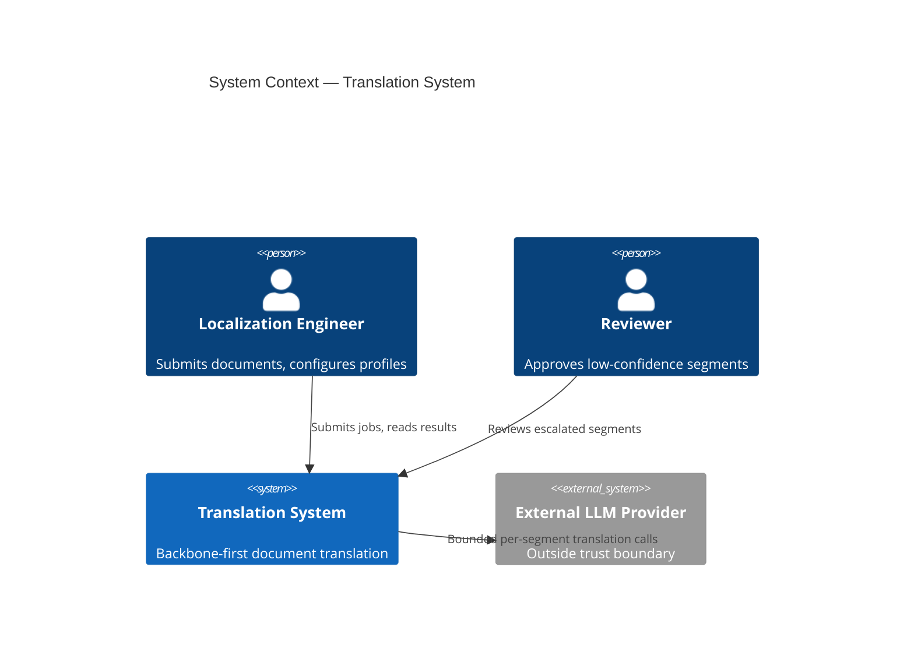
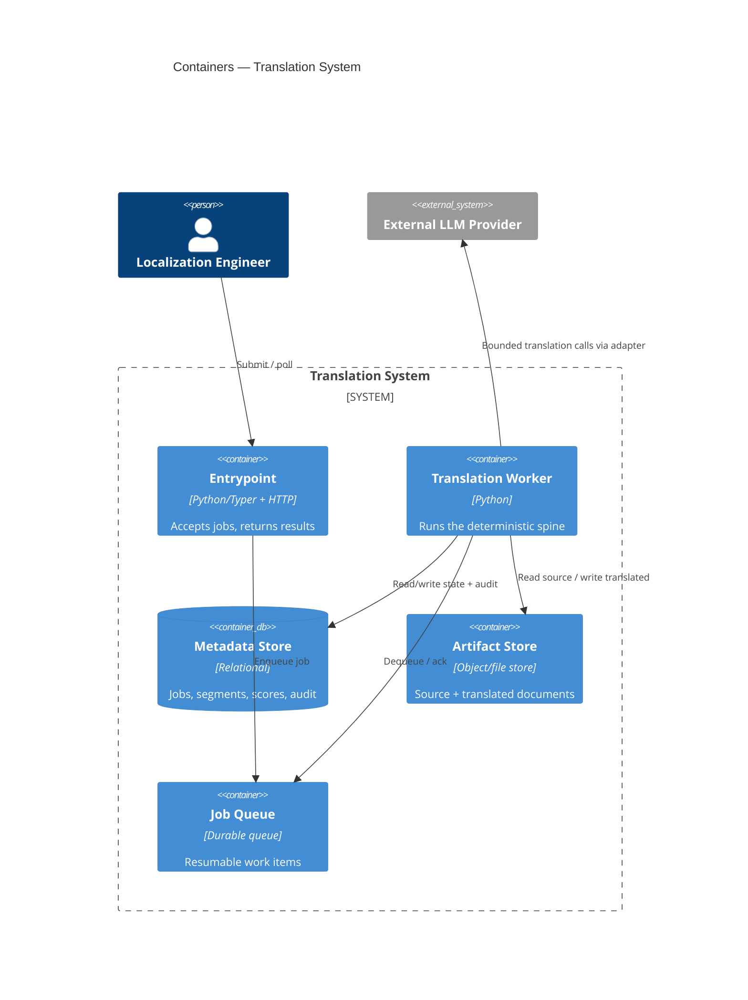
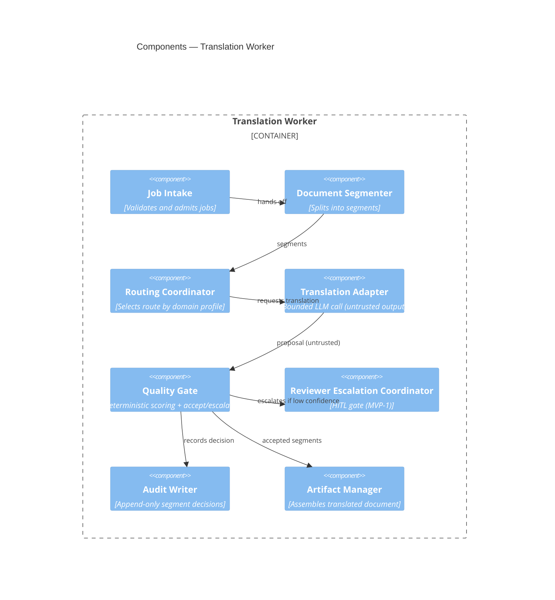
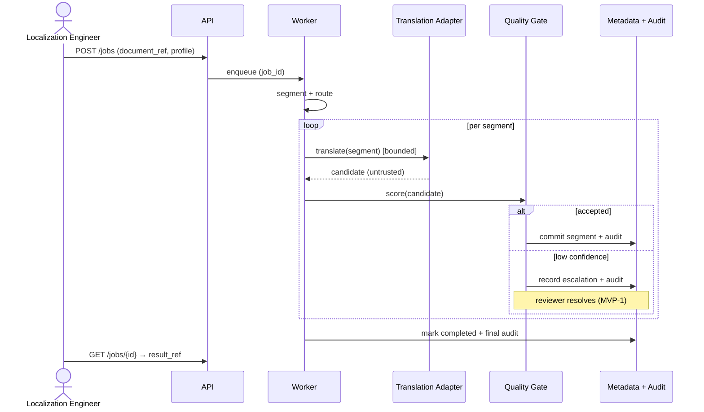

# Architecture Design: LLM-Agent Document Translation System

> Worked example output of the `architecture` skill, produced from
> `translation_blueprint_excerpt.md`. It is an **example**, not a universal
> recommendation; the tech-stack choices are justified for this blueprint only.

## Contents

- [1. Executive Architecture Summary](#1-executive-architecture-summary)
- [Update History](#update-history)
- [2. Source Blueprint Interpretation](#2-source-blueprint-interpretation)
- [3. Clarification Summary](#3-clarification-summary)
- [4. Architecture Goals and Constraints](#4-architecture-goals-and-constraints)
- [5. Solution Strategy](#5-solution-strategy)
- [6. Traditional Software vs AI-Agent Boundary](#6-traditional-software-vs-ai-agent-boundary)
- [7. Recommended Tech Stack](#7-recommended-tech-stack)
- [8. System Context View](#8-system-context-view)
- [9. Container / Runtime View](#9-container--runtime-view)
- [10. Component View](#10-component-view)
- [11. AI / Skill / MCP Architecture](#11-ai--skill--mcp-architecture)
- [12. Interface Contracts](#12-interface-contracts)
- [13. Data Contracts and Schemas](#13-data-contracts-and-schemas)
- [14. State, Storage, and Data Lifecycle](#14-state-storage-and-data-lifecycle)
- [15. Workflow / Sequence Views](#15-workflow--sequence-views)
- [16. Observability, Logging, Telemetry, and Audit](#16-observability-logging-telemetry-and-audit)
- [17. Security and Trust Boundaries](#17-security-and-trust-boundaries)
- [18. Failure Handling and Recovery](#18-failure-handling-and-recovery)
- [19. Testing and Evaluation Architecture](#19-testing-and-evaluation-architecture)
- [20. Deployment Architecture](#20-deployment-architecture)
- [21. Architecture Decision Records](#21-architecture-decision-records)
- [22. Technical Risks and Trade-offs](#22-technical-risks-and-trade-offs)
- [23. Open Questions](#23-open-questions)
- [24. Architecture Quality-Gate Self-Check](#24-architecture-quality-gate-self-check)
- [25. Handoff Notes for Implementation Planning](#25-handoff-notes-for-implementation-planning)

---

## 1. Executive Architecture Summary

A deterministic translation **spine** (intake → segmentation → routing →
quality gate → audit → assembly) owns all control, state, and audit. The LLM
performs only the per-segment translation judgment; its output is untrusted
until a deterministic quality gate validates it. Low-confidence segments
escalate to a human reviewer (MVP-1). The architecture priority is
**auditability and determinism around a bounded AI step**, not maximal
automation.

### 1.1 Architecture at a Glance

- **Primary runtime shape:** CLI/API entrypoint + job worker + metadata store +
  artifact store.
- **Where AI is used:** the per-segment translation step only.
- **Where determinism is enforced:** segmentation, routing, quality scoring,
  state transitions, audit, assembly.
- **MCP decision:** deferred (single application; no reusable multi-client tool
  surface yet) — recorded as ADR-0006.

### 1.2 Architecture Warnings Requiring Attention

| Warning | Required Action | Blocks Implementation Planning? |
|---|---|---|
| Data egress is an architecture assumption (`external_allowed`), not user-confirmed | Confirm with the user and review the provider DPA before production | No (review before production) |

### 1.x Generation Metadata

| Field | Value |
|---|---|
| Source blueprint | `translation_blueprint_excerpt.md` |
| Source blueprint version/hash | unknown |
| Source blueprint generated at | unknown |
| Architecture skill version | 0.5.0 |
| Generated at | 2026-06-05 |
| Operating mode | hybrid |
| Clarification count | 3 |
| Assumptions made | 4 |
| Output detail | standard |
| Target deployment assumption | server |

## Update History

| Date | Source Blueprint | Architecture Version | Change Type | Affected Sections | Notes |
|---|---|---|---|---|---|
| 2026-06-05 | `translation_blueprint_excerpt.md` | 0.5.0 | initial | all | First architecture from blueprint |

## 2. Source Blueprint Interpretation

The blueprint frames a **backbone-first** translation engine with a bounded LLM
step and conditional reviewer escalation. This architecture preserves that
emphasis: the LLM is a subordinate judgment component, not the product
identity. Drivers: long-document handling, domain-aware routing, deterministic
quality scoring, full per-segment audit, and a human-in-the-loop gate at MVP-1.
No conflicts with the blueprint were found; the only additions are technical
(storage split, correlation IDs, failure policies) that the handoff notes
invite.

## 3. Clarification Summary

| # | Question | Decision | Source | Decision Evidence | Review Requirement | Reversible? | Revisit Trigger |
|---|---|---|---|---|---|---|---|
| 1 | Single-tenant or multi-tenant at MVP? | Single-tenant server | architecture assumption | architecture_assumption | review before production | yes | First external customer |
| 2 | May document text reach the LLM verbatim? | Yes, but sanitized and treated as evidence, not instruction | blueprint-derived + clarified | confirmed_from_blueprint | review before production | yes | New provider with tool use |
| 3 | Can source/projected content be sent to external LLM providers? | `external_allowed` — sanitized segments sent to the hosted backbone model; local-only fallback deferred to Phase 2 | architecture assumption | architecture_assumption | review before implementation planning | yes | Regulated-data / on-prem customer → switch to `local_only` |

## 4. Architecture Goals and Constraints

### 4.1 Architecture Goals
- Deterministic, auditable control around a bounded AI step.
- Resumable long-document jobs.

### 4.2 Functional Constraints
- Every segment decision must be auditable.
- The LLM must never write durable state directly.

### 4.3 Non-Functional Requirements
| Requirement | Target | Source |
|---|---|---|
| Job resumability | Resume after worker crash without data loss | Handoff notes |
| Audit completeness | 100% of segment decisions recorded | Blueprint §12 |
| Cost control | Per-segment token budget enforced | Blueprint §12 |

### 4.4 Security / Privacy Constraints
- Document content is potentially sensitive; classify and restrict access.

### 4.5 Data and Retention Constraints
- Metadata retained per job policy; source/translated artifacts retained
  separately with their own retention.

### 4.6 Cost / Latency / Performance Constraints
- Bound LLM cost per segment; batch where possible.

### 4.7 Team / Development Constraints
- Small team; prefer a single primary language and simple deployment.

### 4.8 MVP-0 / MVP-1 Architecture Constraints
- **MVP-0:** intake → segment → translate → quality score → assemble + audit;
  no reviewer.
- **MVP-1:** add reviewer escalation chain + domain profiles; escalation is a
  release gate.

### 4.9 Explicit Assumptions
| Assumption | Reason | Reversible? | Revisit Trigger |
|---|---|---|---|
| Single external LLM provider at MVP | Simplicity | yes | Quality/cost pressure |
| Server deployment, not serverless | Long-running jobs | yes | Bursty load profile |
| One metadata store + one artifact store | Small scale | yes | Scale or compliance needs |
| Source content may be sent to the external LLM (`external_allowed`), sanitized | MVP uses a hosted model for translation quality | yes | Regulated-data / on-prem customer → `local_only` |

## 5. Solution Strategy

A **deterministic spine with a bounded AI adapter**. The worker sequences
deterministic stages; the only AI call is the translation step, whose output is
validated by a deterministic quality gate before any state write. Human review
is a gated escalation, not an inline AI loop. MCP is deferred. The top
decisions: (1) deterministic orchestration in traditional code; (2) AI confined
to translation; (3) metadata/artifact storage split; (4) append-only audit;
(5) provider access behind an adapter.

## 6. Traditional Software vs AI-Agent Boundary

| Responsibility | Traditional Software | AI / LLM | Skill | MCP Server | Human | Notes |
|---|---:|---:|---:|---:|---:|---|
| Workflow orchestration | ✓ | – | – | – | – | Deterministic worker |
| Segmentation & routing | ✓ | – | – | – | – | Rule/profile driven |
| Per-segment translation | – | ✓ | – | – | – | Bounded; validated downstream |
| Quality scoring | ✓ | – | – | – | – | Deterministic gate |
| Durable state writes | ✓ | – | – | – | – | Only after validation |
| Audit recording | ✓ | – | – | – | – | Append-only |
| Low-confidence approval | – | – | – | – | ✓ | HITL gate (MVP-1) |

> AI never mutates durable state; the quality gate sits between the translation
> proposal and any commit.

## 7. Recommended Tech Stack

| Decision | Recommendation | Alternatives | Rationale | Risks | Reversible? |
|---|---|---|---|---|---|
| Primary language | Python 3.12 | Go, TypeScript | Strong LLM ecosystem; team familiarity | GIL for CPU-bound work (not the bottleneck here) | yes |
| Entry/API | Typer CLI + thin HTTP API | Full web framework | Jobs are batch, not interactive | — | yes |
| Job execution | Worker process + durable queue | In-process threads | Resumable long jobs | Operational overhead | yes |
| Metadata store | Relational store (e.g. SQLite→Postgres path) | Document store | Strong consistency for state/audit | Migration effort at scale | yes |
| Artifact store | Object/file store | Metadata DB blobs | Keep large docs out of the metadata DB | — | yes |
| LLM provider abstraction | Provider adapter interface | Direct SDK calls | Isolate provider; enable swap | Adapter drift | yes |
| Agent orchestration | None — deterministic worker | Agent framework | One bounded AI call needs no agent runtime | — | yes |
| MCP strategy | Defer (ADR-0006) | Adopt now | No reusable multi-client surface yet | Re-add later if needed | yes |
| Deployment | Single-tenant server | Serverless | Long-running, stateful jobs | — | yes |

## 8. System Context View

## 9. Container / Runtime View

## 10. Component View

Most complex container: **Translation Worker**.

## 11. AI / Skill / MCP Architecture

### 11.1 Where AI Is Used and Bounded
- Per-segment translation only. The Translation Adapter returns a candidate;
  the Quality Gate scores it deterministically and either accepts it or
  escalates. No AI output reaches the assembled document or the audit log
  without passing the gate.

### 11.2 Skill vs MCP Decision
- **Skill:** not applicable as a runtime component here.
- **MCP server:** deferred (ADR-0006). There is one application and no reusable,
  permissioned, multi-client tool surface yet. Revisit if other clients need
  the translation/quality capability.

### 11.3 Agent / Tool Boundaries
- The worker calls the provider through a read-only translation adapter. No
  tool may write durable state; only the deterministic spine writes state.

## 12. Interface Contracts

### 12.1 API Contracts
- `POST /jobs` → `{document_ref, domain_profile_id}` ⇒ `{job_id}`; errors:
  validation (400), capacity (429).
- `GET /jobs/{job_id}` ⇒ `{status, result_ref?}`.

### 12.2 Event Contracts
- Queue work item: `{job_id, attempt, enqueued_at}`; at-least-once delivery;
  consumers must be idempotent on `job_id`.

### 12.3 Internal Module Contracts
- Segmenter: `Document → [Segment]`; deterministic for a given input + profile.
- Quality Gate: `(Segment, Candidate) → {accepted|escalate, score}`.

### 12.4 Agent Input/Output Contracts
- Translation Adapter: `(segment_text, profile) → candidate_text`; output is
  **untrusted**; never written to state directly.

### 12.5 Tool Schemas
- None beyond the translation adapter at MVP.

### 12.6 MCP Resources and Tools
- n/a — MCP deferred (ADR-0006).

### 12.7 Error Model
| Category | Example | Retryable? | Surface |
|---|---|---|---|
| Validation | bad job payload | no | yes (400) |
| Transient | provider timeout | yes (backoff) | maybe |
| Permission | profile access denied | no | yes |
| Internal | unexpected | no | sanitized |

### 12.8 Versioning Rules
- Additive API changes only without a version bump; segment/score schemas
  evolve additively with a migration path.

## 13. Data Contracts and Schemas

| Blueprint Object | Storage Owner | Suggested Storage | Retention | Notes |
|---|---|---|---|---|
| Job | Job Intake | Metadata store | Per policy | State machine in §14 |
| Segment | Segmenter | Metadata store | With job | Indexed by job_id |
| Translation Candidate | Translation Adapter | Metadata store | With job | Marked untrusted until gated |
| Quality Score | Quality Gate | Metadata store | With job | Reproducible from inputs |
| Review Round | Escalation Coordinator | Metadata store | With job | MVP-1 |
| Domain Profile | Routing Coordinator | Metadata store | Long-lived | Versioned |
| Audit Record | Audit Writer | Append-only audit table | Long; no expiry | Append-only is application-enforced (single writer, no update/delete path) + SHA-256 hash-chained (tamper-evident), not database-grant-enforced |
| Source / Translated Document | Artifact Manager | Artifact store | Separate policy | Not in metadata DB |

## 14. State, Storage, and Data Lifecycle

- **Lifecycle states (canonical):** `received → segmented → translating →
  scored → (escalated → reviewed)? → assembled → completed | failed`. These are
  the only values the `jobs` schema and the API status field use.
- **Operational condition flags (not states):** `degraded` (a required probe
  unavailable), `discourse-unscored`, `fallback-route-used` — orthogonal to the
  lifecycle state.
- **Audit events (not states):** `escalation_triggered`, `job_completed`,
  `job_failed`.
- **Ownership/retention:** metadata store owns state + audit; artifact store
  owns documents; retention policies are independent.
- **Schema evolution:** additive-first; migrations authored, never executed
  autonomously.
- **Artifact lifecycle:** source stored on intake; translated written on
  assembly; both expire per artifact retention.

## 15. Workflow / Sequence Views

Failure branch: on provider error the segment retries with backoff; on repeated
failure the job is marked `failed` with an audit record (see §18).

## 16. Observability, Logging, Telemetry, and Audit

- **Correlation IDs:** `job_id`, `segment_id`, `model_call_id`, `decision_id`,
  `audit_event_id`, `review_round_id` (MVP-1), `external_call_id`.
- **Logs:** `job_created`, `segment_created`, `translation_started`,
  `translation_completed`, `translation_failed`, `quality_decision_made`,
  `escalation_triggered`, `job_completed`.
- **Metrics:** throughput (segments/min), latency (per stage), errors (by
  category), quality-score distribution, cost (tokens/segment), reviewer load.
- **Traces:** end-to-end job, per-segment translation, provider calls, reviewer
  flow.
- **Audit:** each segment decision records input hash, actor/caller, the score,
  the candidate reference, validation result, the model_call_id, any human
  decision, and the committed output hash. Audit is append-only (§14).

## 17. Security and Trust Boundaries

### 17.1 Security Goals
- Protect potentially sensitive document content; guarantee an immutable audit.

### 17.2 Trust Zones
| Zone | Contains | Trust Level | Can Read | Can Write | Controls |
|---|---|---|---|---|---|
| User input zone | submitted documents | untrusted | — | — | classify, sanitize |
| Application control zone | worker spine | trusted | state, audit | state, audit | authz |
| AI execution zone | translation adapter | untrusted output | segment text | nothing durable | gate before commit |
| Storage zone | metadata + artifacts | trusted | per-owner | per-owner | encryption, retention |
| Audit zone | audit records | append-only | operators | system only | immutability |
| External provider zone | LLM provider | outside boundary | request | response only | adapter isolation |
| Human review zone | reviewers | trusted | proposals | approvals | approval workflow |

### 17.3 Identity and Access Model
- Engineers and reviewers authenticate; profile access is authorized per role.

### 17.4 Authorization Boundaries
- Only the worker writes state and audit; the API never writes domain state
  directly.

### 17.5 AI / LLM Trust Boundary
- LLM output is untrusted until the Quality Gate validates it; the adapter
  cannot write durable state.

### 17.6 Prompt Injection and Tool Misuse Controls
- Document text is sanitized and passed as **evidence, not instruction**; no
  tool exposure to the model; suspicious input raises
  `prompt_injection_suspected`.

### 17.7 Data Classification and Privacy
- Documents classified as confidential by default; access restricted; artifacts
  encrypted at rest.

### 17.8 Secrets and Configuration Management
- Provider credentials live in environment/secret manager only — never in
  prompts, logs, tool args, or artifacts.

### 17.9 External Provider Boundary

All provider calls go through the adapter; failures raise
`external_provider_error`. Data Egress / External Model Use:

| Decision | Value | Source | Review Requirement | Reason |
|---|---|---|---|---|
| Can raw/projected source content leave the local trust boundary? | external_allowed | architecture assumption | review before implementation planning | Hosted backbone model used for translation quality |
| Which providers may receive content? | The configured backbone provider only (single provider at MVP) | blueprint-derived | review before production | Limits provider trust surface |
| Is redaction required before model calls? | No at MVP; sanitized evidence-projection only | architecture assumption | review before production | Source is the unit of work; redaction deferred |
| May logs contain source content? | No — logs carry IDs/hashes, not source text | architecture assumption | no review needed | Privacy + audit minimization |
| Can domain plugins override data-egress policy? | No — policy is global at MVP | architecture assumption | review before production | Prevents per-plugin egress drift |

### 17.10 Audit and Compliance Requirements
- Every segment decision is auditable; the audit log is append-only
  (application-enforced) and hash-chained (tamper-evident), not tamper-proof
  against privileged storage access.

### 17.11 Security Failure Modes
- Audit write failure halts the job (fail-closed) rather than completing
  unaudited.

### 17.12 Security Quality Gates

| Security Gate | Required Implementation Evidence | Verification Method | Blocks Release? |
|---|---|---|---|
| AI cannot mutate durable state without deterministic validation | Quality Gate sits between every translation proposal and any state write | unit + integration tests | Yes |
| Append-only audit (application-enforced; no update/delete path exposed) + hash-chain tamper-evident | single-writer AuditWriter; no repository update/delete path; hash-chain verifier | unit + integration tests | Yes |
| External provider isolated behind an adapter | all provider calls route through the translation adapter | integration tests; no direct SDK calls in core | Yes |
| Secrets never written to artifacts/logs/prompts | secret-redaction tests; log-snapshot tests | security test suite | Yes |
| Raw source content never written to logs | provider-wrapper redaction; safe log level; logs carry IDs/hashes only | log-snapshot test + provider-wrapper redaction test | Yes |

> Gates are verification rows (evidence + method + blocks-release), not
> unchecked checkboxes, and the audit gate is worded as application-enforced +
> tamper-evident — not borrowed database-grant wording.

## 18. Failure Handling and Recovery

| Concern | Policy |
|---|---|
| Timeouts | Per provider call; bounded |
| Retry | Exponential backoff + jitter on transient provider errors |
| Fallback | After N failures, mark segment failed; job fails if any required segment fails |
| Idempotency | Consumers idempotent on `job_id` + `segment_id` |
| Partial failure | Completed segments persisted; job resumes from last committed segment |
| Queue/job recovery | At-least-once delivery; worker resumes from job state |
| External provider failure | Adapter raises typed error; retried then failed |
| AI model failure | No fallback model at MVP; escalate or fail with audit |
| Tool/MCP failure | n/a (MCP deferred) |
| Human approval timeout | Escalation expires → job parked for engineer (MVP-1) |
| Data corruption recovery | Re-derive from source artifact + audit |
| Audit write failure | Fail-closed: stop the job, surface the error |

## 19. Testing and Evaluation Architecture

| Test type | What it covers |
|---|---|
| Unit | Segmenter, router, scorer determinism |
| Integration | Worker ↔ stores ↔ queue |
| Contract | §12 API, queue, adapter contracts |
| End-to-end | Submit → assembled output |
| Golden | Per-domain golden translations |
| AI evaluation | Quality-score calibration vs human judgments |
| Security | Prompt-injection fixtures; secrets-leak checks |
| Observability | Audit completeness; correlation-ID propagation |
| Failure-mode | Each §18 concern (provider timeout, audit-write failure, resume) |
| Regression | Prompt-template regression on golden set |

## 20. Deployment Architecture

Single-tenant server: API + worker processes, a metadata store, an artifact
store, and a durable queue. A deployment diagram is deferred until topology
changes (multi-tenant or compliance-driven isolation) — the current topology
does not yet affect trust boundaries beyond the external-provider edge already
shown in §9.

## 21. Architecture Decision Records

| ADR | Title | Status | Supersedes |
|---|---|---|---|
| ADR-0001 | Deterministic spine + bounded AI runtime architecture | Accepted | — |
| ADR-0002 | Python + worker/queue tech stack | Accepted | — |
| ADR-0003 | AI confined to translation; gate before state | Accepted | — |
| ADR-0004 | Metadata/artifact storage split + append-only audit | Accepted | — |
| ADR-0005 | Correlation IDs + audit trail model | Accepted | — |
| ADR-0006 | Defer MCP adoption | Accepted | — |

## 22. Technical Risks and Trade-offs

| Risk | Impact | Likelihood | Mitigation | Owner |
|---|---|---|---|---|
| Quality gate mis-calibrated | H | M | Golden + calibration tests; reviewer at MVP-1 | Quality Gate |
| Provider cost spikes | M | M | Per-segment token budget; batching | Translation Adapter |
| Prompt injection via documents | M | M | Evidence-not-instruction; injection fixtures | Security |
| Long jobs exhaust resources | M | L | Segment-level checkpointing + resume | Worker |

## 23. Open Questions

| # | Question | Why It Matters | Proposed Resolution Path |
|---|---|---|---|
| 1 | One provider or multiple at MVP-1? | Cost/quality + adapter complexity | Evaluate after MVP-0 quality data |
| 2 | Reviewer SLA / timeout policy? | Affects job state + UX | Define with localization team before MVP-1 |

## 24. Architecture Quality-Gate Self-Check

| Gate | Status | Finding | Required Action | Blocks Implementation? |
|---|---|---|---|---|
| Traceability map present | PASS | Map produced (intermediate) | — | no |
| All 25 sections present | PASS | All present | — | no |
| Tech-stack rationale + alternatives | PASS | §7 complete | — | no |
| Traditional-vs-AI matrix present | PASS | §6 complete | — | no |
| C4 context/container/dynamic present | PASS | §8/§9/§15 | — | no |
| Interface + data contracts present | PASS | §12/§13 | — | no |
| Security/trust boundary model present | PASS | §17 complete | — | no |
| Observability/audit plan present | PASS | §16 complete | — | no |
| Failure handling for critical workflows | PASS | §18 complete | — | no |
| ADRs for major decisions | PASS | §21, six ADRs | — | no |
| MCP justified or deferred | PASS | Deferred, ADR-0006 | — | no |
| AI cannot mutate state without validation | PASS | Gate before commit | — | no |
| MVP-0/MVP-1 respected | PASS | §4.8 honors blueprint | — | no |
| Update behavior defined (if updating) | PASS | Initial document | — | no |
| Metadata consistency | PASS | Clarification count 3 = §3 rows (3); assumptions 4 = §4.9 rows (4); ADR/Contents refs resolve | — | no |
| Hybrid decision review | PASS | Both §3 decisions carry a source + review requirement | — | no |
| Technology-specific validity | PASS | Append-only audit framed as application-enforced + hash-chain tamper-evident, not DB-grant-enforced (§13) | — | no |
| Probe/evaluator availability | PASS | n/a — no model-backed evaluators/probes in this design | — | no |
| Architecture-vs-implementation boundary | PASS | §25 names layers, not file paths; no tickets/code/migrations | — | no |
| Residual invalid-claim scan | PASS | Whole-doc scan: audit framed app-enforced + tamper-evident (§13/§17); no DB-grant wording anywhere | — | no |
| Data egress / external model use | WARNING | `external_allowed` is an architecture assumption (not user-confirmed); §17.9 table present, distinct from provider abstraction | Confirm with user + review provider DPA before production (surfaced in §1.2/§25) | no |
| State-semantics consistency | PASS | All state/condition terms resolve to the §14 canonical model (lifecycle vs condition flag vs audit event) | — | no |
| Standard-vs-detailed budget | PASS | Concise main body; heavy ADR bodies live under `adr/` | — | no |
| Security gate verification format | PASS | §17.12 is a verification table (evidence + method + blocks-release); no unchecked checkboxes; audit gate worded app-enforced + tamper-evident | — | no |
| Decision evidence / provenance | PASS | every §3 row carries Decision Evidence; data-egress = architecture_assumption (not labelled user-confirmed) | — | no |
| Raw source-content logging policy | PASS | §17.9 forbids raw source in logs (No); §17.12 has a log-snapshot + provider-wrapper redaction gate | — | no |
| Warning surfacing | PASS | the data-egress WARNING is echoed in §1.2 and §25 | — | no |
| Architecture-stage sequencing cap | PASS | §25 build order is 4 high-level constraints; no file-by-file/tickets/PR order | — | no |

## 25. Handoff Notes for Implementation Planning

- **Build order:** deterministic spine (intake→segment→route→gate→audit→assembly)
  first; then the translation adapter; then the evaluation harness; reviewer
  escalation at MVP-1.
- **First implementable slice (MVP-0):** single document end-to-end without the
  reviewer.
- **Contracts to freeze early:** the §12.3 internal module contracts and the
  §12.4 adapter contract gate parallel work.
- **Highest-risk areas to prototype:** quality-gate calibration (§22).
- **Decisions deferred to implementation:** concrete store engine within the
  chosen relational path; queue technology.
- **What the implementation-plan skill should NOT re-decide:** ADR-0001..0006.
- **Boundary note:** the build order above names architectural layers, not file
  paths (4 high-level constraints, within the five-constraint cap); any module
  names are proposed module namespaces for implementation planning, not
  file-by-file tasks. No task tickets, code, or migrations are emitted here —
  those are the implementation-plan skill's job.
- **Open warnings (from §24):** Data egress is an architecture assumption
  (`external_allowed`), not user-confirmed — confirm with the user and review
  the provider DPA before production. Non-blocking for implementation planning.
