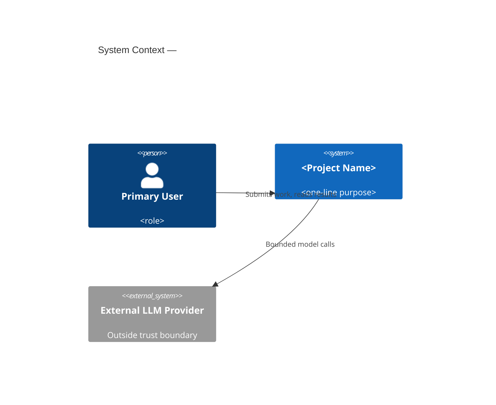
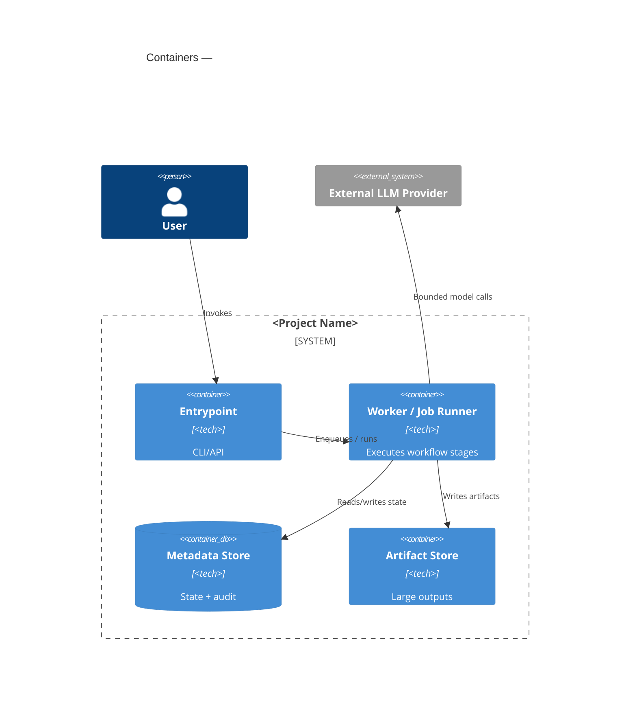
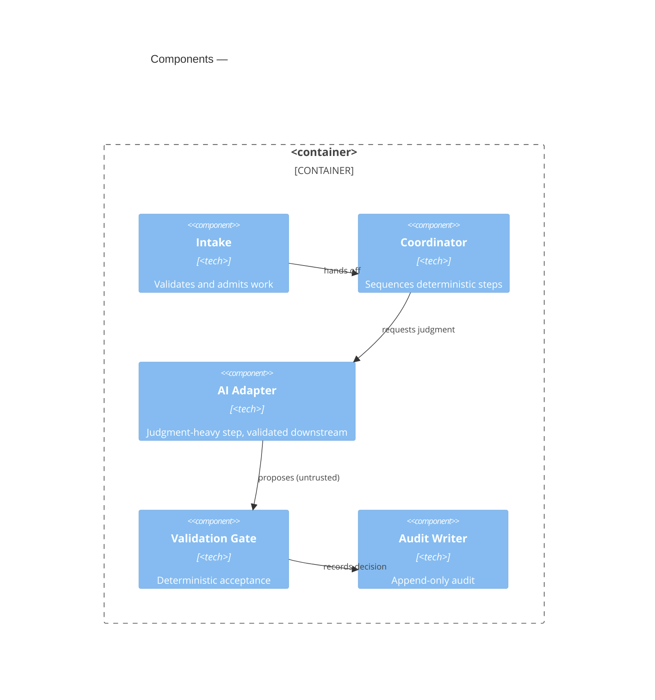
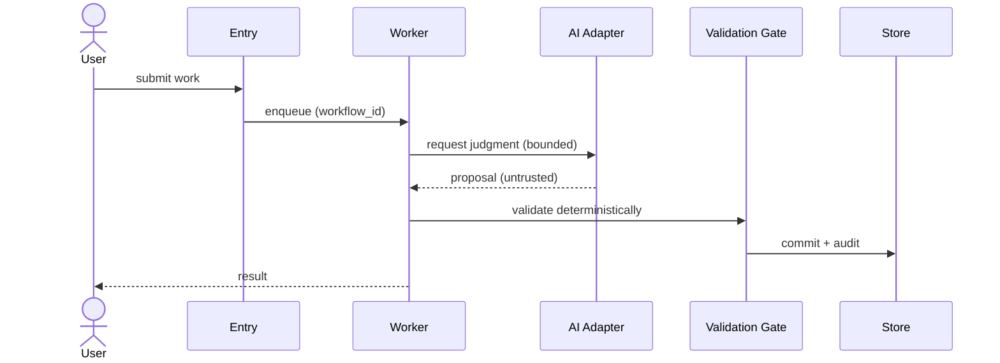

# Architecture Design: <Project Name>

> Skeleton for the `architecture` skill output. Replace every `<…>`
> placeholder. Keep the section order and headings. Co-locate the file with
> the source blueprint as `<topic-slug>-architecture-design.md`.

## Contents

- [1. Executive Architecture Summary](#1-executive-architecture-summary)
- [Update History](#update-history)
- [2. Source Blueprint Interpretation](#2-source-blueprint-interpretation)
- [3. Clarification Summary](#3-clarification-summary)
- [4. Architecture Goals and Constraints](#4-architecture-goals-and-constraints)
- [5. Solution Strategy](#5-solution-strategy)
- [6. Traditional Software vs AI-Agent Boundary](#6-traditional-software-vs-ai-agent-boundary)
- [7. Recommended Tech Stack](#7-recommended-tech-stack)
- [8. System Context View](#8-system-context-view)
- [9. Container / Runtime View](#9-container--runtime-view)
- [10. Component View](#10-component-view)
- [11. AI / Skill / MCP Architecture](#11-ai--skill--mcp-architecture)
- [12. Interface Contracts](#12-interface-contracts)
- [13. Data Contracts and Schemas](#13-data-contracts-and-schemas)
- [14. State, Storage, and Data Lifecycle](#14-state-storage-and-data-lifecycle)
- [15. Workflow / Sequence Views](#15-workflow--sequence-views)
- [16. Observability, Logging, Telemetry, and Audit](#16-observability-logging-telemetry-and-audit)
- [17. Security and Trust Boundaries](#17-security-and-trust-boundaries)
- [18. Failure Handling and Recovery](#18-failure-handling-and-recovery)
- [19. Testing and Evaluation Architecture](#19-testing-and-evaluation-architecture)
- [20. Deployment Architecture](#20-deployment-architecture)
- [21. Architecture Decision Records](#21-architecture-decision-records)
- [22. Technical Risks and Trade-offs](#22-technical-risks-and-trade-offs)
- [23. Open Questions](#23-open-questions)
- [24. Architecture Quality-Gate Self-Check](#24-architecture-quality-gate-self-check)
- [25. Handoff Notes for Implementation Planning](#25-handoff-notes-for-implementation-planning)

---

## 1. Executive Architecture Summary

<2–5 sentences: what the system is, the architecture priorities, and the
non-negotiable outcomes. Lead with the primary architecture, not a secondary
mechanism.>

### 1.1 Architecture at a Glance

- **Primary runtime shape:** <e.g. CLI + worker + metadata store + artifact store>
- **Where AI is used:** <judgment/language/reasoning tasks only>
- **Where determinism is enforced:** <control, state, audit, validation>
- **MCP decision:** <adopted / deferred — one line of why>

### 1.2 Architecture Warnings Requiring Attention

<Surface every §24 WARNING / PASS-with-warning row here (and in §25). If none,
write "No open warnings." Do not let warnings live only in §24.>

| Warning | Required Action | Blocks Implementation Planning? |
|---|---|---|
| <warning> | <action> | yes/no |

### 1.x Generation Metadata

| Field | Value |
|---|---|
| Source blueprint | `<filename>` |
| Source blueprint version/hash | `<hash or timestamp or unknown>` |
| Source blueprint generated at | `<date or unknown>` |
| Architecture skill version | `<from manifest.json version or unknown>` |
| Generated at | `<date>` |
| Operating mode | interactive / automatic / hybrid |
| Clarification count | `<N>` |
| Assumptions made | `<N>` |
| Output detail | concise / standard / detailed |
| Target deployment assumption | local / server / cloud / hybrid / unknown |

> Do not invent metadata. Use `unknown` when unavailable. Record assumptions
> separately from known facts.

## Update History

| Date | Source Blueprint | Architecture Version | Change Type | Affected Sections | Notes |
|---|---|---|---|---|---|
| <YYYY-MM-DD> | `<blueprint filename>` | 0.1.0 | initial | all | First architecture from blueprint |

> New documents include the initial row. Updates append a new row. Never
> delete prior rows. Change Type ∈ {initial, regenerate, patch, adr-only,
> resume, compare}.

## 2. Source Blueprint Interpretation

<What the blueprint asks for, the evidence-backed architecture drivers, and any
points where this architecture interprets or constrains the blueprint. Note
conflicts and how they were resolved.>

## 3. Clarification Summary

| # | Question | Decision | Source | Decision Evidence | Review Requirement | Reversible? | Revisit Trigger |
|---|---|---|---|---|---|---|---|
| 1 | <question> | <answer/assumption> | user-confirmed / blueprint-derived / inferred / assumption / ADR-locked | confirmed_in_interactive_answer / …_from_supplied_configuration / …_from_blueprint / architecture_assumption / unknown_requires_review | none / review before implementation / review before production / blocks | yes/no | <trigger> |

> In hybrid mode every major decision needs a **Source** and a **Review
> Requirement**. A high-impact decision that was inferred or assumed (external
> LLM use, source-data privacy, deployment model, storage backend, auth, data
> retention, cost-sensitive routing, MCP exposure, human-approval workflow) must
> be flagged "review before implementation planning" or stronger — hybrid mode
> must not silently behave like automatic mode.
>
> **Data egress (mandatory when external models are used):** include a distinct
> row — *"Can source or projected content be sent to external LLM providers?"* —
> classified external_allowed / external_allowed_with_redaction / local_only /
> hybrid_by_domain / unknown_requires_user_review. Keep it separate from the
> provider-abstraction/library decision; if unanswered, mark it "review before
> implementation planning".
>
> **Decision Evidence (provenance):** every high-impact row records *how* its
> source was established (confirmed_in_interactive_answer /
> …_from_supplied_configuration / …_from_previous_architecture_document /
> …_from_blueprint / architecture_assumption / unknown_requires_review). Never
> label a decision `user-confirmed` without an explicit evidence source — if
> unclear, downgrade to `architecture_assumption` + review.

## 4. Architecture Goals and Constraints

### 4.1 Architecture Goals
- <goal>

### 4.2 Functional Constraints
- <constraint>

### 4.3 Non-Functional Requirements
| Requirement | Target | Source |
|---|---|---|
| <e.g. p95 latency> | <target> | <blueprint §/clarification/assumption> |

### 4.4 Security / Privacy Constraints
- <constraint>

### 4.5 Data and Retention Constraints
- <constraint>

### 4.6 Cost / Latency / Performance Constraints
- <constraint>

### 4.7 Team / Development Constraints
- <constraint>

### 4.8 MVP-0 / MVP-1 Architecture Constraints
- **MVP-0:** <smallest end-to-end slice the architecture must support>
- **MVP-1:** <first usable version>

### 4.9 Explicit Assumptions
| Assumption | Reason | Reversible? | Revisit Trigger |
|---|---|---|---|
| <assumption> | <reason> | yes/no | <trigger> |

## 5. Solution Strategy

<The shape of the solution: deterministic spine vs AI components, the main
architectural style, and the top 3–5 strategic decisions and why. Respect the
selected update mode if an architecture document already exists.>

## 6. Traditional Software vs AI-Agent Boundary

| Responsibility | Traditional Software | AI / LLM | Skill | MCP Server | Human | Notes |
|---|---:|---:|---:|---:|---:|---|
| <responsibility> | ✓/– | ✓/– | ✓/– | ✓/– | ✓/– | <note> |

> Core rule: deterministic control, state, storage, audit, security, workflow
> transitions, and interface contracts belong to traditional software unless
> explicitly justified. AI owns only judgment-heavy, language-heavy, or
> reasoning-heavy tasks. AI components must not mutate durable state directly
> unless deterministic validation and audit controls exist.

## 7. Recommended Tech Stack

| Decision | Recommendation | Alternatives | Rationale | Risks | Reversible? |
|---|---|---|---|---|---|
| Primary language | <choice> | <alts> | <fit to blueprint> | <risk> | yes/no |
| Backend framework | <choice> | <alts> | <rationale> | <risk> | yes/no |
| Storage system | <choice> | <alts> | <rationale> | <risk> | yes/no |
| LLM provider abstraction | <choice> | <alts> | <rationale> | <risk> | yes/no |
| Agent orchestration | <choice> | <alts> | <rationale> | <risk> | yes/no |
| MCP strategy | <adopt/defer> | <alts> | <rationale> | <risk> | yes/no |

> Stacks are chosen for *this* blueprint, not as universal defaults. State the
> decision criteria that drove each choice.

## 8. System Context View

- **Primary/secondary users, external systems, AI services, file inputs,
  monitoring/audit consumers, human approval actors** — list each with its role
  and trust relationship.

## 9. Container / Runtime View

- For each container: responsibility, owner, technology, and the contracts at
  its boundary (link to §12).

## 10. Component View

> Generate only for the most complex container. State which container.

## 11. AI / Skill / MCP Architecture

### 11.1 Where AI Is Used and Bounded
- <task → why AI → how output is validated before it affects state>

### 11.2 Skill vs MCP Decision
- **Skill:** <repeatable reasoning workflows>
- **MCP server:** <adopt only with clients, resources/tools, permission
  boundary, audit, error model, versioning, and a considered non-MCP
  alternative — otherwise DEFER and say so>

### 11.3 Agent / Tool Boundaries
- <tool permission model; which tools are read-only vs state-changing>

## 12. Interface Contracts

See `templates/interface_contract_template.md`. Cover:

### 12.1 API Contracts
### 12.2 Event Contracts
### 12.3 Internal Module Contracts
### 12.4 Agent Input/Output Contracts
### 12.5 Tool Schemas
### 12.6 MCP Resources and Tools (if any)
### 12.7 Error Model
### 12.8 Versioning Rules

## 13. Data Contracts and Schemas

| Blueprint Object | Storage Owner | Suggested Storage | Retention | Notes |
|---|---|---|---|---|
| <object> | <owner module> | <kind, not a vendor unless justified> | <retention> | <schema-evolution / immutability> |

> Define schema-level objects, not final database migrations. Separate
> metadata from large artifacts. Define audit immutability semantics.

## 14. State, Storage, and Data Lifecycle

**Canonical state model** (keep these three categories distinct; every state /
status / condition term used anywhere in the document must resolve here):

- **Lifecycle states:** <the persisted states of the primary entity, e.g.
  queued → … → completed / failed — the only values the schema and API status
  use>
- **Operational condition flags:** <orthogonal runtime conditions, e.g.
  degraded / fallback-used / probe-unavailable — not lifecycle states>
- **Audit events:** <things that happened, e.g. escalated / job_failed — not
  states>

- **Storage ownership & retention:** <per store>
- **Schema evolution strategy:** <how schemas change safely>
- **Artifact lifecycle:** <creation → retention → deletion>

## 15. Workflow / Sequence Views

- Cover the main end-to-end workflow and any critical sub-workflows, including
  failure branches (link to §18).

## 16. Observability, Logging, Telemetry, and Audit

See `templates/observability_plan_template.md`. Cover correlation IDs, logs,
metrics, traces, and the audit trail. Every final output or state-changing
action must be traceable to input reference/hash, actor, decision path,
intermediate outputs, validation results, AI/tool calls, human decisions, and
final output hash / state change.

## 17. Security and Trust Boundaries

See `templates/security_trust_boundary_template.md`. Cover security goals,
trust zones, identity/access, authorization boundaries, the AI/LLM trust
boundary, prompt-injection and tool-misuse controls, data classification and
privacy, secrets and configuration management, the external-provider boundary,
audit/compliance requirements, security failure modes, and security quality
gates. Render **§17.12 Security Quality Gates as a verification table**
(Security Gate · Required Implementation Evidence · Verification Method · Blocks
Release?) — never as ambiguous unchecked `- [ ]` checkboxes — and when external
models are used, include the **§17.9 Data Egress / External Model Use table**
(content-leaves-boundary, which providers, redaction, logs-may-contain-source,
domain-plugin-override). Keep every gate's wording honest to the chosen
technology.

## 18. Failure Handling and Recovery

| Concern | Policy |
|---|---|
| Timeouts | <policy> |
| Retry | <policy + backoff> |
| Fallback | <policy> |
| Idempotency | <policy> |
| Partial failure | <policy> |
| Queue/job recovery | <policy> |
| External provider failure | <policy> |
| AI model failure | <fallback path> |
| Tool/MCP failure | <policy> |
| Human approval timeout | <policy> |
| Data corruption recovery | <policy> |
| Audit write failure | <policy> |

> No critical workflow may lack failure handling.

## 19. Testing and Evaluation Architecture

| Test type | What it covers |
|---|---|
| Unit | <…> |
| Integration | <…> |
| Contract | <interface contracts in §12> |
| End-to-end | <main workflow> |
| Golden | <deterministic fixtures> |
| AI evaluation | <model output evaluation fixtures> |
| Security | <prompt-injection / tool-call safety> |
| Observability | <correlation-ID / audit assertions> |
| Failure-mode | <each §18 concern> |
| Regression | <…> |

## 20. Deployment Architecture

<Generate a deployment view only when topology affects security boundary,
privacy, data locality, scaling, availability, or operational ownership.
Otherwise state the deployment assumption and defer.>

## 21. Architecture Decision Records

Index of ADRs (full records under `adr/`, see `templates/adr_template.md`):

| ADR | Title | Status | Supersedes |
|---|---|---|---|
| ADR-0001 | Runtime architecture | Accepted | — |
| ADR-0002 | Tech stack | Accepted | — |
| ADR-0003 | AI boundary | Accepted | — |

## 22. Technical Risks and Trade-offs

| Risk | Impact | Likelihood | Mitigation | Owner |
|---|---|---|---|---|
| <risk> | H/M/L | H/M/L | <mitigation> | <module/role> |

## 23. Open Questions

| # | Question | Why It Matters | Proposed Resolution Path |
|---|---|---|---|
| 1 | <question> | <impact> | <how/when to resolve> |

## 24. Architecture Quality-Gate Self-Check

| Gate | Status | Finding | Required Action | Blocks Implementation? |
|---|---|---|---|---|
| Traceability map present | PASS / WARNING / FAIL | <finding> | <action> | yes/no |
| All 25 sections present | PASS / WARNING / FAIL | <finding> | <action> | yes/no |
| Tech-stack rationale + alternatives | PASS / WARNING / FAIL | <finding> | <action> | yes/no |
| Traditional-vs-AI matrix present | PASS / WARNING / FAIL | <finding> | <action> | yes/no |
| C4 context/container/dynamic present | PASS / WARNING / FAIL | <finding> | <action> | yes/no |
| Interface + data contracts present | PASS / WARNING / FAIL | <finding> | <action> | yes/no |
| Security/trust boundary model present | PASS / WARNING / FAIL | <finding> | <action> | yes/no |
| Observability/audit plan present | PASS / WARNING / FAIL | <finding> | <action> | yes/no |
| Failure handling for critical workflows | PASS / WARNING / FAIL | <finding> | <action> | yes/no |
| ADRs for major decisions | PASS / WARNING / FAIL | <finding> | <action> | yes/no |
| MCP justified or deferred | PASS / WARNING / FAIL | <finding> | <action> | yes/no |
| AI cannot mutate state without validation | PASS / WARNING / FAIL | <finding> | <action> | yes/no |
| MVP-0/MVP-1 respected | PASS / WARNING / FAIL | <finding> | <action> | yes/no |
| Update behavior defined (if updating) | PASS / WARNING / FAIL | <finding> | <action> | yes/no |
| Metadata consistency | PASS / WARNING / FAIL | counts match tables; A-N/ADR/Contents refs resolve | <action> | yes/no |
| Hybrid decision review | PASS / WARNING / FAIL | every §3 decision has source + review requirement | <action> | yes/no |
| Technology-specific validity | PASS / WARNING / FAIL | tech claims match actual capabilities | <action> | yes/no |
| Probe/evaluator availability | PASS / WARNING / FAIL | each model-backed evaluator has an availability policy (or n/a) | <action> | yes/no |
| Architecture-vs-implementation boundary | PASS / WARNING / FAIL | namespaces labelled proposed; no tickets/code/migrations | <action> | yes/no |
| Residual invalid-claim scan | PASS / WARNING / FAIL | whole-document scan for tech-inconsistent wording (security gates, data, ADRs, checklist) | <action> | yes/no |
| Data egress / external model use | PASS / WARNING / FAIL | external-model architectures have a distinct §3 data-egress decision (or n/a) | <action> | yes/no |
| State-semantics consistency | PASS / WARNING / FAIL | every state/condition term resolves to the §14 canonical model | <action> | yes/no |
| Standard-vs-detailed budget | PASS / WARNING / FAIL | standard output keeps a concise main body + appendices | <action> | yes/no |
| Security gate verification format | PASS / WARNING / FAIL | §17 gates are a verification table (evidence + method + blocks-release), not unchecked checkboxes | <action> | yes/no |
| Decision evidence / provenance | PASS / WARNING / FAIL | high-impact decisions carry Decision Evidence; none labelled user-confirmed without a source | <action> | yes/no |
| Raw source-content logging policy | PASS / WARNING / FAIL | raw source content forbidden in logs by default; redaction + log-snapshot tests required | <action> | yes/no |
| Warning surfacing | PASS / WARNING / FAIL | every §24 warning is echoed in §1 and §25 | <action> | yes/no |
| Architecture-stage sequencing cap | PASS / WARNING / FAIL | §25 sequencing ≤ 5 high-level constraints; no file-by-file/tickets/PR order | <action> | yes/no |

> Status legend: **PASS** (complete + consistent), **WARNING** ("PASS with
> warning" — acceptable direction, needs cleanup; non-blocking but carries a
> required action), **FAIL** (missing/false/misleading). Never mark a section
> PASS when a known contradiction or residual invalid claim remains.

## 25. Handoff Notes for Implementation Planning

- **Build order (suggested):** <deterministic spine first, then AI adapters,
  then evaluation harness>
- **First implementable slice (MVP-0):** <what to build first>
- **Contracts to freeze early:** <which §12 contracts gate parallel work>
- **Highest-risk areas to prototype:** <link §22>
- **Decisions deferred to implementation:** <list>
- **What the implementation-plan skill should NOT re-decide:** <ADR-locked items>
- **Module namespaces (optional):** <if listed, present them as
  proposed module namespaces for implementation planning — not mandatory
  file-by-file implementation tasks>

- **Open warnings (from §24):** <echo every WARNING / PASS-with-warning row
  here with its required action and blocking status, or "No open warnings">

> Stay on the architecture side of the boundary: module boundaries, proposed
> namespaces, contracts to freeze, high-risk prototypes, and ADR-locked
> constraints are in scope. Task tickets, code patches, migration scripts, and
> file-by-file steps are the implementation-plan skill's job — do not emit them.
> **Build sequencing is capped at five high-level constraints** — anything more
> detailed (file-by-file order, task tickets, PR sequence, class/migration
> ordering) belongs to the implementation-plan skill.
