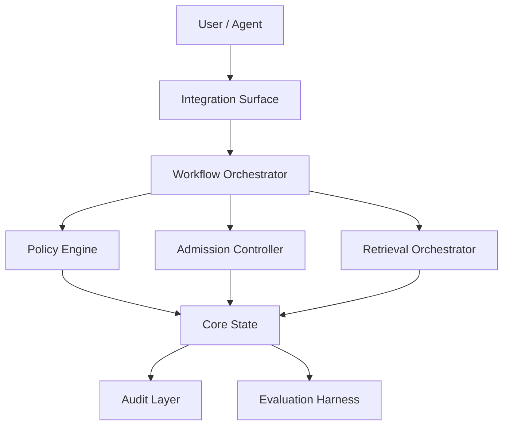

# Logical Architecture Template (§10)

The logical architecture describes **conceptual responsibilities and
boundaries**, not implementation components. Conceptual names may sound
software-like, but they describe responsibility boundaries only — they
must not imply classes, services, packages, processes, or deployable
units.

## Required structure

```markdown
## 10. Logical Architecture

### 10.1 System Context
### 10.2 Architecture Overview   (Mermaid diagram — required)
### 10.3 Core Logical Components (table)
### 10.4 Control Flow
### 10.5 Information Flow
### 10.6 Trust and Policy Boundaries
### (optional) Extension Points
```

## Component table

| Component | Responsibility | Inputs | Outputs | Owns Decisions | Does Not Own |
|---|---|---|---|---|---|
| Admission Controller | Decide whether a candidate becomes durable state | Candidate item, context, scope | Accept/reject/quarantine + audit event | Admission policy | Storage layout |

For each component also note its related workflows and traceability
(`[arxiv_id]` / `[Author, Year]`).

## Required diagram



## Allowed conceptual component names

Admission Controller · Retrieval Orchestrator · Lifecycle Manager ·
Governance Layer · Evaluation Harness · Integration Surface · Audit Layer
· Policy Engine · Scope Controller · Index Manager · Classification Engine
· Conflict Resolver.

## Forbidden (implies code/infra too early)

FastAPI service · PostgreSQL database · Redis queue · React dashboard ·
Docker container · Python module · TypeScript package · gRPC server · REST
endpoint. These belong to the later technical-design skill.
