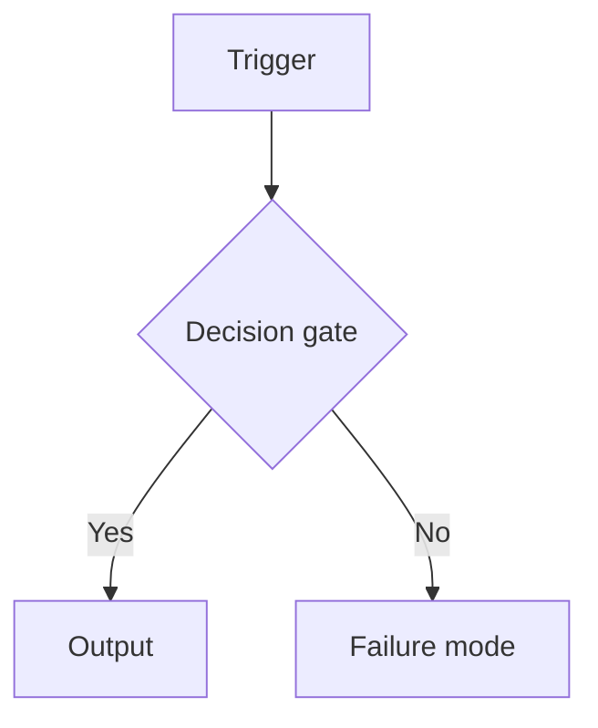
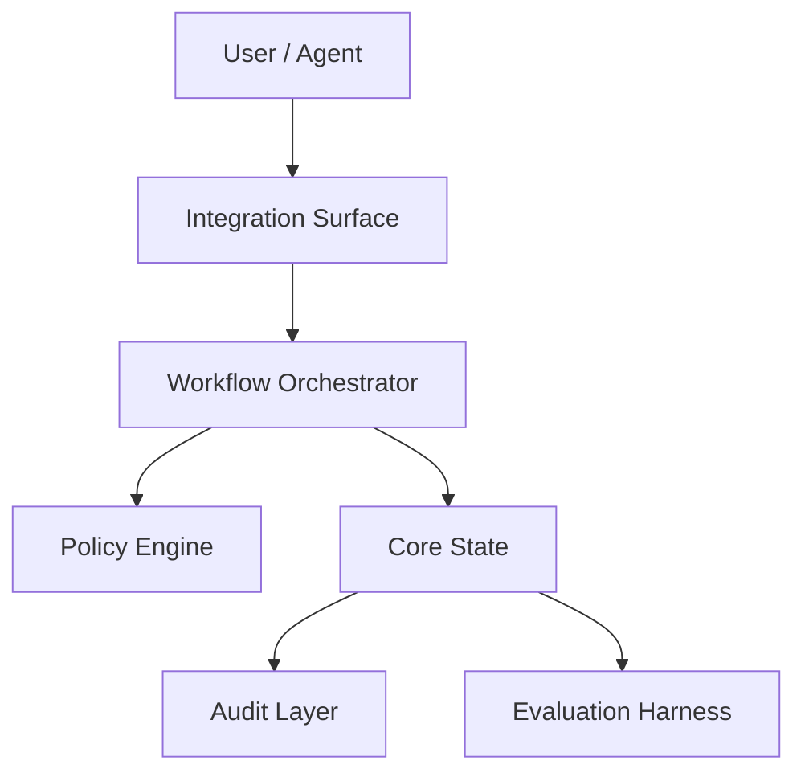

# Product Blueprint: <Project Name>

## Contents

- [1. Executive Product Thesis](#1-executive-product-thesis)
- [2. Source Research Interpretation](#2-source-research-interpretation)
- [3. Target Users and System Actors](#3-target-users-and-system-actors)
- [4. Product Goals and Non-Goals](#4-product-goals-and-non-goals)
- [5. Research-to-Product Translation Map](#5-research-to-product-translation-map)
- [6. Adopt / Adapt / Merge / Defer / Reject Decisions](#6-adopt--adapt--merge--defer--reject-decisions)
- [7. Core Product Capabilities](#7-core-product-capabilities)
- [8. Workflow Model](#8-workflow-model)
- [9. Product Experience Direction](#9-product-experience-direction)
- [10. Logical Architecture](#10-logical-architecture)
- [11. Conceptual Information Model](#11-conceptual-information-model)
- [12. Decision Policies](#12-decision-policies)
- [13. Risk, Governance, and Safety Model](#13-risk-governance-and-safety-model)
- [14. Evaluation Strategy](#14-evaluation-strategy)
- [15. MVP Scope](#15-mvp-scope)
- [16. Roadmap and Future Extensions](#16-roadmap-and-future-extensions)
- [17. Open Questions and Validation Plan](#17-open-questions-and-validation-plan)
- [18. Handoff Notes for Technical Design](#18-handoff-notes-for-technical-design)
- [19. Recommended Next Stages](#19-recommended-next-stages)
- [20. Traceability Appendix](#20-traceability-appendix)
- [Appendix A: Blueprint Quality-Gate Self-Check](#appendix-a-blueprint-quality-gate-self-check)
- [Appendix B: Design Decision Register](#appendix-b-design-decision-register) *(optional)*

> Contents must list **every** numbered section **and every appendix that
> is actually present** (Appendix A is always present; include the
> Appendix B line only when you include that appendix).

> **Cross-phase coherence anchors (mandatory on every staged node).** A
> deterministic guard (`scripts/check_blueprint_coherence.py`) runs between
> compose and the quality-gate to catch **phase inversion** — an MVP-N node
> whose required servicer or precondition is itself staged later, or an MVP
> control gated on a non-blocking open question. Anchoring is **not optional**:
> a blueprint that uses MVP-staging language but carries no anchors now FAILs
> (`missing_coherence_anchors`), and an Open Questions section with no
> `stage=open` anchor FAILs (`unanchored_open_questions`). Tag **every** staged
> workflow gate, servicer row, **consumed-signal producer**, and open question
> with a single-line coherence anchor so the cross-check is exact, not
> fuzzy-text:
>
> `<!-- coherence: id=<anchor> stage=MVP-0|MVP-1|open|future [requires=<id,...>] [consumes=<id,...>] [blocking=yes|no] [qualifier="..."] -->`
>
> Every referenced id must resolve, and each MVP servicer must satisfy
> `stage(servicer) <= stage(node)`. An MVP node may depend on an open question
> only when that question is `blocking=yes` or the dependency carries an
> explicit `qualifier`.
>
> Use two edge types. `requires=` is a **servicer / precondition** edge.
> `consumes=` is a **signal / object** edge: an MVP-N node may only consume a
> signal whose producer is staged `<= N` (else `signal_inversion`), and every
> consumed id must resolve (else `orphan_reference`). Register each §7 capability
> and §11 information object as its own anchor id so that a §12 policy or a §15
> MVP reference to it resolves — a capability minted in §15 but never registered
> in §7, or a policy field with no §11 object, is an orphan reference.

---

## 1. Executive Product Thesis

### 1.1 Product Thesis

<One-sentence thesis. Single-domain template:>

> This product is a `<system type>` for `<target users or systems>` that
> helps them `<primary outcome>` by using `<core research-derived
> mechanisms>`, while controlling `<main risks>`.

<Multi-domain platform template:>

> This product is a `<platform type>` that provides `<outcome A>` for
> `<user group A>` and `<outcome B>` for `<user group B>`, built on
> `<shared research-derived mechanisms>`, while managing `<main risks>`.

<Research-validation template (when central ACADEMIC gaps exist):>

> This product is a `<system type>` for `<target users>` that validates
> `<unresolved research question>` in a production context by implementing
> `<research-derived mechanisms>`, with explicit measurement of
> `<evaluation criteria>` to close the remaining gap.

**Emphasis:** lead with the *primary* research-backed architecture. A
conditional, bounded, or escalation-only mechanism is a supporting
mechanism, not the product identity — do not let it dominate the thesis.

### 1.2 Product Type

<System type — e.g. "local-first service", "governance layer",
"developer toolchain component".>

### 1.3 Primary Outcome

<What the product helps users/systems achieve.>

### 1.4 Main Risks Controlled

<Key risks from the research report's Risk Register or Gap items.>

### 1.5 Research Basis

- **Source report:** `<topic-slug>-research-report.md`
- **Pipeline runs integrated:** `<N or unknown>`
- **Gap-closure rounds:** `<N or unknown>` *(distinct from pipeline runs;
  use "unknown" if the report does not state a round count)*
- **Readiness verdict:** `IMPLEMENTATION_READY` / `HAS_GAPS` / unknown
- **Input quality:** strong / usable / weak

### 1.6 Generation Metadata

> Copy every value from the source report or skill metadata. Do **not**
> infer, normalise, invent, or upgrade a value. If a field is not
> explicitly available, write `unknown`. Never collapse distinct concepts
> (e.g. pipeline runs vs. gap-closure rounds) into one field.

| Field | Value |
|---|---|
| Artifact Type | product_blueprint |
| Topic Slug | `<stable-pipeline-slug>` |
| Project Name | `<Project Name>` |
| Skill Name | blueprint |
| Mode | NOT_APPLICABLE |
| Source report | `<filename>` |
| Source report date | `<date or unknown>` |
| Pipeline runs integrated | `<N or unknown>` |
| Gap-closure rounds | `<N or unknown>` |
| Latest run ID | `<run_id or unknown>` |
| Source readiness verdict | `IMPLEMENTATION_READY` / `HAS_GAPS` / unknown |
| Blueprint skill version | `<copied from manifest.json, or unknown>` |
| Generated at | `<date>` |
| Output detail | concise / standard / detailed |
| Target domain | `<domain>` |

---

## Cross-Skill Artifact Contract

> Conforms to the Cross-Skill Artifact Contract
> (`references/artifact-contract.md`).

### Source Artifacts Consumed

| Artifact Role | Path | Required? | How Used |
|---|---|---:|---|
| research_report | `<filename>` | yes | Findings, gaps, contradictions, risks → product primitives |

### Resolved Input Artifacts

`NOT_APPLICABLE — the blueprint consumes an explicitly supplied research report;
it does not auto-discover sibling artifacts. (Record candidates here if discovery
is added.)`

### Contract Field Map

| Contract Field | Where in this document |
|---|---|
| Generation Metadata | §1.6 |
| Decision Register | §6 Adopt / Adapt / Merge / Defer / Reject Decisions |
| Assumptions | §17 Open Questions and Validation Plan / §9 UX Assumptions for Architecture |
| Open Questions | §17 Open Questions and Validation Plan |
| Recommended Next Stage | §19 Recommended Next Stages |
| Quality-Gate Self-Check | Appendix A (incl. the Cross-Skill Artifact Contract Gate) |

---

## 2. Source Research Interpretation

### 2.1 Source Report Summary

<What was studied, how many papers, main themes.>

### 2.2 Research-Derived Opportunity

<What product opportunity is implied by the findings.>

### 2.3 Strongest Evidence

| Finding | Confidence | Citation |
|---|---|---|
| ... | HIGH 🟢 | [arxiv_id] |

### 2.4 Weak or Unresolved Evidence

<MEDIUM/LOW items and ACADEMIC gaps that affect feasibility.>

### 2.5 Update History *(include only if this is an updated blueprint)*

| Date | Research Report Version | Key Changes |
|---|---|---|
| YYYY-MM-DD | Round 1 | Initial blueprint |

---

## 3. Target Users and System Actors

> List as **Primary** only actors the product **thesis** explicitly serves.
> Tag every actor's scope. High-stakes or adjacent domains the thesis does
> not name (e.g. legal/medical when the thesis targets technical/academic
> docs) are **Secondary** or **Future** — keep them out of the primary
> actor set and the MVP unless the thesis makes them primary. Evidence-only
> examples should not become actors at all.

| Actor | Scope | Role | Needs | Interaction with Product |
|---|---|---|---|---|
| ... | Primary / Secondary / Future / System actor | ... | ... | ... |

---

## 4. Product Goals and Non-Goals

### 4.1 Goals

- ...

### 4.2 Non-Goals

- ...

---

## 5. Research-to-Product Translation Map

| Research Item | Type | Confidence | Product Primitive | Product Relevance | Citation |
|---|---|---|---|---|---|
| ... | ... | ... | ... | ... | [arxiv_id] |

---

## 6. Adopt / Adapt / Merge / Defer / Reject Decisions

| Source Idea | Citation | Decision | Product Translation | Rationale | MVP? |
|---|---|---|---|---|---|
| ... | [arxiv_id] | ADOPT | Capability X | HIGH confidence, central | Yes |

---

## 7. Core Product Capabilities

### Capability 1: <Name>

**Purpose:** ...

**Derived From:** [cite research items and citations]

**Confidence Basis:** HIGH 🟢 / MEDIUM 🟡 / LOW 🔴

**Required for MVP:** Yes/No

**Notes:** ...

---

## 8. Workflow Model

### Workflow 1: <Name>

**Purpose:** ...

**Trigger:** ...

**Actors:** ...

**Inputs:** ...

**Preconditions:** ...

**Decision Gates:**
1. ...

<!-- coherence: id=wf1.gate.contradicts stage=MVP-0 requires=sec9.7.r1 -->

> Anchor every staged gate whose "Yes" branch escalates to a servicer defined
> elsewhere (e.g. the §9.7 human-review row), so the coherence guard can verify
> the servicer is available no later than this gate.

**Steps:**
1. ...

**Outputs:** ...

**Failure Modes:** ...

**Success Criteria:** ...

**Traceability:** [cite research items]



---

## 9. Product Experience Direction

> Capture **UX intent**, not UX design. Blueprint defines the experience
> direction; architecture defines the UX-enabling technical structure; a later
> UX-design skill defines detailed journeys, screens, command/conversation UX,
> and copy. Keep this section compact — 1–2 pages in `standard` output, tables
> over prose. Do **not** include screen layout, wireframes, exact CLI syntax,
> exact MCP/API schemas, copywriting, or implementation tasks (see
> `references/product-experience-direction.md`).

### 9.1 Primary Experience Thesis

The product should feel like `<short description of the intended experience>`.

### 9.2 Primary User / Operator

| User / Actor | Role in Product | Experience Need |
|---|---|---|
| ... | ... | ... |

### 9.3 Primary Job-to-Be-Done

| User / Actor | Job-to-Be-Done | Success Outcome |
|---|---|---|
| ... | ... | ... |

### 9.4 Primary Interaction Mode

> Classify every mode (primary surface / secondary surface / wrapper /
> integration surface / future surface). Disambiguate "AI Skill" (usually a
> wrapper/integration surface around the CLI/core, not a separate runtime) and
> do not conflate it with MCP. See `references/product-experience-direction.md`.

| Mode | Classification | MVP Stage | Rationale |
|---|---|---|---|
| CLI / Web UI / Desktop GUI / TUI / API / AI Skill / MCP / Hybrid | primary surface | MVP-0 / MVP-1 / Future | ... |

### 9.5 Secondary / Future Interaction Modes

| Mode | Classification | Stage | Reason Deferred | Revisit Trigger |
|---|---|---|---|---|
| ... | secondary surface / wrapper / integration surface / future surface | ... | ... | ... |

### 9.6 Critical Trust, Control, and Transparency Requirements

| Requirement | Why It Matters | Architecture Impact |
|---|---|---|
| ... | ... | ... |

### 9.7 Human-in-the-Loop Experience

| Trigger | User Decision | Expected Product Support | MVP Stage |
|---|---|---|---|
| ... | ... | ... | ... |

<!-- coherence: id=sec9.7.r1 stage=MVP-0 -->

> Give each human-review / servicer row a stable anchor and stage so a gate that
> escalates to it can be phase-checked (`stage(servicer) <= stage(gate)`).

### 9.8 Failure and Recovery Expectations

| Condition | User Impact | Expected Recovery Experience |
|---|---|---|
| ... | ... | ... |

### 9.9 UX Assumptions for Architecture

| Assumption | Source | Reversible? | Revisit Trigger |
|---|---|---|---|
| ... | ... | ... | ... |

### 9.10 Product Experience Handoff to Architecture

| UX Decision | Architecture Impact |
|---|---|
| ... | ... |

---

## 10. Logical Architecture

### 10.1 System Context

...

### 10.2 Architecture Overview



### 10.3 Core Logical Components

| Component | Responsibility | Inputs | Outputs | Owns Decisions | Does Not Own |
|---|---|---|---|---|---|
| ... | ... | ... | ... | ... | ... |

### 10.4 Control Flow

```text
...
```

### 10.5 Information Flow

```text
...
```

### 10.6 Trust and Policy Boundaries

...

---

## 11. Conceptual Information Model

| Object | Purpose | Key Conceptual Fields | Lifecycle States | Relationships |
|---|---|---|---|---|
| ... | ... | ... | ... | ... |

---

## 12. Decision Policies

| Policy | Purpose | Inputs | Decision Options | Default | Escalation | Traceability |
|---|---|---|---|---|---|---|
| ... | ... | ... | ... | ... | ... | [arxiv_id] |

---

## 13. Risk, Governance, and Safety Model

| Risk | Likelihood | Impact | Mitigation | Release Gate? | Traceability |
|---|---|---|---|---|---|
| ... | ... | ... | ... | Yes/No | [arxiv_id] |

---

## 14. Evaluation Strategy

| Evaluation | Purpose | Scenario | Expected Behaviour | Success Metric | MVP Required? | Traceability |
|---|---|---|---|---|---|---|
| ... | ... | ... | ... | ... | Yes/No | [arxiv_id] |

---

## 15. MVP Scope

> Split the core value path into **MVP-0** (the smallest end-to-end slice
> that demonstrates the thesis) and **MVP-1** (the first usable production
> version). Keep safety and evaluation baselines separate — they are
> non-negotiable but must not inflate MVP-0. Do not translate research
> completeness into MVP inclusion. If the product has more than 4 major
> capabilities, the MVP-0/MVP-1 split is mandatory; for a genuinely simple
> product MVP-0 and MVP-1 may coincide; say so rather than inventing a split.

### 15.1 MVP-0 — Smallest Demonstrable Core

The minimum end-to-end path that produces one useful outcome from one
realistic input, for one domain.

- ...

### 15.2 MVP-1 — First Usable Version

The first production-hardening layer on top of MVP-0 (richer evaluation,
optional escalation, broader coverage).

- ...

### 15.3 Safety Baseline

Non-negotiable controls required to avoid unsafe, leaking, or misleading
output. Mark which are required already at MVP-0.

- ...

### 15.4 Evaluation Baseline

Minimum checks required to know whether the MVP works (mark which at MVP-0).

- ...

### 15.5 Explicitly Deferred from MVP

| Item | Move To | Reason |
|---|---|---|
| ... | Phase 2 / Phase 3 | ... |

### 15.6 MVP Success Definition

The MVP is successful if ... <specific, pass/fail criteria>.

---

## 16. Roadmap and Future Extensions

### Phase 0: Product Clarification

...

### Phase 1: Core Workflow MVP

...

### Phase 2: Governance and Evaluation Hardening

...

### Phase 3: Expansion

...

### Phase 4: Advanced Research Extensions

...

---

## 17. Open Questions and Validation Plan

| Question | Why It Matters | Validation Method | Blocks MVP? | Gap Source |
|---|---|---|---|---|
| ... | ... | ... | Yes/No | ACADEMIC / ENGINEERING |

<!-- coherence: id=sec17.oq1 stage=open blocking=yes -->

> Anchor each open question with `stage=open` and its `blocking` verdict. An
> MVP node that requires a non-blocking open question (without an explicit
> `qualifier`) is a phase inversion and fails the coherence guard.

---

## 18. Handoff Notes for Technical Design

This document intentionally does not choose a tech stack.

The next technical-design stage must decide:

- Runtime architecture
- Programming language
- Storage system
- Indexing/search strategy
- API style
- Agent integration mechanism
- UI or CLI surface (constrained by the §9 primary interaction mode)
- Deployment model
- Repository structure
- Testing strategy
- Security implementation details
- Migration strategy

### Inputs for Technical Design

- Core workflows (§8)
- Product experience direction + UX handoff (§9)
- Core logical components (§10)
- Conceptual information model (§11)
- Decision policies (§12)
- Risk model (§13)
- MVP boundary (§15)
- Evaluation requirements (§14)
- Open questions (§17)
- Unresolved ACADEMIC gaps: [list any that still apply]

---

## 19. Recommended Next Stages

> The blueprint is the first adaptive stage-gate router after research
> extraction. Recommend which downstream stages should run next using controlled
> decisions (**RUN / SKIP / DEFER / ASK_USER**) with evidence, confidence, and
> revisit triggers. Do **not** silently expand the pipeline — recommendations
> are overrideable defaults. Keep this section compact: one complexity table,
> one recommendation table, one short pipeline, one decision log. See
> `references/adaptive-stage-gate-routing.md`.

### 19.1 Pipeline Complexity Assessment

| Dimension | Score (0–3) | Reason |
|---|---:|---|
| User-facing complexity | ... | ... |
| Technical ambiguity | ... | ... |
| Security / privacy risk | ... | ... |
| AI / LLM uncertainty | ... | ... |
| Integration complexity | ... | ... |
| Human-review complexity | ... | ... |
| Testing / E2E importance | ... | ... |

**Total Score:** ... / 21
**Recommended Workflow Class:** simple (0–3) / lightweight (4–7) / medium (8–12) / complex (13+)

> This complexity score is a **routing heuristic, not a formal project
> estimate**. It guides optional stage selection and should be revisited after
> architecture-design; it does not override human judgement or downstream review.

### 19.2 Stage Recommendations

> `Depends On` names the prerequisite stage/artifact (distinct from `Revisit
> Trigger`, which names the event that re-opens a DEFER).

| Stage | Decision | Depends On | Confidence | Reason | Blocks Next Step? | Revisit Trigger |
|---|---|---|---:|---|---|---|
| architecture-design | RUN | blueprint | High | ... | Yes | Always after blueprint |
| tech-stack-selection | RUN / SKIP / DEFER / ASK_USER | architecture-design | ... | ... | ... | ... |
| ux-design | RUN / SKIP / DEFER / ASK_USER | architecture-design | ... | ... | ... | ... |
| security-review | RUN / SKIP / DEFER / ASK_USER | architecture-design | ... | ... | ... | ... |
| test-design | RUN / SKIP / DEFER / ASK_USER | ux-design or implementation-plan | ... | ... | ... | ... |
| architecture-update | DEFER | architecture-design + a changed downstream decision | High | No architecture exists yet; revisit after tech-stack / UX / security changes | No | After architecture-design |
| architecture-reconciliation | DEFER | architecture-design + a conflict report | High | Only needed if downstream design conflicts with architecture | No | When a conflict is detected |

### 19.3 ASK_USER Decision Rationale

> If any stage is ASK_USER, name the missing input for each. If none is, justify
> why (each high-impact unknown is already answered by the source report / §9,
> deferred to architecture-design, or delegated to security-review — name the
> owner). Do not silently assume a high-impact unknown.

No ASK_USER decisions were emitted because all high-impact unknowns are either:
- already defined in the source research report or §9 Product Experience Direction;
- deferred to architecture-design, where states / contracts / data flow are defined;
- delegated to security-review, where data-egress and trust-boundary questions are validated.

If `<data sensitivity / deployment environment / egress policy>` remains unclear
after architecture-design, the next stage should emit ASK_USER.

### 19.4 Recommended Pipeline

#### Recommended Linear Path

```text
research-pipeline
  -> blueprint
  -> architecture-design
  -> ...
  -> implementation-plan
```

#### Conditional Follow-up Gates

| Gate | Run When | Typical Input | Output |
|---|---|---|---|
| architecture-update | tech-stack-selection or security-review changes runtime / data-flow assumptions | architecture + changed decisions | patched architecture |
| architecture-reconciliation | UX / test / security conflicts with architecture states / contracts | architecture + conflict report | reconciliation recommendations or patched architecture |

### 19.5 Stage-Gate Decision Log

| Decision | Evidence | Risk if Wrong | Revisit Trigger |
|---|---|---|---|
| ... | ... | ... | ... |

---

## 20. Traceability Appendix

| Product Element | Derived From | Research Citation | Decision | Notes |
|---|---|---|---|---|
| ... | ... | [arxiv_id] | ADOPT | ... |

---

## Appendix A: Blueprint Quality-Gate Self-Check

> Compact self-assessment so residual warnings are visible and actionable,
> not hidden. Mark each gate `PASS` / `WARNING` / `FAIL`. Any `FAIL` must be
> fixed before delivery; every `WARNING` carries a concrete required action
> and a yes/no "blocks technical design?" verdict — never a passive note.

| Gate | Status | Finding | Required Action | Blocks Technical Design? |
|---|---|---|---|---|
| Required sections + Contents present | PASS / WARNING / FAIL | ... | ... | Yes/No |
| Metadata integrity (no invented values) | PASS / WARNING / FAIL | ... | ... | Yes/No |
| Thesis emphasis (primary architecture) | PASS / WARNING / FAIL | ... | ... | Yes/No |
| Research traceability / source fidelity | PASS / WARNING / FAIL | ... | ... | Yes/No |
| Scope control (primary scope matches thesis) | PASS / WARNING / FAIL | ... | ... | Yes/No |
| MVP discipline (MVP-0 vs MVP-1 vs baselines) | PASS / WARNING / FAIL | ... | ... | Yes/No |
| Release-gate confidence consistency | PASS / WARNING / FAIL | ... | ... | Yes/No |
| Implementation neutrality | PASS / WARNING / FAIL | ... | ... | Yes/No |
| Risk honesty | PASS / WARNING / FAIL | ... | ... | Yes/No |
| Evaluation coverage | PASS / WARNING / FAIL | ... | ... | Yes/No |
| Downstream usefulness | PASS / WARNING / FAIL | ... | ... | Yes/No |
| Cross-phase coherence (deterministic guard) | PASS / WARNING / FAIL | scripts/check_blueprint_coherence.py — no phase inversion | ... | Yes/No |

**Product Experience Gate** (§9) — see
`references/product-experience-direction.md` for fail/warning conditions. Here
"Blocks Technical Design?" is the same as "Blocks Architecture?".

| Gate | Status | Finding | Required Action | Blocks Technical Design? |
|---|---|---|---|---|
| Primary user identified | PASS / WARNING / FAIL | ... | ... | Yes/No |
| Primary job-to-be-done defined | PASS / WARNING / FAIL | ... | ... | Yes/No |
| Primary experience thesis defined | PASS / WARNING / FAIL | ... | ... | Yes/No |
| Primary interaction mode selected | PASS / WARNING / FAIL | ... | ... | Yes/No |
| Interaction modes classified | PASS / WARNING / FAIL | ... | ... | Yes/No |
| Trust / control / transparency needs defined | PASS / WARNING / FAIL | ... | ... | Yes/No |
| Human-in-the-loop experience defined where needed | PASS / WARNING / FAIL | ... | ... | Yes/No |
| Failure / recovery expectations defined | PASS / WARNING / FAIL | ... | ... | Yes/No |
| UX assumptions handed off to architecture | PASS / WARNING / FAIL | ... | ... | Yes/No |

**Adaptive Stage-Gate Recommendation Gate** (§19) — see
`references/adaptive-stage-gate-routing.md` for fail/warning conditions. Here
"Blocks Technical Design?" means "blocks the recommended next stage".

| Gate | Status | Finding | Required Action | Blocks Technical Design? |
|---|---|---|---|---|
| Recommended Next Stages section exists | PASS / WARNING / FAIL | ... | ... | Yes/No |
| Controlled decision values used (RUN / SKIP / DEFER / ASK_USER) | PASS / WARNING / FAIL | ... | ... | Yes/No |
| RUN decisions have evidence | PASS / WARNING / FAIL | ... | ... | Yes/No |
| SKIP decisions have reason | PASS / WARNING / FAIL | ... | ... | Yes/No |
| DEFER decisions have revisit trigger | PASS / WARNING / FAIL | ... | ... | Yes/No |
| ASK_USER decisions identify missing info | PASS / WARNING / FAIL | ... | ... | Yes/No |
| Product Experience Direction informs recommendations | PASS / WARNING / FAIL | ... | ... | Yes/No |
| Stage table has Depends On | PASS / WARNING / FAIL | ... | ... | Yes/No |
| Linear-path vs conditional-gates split | PASS / WARNING / FAIL | ... | ... | Yes/No |
| ASK_USER absence explained | PASS / WARNING / FAIL | ... | ... | Yes/No |
| Complexity score labelled heuristic | PASS / WARNING / FAIL | ... | ... | Yes/No |

Apply any **safe wording rewrite** a `WARNING` identifies *before* delivery,
then re-run the self-check so this table reflects the post-repair document.
A `WARNING` should remain only when it needs human or downstream technical
judgement.

### Cross-Skill Artifact Contract Gate

| Gate | Status | Finding | Required Action |
|---|---|---|---|
| Generation metadata present (Artifact Type + Topic Slug) | PASS / WARNING / FAIL | <finding> | <action> |
| Topic slug present and stable | PASS / WARNING / FAIL | <finding> | <action> |
| Source artifacts listed | PASS / WARNING / FAIL | §1.6 / Source Artifacts Consumed | <action> |
| Resolved input artifacts recorded (when discovery is used) | PASS / WARNING / FAIL / NOT_APPLICABLE | blueprint consumes a supplied report | <action> |
| Decisions and assumptions separated | PASS / WARNING / FAIL | §6 decisions vs §17 open questions | <action> |
| Open questions assigned to a next stage | PASS / WARNING / FAIL | §17 / §19 | <action> |
| Recommended next stage present | PASS / WARNING / FAIL | §19 Recommended Next Stages | <action> |

> See `references/artifact-contract.md`.

---

## Appendix B: Design Decision Register *(optional — include only for technical-architecture handoff)*

> Optional. Add this only when handing off to technical architecture and the
> blueprint is detailed enough to warrant it. Do **not** duplicate the §6
> Adopt/Adapt/Merge/Defer/Reject table — list only decisions that materially
> affect downstream architecture, and add the **reversibility** and
> **revisit-trigger** view that §6 lacks. If included, add it to Contents.

| Decision | Type | Rationale | Evidence | Reversible? | Revisit Trigger |
|---|---|---|---|---|---|
| ... | Research-backed / Scope / MVP-staging / Safety / Evaluation / Deferred-technical | ... | [arxiv_id] / [Source Report: Research Gaps — <name>] | Yes/No | ... |
