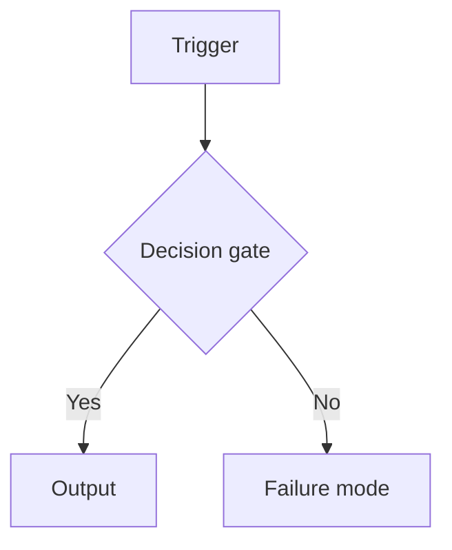
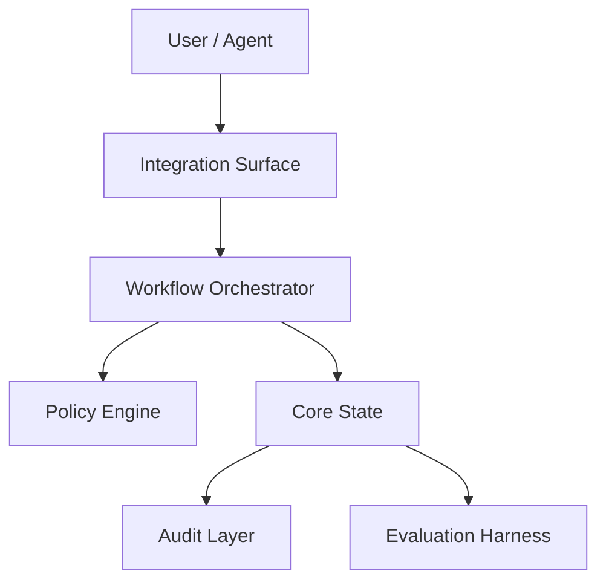

# Product Blueprint: <Project Name>

## Contents

- [1. Executive Product Thesis](#1-executive-product-thesis)
- [2. Source Research Interpretation](#2-source-research-interpretation)
- [3. Target Users and System Actors](#3-target-users-and-system-actors)
- [4. Product Goals and Non-Goals](#4-product-goals-and-non-goals)
- [5. Research-to-Product Translation Map](#5-research-to-product-translation-map)
- [6. Adopt / Adapt / Merge / Defer / Reject Decisions](#6-adopt--adapt--merge--defer--reject-decisions)
- [7. Core Product Capabilities](#7-core-product-capabilities)
- [8. Workflow Model](#8-workflow-model)
- [9. Logical Architecture](#9-logical-architecture)
- [10. Conceptual Information Model](#10-conceptual-information-model)
- [11. Decision Policies](#11-decision-policies)
- [12. Risk, Governance, and Safety Model](#12-risk-governance-and-safety-model)
- [13. Evaluation Strategy](#13-evaluation-strategy)
- [14. MVP Scope](#14-mvp-scope)
- [15. Roadmap and Future Extensions](#15-roadmap-and-future-extensions)
- [16. Open Questions and Validation Plan](#16-open-questions-and-validation-plan)
- [17. Handoff Notes for Technical Design](#17-handoff-notes-for-technical-design)
- [18. Traceability Appendix](#18-traceability-appendix)

---

## 1. Executive Product Thesis

### 1.1 Product Thesis

<One-sentence thesis. Single-domain template:>

> This product is a `<system type>` for `<target users or systems>` that
> helps them `<primary outcome>` by using `<core research-derived
> mechanisms>`, while controlling `<main risks>`.

<Multi-domain platform template:>

> This product is a `<platform type>` that provides `<outcome A>` for
> `<user group A>` and `<outcome B>` for `<user group B>`, built on
> `<shared research-derived mechanisms>`, while managing `<main risks>`.

<Research-validation template (when central ACADEMIC gaps exist):>

> This product is a `<system type>` for `<target users>` that validates
> `<unresolved research question>` in a production context by implementing
> `<research-derived mechanisms>`, with explicit measurement of
> `<evaluation criteria>` to close the remaining gap.

### 1.2 Product Type

<System type — e.g. "local-first service", "governance layer",
"developer toolchain component".>

### 1.3 Primary Outcome

<What the product helps users/systems achieve.>

### 1.4 Main Risks Controlled

<Key risks from the research report's Risk Register or Gap items.>

### 1.5 Research Basis

- **Source report:** `<topic-slug>-research-report.md`
- **Pipeline runs integrated:** `<N or unknown>`
- **Gap-closure rounds:** `<N or unknown>` *(distinct from pipeline runs;
  use "unknown" if the report does not state a round count)*
- **Readiness verdict:** `IMPLEMENTATION_READY` / `HAS_GAPS` / unknown
- **Input quality:** strong / usable / weak

### 1.6 Generation Metadata

> Copy every value from the source report or skill metadata. Do **not**
> infer, normalise, invent, or upgrade a value. If a field is not
> explicitly available, write `unknown`. Never collapse distinct concepts
> (e.g. pipeline runs vs. gap-closure rounds) into one field.

| Field | Value |
|---|---|
| Source report | `<filename>` |
| Source report date | `<date or unknown>` |
| Pipeline runs integrated | `<N or unknown>` |
| Gap-closure rounds | `<N or unknown>` |
| Latest run ID | `<run_id or unknown>` |
| Source readiness verdict | `IMPLEMENTATION_READY` / `HAS_GAPS` / unknown |
| Blueprint skill version | `<copied from manifest.json, or unknown>` |
| Generated at | `<date>` |
| Output detail | concise / standard / detailed |
| Target domain | `<domain>` |

---

## 2. Source Research Interpretation

### 2.1 Source Report Summary

<What was studied, how many papers, main themes.>

### 2.2 Research-Derived Opportunity

<What product opportunity is implied by the findings.>

### 2.3 Strongest Evidence

| Finding | Confidence | Citation |
|---|---|---|
| ... | HIGH 🟢 | [arxiv_id] |

### 2.4 Weak or Unresolved Evidence

<MEDIUM/LOW items and ACADEMIC gaps that affect feasibility.>

### 2.5 Update History *(include only if this is an updated blueprint)*

| Date | Research Report Version | Key Changes |
|---|---|---|
| YYYY-MM-DD | Round 1 | Initial blueprint |

---

## 3. Target Users and System Actors

> List as **Primary** only actors the product **thesis** explicitly serves.
> Tag every actor's scope. High-stakes or adjacent domains the thesis does
> not name (e.g. legal/medical when the thesis targets technical/academic
> docs) are **Secondary** or **Future** — keep them out of the primary
> actor set and the MVP unless the thesis makes them primary. Evidence-only
> examples should not become actors at all.

| Actor | Scope | Role | Needs | Interaction with Product |
|---|---|---|---|---|
| ... | Primary / Secondary / Future / System actor | ... | ... | ... |

---

## 4. Product Goals and Non-Goals

### 4.1 Goals

- ...

### 4.2 Non-Goals

- ...

---

## 5. Research-to-Product Translation Map

| Research Item | Type | Confidence | Product Primitive | Product Relevance | Citation |
|---|---|---|---|---|---|
| ... | ... | ... | ... | ... | [arxiv_id] |

---

## 6. Adopt / Adapt / Merge / Defer / Reject Decisions

| Source Idea | Citation | Decision | Product Translation | Rationale | MVP? |
|---|---|---|---|---|---|
| ... | [arxiv_id] | ADOPT | Capability X | HIGH confidence, central | Yes |

---

## 7. Core Product Capabilities

### Capability 1: <Name>

**Purpose:** ...

**Derived From:** [cite research items and citations]

**Confidence Basis:** HIGH 🟢 / MEDIUM 🟡 / LOW 🔴

**Required for MVP:** Yes/No

**Notes:** ...

---

## 8. Workflow Model

### Workflow 1: <Name>

**Purpose:** ...

**Trigger:** ...

**Actors:** ...

**Inputs:** ...

**Preconditions:** ...

**Decision Gates:**
1. ...

**Steps:**
1. ...

**Outputs:** ...

**Failure Modes:** ...

**Success Criteria:** ...

**Traceability:** [cite research items]



---

## 9. Logical Architecture

### 9.1 System Context

...

### 9.2 Architecture Overview



### 9.3 Core Logical Components

| Component | Responsibility | Inputs | Outputs | Owns Decisions | Does Not Own |
|---|---|---|---|---|---|
| ... | ... | ... | ... | ... | ... |

### 9.4 Control Flow

```text
...
```

### 9.5 Information Flow

```text
...
```

### 9.6 Trust and Policy Boundaries

...

---

## 10. Conceptual Information Model

| Object | Purpose | Key Conceptual Fields | Lifecycle States | Relationships |
|---|---|---|---|---|
| ... | ... | ... | ... | ... |

---

## 11. Decision Policies

| Policy | Purpose | Inputs | Decision Options | Default | Escalation | Traceability |
|---|---|---|---|---|---|---|
| ... | ... | ... | ... | ... | ... | [arxiv_id] |

---

## 12. Risk, Governance, and Safety Model

| Risk | Likelihood | Impact | Mitigation | Release Gate? | Traceability |
|---|---|---|---|---|---|
| ... | ... | ... | ... | Yes/No | [arxiv_id] |

---

## 13. Evaluation Strategy

| Evaluation | Purpose | Scenario | Expected Behaviour | Success Metric | MVP Required? | Traceability |
|---|---|---|---|---|---|---|
| ... | ... | ... | ... | ... | Yes/No | [arxiv_id] |

---

## 14. MVP Scope

> Separate the **core value path** (what proves the thesis) from the
> **safety** and **evaluation** baselines (what makes it shippable and
> measurable). Do not translate research completeness into MVP inclusion —
> move anything not required for one useful end-to-end outcome, or for its
> safety/evaluation, to §15. Safety and evaluation baselines are not
> "extra" capabilities; count and justify them separately from the core
> path so the core path stays minimal.

### 14.1 Core Value Path

Items required to produce one useful end-to-end product outcome.

- ...

### 14.2 Safety Baseline

Non-negotiable controls required to avoid unsafe, leaking, or misleading
output.

- ...

### 14.3 Evaluation Baseline

Minimum checks required to know whether the MVP works.

- ...

### 14.4 Explicitly Deferred from MVP

Valuable items intentionally excluded from MVP, each pointing to its §15
phase.

- ...

### 14.5 MVP Success Definition

The MVP is successful if ... <specific, pass/fail criteria>.

---

## 15. Roadmap and Future Extensions

### Phase 0: Product Clarification

...

### Phase 1: Core Workflow MVP

...

### Phase 2: Governance and Evaluation Hardening

...

### Phase 3: Expansion

...

### Phase 4: Advanced Research Extensions

...

---

## 16. Open Questions and Validation Plan

| Question | Why It Matters | Validation Method | Blocks MVP? | Gap Source |
|---|---|---|---|---|
| ... | ... | ... | Yes/No | ACADEMIC / ENGINEERING |

---

## 17. Handoff Notes for Technical Design

This document intentionally does not choose a tech stack.

The next technical-design stage must decide:

- Runtime architecture
- Programming language
- Storage system
- Indexing/search strategy
- API style
- Agent integration mechanism
- UI or CLI surface
- Deployment model
- Repository structure
- Testing strategy
- Security implementation details
- Migration strategy

### Inputs for Technical Design

- Core workflows (§8)
- Core logical components (§9)
- Conceptual information model (§10)
- Decision policies (§11)
- Risk model (§12)
- MVP boundary (§14)
- Evaluation requirements (§13)
- Open questions (§16)
- Unresolved ACADEMIC gaps: [list any that still apply]

---

## 18. Traceability Appendix

| Product Element | Derived From | Research Citation | Decision | Notes |
|---|---|---|---|---|
| ... | ... | [arxiv_id] | ADOPT | ... |

---

## Appendix A: Blueprint Quality-Gate Self-Check

> Compact self-assessment so residual warnings are visible to the reader,
> not hidden. Mark each gate `PASS` / `WARNING` / `FAIL`. Any `FAIL` must
> be fixed before delivery; surface every `WARNING` here with a one-line
> note rather than silently passing.

| Gate | Status | Notes |
|---|---|---|
| Required sections + Contents present | PASS / WARNING / FAIL | ... |
| Metadata integrity (no invented values) | PASS / WARNING / FAIL | ... |
| Research traceability / source fidelity | PASS / WARNING / FAIL | ... |
| Scope control (primary scope matches thesis) | PASS / WARNING / FAIL | ... |
| MVP discipline (core path vs. baselines) | PASS / WARNING / FAIL | ... |
| Implementation neutrality | PASS / WARNING / FAIL | ... |
| Risk honesty | PASS / WARNING / FAIL | ... |
| Evaluation coverage | PASS / WARNING / FAIL | ... |
| Downstream usefulness | PASS / WARNING / FAIL | ... |
