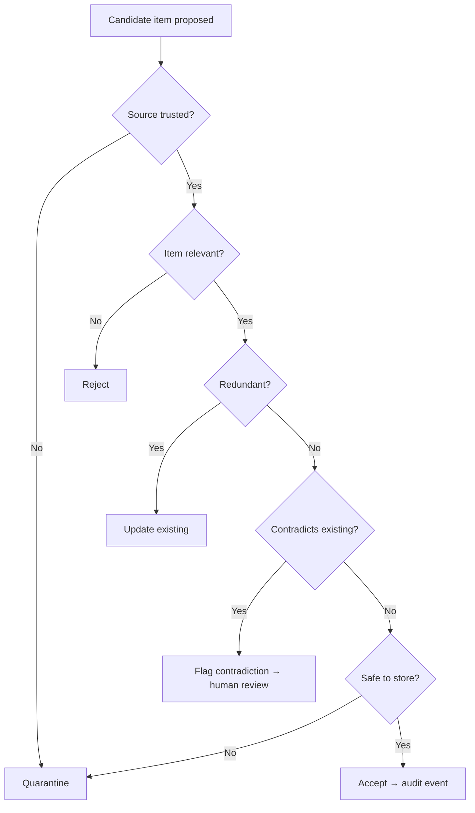

# Workflow Template (§8)

Each major workflow must include every field below. The main end-to-end
workflow needs a Mermaid diagram; add diagrams to other workflows only
when they are complex, safety-critical, or high-risk.

```markdown
### Workflow: <Name>

**Purpose:**
<What decision or transformation this workflow performs.>

**Trigger:**
<The clear event that starts it.>

**Actors:**
<Users, agents, or automated processes involved.>

**Inputs:**
- ...

**Preconditions:**
- ...

**Decision Gates:**
1. <First yes/no decision>
2. <Second decision>

**Steps:**
1. ...
2. ...

**Outputs:**
<Every terminal output — accepted, rejected, quarantined, audit event…>

**Failure Modes:**
- ...

**Success Criteria:**
- ...

**Related Capabilities:**
- ...

**Traceability:**
[cite research items as [arxiv_id] or [Author, Year]]
```

## Example (admission workflow)



## Design rules

1. Start from a clear trigger; end with an explicit output.
2. Decision gates must be visible.
3. Human-review points must be explicit when risk exists.
4. Name the failure modes.
5. Do not assume a particular implementation technology.
6. The workflow must be usable by a downstream implementation-planning
   agent.

## Common workflow categories (include only the relevant ones)

Intake / ingestion · classification · admission / approval · retrieval /
read · update / consolidation · conflict-resolution · forgetting /
deletion · sharing / promotion · evaluation · audit / recovery · human
review · agent integration · migration.
