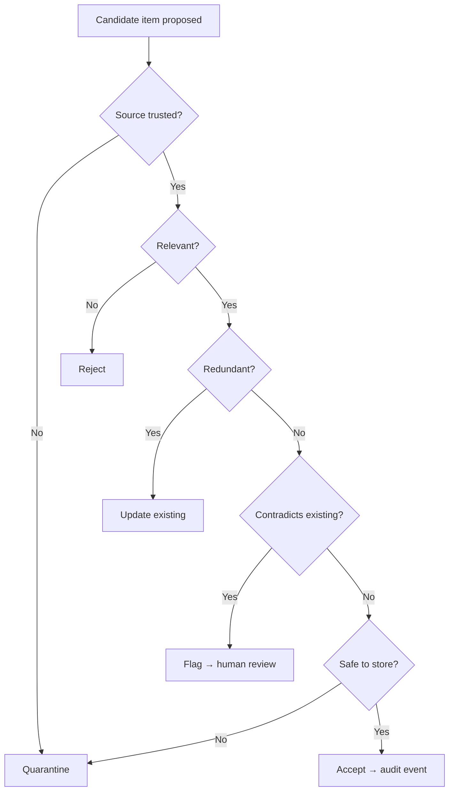
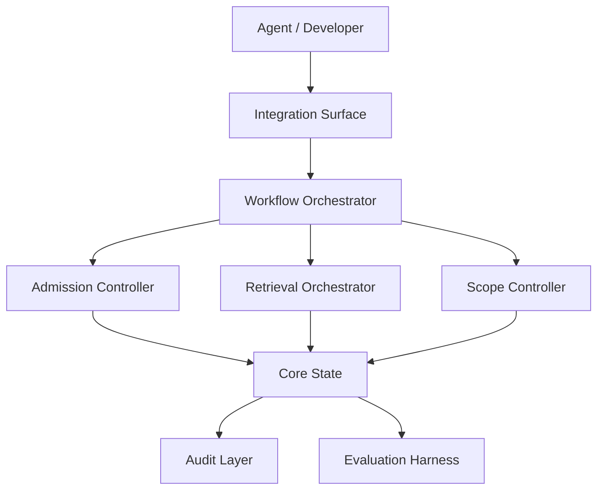

# Product Blueprint: Agent Memory Service

> Illustrative example generated from `sample_inputs/strong_report_excerpt.md`.
> Implementation-neutral by design. Citations are fictional, matching the
> sample report.

## Contents

- [1. Executive Product Thesis](#1-executive-product-thesis)
- [2. Source Research Interpretation](#2-source-research-interpretation)
- [3. Target Users and System Actors](#3-target-users-and-system-actors)
- [4. Product Goals and Non-Goals](#4-product-goals-and-non-goals)
- [5. Research-to-Product Translation Map](#5-research-to-product-translation-map)
- [6. Adopt / Adapt / Merge / Defer / Reject Decisions](#6-adopt--adapt--merge--defer--reject-decisions)
- [7. Core Product Capabilities](#7-core-product-capabilities)
- [8. Workflow Model](#8-workflow-model)
- [9. Product Experience Direction](#9-product-experience-direction)
- [10. Logical Architecture](#10-logical-architecture)
- [11. Conceptual Information Model](#11-conceptual-information-model)
- [12. Decision Policies](#12-decision-policies)
- [13. Risk, Governance, and Safety Model](#13-risk-governance-and-safety-model)
- [14. Evaluation Strategy](#14-evaluation-strategy)
- [15. MVP Scope](#15-mvp-scope)
- [16. Roadmap and Future Extensions](#16-roadmap-and-future-extensions)
- [17. Open Questions and Validation Plan](#17-open-questions-and-validation-plan)
- [18. Handoff Notes for Technical Design](#18-handoff-notes-for-technical-design)
- [19. Recommended Next Stages](#19-recommended-next-stages)
- [20. Traceability Appendix](#20-traceability-appendix)
- [Appendix A: Blueprint Quality-Gate Self-Check](#appendix-a-blueprint-quality-gate-self-check)

---

## 1. Executive Product Thesis

### 1.1 Product Thesis

> This product is a local-first memory service for AI coding agents that
> helps them retain and reuse trustworthy cross-session knowledge by using
> evaluator-gated admission, scoped records, and hybrid retrieval, while
> controlling memory poisoning, leakage across scopes, and unverifiable
> deletion.

### 1.2 Product Type

Local-first service with an agent-facing integration surface.

### 1.3 Primary Outcome

Agents recall relevant prior context without re-deriving it, and only
trustworthy knowledge becomes durable.

### 1.4 Main Risks Controlled

Memory poisoning, cross-scope leakage, low-value accumulation, and
deletion that cannot be verified.

### 1.5 Research Basis

- **Source report:** `agent-memory-research-report.md`
- **Pipeline runs integrated:** 1
- **Gap-closure rounds:** 2
- **Readiness verdict:** `HAS_GAPS`
- **Input quality:** strong

### 1.6 Generation Metadata

| Field | Value |
|---|---|
| Source report | `agent-memory-research-report.md` |
| Source report date | unknown |
| Pipeline runs integrated | 1 |
| Gap-closure rounds | 2 |
| Latest run ID | unknown |
| Source readiness verdict | `HAS_GAPS` |
| Blueprint skill version | 0.6.0 |
| Generated at | `<date>` |
| Output detail | standard |
| Target domain | AI coding-agent memory |

---

## 2. Source Research Interpretation

### 2.1 Source Report Summary

8 retained papers on agent memory across admission, retrieval, scoping,
and forgetting; two reviewer passes; converged after 2 rounds with 2 gaps
remaining.

### 2.2 Research-Derived Opportunity

A governed memory layer that admits, scopes, retrieves, and forgets agent
knowledge — the gated-write + scoping + hybrid-retrieval combination is the
defensible core.

### 2.3 Strongest Evidence

| Finding | Confidence | Citation |
|---|---|---|
| Evaluator-gated writes cut low-value memory | HIGH 🟢 | [2312.01234] |
| Hybrid BM25 + dense retrieval beats either alone | HIGH 🟢 | [Park et al., 2023] |
| Scoped memory limits leakage | HIGH 🟢 | [2401.05678] |

### 2.4 Weak or Unresolved Evidence

- 🟡 Hierarchical retrieval at scale [2401.05679].
- 🟡 Selective forgetting risks losing useful records [2402.01234].
- 🔴/ACADEMIC Optimal consolidation frequency — no consensus [2403.09999].

---

## 3. Target Users and System Actors

| Actor | Scope | Role | Needs | Interaction with Product |
|---|---|---|---|---|
| AI coding agent | Primary | Primary consumer | Read/write durable context | Proposes writes; issues retrieval queries |
| Developer | Primary | Owner/operator | Control, audit, correct memory | Reviews flagged items; deletes records |
| Admission Evaluator | System actor | Judge candidate writes | Gates every write | — |
| Audit Layer | System actor | Record decisions | Receives every admission/deletion event | — |

---

## 4. Product Goals and Non-Goals

### 4.1 Goals

- Admit only trustworthy, useful knowledge [2312.01234].
- Retrieve relevant records via hybrid search [Park et al., 2023].
- Keep records scoped and require explicit promotion [2401.05678].
- Make every admission and deletion auditable and verifiable (ENGINEERING gap).

### 4.2 Non-Goals

- Automatic consolidation scheduling (ACADEMIC gap — validate first).
- Hardware acceleration of embeddings (OUT_OF_SCOPE).
- Choosing storage/retrieval technology (technical-design skill).

---

## 5. Research-to-Product Translation Map

| Research Item | Type | Confidence | Product Primitive | Product Relevance | Citation |
|---|---|---|---|---|---|
| Evaluator-gated writes | mechanism | HIGH 🟢 | Memory Admission Workflow | critical | [2312.01234] |
| Hybrid retrieval | mechanism | HIGH 🟢 | Hybrid Retrieval Capability | critical | [Park et al., 2023] |
| Scoped memory + promotion | architecture_hint | HIGH 🟢 | Scoped Sharing & Promotion Model | critical | [2401.05678] |
| Memory taxonomy | taxonomy | HIGH 🟢 | Conceptual Information Model | useful | [2310.05338] |
| Deletion verification | engineering_gap | n/a | Deletion & Forgetting Verification | critical | (ENGINEERING) |
| Selective forgetting | mechanism | MEDIUM 🟡 | Forgetting Policy | useful | [2402.01234] |
| Consolidation frequency | academic_gap | LOW 🔴 | Validation requirement | optional | [2403.09999] |

---

## 6. Adopt / Adapt / Merge / Defer / Reject Decisions

| Source Idea | Citation | Decision | Product Translation | Rationale | MVP? |
|---|---|---|---|---|---|
| Evaluator-gated writes | [2312.01234] | ADOPT | Memory Admission Workflow | HIGH, central, safety-critical | Yes |
| Hybrid retrieval | [Park et al., 2023] | ADOPT | Hybrid Retrieval Capability | HIGH, core value path | Yes |
| Scoped memory + promotion | [2401.05678] | ADOPT | Scoped Sharing & Promotion | HIGH, controls leakage | Yes |
| Deletion verification | (ENGINEERING) | ADAPT | Deletion & Forgetting Verification | Safety-relevant gap, productionize | Yes |
| Hierarchical retrieval | [2401.05679] | DEFER | Future scaling extension | MEDIUM, only at large scale | No |
| Selective forgetting | [2402.01234] | ADAPT | Forgetting Policy (manual-first) | MEDIUM, risk of losing records | No |
| Auto consolidation | [2403.09999] | DEFER / VALIDATE | Open question + evaluation | ACADEMIC, no consensus | No |

---

## 7. Core Product Capabilities

### Capability 1: Memory Admission

**Purpose:** Decide whether a candidate write becomes durable state.
**Derived From:** Evaluator-gated writes [2312.01234].
**Confidence Basis:** HIGH 🟢. **Required for MVP:** Yes.

### Capability 2: Hybrid Retrieval

**Purpose:** Return relevant records by combining keyword and semantic
similarity. **Derived From:** [Park et al., 2023]. **Confidence Basis:**
HIGH 🟢. **Required for MVP:** Yes.

### Capability 3: Scoped Sharing & Promotion

**Purpose:** Keep records scoped (local/project/team) and require explicit
promotion. **Derived From:** [2401.05678]. **Confidence Basis:** HIGH 🟢.
**Required for MVP:** Yes.

### Capability 4: Deletion & Forgetting Verification

**Purpose:** Provide auditable, verifiable deletion. **Derived From:**
ENGINEERING gap. **Confidence Basis:** Design + engineering gap.
**Required for MVP:** Yes (safety baseline).

---

## 8. Workflow Model

### Workflow 1: Candidate Memory Admission

**Purpose:** Gate every write into durable state.
**Trigger:** An agent or process proposes a knowledge item.
**Actors:** Agent, Admission Evaluator, Audit Layer.
**Inputs:** Candidate item, source context, target scope, related records,
confidence signal.
**Preconditions:** Caller authenticated to a scope.
**Decision Gates:** source trusted? · relevant? · redundant? · contradicts
existing? · safe to store?
**Steps:** evaluate → classify → admit/update/quarantine/reject → emit
audit event.
**Outputs:** accepted record · updated record · rejected proposal ·
quarantined item · audit event.
**Failure Modes:** low-value stored · poisoned item stored · useful item
rejected · contradiction ignored · no audit trail.
**Success Criteria:** useful retained · harmful/low-value blocked ·
contradictions visible · decisions traceable.
**Traceability:** [2312.01234], [2401.05678].



### Workflow 2: Retrieval

**Trigger:** Agent issues a context query. **Inputs:** query, active scope.
**Decision gates:** scope filter → hybrid rank → freshness check.
**Outputs:** ranked records or empty result. **Failure modes:** stale or
out-of-scope records surfaced. **Success criteria:** relevant in-scope
records ranked first. **Traceability:** [Park et al., 2023], [2401.05678].

### Workflow 3: Verified Deletion

**Trigger:** Developer requests deletion. **Decision gates:** authorize →
delete → verify absence → audit. **Outputs:** tombstone + verification +
audit event. **Failure modes:** record resurfaces after deletion.
**Success criteria:** deleted records never retrieved again.
**Traceability:** ENGINEERING gap.

---

## 9. Product Experience Direction

> UX intent only — no screen layout, wireframes, exact command syntax, or
> copy. Defines the experience direction so architecture can derive surfaces,
> states, and review flows.

### 9.1 Primary Experience Thesis

The product should feel like a trustworthy, local-first memory keeper:
automated admission by default, conservative when a write is risky, and
transparent about what was stored, why, and what can be deleted.

### 9.2 Primary User / Operator

| User / Actor | Role in Product | Experience Need |
|---|---|---|
| AI coding agent | Reads/writes durable context | Stable read/write contract; predictable retrieval |
| Developer | Owns and audits memory | Visibility into what was admitted/rejected; control over deletion |

### 9.3 Primary Job-to-Be-Done

| User / Actor | Job-to-Be-Done | Success Outcome |
|---|---|---|
| AI coding agent | Reuse trustworthy prior context across sessions | Relevant in-scope records returned; no poisoned writes admitted |

### 9.4 Primary Interaction Mode

| Mode | Classification | MVP Stage | Rationale |
|---|---|---|---|
| API / agent-facing surface | primary surface | MVP-0 | Primary consumer is an agent; the value path is programmatic read/write. Not an MCP tool surface (no external AI client at MVP) and not an AI-skill wrapper — it is the product's own runtime interface |

### 9.5 Secondary / Future Interaction Modes

| Mode | Classification | Stage | Reason Deferred | Revisit Trigger |
|---|---|---|---|---|
| CLI for developer audit | secondary surface | MVP-1 | Not needed to prove the agent value path | Developers need to inspect/correct memory |
| Web UI | future surface | Future | No human-facing review at MVP | Non-technical reviewers need direct access |

### 9.6 Critical Trust, Control, and Transparency Requirements

| Requirement | Why It Matters | Architecture Impact |
|---|---|---|
| Developer can see why a write was admitted/rejected | Prevents blind trust in agent memory | Requires admission-decision record + rationale |
| Deletion must be verifiable | Trust and correctness | Requires tombstone + post-delete verification surface |
| Scope of every record is visible | Prevents cross-scope leakage | Requires scope field exposed on retrieval results |

### 9.7 Human-in-the-Loop Experience

| Trigger | User Decision | Expected Product Support | MVP Stage |
|---|---|---|---|
| Admission flags a contradiction | Accept, reject, or reconcile | Surface the conflicting records + rationale for review | MVP-1 |

### 9.8 Failure and Recovery Expectations

| Condition | User Impact | Expected Recovery Experience |
|---|---|---|
| Admission evaluator unavailable | Writes cannot be safely gated | Fail-closed (quarantine), clear status, retry option |
| Deletion verification fails | Record cannot be trusted as gone | Fail-closed before confirming deletion; emit audit event |

### 9.9 UX Assumptions for Architecture

| Assumption | Source | Reversible? | Revisit Trigger |
|---|---|---|---|
| First user is an agent, not a human | Thesis (primary actor = agent) | Yes | A human-review workflow becomes primary |
| Developer audit is CLI-first | Architecture assumption (review-flagged) | Yes | Non-technical reviewers join |

### 9.10 Product Experience Handoff to Architecture

| UX Decision | Architecture Impact |
|---|---|
| Agent-facing API MVP-0 | Requires stable read/write contract + machine-readable status |
| Admission visibility | Requires admission-decision record + rationale field |
| Verified deletion | Requires tombstone artifact + post-delete verification operation |
| Scope visibility | Requires scope field on every retrieval result |

---

## 10. Logical Architecture

### 10.1 System Context

Agents and developers interact through an integration surface; a workflow
orchestrator routes proposals and queries through policy and state.

### 10.2 Architecture Overview



### 10.3 Core Logical Components

| Component | Responsibility | Inputs | Outputs | Owns Decisions | Does Not Own |
|---|---|---|---|---|---|
| Admission Controller | Gate writes | Candidate, context | Accept/quarantine/reject | Admission policy | Storage layout |
| Retrieval Orchestrator | Rank records | Query, scope | Ranked results | Ranking policy | Index internals |
| Scope Controller | Enforce scopes/promotion | Record, scope | Allow/deny/promote | Promotion policy | Auth backend |
| Audit Layer | Record decisions | Events | Append-only log | Retention policy | Business logic |

### 10.4 Control Flow

```text
Proposal → Orchestrator → Admission Controller → (Scope Controller) → Core State → Audit
Query    → Orchestrator → Scope Controller → Retrieval Orchestrator → ranked results
```

### 10.5 Information Flow

```text
Candidate → durable Memory Record (scoped) → retrievable result → tombstone on deletion
```

### 10.6 Trust and Policy Boundaries

Scope boundaries (local/project/team) are trust boundaries; promotion
crosses them only via the Scope Controller. The Audit Layer is append-only.

---

## 11. Conceptual Information Model

| Object | Purpose | Key Conceptual Fields | Lifecycle States | Relationships |
|---|---|---|---|---|
| Memory Record | Durable knowledge | content, scope, provenance, confidence | candidate→active→tombstoned | derived from Source Episode |
| Candidate Memory | Proposed write | content, source, target scope | proposed→admitted/rejected/quarantined | becomes Memory Record |
| Scope | Trust boundary | level, owner | local/project/team | contains Memory Records |
| Audit Event | Decision record | actor, decision, rationale | created (immutable) | references record |
| Tombstone | Deletion proof | record id, verified-at | created→verified | replaces Memory Record |

---

## 12. Decision Policies

| Policy | Purpose | Inputs | Decision Options | Default | Escalation | Traceability |
|---|---|---|---|---|---|---|
| Admission | Gate writes | trust, relevance, redundancy, safety | admit/update/quarantine/reject | quarantine (fail-closed) | human review on contradiction | [2312.01234] |
| Retrieval | Rank in scope | query, scope, freshness | return/empty | in-scope only | — | [Park et al., 2023] |
| Promotion | Widen scope | record, target scope | allow/deny | deny | developer approval | [2401.05678] |
| Forgetting | Remove records | request, references | tombstone/keep | manual-only (MVP) | flag if referenced | [2402.01234] |

---

## 13. Risk, Governance, and Safety Model

| Risk | Likelihood | Impact | Mitigation | Release Gate? | Traceability |
|---|---|---|---|---|---|
| Memory poisoning | Medium | High | Admission evaluator + quarantine; trusted-source check | Yes | [2312.01234] |
| Cross-scope leakage | Medium | High | Scope enforcement; promotion only via controller | Yes | [2401.05678] |
| Unverifiable deletion | Medium | High | Tombstone + post-delete verification + audit | Yes | ENGINEERING gap |
| Losing useful records | Medium | Medium | Manual-first forgetting; flag-before-delete | No | [2402.01234] |
| Premature auto-consolidation | Low | Medium | Defer until validated | No | [2403.09999] (ACADEMIC — unconfirmed) |

---

## 14. Evaluation Strategy

| Evaluation | Purpose | Scenario | Expected Behaviour | Success Metric | MVP Required? | Traceability |
|---|---|---|---|---|---|---|
| Admission precision | Block bad writes | Mixed good/poisoned candidates | Bad quarantined/rejected | No unsafe write admitted | Yes | [2312.01234] |
| Retrieval relevance | Right records | Query w/ known-relevant set | Relevant ranked first | Scenario precision/recall | Yes | [Park et al., 2023] |
| Scope isolation | No leakage | Cross-scope query | Out-of-scope excluded | Zero leakage | Yes | [2401.05678] |
| Deletion verification | Hard delete | Delete then re-query | Never resurfaces | 0 post-delete hits | Yes | ENGINEERING gap |
| Consolidation assumption | Test ACADEMIC gap | Vary cadence offline | Measurable quality effect | Documented finding | No | [2403.09999] |

---

## 15. MVP Scope

### 15.1 MVP-0 — Smallest Demonstrable Core

The smallest path that proves the thesis: an agent writes a gated memory
and retrieves it within one scope.

- Memory Admission workflow + policy (fail-closed).
- Hybrid Retrieval, local scope only.

### 15.2 MVP-1 — First Usable Version

- Scoped records (local/project) with explicit promotion.
- Verified deletion promoted to a first-class workflow.

### 15.3 Safety Baseline

- Admission quarantine path for untrusted/poisoned candidates — **MVP-0**.
- Verified deletion + tombstoning — required by **MVP-1**.

### 15.4 Evaluation Baseline

- Admission-precision and scope-isolation scenarios (§14) — **MVP-0**.
- Post-delete re-query check (deleted records never resurface) — **MVP-1**.

### 15.5 Explicitly Deferred from MVP

| Item | Move To | Reason |
|---|---|---|
| Automatic consolidation scheduling | Phase 4 | ACADEMIC gap — validate first |
| Hierarchical retrieval | Phase 3 | Scaling extension, not core value |
| Team-scope multi-tenant sharing | Phase 3 | Beyond single-user proof |

### 15.6 MVP Success Definition

The MVP is successful if agents reuse prior context across sessions, no
unsafe or out-of-scope write is admitted in evaluation, and every deletion
is verifiable in the audit log.

---

## 16. Roadmap and Future Extensions

- **Phase 0 — Clarification:** confirm scope model and audit needs.
- **Phase 1 — Core MVP:** admission, hybrid retrieval, scoping, deletion.
- **Phase 2 — Governance hardening:** contradiction review, dedup at scale.
- **Phase 3 — Expansion:** team scope, hierarchical retrieval.
- **Phase 4 — Research extensions:** auto-consolidation *after* validation.

---

## 17. Open Questions and Validation Plan

| Question | Why It Matters | Validation Method | Blocks MVP? | Gap Source |
|---|---|---|---|---|
| Optimal consolidation frequency? | Affects auto-consolidation safety | Offline cadence sweep | No | ACADEMIC |
| Dedup correctness at repo scale? | Storage + recall quality | Scenario test on large corpus | No | ENGINEERING (MEDIUM) |
| Is manual forgetting sufficient for v1? | Avoids losing useful records | User study | No | [2402.01234] |

---

## 18. Handoff Notes for Technical Design

This document intentionally does not choose a tech stack. The next stage
must decide: runtime architecture, programming language, storage system,
indexing/search strategy, API style, agent integration mechanism, UI/CLI
surface (constrained by the §9 agent-facing API primary mode), deployment
model, repository structure, testing strategy, security implementation, and
migration strategy.

**Inputs for technical design:** workflows (§8), product experience direction
+ UX handoff (§9), components (§10), information model (§11), policies (§12),
risks (§13), MVP (§15), evaluations (§14), open questions (§17). **Unresolved
ACADEMIC gaps still applying:** optimal consolidation frequency [2403.09999].

---

## 19. Recommended Next Stages

> UX intent (§9), the risk model (§13), and the multi-component logical
> architecture (§10) drive routing. Decisions are overrideable defaults. See
> `references/adaptive-stage-gate-routing.md`.

### 19.1 Pipeline Complexity Assessment

| Dimension | Score (0–3) | Reason |
|---|---:|---|
| User-facing complexity | 2 | Agent-facing API at MVP-0; developer audit + contradiction review deferred to MVP-1 |
| Technical ambiguity | 3 | Storage, hybrid indexing/retrieval, admission evaluator, append-only audit, and deletion verification all need decisions |
| Security / privacy risk | 3 | Memory poisoning, cross-scope leakage, and verifiable deletion are release-gate risks |
| AI / LLM uncertainty | 2 | Admission-evaluator judgement quality matters; evaluator unavailability is a failure mode |
| Integration complexity | 2 | Agent-facing surface now; CLI/Web surfaces later |
| Human-review complexity | 1 | Single contradiction-review path, deferred to MVP-1 |
| Testing / E2E importance | 3 | Admission precision, scope isolation, and deletion verification are explicit, safety-critical scenarios |

**Total Score:** 16 / 21
**Recommended Workflow Class:** complex (13+)

> This complexity score is a **routing heuristic, not a formal project
> estimate**. It guides optional stage selection and should be revisited after
> architecture-design; it does not override human judgement or downstream review.

### 19.2 Stage Recommendations

> `Depends On` names the prerequisite stage/artifact (distinct from `Revisit
> Trigger`, the event that re-opens a DEFER).

| Stage | Decision | Depends On | Confidence | Reason | Blocks Next Step? | Revisit Trigger |
|---|---|---|---:|---|---|---|
| architecture-design | RUN | blueprint | High | Defines AI boundary, state model, storage/retrieval, audit ledger, deletion verification, and trust boundaries (§10, §13) | Yes | Always after blueprint |
| tech-stack-selection | RUN | architecture-design | High | Storage, indexing/search, embedding, audit-ledger, and evaluator-runtime choices materially shape the data layer | Yes | After architecture-design defines containers / data flow |
| security-review | RUN | architecture-design | High | Poisoning, cross-scope leakage, and verifiable deletion are release gates (§13); trust boundaries need review | Yes | After architecture-design defines data flow / trust boundaries |
| ux-design | DEFER | architecture-design | Medium | Primary user is an agent (API); developer audit + contradiction review are MVP-1 (§9); architecture must define states/contracts first | No | After architecture-design; before MVP-1 developer surfaces |
| test-design | DEFER | ux-design or implementation-plan | High | E2E seeds exist (§14) but should derive from architecture contracts and deferred UX stories | No | After architecture-design / ux-design, or at implementation-plan |
| architecture-update | DEFER | architecture-design + a changed downstream decision | High | No architecture document exists yet | No | After tech-stack-selection or security-review changes assumptions |
| architecture-reconciliation | DEFER | architecture-design + a conflict report | High | Only needed if downstream design conflicts with architecture | No | When a conflict is detected |

### 19.3 ASK_USER Decision Rationale

No ASK_USER decisions were emitted. The high-impact unknowns are accounted for, not silently assumed:
- Cross-scope isolation and verifiable deletion are already defined as release-gate requirements (§13) and §9 trust requirements — not open questions.
- Storage / indexing / embedding / evaluator-runtime choices are deferred to tech-stack-selection (a RUN gate), not assumed here.
- Data-sensitivity and deployment-environment specifics are delegated to security-review (a RUN gate), which validates trust boundaries and egress.

If the deployment environment or data-retention / compliance policy is still unspecified after architecture-design defines the data flow, security-review should emit ASK_USER rather than assume a default.

### 19.4 Recommended Pipeline

#### Recommended Linear Path

```text
research-pipeline
  -> blueprint
  -> architecture-design
  -> tech-stack-selection
  -> security-review
  -> ux-design (before MVP-1 developer surfaces)
  -> test-design
  -> implementation-plan
```

#### Conditional Follow-up Gates

| Gate | Run When | Typical Input | Output |
|---|---|---|---|
| architecture-update | tech-stack-selection or security-review changes storage / data-flow / trust-boundary assumptions | architecture + changed decisions | patched architecture |
| architecture-reconciliation | ux-design / test-design / security-review conflicts with architecture states or contracts | architecture + conflict report | reconciliation recommendations or patched architecture |

### 19.5 Stage-Gate Decision Log

| Decision | Evidence | Risk if Wrong | Revisit Trigger |
|---|---|---|---|
| architecture-design = RUN | Multi-component state/audit/retrieval system (§10); safety-critical gating (§13) | Unstructured build; missed trust boundaries | Always after blueprint |
| security-review = RUN | Poisoning, leakage, unverifiable deletion are release gates (§13) | Leakage/poisoning ship unmitigated | After architecture-design defines data flow |
| ux-design = DEFER | Primary user is an agent (API); human surfaces deferred to MVP-1 (§9) | Premature UX work on deferred surfaces | After architecture-design; before MVP-1 surfaces |
| test-design = DEFER | E2E seeds in §14 need stable architecture contracts first | Scenarios built on unstable contracts | After architecture / UX, or at implementation-plan |

---

## 20. Traceability Appendix

| Product Element | Derived From | Research Citation | Decision | Notes |
|---|---|---|---|---|
| Memory Admission | Evaluator-gated writes | [2312.01234] | ADOPT | Fail-closed |
| Hybrid Retrieval | Hybrid retrieval | [Park et al., 2023] | ADOPT | Core value |
| Scoped Sharing & Promotion | Scoped memory | [2401.05678] | ADOPT | Trust boundary |
| Deletion Verification | ENGINEERING gap | [Source Report: Research Gaps — deletion verification] | ADAPT | Safety baseline |
| Forgetting Policy | Selective forgetting | [2402.01234] | ADAPT | Manual-first |
| Auto-consolidation | Consolidation freq. | [2403.09999] | DEFER / VALIDATE | ACADEMIC |

---

## Appendix A: Blueprint Quality-Gate Self-Check

| Gate | Status | Finding | Required Action | Blocks Technical Design? |
|---|---|---|---|---|
| Required sections + Contents present | PASS | All 20 sections + Contents. | — | No |
| Metadata integrity (no invented values) | PASS | 1 pipeline run / 2 gap-closure rounds kept distinct; skill version 0.6.0 from manifest. | — | No |
| Thesis emphasis (primary architecture) | PASS | Thesis leads with gated admission + scoped records + retrieval, not a conditional mechanism. | — | No |
| Research traceability / source fidelity | PASS | Every capability cited; deletion verification cites the source-report gap. | — | No |
| Scope control (primary scope matches thesis) | PASS | Only agent + developer are Primary; no out-of-scope actors. | — | No |
| MVP discipline (MVP-0 vs MVP-1 vs baselines) | PASS | MVP-0 is 2 capabilities; promotion + verified deletion deferred to MVP-1. | — | No |
| Release-gate confidence consistency | PASS | All release gates derive from HIGH-confidence safety findings. | — | No |
| Implementation neutrality | PASS | No tech/vendor names; conceptual components only. | — | No |
| Risk honesty | PASS | Poisoning, leakage, unverifiable deletion are release gates. | — | No |
| Evaluation coverage | PASS | ≥1 scenario per core capability; deletion + scope-isolation covered. | — | No |
| Downstream usefulness | PASS | Two Mermaid diagrams; handoff lists what technical design must decide. | — | No |

**Product Experience Gate** (§9) — "Blocks Technical Design?" ≡ "Blocks
Architecture?".

| Gate | Status | Finding | Required Action | Blocks Technical Design? |
|---|---|---|---|---|
| Primary user identified | PASS | Agent (primary) + developer (owner/auditor). | — | No |
| Primary job-to-be-done defined | PASS | Reuse trustworthy prior context across sessions. | — | No |
| Primary experience thesis defined | PASS | Trustworthy local-first memory keeper; conservative under risk. | — | No |
| Primary interaction mode selected | PASS | Agent-facing API at MVP-0, with rationale. | — | No |
| Interaction modes classified | PASS | API = primary surface; CLI = secondary surface; Web UI = future surface; not conflated with MCP/AI-skill. | — | No |
| Trust / control / transparency needs defined | PASS | Admission rationale, verifiable deletion, scope visibility. | — | No |
| Human-in-the-loop experience defined where needed | PASS | Contradiction review surfaced at MVP-1. | — | No |
| Failure / recovery expectations defined | PASS | Fail-closed on evaluator/deletion-verification failure. | — | No |
| UX assumptions handed off to architecture | WARNING | "Developer audit is CLI-first" is an architecture assumption. | Confirm CLI-first audit before architecture commits to a surface | No |

**Adaptive Stage-Gate Recommendation Gate** (§19) — "Blocks Technical Design?"
means "blocks the recommended next stage".

| Gate | Status | Finding | Required Action | Blocks Technical Design? |
|---|---|---|---|---|
| Recommended Next Stages section exists | PASS | §19 has complexity (16/21) + a stage-recommendation table. | — | No |
| Controlled decision values used (RUN / SKIP / DEFER / ASK_USER) | PASS | All seven stages use controlled values only. | — | No |
| RUN decisions have evidence | PASS | architecture-design / tech-stack / security-review each cite §10/§13/§9. | — | No |
| SKIP decisions have reason | PASS | No SKIP used; all gates RUN or DEFER. | — | No |
| DEFER decisions have revisit trigger | PASS | ux-design, test-design, architecture-update/-reconciliation each name a trigger. | — | No |
| ASK_USER decisions identify missing info | PASS | No ASK_USER needed; the report fixes data sensitivity and the primary user. | — | No |
| Product Experience Direction informs recommendations | PASS | Agent-first API (§9) drives ux-design DEFER; egress/leakage risk drives security-review RUN. | — | No |
| Stage table has Depends On | PASS | §19.2 names each prerequisite (architecture-design ← blueprint; security/ux/tech ← architecture-design; test-design ← ux-design/implementation-plan). | — | No |
| Linear-path vs conditional-gates split | PASS | §19.4 separates the linear path from a Conditional Follow-up Gates table; architecture-update/-reconciliation appear there with run conditions. | — | No |
| ASK_USER absence explained | PASS | §19.3 justifies why no ASK_USER (defined in §13/§9, deferred to tech-stack-selection, delegated to security-review). | — | No |
| Complexity score labelled heuristic | PASS | §19.1 flags the 16/21 score as a routing heuristic to revisit after architecture-design. | — | No |
