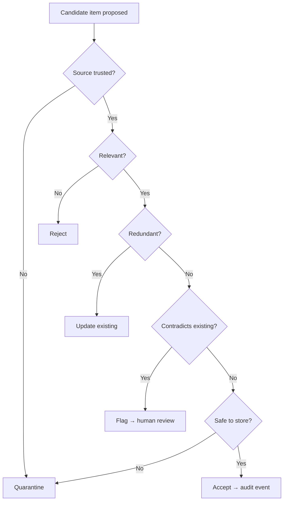
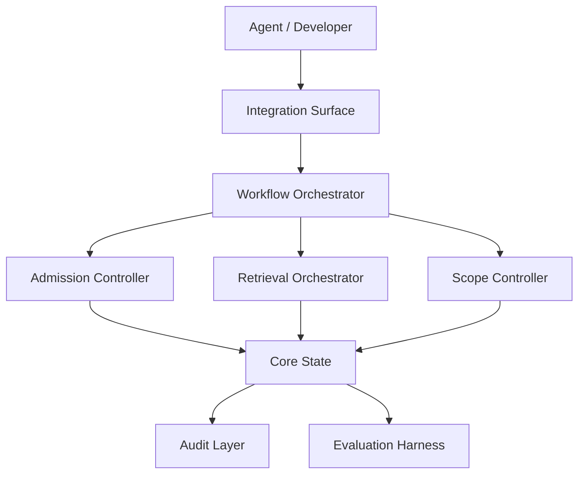

# Product Blueprint: Agent Memory Service

> Illustrative example generated from `sample_inputs/strong_report_excerpt.md`.
> Implementation-neutral by design. Citations are fictional, matching the
> sample report.

## Contents

- [1. Executive Product Thesis](#1-executive-product-thesis)
- [2. Source Research Interpretation](#2-source-research-interpretation)
- [3. Target Users and System Actors](#3-target-users-and-system-actors)
- [4. Product Goals and Non-Goals](#4-product-goals-and-non-goals)
- [5. Research-to-Product Translation Map](#5-research-to-product-translation-map)
- [6. Adopt / Adapt / Merge / Defer / Reject Decisions](#6-adopt--adapt--merge--defer--reject-decisions)
- [7. Core Product Capabilities](#7-core-product-capabilities)
- [8. Workflow Model](#8-workflow-model)
- [9. Logical Architecture](#9-logical-architecture)
- [10. Conceptual Information Model](#10-conceptual-information-model)
- [11. Decision Policies](#11-decision-policies)
- [12. Risk, Governance, and Safety Model](#12-risk-governance-and-safety-model)
- [13. Evaluation Strategy](#13-evaluation-strategy)
- [14. MVP Scope](#14-mvp-scope)
- [15. Roadmap and Future Extensions](#15-roadmap-and-future-extensions)
- [16. Open Questions and Validation Plan](#16-open-questions-and-validation-plan)
- [17. Handoff Notes for Technical Design](#17-handoff-notes-for-technical-design)
- [18. Traceability Appendix](#18-traceability-appendix)

---

## 1. Executive Product Thesis

### 1.1 Product Thesis

> This product is a local-first memory service for AI coding agents that
> helps them retain and reuse trustworthy cross-session knowledge by using
> evaluator-gated admission, scoped records, and hybrid retrieval, while
> controlling memory poisoning, leakage across scopes, and unverifiable
> deletion.

### 1.2 Product Type

Local-first service with an agent-facing integration surface.

### 1.3 Primary Outcome

Agents recall relevant prior context without re-deriving it, and only
trustworthy knowledge becomes durable.

### 1.4 Main Risks Controlled

Memory poisoning, cross-scope leakage, low-value accumulation, and
deletion that cannot be verified.

### 1.5 Research Basis

- **Source report:** `agent-memory-research-report.md`
- **Pipeline runs integrated:** 1
- **Gap-closure rounds:** 2
- **Readiness verdict:** `HAS_GAPS`
- **Input quality:** strong

### 1.6 Generation Metadata

| Field | Value |
|---|---|
| Source report | `agent-memory-research-report.md` |
| Source report date | unknown |
| Pipeline runs integrated | 1 |
| Gap-closure rounds | 2 |
| Latest run ID | unknown |
| Source readiness verdict | `HAS_GAPS` |
| Blueprint skill version | 0.2.0 |
| Generated at | `<date>` |
| Output detail | standard |
| Target domain | AI coding-agent memory |

---

## 2. Source Research Interpretation

### 2.1 Source Report Summary

8 retained papers on agent memory across admission, retrieval, scoping,
and forgetting; two reviewer passes; converged after 2 rounds with 2 gaps
remaining.

### 2.2 Research-Derived Opportunity

A governed memory layer that admits, scopes, retrieves, and forgets agent
knowledge — the gated-write + scoping + hybrid-retrieval combination is the
defensible core.

### 2.3 Strongest Evidence

| Finding | Confidence | Citation |
|---|---|---|
| Evaluator-gated writes cut low-value memory | HIGH 🟢 | [2312.01234] |
| Hybrid BM25 + dense retrieval beats either alone | HIGH 🟢 | [Park et al., 2023] |
| Scoped memory limits leakage | HIGH 🟢 | [2401.05678] |

### 2.4 Weak or Unresolved Evidence

- 🟡 Hierarchical retrieval at scale [2401.05679].
- 🟡 Selective forgetting risks losing useful records [2402.01234].
- 🔴/ACADEMIC Optimal consolidation frequency — no consensus [2403.09999].

---

## 3. Target Users and System Actors

| Actor | Scope | Role | Needs | Interaction with Product |
|---|---|---|---|---|
| AI coding agent | Primary | Primary consumer | Read/write durable context | Proposes writes; issues retrieval queries |
| Developer | Primary | Owner/operator | Control, audit, correct memory | Reviews flagged items; deletes records |
| Admission Evaluator | System actor | Judge candidate writes | Gates every write | — |
| Audit Layer | System actor | Record decisions | Receives every admission/deletion event | — |

---

## 4. Product Goals and Non-Goals

### 4.1 Goals

- Admit only trustworthy, useful knowledge [2312.01234].
- Retrieve relevant records via hybrid search [Park et al., 2023].
- Keep records scoped and require explicit promotion [2401.05678].
- Make every admission and deletion auditable and verifiable (ENGINEERING gap).

### 4.2 Non-Goals

- Automatic consolidation scheduling (ACADEMIC gap — validate first).
- Hardware acceleration of embeddings (OUT_OF_SCOPE).
- Choosing storage/retrieval technology (technical-design skill).

---

## 5. Research-to-Product Translation Map

| Research Item | Type | Confidence | Product Primitive | Product Relevance | Citation |
|---|---|---|---|---|---|
| Evaluator-gated writes | mechanism | HIGH 🟢 | Memory Admission Workflow | critical | [2312.01234] |
| Hybrid retrieval | mechanism | HIGH 🟢 | Hybrid Retrieval Capability | critical | [Park et al., 2023] |
| Scoped memory + promotion | architecture_hint | HIGH 🟢 | Scoped Sharing & Promotion Model | critical | [2401.05678] |
| Memory taxonomy | taxonomy | HIGH 🟢 | Conceptual Information Model | useful | [2310.05338] |
| Deletion verification | engineering_gap | n/a | Deletion & Forgetting Verification | critical | (ENGINEERING) |
| Selective forgetting | mechanism | MEDIUM 🟡 | Forgetting Policy | useful | [2402.01234] |
| Consolidation frequency | academic_gap | LOW 🔴 | Validation requirement | optional | [2403.09999] |

---

## 6. Adopt / Adapt / Merge / Defer / Reject Decisions

| Source Idea | Citation | Decision | Product Translation | Rationale | MVP? |
|---|---|---|---|---|---|
| Evaluator-gated writes | [2312.01234] | ADOPT | Memory Admission Workflow | HIGH, central, safety-critical | Yes |
| Hybrid retrieval | [Park et al., 2023] | ADOPT | Hybrid Retrieval Capability | HIGH, core value path | Yes |
| Scoped memory + promotion | [2401.05678] | ADOPT | Scoped Sharing & Promotion | HIGH, controls leakage | Yes |
| Deletion verification | (ENGINEERING) | ADAPT | Deletion & Forgetting Verification | Safety-relevant gap, productionize | Yes |
| Hierarchical retrieval | [2401.05679] | DEFER | Future scaling extension | MEDIUM, only at large scale | No |
| Selective forgetting | [2402.01234] | ADAPT | Forgetting Policy (manual-first) | MEDIUM, risk of losing records | No |
| Auto consolidation | [2403.09999] | DEFER / VALIDATE | Open question + evaluation | ACADEMIC, no consensus | No |

---

## 7. Core Product Capabilities

### Capability 1: Memory Admission

**Purpose:** Decide whether a candidate write becomes durable state.
**Derived From:** Evaluator-gated writes [2312.01234].
**Confidence Basis:** HIGH 🟢. **Required for MVP:** Yes.

### Capability 2: Hybrid Retrieval

**Purpose:** Return relevant records by combining keyword and semantic
similarity. **Derived From:** [Park et al., 2023]. **Confidence Basis:**
HIGH 🟢. **Required for MVP:** Yes.

### Capability 3: Scoped Sharing & Promotion

**Purpose:** Keep records scoped (local/project/team) and require explicit
promotion. **Derived From:** [2401.05678]. **Confidence Basis:** HIGH 🟢.
**Required for MVP:** Yes.

### Capability 4: Deletion & Forgetting Verification

**Purpose:** Provide auditable, verifiable deletion. **Derived From:**
ENGINEERING gap. **Confidence Basis:** Design + engineering gap.
**Required for MVP:** Yes (safety baseline).

---

## 8. Workflow Model

### Workflow 1: Candidate Memory Admission

**Purpose:** Gate every write into durable state.
**Trigger:** An agent or process proposes a knowledge item.
**Actors:** Agent, Admission Evaluator, Audit Layer.
**Inputs:** Candidate item, source context, target scope, related records,
confidence signal.
**Preconditions:** Caller authenticated to a scope.
**Decision Gates:** source trusted? · relevant? · redundant? · contradicts
existing? · safe to store?
**Steps:** evaluate → classify → admit/update/quarantine/reject → emit
audit event.
**Outputs:** accepted record · updated record · rejected proposal ·
quarantined item · audit event.
**Failure Modes:** low-value stored · poisoned item stored · useful item
rejected · contradiction ignored · no audit trail.
**Success Criteria:** useful retained · harmful/low-value blocked ·
contradictions visible · decisions traceable.
**Traceability:** [2312.01234], [2401.05678].



### Workflow 2: Retrieval

**Trigger:** Agent issues a context query. **Inputs:** query, active scope.
**Decision gates:** scope filter → hybrid rank → freshness check.
**Outputs:** ranked records or empty result. **Failure modes:** stale or
out-of-scope records surfaced. **Success criteria:** relevant in-scope
records ranked first. **Traceability:** [Park et al., 2023], [2401.05678].

### Workflow 3: Verified Deletion

**Trigger:** Developer requests deletion. **Decision gates:** authorize →
delete → verify absence → audit. **Outputs:** tombstone + verification +
audit event. **Failure modes:** record resurfaces after deletion.
**Success criteria:** deleted records never retrieved again.
**Traceability:** ENGINEERING gap.

---

## 9. Logical Architecture

### 9.1 System Context

Agents and developers interact through an integration surface; a workflow
orchestrator routes proposals and queries through policy and state.

### 9.2 Architecture Overview



### 9.3 Core Logical Components

| Component | Responsibility | Inputs | Outputs | Owns Decisions | Does Not Own |
|---|---|---|---|---|---|
| Admission Controller | Gate writes | Candidate, context | Accept/quarantine/reject | Admission policy | Storage layout |
| Retrieval Orchestrator | Rank records | Query, scope | Ranked results | Ranking policy | Index internals |
| Scope Controller | Enforce scopes/promotion | Record, scope | Allow/deny/promote | Promotion policy | Auth backend |
| Audit Layer | Record decisions | Events | Append-only log | Retention policy | Business logic |

### 9.4 Control Flow

```text
Proposal → Orchestrator → Admission Controller → (Scope Controller) → Core State → Audit
Query    → Orchestrator → Scope Controller → Retrieval Orchestrator → ranked results
```

### 9.5 Information Flow

```text
Candidate → durable Memory Record (scoped) → retrievable result → tombstone on deletion
```

### 9.6 Trust and Policy Boundaries

Scope boundaries (local/project/team) are trust boundaries; promotion
crosses them only via the Scope Controller. The Audit Layer is append-only.

---

## 10. Conceptual Information Model

| Object | Purpose | Key Conceptual Fields | Lifecycle States | Relationships |
|---|---|---|---|---|
| Memory Record | Durable knowledge | content, scope, provenance, confidence | candidate→active→tombstoned | derived from Source Episode |
| Candidate Memory | Proposed write | content, source, target scope | proposed→admitted/rejected/quarantined | becomes Memory Record |
| Scope | Trust boundary | level, owner | local/project/team | contains Memory Records |
| Audit Event | Decision record | actor, decision, rationale | created (immutable) | references record |
| Tombstone | Deletion proof | record id, verified-at | created→verified | replaces Memory Record |

---

## 11. Decision Policies

| Policy | Purpose | Inputs | Decision Options | Default | Escalation | Traceability |
|---|---|---|---|---|---|---|
| Admission | Gate writes | trust, relevance, redundancy, safety | admit/update/quarantine/reject | quarantine (fail-closed) | human review on contradiction | [2312.01234] |
| Retrieval | Rank in scope | query, scope, freshness | return/empty | in-scope only | — | [Park et al., 2023] |
| Promotion | Widen scope | record, target scope | allow/deny | deny | developer approval | [2401.05678] |
| Forgetting | Remove records | request, references | tombstone/keep | manual-only (MVP) | flag if referenced | [2402.01234] |

---

## 12. Risk, Governance, and Safety Model

| Risk | Likelihood | Impact | Mitigation | Release Gate? | Traceability |
|---|---|---|---|---|---|
| Memory poisoning | Medium | High | Admission evaluator + quarantine; trusted-source check | Yes | [2312.01234] |
| Cross-scope leakage | Medium | High | Scope enforcement; promotion only via controller | Yes | [2401.05678] |
| Unverifiable deletion | Medium | High | Tombstone + post-delete verification + audit | Yes | ENGINEERING gap |
| Losing useful records | Medium | Medium | Manual-first forgetting; flag-before-delete | No | [2402.01234] |
| Premature auto-consolidation | Low | Medium | Defer until validated | No | [2403.09999] (ACADEMIC — unconfirmed) |

---

## 13. Evaluation Strategy

| Evaluation | Purpose | Scenario | Expected Behaviour | Success Metric | MVP Required? | Traceability |
|---|---|---|---|---|---|---|
| Admission precision | Block bad writes | Mixed good/poisoned candidates | Bad quarantined/rejected | No unsafe write admitted | Yes | [2312.01234] |
| Retrieval relevance | Right records | Query w/ known-relevant set | Relevant ranked first | Scenario precision/recall | Yes | [Park et al., 2023] |
| Scope isolation | No leakage | Cross-scope query | Out-of-scope excluded | Zero leakage | Yes | [2401.05678] |
| Deletion verification | Hard delete | Delete then re-query | Never resurfaces | 0 post-delete hits | Yes | ENGINEERING gap |
| Consolidation assumption | Test ACADEMIC gap | Vary cadence offline | Measurable quality effect | Documented finding | No | [2403.09999] |

---

## 14. MVP Scope

### 14.1 Core Value Path

- Memory Admission workflow + policy (fail-closed).
- Hybrid Retrieval with scope filtering.
- Scoped records (local/project) with explicit promotion.

### 14.2 Safety Baseline

- Verified deletion + tombstoning.
- Admission quarantine path for untrusted/poisoned candidates.

### 14.3 Evaluation Baseline

- Admission-precision and scope-isolation scenarios (§13).
- Post-delete re-query check (deleted records never resurface).

### 14.4 Explicitly Deferred from MVP

- Automatic consolidation scheduling (ACADEMIC — validate first; → Phase 4).
- Hierarchical retrieval (scaling extension; → Phase 3).
- Team-scope multi-tenant sharing (→ Phase 3).

### 14.5 MVP Success Definition

The MVP is successful if agents reuse prior context across sessions, no
unsafe or out-of-scope write is admitted in evaluation, and every deletion
is verifiable in the audit log.

---

## 15. Roadmap and Future Extensions

- **Phase 0 — Clarification:** confirm scope model and audit needs.
- **Phase 1 — Core MVP:** admission, hybrid retrieval, scoping, deletion.
- **Phase 2 — Governance hardening:** contradiction review, dedup at scale.
- **Phase 3 — Expansion:** team scope, hierarchical retrieval.
- **Phase 4 — Research extensions:** auto-consolidation *after* validation.

---

## 16. Open Questions and Validation Plan

| Question | Why It Matters | Validation Method | Blocks MVP? | Gap Source |
|---|---|---|---|---|
| Optimal consolidation frequency? | Affects auto-consolidation safety | Offline cadence sweep | No | ACADEMIC |
| Dedup correctness at repo scale? | Storage + recall quality | Scenario test on large corpus | No | ENGINEERING (MEDIUM) |
| Is manual forgetting sufficient for v1? | Avoids losing useful records | User study | No | [2402.01234] |

---

## 17. Handoff Notes for Technical Design

This document intentionally does not choose a tech stack. The next stage
must decide: runtime architecture, programming language, storage system,
indexing/search strategy, API style, agent integration mechanism, UI/CLI
surface, deployment model, repository structure, testing strategy,
security implementation, and migration strategy.

**Inputs for technical design:** workflows (§8), components (§9),
information model (§10), policies (§11), risks (§12), MVP (§14),
evaluations (§13), open questions (§16). **Unresolved ACADEMIC gaps still
applying:** optimal consolidation frequency [2403.09999].

---

## 18. Traceability Appendix

| Product Element | Derived From | Research Citation | Decision | Notes |
|---|---|---|---|---|
| Memory Admission | Evaluator-gated writes | [2312.01234] | ADOPT | Fail-closed |
| Hybrid Retrieval | Hybrid retrieval | [Park et al., 2023] | ADOPT | Core value |
| Scoped Sharing & Promotion | Scoped memory | [2401.05678] | ADOPT | Trust boundary |
| Deletion Verification | ENGINEERING gap | (gap) | ADAPT | Safety baseline |
| Forgetting Policy | Selective forgetting | [2402.01234] | ADAPT | Manual-first |
| Auto-consolidation | Consolidation freq. | [2403.09999] | DEFER / VALIDATE | ACADEMIC |

---

## Appendix A: Blueprint Quality-Gate Self-Check

| Gate | Status | Notes |
|---|---|---|
| Required sections + Contents present | PASS | All 18 sections + Contents. |
| Metadata integrity (no invented values) | PASS | 1 pipeline run / 2 gap-closure rounds kept distinct; skill version 0.2.0 from manifest. |
| Research traceability / source fidelity | PASS | Every capability cited; deletion verification marked as ENGINEERING gap. |
| Scope control (primary scope matches thesis) | PASS | Only agent + developer are Primary; no out-of-scope actors. |
| MVP discipline (core path vs. baselines) | PASS | 3 core-path capabilities; safety + evaluation baselines listed separately. |
| Implementation neutrality | PASS | No tech/vendor names; conceptual components only. |
| Risk honesty | PASS | Poisoning, leakage, unverifiable deletion are release gates. |
| Evaluation coverage | PASS | ≥1 scenario per core capability; deletion + scope-isolation covered. |
| Downstream usefulness | PASS | Two Mermaid diagrams; handoff lists what technical design must decide. |
