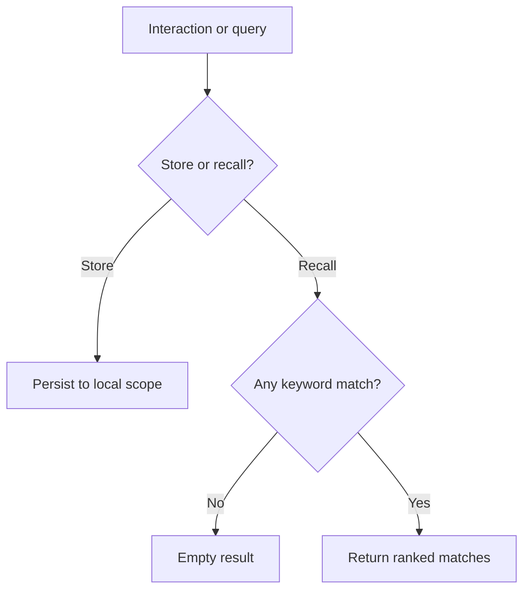
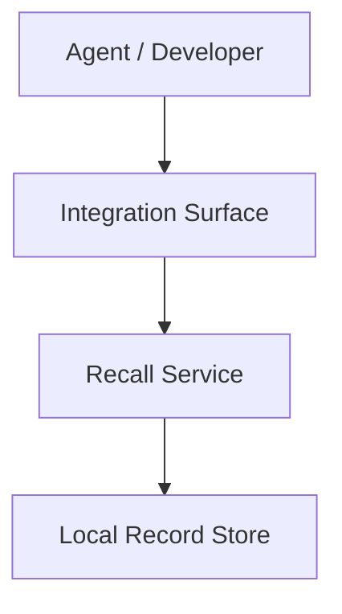

# Product Blueprint: Agent Session-Recall Helper

> Illustrative example generated from `sample_inputs/weak_report_excerpt.md`
> (input quality: **weak**). It models correct weak-input discipline — proceed,
> but mark missing areas as explicit **assumptions** and **open questions**
> rather than fabricating confidence — and the **lightweight** routing path
> (a small product whose complexity score matches its scope, unlike the
> complex golden fixture). Implementation-neutral; citations are fictional and
> limited to the single reference the weak source carries.
>
> Independently verified by `scripts/check_blueprint_coherence.py`: phase-clean
> and anchored, so it is a trustworthy weak-input expected-object.

## Contents

- [1. Executive Product Thesis](#1-executive-product-thesis)
- [2. Source Research Interpretation](#2-source-research-interpretation)
- [3. Target Users and System Actors](#3-target-users-and-system-actors)
- [4. Product Goals and Non-Goals](#4-product-goals-and-non-goals)
- [5. Research-to-Product Translation Map](#5-research-to-product-translation-map)
- [6. Adopt / Adapt / Merge / Defer / Reject Decisions](#6-adopt--adapt--merge--defer--reject-decisions)
- [7. Core Product Capabilities](#7-core-product-capabilities)
- [8. Workflow Model](#8-workflow-model)
- [9. Product Experience Direction](#9-product-experience-direction)
- [10. Logical Architecture](#10-logical-architecture)
- [11. Conceptual Information Model](#11-conceptual-information-model)
- [12. Decision Policies](#12-decision-policies)
- [13. Risk, Governance, and Safety Model](#13-risk-governance-and-safety-model)
- [14. Evaluation Strategy](#14-evaluation-strategy)
- [15. MVP Scope](#15-mvp-scope)
- [16. Roadmap and Future Extensions](#16-roadmap-and-future-extensions)
- [17. Open Questions and Validation Plan](#17-open-questions-and-validation-plan)
- [18. Handoff Notes for Technical Design](#18-handoff-notes-for-technical-design)
- [19. Recommended Next Stages](#19-recommended-next-stages)
- [20. Traceability Appendix](#20-traceability-appendix)
- [Appendix A: Blueprint Quality-Gate Self-Check](#appendix-a-blueprint-quality-gate-self-check)

---

## 1. Executive Product Thesis

### 1.1 Product Thesis

> This product is a minimal session-recall helper for an AI coding agent that
> stores past interactions in one local scope and returns them later by keyword,
> so the agent can reuse recent context. Whether stored memory is trustworthy,
> and whether embedding retrieval beats keyword recall, are **unresolved** and
> handled as open questions — not assumed.

### 1.2 Product Type

Local-first helper with an agent-facing integration surface.

### 1.3 Primary Outcome

The agent recalls recent prior interactions instead of re-deriving them.

### 1.4 Main Risks Controlled

Only weakly controlled at MVP: storing wrong or malicious memories is a known
worry with **no rigorous treatment in the source**, so it is carried as an open
risk, not a solved feature.

### 1.5 Research Basis

- **Source report:** `notes-on-ai-agent-memory.md`
- **Pipeline runs integrated:** 1
- **Gap-closure rounds:** 0
- **Readiness verdict:** not stated in source (weak input)
- **Input quality:** weak

### 1.6 Generation Metadata

| Field | Value |
|---|---|
| Source report | `notes-on-ai-agent-memory.md` |
| Source report date | unknown |
| Pipeline runs integrated | 1 |
| Gap-closure rounds | 0 |
| Latest run ID | unknown |
| Source readiness verdict | not stated (weak input) |
| Blueprint skill version | 0.8.0 |
| Generated at | `<date>` |
| Output detail | standard |
| Target domain | AI coding-agent memory |

> **Weak-input note:** the source has a research question and two loosely
> evidenced mechanisms but **no confidence grades and no gap classification**.
> Findings below are therefore marked as assumptions or open questions; no
> confidence grade is invented.

---

## 2. Source Research Interpretation

### 2.1 Source Report Summary

Informal notes: storing and retrieving past interactions "seems to help"
(anecdotal); keyword vs. embedding retrieval is "unclear"; remembering wrong or
malicious content is a worry with no rigorous treatment.

### 2.2 Research-Derived Opportunity

A minimal store-and-recall helper is buildable now; the trustworthiness and
retrieval-quality questions are validation work, not MVP guarantees.

### 2.3 Strongest Evidence

| Finding | Confidence | Citation |
|---|---|---|
| Storing/retrieving past interactions seems to help | LOW (anecdotal — source ungraded) | [2312.01234] |

### 2.4 Weak or Unresolved Evidence

- Keyword vs. embedding retrieval — **unresolved** in source (no comparison).
- Remembering wrong/malicious content — **worry, no rigorous treatment**.

---

## 3. Target Users and System Actors

| Actor | Scope | Role | Needs | Interaction with Product |
|---|---|---|---|---|
| AI coding agent | Primary | Primary consumer | Store and recall recent context | Writes interactions; issues recall queries |
| Developer | Primary | Owner/operator | Inspect and clear stored memory | Reviews and deletes records |

---

## 4. Product Goals and Non-Goals

### 4.1 Goals

- Store agent interactions in one local scope.
- Recall stored interactions by keyword [2312.01234] (anecdotal basis).

### 4.2 Non-Goals

- Guaranteeing memory trustworthiness (open safety question — validate first).
- Choosing keyword vs. embedding retrieval (open question — validate first).
- Choosing storage/retrieval technology (technical-design skill).

---

## 5. Research-to-Product Translation Map

| Research Item | Type | Confidence | Product Primitive | Product Relevance | Citation |
|---|---|---|---|---|---|
| Store/recall past interactions | mechanism | LOW (ungraded) | Session-Recall Capability | critical | [2312.01234] |
| Keyword vs. embedding retrieval | open_question | n/a | Retrieval-method validation | useful | (open) |
| Wrong/malicious memory | open_risk | n/a | Trust validation | critical | (open) |

---

## 6. Adopt / Adapt / Merge / Defer / Reject Decisions

| Source Idea | Citation | Decision | Product Translation | Rationale | MVP? |
|---|---|---|---|---|---|
| Store/recall interactions | [2312.01234] | ADAPT | Session-Recall Capability (keyword, one scope) | Only anecdotal support; keep minimal | Yes |
| Embedding retrieval | (open) | DEFER / VALIDATE | Retrieval-method validation | Source says "unclear which is better" | No |
| Memory-trust controls | (open) | DEFER / VALIDATE | Trust validation | No rigorous treatment in source | No |

---

## 7. Core Product Capabilities

### Capability 1: Session Recall

**Purpose:** Store agent interactions and return them by keyword within one
scope. **Derived From:** [2312.01234] (anecdotal). **Confidence Basis:** LOW
(source ungraded). **Required for MVP:** Yes.

---

## 8. Workflow Model

### Workflow 1: Store and Recall

**Purpose:** Persist an interaction, then recall it by keyword.
**Trigger:** The agent finishes an interaction or issues a recall query.
**Actors:** Agent, Developer.
**Inputs:** Interaction text (store) or query terms (recall), local scope.
**Preconditions:** A local scope exists.
**Decision Gates:** store or recall? · any keyword match?
**Steps:** store interaction → on recall, keyword-match within scope → return
matches or empty.
**Outputs:** stored record · ranked keyword matches · empty result.
**Failure Modes:** irrelevant recall · nothing stored · wrong/malicious content
stored (open risk).
**Success Criteria:** recent relevant interactions returned by keyword.
**Traceability:** [2312.01234].

**Staging note:** MVP-0 recall uses **keyword matching**, an available MVP-0
servicer. Whether embedding retrieval is better is an open question (§17); no
MVP gate depends on it. The anchors below make this staging machine-checkable.



<!-- coherence: id=wf1.gate.recall stage=MVP-0 requires=wf1.servicer.keyword -->
<!-- coherence: id=wf1.servicer.keyword stage=MVP-0 -->

---

## 9. Product Experience Direction

> UX intent only — no screen layout, wireframes, exact command syntax, or copy.

### 9.1 Primary Experience Thesis

The helper should feel like a small, predictable notebook the agent writes to
and reads back — with the honest caveat that stored content is not yet vetted.

### 9.2 Primary User / Operator

| User / Actor | Role in Product | Experience Need |
|---|---|---|
| AI coding agent | Stores/recalls context | Simple, predictable store/recall contract |
| Developer | Owns stored memory | Can inspect and clear records |

### 9.3 Primary Job-to-Be-Done

| User / Actor | Job-to-Be-Done | Success Outcome |
|---|---|---|
| AI coding agent | Recall recent context instead of re-deriving it | Relevant recent interactions returned by keyword |

### 9.4 Primary Interaction Mode

| Mode | Classification | MVP Stage | Rationale |
|---|---|---|---|
| API / agent-facing surface | primary surface | MVP-0 | The consumer is an agent; the value path is programmatic store/recall |

### 9.5 Secondary / Future Interaction Modes

| Mode | Classification | Stage | Reason Deferred | Revisit Trigger |
|---|---|---|---|---|
| CLI for developer inspection | secondary surface | MVP-1 | Not needed to prove recall | Developers need to inspect/clear memory |

### 9.6 Critical Trust, Control, and Transparency Requirements

| Requirement | Why It Matters | Architecture Impact |
|---|---|---|
| Developer can clear stored memory | Wrong/malicious content is an open risk | Requires a delete operation and a way to list records |

### 9.7 Human-in-the-Loop Experience

| Trigger | User Decision | Expected Product Support | MVP Stage |
|---|---|---|---|
| Developer suspects bad memory | Clear a record | List and delete stored records | MVP-1 |

### 9.8 Failure and Recovery Expectations

| Condition | User Impact | Expected Recovery Experience |
|---|---|---|
| Recall returns nothing | Agent lacks prior context | Empty result is explicit, not an error |

### 9.9 UX Assumptions for Architecture

| Assumption | Source | Reversible? | Revisit Trigger |
|---|---|---|---|
| Keyword recall is good enough for MVP | Assumption (source: retrieval method unresolved) | Yes | Recall quality proves inadequate |
| Stored memory is low-sensitivity | Assumption (source silent on data sensitivity) | Yes | Product handles sensitive data |

### 9.10 Product Experience Handoff to Architecture

| UX Decision | Architecture Impact |
|---|---|
| Agent-facing API MVP-0 | Requires a stable store/recall contract |
| Developer can clear memory | Requires list + delete operations |

---

## 10. Logical Architecture

### 10.1 System Context

An agent stores and recalls interactions through an integration surface backed
by a single local record store.

### 10.2 Architecture Overview



### 10.3 Core Logical Components

| Component | Responsibility | Inputs | Outputs | Owns Decisions | Does Not Own |
|---|---|---|---|---|---|
| Recall Service | Store and keyword-match records | Interaction, query | Stored record, matches | Keyword ranking | Storage layout |
| Local Record Store | Hold records in one scope | Records | Retrieved records | Retention | Ranking policy |

### 10.4 Control Flow

```text
Store  → Integration Surface → Recall Service → Local Record Store
Recall → Integration Surface → Recall Service → keyword match → ranked results
```

### 10.5 Information Flow

```text
Interaction → stored record (local scope) → keyword-matched result
```

### 10.6 Trust and Policy Boundaries

The single local scope is the only boundary at MVP; stored content is not yet
vetted (open risk). Cross-scope sharing is out of scope.

---

## 11. Conceptual Information Model

| Object | Purpose | Key Conceptual Fields | Lifecycle States | Relationships |
|---|---|---|---|---|
| Interaction Record | Stored interaction | content, keywords, created-at | stored→deleted | held by Local Scope |
| Local Scope | Container | owner | active | contains Interaction Records |

---

## 12. Decision Policies

| Policy | Purpose | Inputs | Decision Options | Default | Escalation | Traceability |
|---|---|---|---|---|---|---|
| Recall | Return matches | query, scope | return/empty | empty on no match | — | [2312.01234] |
| Deletion | Clear records | request | delete/keep | manual-only (MVP) | — | (open) |

---

## 13. Risk, Governance, and Safety Model

| Risk | Likelihood | Impact | Mitigation | Release Gate? | Traceability |
|---|---|---|---|---|---|
| Wrong/malicious memory stored | Unknown (source ungraded) | High | **No rigorous treatment in source.** MVP mitigation is a manual developer clear (ASSUMPTION); admission vetting is deferred to validation — not claimed as solved. | Release consideration (open) | (open — validate) |
| Irrelevant recall | Medium | Low | Keyword ranking; empty result is explicit | No | [2312.01234] |

> The high-impact trust risk is **not softened**: it is carried as an open,
> unmitigated concern with an explicit assumption, per weak-input discipline.

---

## 14. Evaluation Strategy

| Evaluation | Purpose | Scenario | Expected Behaviour | Success Metric | MVP Required? | Traceability |
|---|---|---|---|---|---|---|
| Recall relevance | Right records | Store then recall by keyword | Relevant records returned | Scenario precision | Yes | [2312.01234] |
| Retrieval-method comparison | Resolve open question | Keyword vs. embedding offline | Measurable difference | Documented finding | No | (open) |
| Trust validation | Resolve open risk | Inject bad memory | Detected or cleared | Documented finding | No | (open) |

---

## 15. MVP Scope

### 15.1 MVP-0 — Smallest Demonstrable Core

The smallest path that proves the thesis: the agent stores an interaction and
recalls it by keyword in one local scope.

- Session-Recall capability (store + keyword recall, one local scope).

### 15.2 MVP-1 — First Usable Version

- Developer can list and clear stored records.

### 15.3 Safety Baseline

- Manual developer clear of stored records — **MVP-1** (trust vetting is an open
  question, explicitly deferred to validation — not an MVP guarantee).

### 15.4 Evaluation Baseline

- Recall-relevance scenario (§14) — **MVP-0**.

### 15.5 Explicitly Deferred from MVP

| Item | Move To | Reason |
|---|---|---|
| Embedding retrieval | Phase 2 | Open question — validate vs. keyword first |
| Memory-trust vetting | Phase 2 | Open risk — no treatment in source |

### 15.6 MVP Success Definition

The MVP is successful if the agent reliably recalls recent stored interactions
by keyword within one scope in evaluation.

---

## 16. Roadmap and Future Extensions

- **Phase 0 — Clarification:** confirm data sensitivity and deployment.
- **Phase 1 — Core MVP:** store + keyword recall; developer clear.
- **Phase 2 — Validation:** keyword vs. embedding retrieval; memory-trust vetting.
- **Phase 3 — Expansion:** additional scopes, if a need is proven.

---

## 17. Open Questions and Validation Plan

| Question | Why It Matters | Validation Method | Blocks MVP? | Gap Source |
|---|---|---|---|---|
| Does embedding retrieval beat keyword recall? | Recall quality | Offline comparison | No | Open (source unresolved) |
| Can stored memory be trusted? | Safety | Inject-and-detect study | No (but release consideration) | Open (source: no treatment) |
| Is stored memory sensitive? | Privacy / deployment | Ask user; data review | No | Assumption pending confirmation |

<!-- coherence: id=sec17.oq.retrieval stage=open blocking=no -->
<!-- coherence: id=sec17.oq.trust stage=open blocking=no -->

No MVP control depends on either open question, so neither gates MVP-0. The
trust question is flagged as a release consideration to validate, not a blocker
silently assumed away.

---

## 18. Handoff Notes for Technical Design

This document intentionally does not choose a tech stack. The next stage must
decide: storage for records, keyword-match strategy, agent integration
mechanism, and the developer list/clear surface (constrained by the §9
agent-facing API primary mode).

**Inputs for technical design:** workflow (§8), product experience direction +
UX handoff (§9), components (§10), information model (§11), policies (§12), risks
(§13), MVP (§15), evaluations (§14), open questions (§17). **Unresolved questions
still applying:** retrieval-method choice and memory-trust vetting (§17).

---

## 19. Recommended Next Stages

> This is a small, lightweight product: the complexity score is low, so only a
> few gates are recommended and uncertain ones are deferred or routed to the
> user. Decisions are overrideable defaults. See
> `references/adaptive-stage-gate-routing.md`.

### 19.1 Pipeline Complexity Assessment

| Dimension | Score (0–3) | Reason |
|---|---:|---|
| User-facing complexity | 1 | Agent-facing API only; developer clear deferred to MVP-1 |
| Technical ambiguity | 1 | Store + keyword recall is well-understood; retrieval-method choice is deferred |
| Security / privacy risk | 2 | Memory-trust is an open risk; data sensitivity is unspecified |
| AI / LLM uncertainty | 1 | Keyword recall involves no model judgement at MVP |
| Integration complexity | 1 | Single agent-facing surface |
| Human-review complexity | 0 | No human-in-the-loop at MVP-0 |
| Testing / E2E importance | 1 | One recall-relevance scenario |

**Total Score:** 7 / 21
**Recommended Workflow Class:** lightweight (4–7)

> This complexity score is a **routing heuristic, not a formal project
> estimate**. It guides optional stage selection and should be revisited after
> architecture-design; it does not override human judgement or downstream review.

### 19.2 Stage Recommendations

> `Depends On` names the prerequisite stage/artifact (distinct from `Revisit
> Trigger`, the event that re-opens a DEFER).

| Stage | Decision | Depends On | Confidence | Reason | Blocks Next Step? | Revisit Trigger |
|---|---|---|---:|---|---|---|
| architecture-design | RUN | blueprint | High | Even a small product needs a store/recall contract and a delete surface defined (§10) | Yes | Always after blueprint |
| tech-stack-selection | RUN | architecture-design | Medium | One record store + keyword match is a small but real data-layer choice | No | After architecture-design defines the data flow |
| security-review | ASK_USER | architecture-design | Medium | Whether stored memory is sensitive is unspecified in the weak source; confirm data sensitivity before deciding to run | No | User confirms data sensitivity / deployment |
| ux-design | SKIP | — | Medium | No human-facing surface at MVP-0 (agent API only); the MVP-1 developer clear is a single trivial operation | No | A non-trivial human surface is added |
| test-design | DEFER | architecture-design | Medium | One recall scenario (§14) can wait for stable contracts | No | After architecture-design |
| architecture-update | DEFER | architecture-design + a changed downstream decision | High | No architecture document exists yet | No | After tech-stack-selection or security-review changes assumptions |
| architecture-reconciliation | DEFER | architecture-design + a conflict report | High | Only needed if downstream design conflicts with architecture | No | When a conflict is detected |

### 19.3 ASK_USER Decision Rationale

`security-review = ASK_USER` because the weak source does not state whether the
stored memory is sensitive or where the product is deployed. Rather than assume
a default, the pipeline should ask the user to confirm data sensitivity and
deployment before deciding whether a full security-review is warranted.

### 19.4 Recommended Pipeline

#### Recommended Linear Path

```text
research-pipeline
  -> blueprint
  -> architecture-design
  -> tech-stack-selection
  -> implementation-plan
```

#### Conditional Follow-up Gates

| Gate | Run When | Typical Input | Output |
|---|---|---|---|
| security-review | the user confirms stored memory is sensitive or deployment is untrusted | architecture + data-sensitivity answer | trust-boundary review |
| test-design | architecture-design has produced stable store/recall contracts | architecture contracts | E2E scenarios |
| architecture-update | tech-stack-selection or security-review changes storage / data-flow assumptions | architecture + changed decisions | patched architecture |
| architecture-reconciliation | a downstream stage conflicts with architecture states or contracts | architecture + conflict report | reconciliation recommendations |

### 19.5 Stage-Gate Decision Log

| Decision | Evidence | Risk if Wrong | Revisit Trigger |
|---|---|---|---|
| architecture-design = RUN | A store/recall contract + delete surface must be defined (§10) | Ad-hoc build; unclear contract | Always after blueprint |
| security-review = ASK_USER | Data sensitivity unspecified in the weak source (§17) | Over- or under-investing in security | User confirms sensitivity |
| ux-design = SKIP | No human surface at MVP-0; MVP-1 clear is trivial (§9) | Wasted UX work | A non-trivial human surface is added |

---

## 20. Traceability Appendix

| Product Element | Derived From | Research Citation | Decision | Notes |
|---|---|---|---|---|
| Session Recall | Store/recall interactions | [2312.01234] | ADAPT | Anecdotal basis; keyword, one scope |
| Retrieval-method validation | Keyword vs. embedding | (open) | DEFER / VALIDATE | Source unresolved |
| Trust validation | Wrong/malicious memory | (open) | DEFER / VALIDATE | No treatment in source |

---

## Appendix A: Blueprint Quality-Gate Self-Check

| Gate | Status | Finding | Required Action | Blocks Technical Design? |
|---|---|---|---|---|
| Required sections + Contents present | PASS | All 20 sections + Contents. | — | No |
| Metadata integrity (no invented values) | PASS | Weak input recorded as weak; 1 pipeline run / 0 gap-closure rounds; skill version 0.8.0 from manifest. | — | No |
| Weak-input discipline (no invented confidence) | PASS | Ungraded findings marked LOW/anecdotal or open; no HIGH grade fabricated. | — | No |
| Thesis emphasis (primary architecture) | PASS | Thesis leads with store + keyword recall; trust/retrieval framed as open. | — | No |
| Research traceability / source fidelity | PASS | Only the one source citation used; other claims marked open/assumption. | — | No |
| Scope control (primary scope matches thesis) | PASS | Only agent + developer are Primary. | — | No |
| MVP discipline (MVP-0 vs MVP-1 vs baselines) | PASS | MVP-0 is 1 capability; developer clear deferred to MVP-1. | — | No |
| Cross-phase coherence (deterministic guard) | PASS | Anchors present; the MVP-0 recall gate's servicer is MVP-0 (keyword match); no MVP control depends on the non-blocking open questions — `scripts/check_blueprint_coherence.py` passes with 0 FAILs. | — | No |
| Risk honesty | PASS | High-impact memory-trust risk carried as open + unmitigated, not softened. | — | No |
| Implementation neutrality | PASS | No tech/vendor names; conceptual components only. | — | No |
| Evaluation coverage | PASS | Recall-relevance scenario for the core capability. | — | No |
| Downstream usefulness | PASS | Two Mermaid diagrams; handoff lists what technical design must decide. | — | No |

**Product Experience Gate** (§9) — "Blocks Technical Design?" ≡ "Blocks
Architecture?".

| Gate | Status | Finding | Required Action | Blocks Technical Design? |
|---|---|---|---|---|
| Primary user identified | PASS | Agent (primary) + developer (owner). | — | No |
| Primary job-to-be-done defined | PASS | Recall recent context by keyword. | — | No |
| Primary experience thesis defined | PASS | Small predictable notebook with an honest caveat. | — | No |
| Primary interaction mode selected | PASS | Agent-facing API at MVP-0, with rationale. | — | No |
| Interaction modes classified | PASS | API = primary surface; CLI = secondary surface. | — | No |
| Trust / control / transparency needs defined | PASS | Developer can clear stored memory. | — | No |
| Human-in-the-loop experience defined where needed | PASS | Developer clear surfaced at MVP-1. | — | No |
| Failure / recovery expectations defined | PASS | Empty recall is explicit, not an error. | — | No |
| UX assumptions handed off to architecture | WARNING | "Keyword recall is good enough" and "memory is low-sensitivity" are assumptions. | Confirm recall adequacy and data sensitivity before architecture commits | No |

**Adaptive Stage-Gate Recommendation Gate** (§19) — "Blocks Technical Design?"
means "blocks the recommended next stage".

| Gate | Status | Finding | Required Action | Blocks Technical Design? |
|---|---|---|---|---|
| Recommended Next Stages section exists | PASS | §19 has complexity (7/21) + a stage-recommendation table. | — | No |
| Controlled decision values used (RUN / SKIP / DEFER / ASK_USER) | PASS | All four decision types are used. | — | No |
| RUN decisions have evidence | PASS | architecture-design / tech-stack cite §10. | — | No |
| SKIP decisions have reason | PASS | ux-design SKIP: no human surface at MVP-0 (§9). | — | No |
| DEFER decisions have revisit trigger | PASS | test-design, architecture-update/-reconciliation each name a trigger. | — | No |
| ASK_USER decisions identify missing info | PASS | security-review ASK_USER names data sensitivity as the missing info. | — | No |
| Product Experience Direction informs recommendations | PASS | Agent-only API (§9) drives ux-design SKIP. | — | No |
| Stage table has Depends On | PASS | §19.2 names each prerequisite. | — | No |
| Linear-path vs conditional-gates split | PASS | §19.4 separates the linear path from a Conditional Follow-up Gates table. | — | No |
| ASK_USER absence explained | PASS | §19.3 justifies the one ASK_USER (data sensitivity). | — | No |
| Complexity score labelled heuristic | PASS | §19.1 flags the 7/21 score as a routing heuristic to revisit. | — | No |
