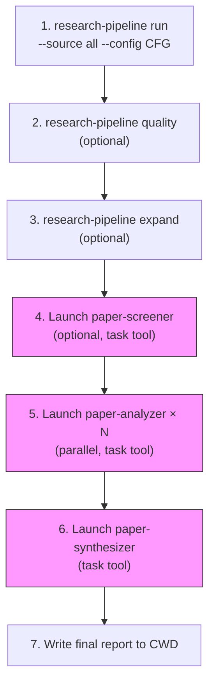

# Sub-Agent Orchestration

Three specialized sub-agents extend the pipeline with intelligent analysis.
Each runs in its **own context window** via the task tool, reads artifacts
from disk, and returns a summary.

## Launching Sub-Agents

Use the task tool with the appropriate agent type. Each agent should be
given the full file paths to its input artifacts — agents are stateless
and do not share context with the main conversation.

### Model Configuration (REQUIRED)

**All sub-agents MUST be launched with `model: "claude-opus-4.6"`** for
maximum reasoning quality. This is a non-negotiable requirement — academic
paper analysis demands the highest-quality reasoning available.

```
task(
  agent_type: "paper-screener" | "paper-analyzer" | "paper-synthesizer",
  model: "claude-opus-4.6",   # ← ALWAYS set this
  mode: "background",
  ...
)
```

| Agent | Model | Rationale |
|-------|-------|-----------|
| paper-screener | `claude-opus-4.6` | Nuanced relevance judgments require deep understanding |
| paper-analyzer | `claude-opus-4.6` | Methodology assessment and critique need expert-level reasoning |
| paper-synthesizer | `claude-opus-4.6` | Cross-paper synthesis, contradiction detection, and gap analysis are the most demanding tasks |

**Do NOT use** `claude-opus-4.6-fast`, `claude-haiku-4.5`, or other cheaper
models for sub-agents — the quality degradation on academic analysis tasks
is significant.

## paper-screener

Intelligent relevance screening beyond keyword matching.

**When to use**: After search/screen stage, when BM25 shortlist quality is
uncertain or when broad topic terms produce noisy results.

**Agent type**: `paper-screener`

**Prompt template**:
```
Screen the search candidates for the research topic below.

RUN DIRECTORY: /absolute/path/to/runs/<run_id>
RESEARCH TOPIC: <topic>
SHORTLIST FILE: /absolute/path/to/runs/<run_id>/screen/cheap_scores.jsonl

CUSTOM INSTRUCTIONS:
<focus areas, exclusion criteria, etc.>

Return: total screened, shortlist count, top papers with relevance, coverage gaps.
```

**Reads**: `runs/{run_id}/search/candidates.jsonl` or `screen/cheap_scores.jsonl`
**Writes**: screening assessment (returned in agent output)

## paper-analyzer

Deep per-paper analysis after PDF-to-Markdown conversion.

**When to use**: After convert stage, for detailed individual paper analysis.
Launch **one agent per paper** in parallel for efficiency.

**Agent type**: `paper-analyzer`

**Outputs**: `{arxiv_id}_analysis.md` (human-readable) + `{arxiv_id}_analysis.json` (structured)

**Prompt template** (one per paper):
```
Analyze this paper for the research topic below.

RESEARCH TOPIC: <topic>
PAPER FILE: /absolute/path/to/runs/<run_id>/convert/markdown/<arxiv_id>.md

CUSTOM INSTRUCTIONS:
<focus on methodology, evaluate scalability, compare architectures, etc.>

Return: title, rating (1-5 stars), methodology assessment, key findings,
transferable patterns, limitations, and key quotes with section references.
Write both the Markdown analysis and the structured JSON output.
```

**Reads**: Individual Markdown files from `convert/markdown/` or `supplemental/markdown/`
**Writes**: Analysis returned in agent output; optionally written to `analysis/`

## paper-synthesizer

Cross-paper synthesis: themes, contradictions, gaps, recommendations.

**When to use**: After paper-analyzer agents have completed for all papers.

**Agent type**: `paper-synthesizer`

**Outputs**: `synthesis_report.md` (human-readable) + `synthesis_results.json` (structured)

**Prompt template**:
```
Synthesize findings from N analyzed papers on "<topic>".

## Paper Summaries
<paste the summary output from each paper-analyzer agent>

## Paper Analysis JSON Files
<list paths to {arxiv_id}_analysis.json files for structured data>

## Analysis Requirements
1. Design pattern convergence across papers
2. Unified metric/framework synthesis
3. Gap analysis
4. Confidence-graded findings (High/Medium/Low with evidence counts)
5. Methodology comparison table
6. Trade-off analysis for key design decisions
7. Reproducibility assessment per paper
8. Readiness assessment (if system-building mode):
   IMPLEMENTATION_READY | HAS_GAPS | NOT_APPLICABLE
   Classify gaps as ENGINEERING or ACADEMIC (if HAS_GAPS)

Write both the Markdown synthesis and the structured JSON output to:
/absolute/path/to/runs/<run_id>/synthesis/
```

**Reads**: Paper analysis summaries (provided in prompt)
**Writes**: `runs/{run_id}/synthesis/synthesis_report.md`

## Typical Orchestration Flow


