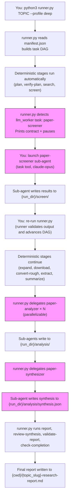

# Sub-Agent Orchestration

Three specialized sub-agents extend the pipeline with intelligent analysis.
Each runs in its **own context window** via the task tool, reads artifacts
from disk, and returns a summary.

## Launching Sub-Agents

Use the task tool with the appropriate agent type. Each agent should be
given the full file paths to its input artifacts — agents are stateless
and do not share context with the main conversation.

### Model Configuration

Sub-agents **inherit the session model by default**, which is almost always the
right choice for academic paper analysis: it keeps the analysis at the same
capability as the driving session without pinning a specific model. Only
override the model *downward* for clearly mechanical sub-tasks (formatting,
extracting already-located fields) to save cost.

Prefer the **model aliases** the harness exposes (`opus`, `sonnet`, `haiku`, or
the current-flagship alias) over dated model ids — a pinned id such as
`claude-opus-4.6` goes stale and may be rejected by current Agent tooling.

```
task(
  agent_type: "paper-screener" | "paper-analyzer" | "paper-synthesizer",
  # omit `model` to inherit the session model (recommended), or use an alias:
  # model: "opus",
  mode: "background",
  ...
)
```

| Agent | Recommended model | Rationale |
|-------|-------------------|-----------|
| paper-screener | inherit session (or `opus`) | Nuanced relevance judgments need deep understanding |
| paper-analyzer | inherit session (or `opus`) | Methodology assessment and critique need expert reasoning |
| paper-synthesizer | inherit session (or `opus`) | Cross-paper synthesis, contradiction detection, and gap analysis are the most demanding |

Avoid downgrading synthesis/analysis to small models — the quality drop on
academic tasks is significant. Mechanical steps may use a smaller alias.

### Missing agent types (fallback)

The agent-type registry loads at session start, so agent types installed or
symlink-repaired mid-session may report as unavailable until the next session.
When `paper-screener` / `paper-analyzer` / `paper-synthesizer` is missing, fall
back to a **general-purpose agent** instructed to read the corresponding role
definition at `~/.claude/agents/<name>.md` and follow the same contract
(inputs, outputs, and quality bar) as the dedicated agent.

## paper-screener

Intelligent relevance screening beyond keyword matching.

**When to use**: After search/screen stage, when BM25 shortlist quality is
uncertain or when broad topic terms produce noisy results.

**Agent type**: `paper-screener`

**Prompt template**:
```
Screen the search candidates for the research topic below.

RUN DIRECTORY: /absolute/path/to/runs/<run_id>
RESEARCH TOPIC: <topic>
SHORTLIST FILE: /absolute/path/to/runs/<run_id>/screen/cheap_scores.jsonl

CUSTOM INSTRUCTIONS:
<focus areas, exclusion criteria, etc.>

Return: total screened, shortlist count, top papers with relevance, coverage gaps.
```

**Reads**: `runs/{run_id}/screen/cheap_scores.jsonl` (BM25 scores from the screen stage; falls back to `search/candidates.jsonl`)
**Writes**: `{run_dir}/screen/screened.jsonl` (improved shortlist replacing the BM25 result)

## paper-analyzer

Deep per-paper analysis after PDF-to-Markdown conversion.

**When to use**: After convert stage, for detailed individual paper analysis.
Launch **one agent per paper** in parallel for efficiency.

**Agent type**: `paper-analyzer`

**Outputs**: `{arxiv_id}.analysis.md` (human-readable) + `{arxiv_id}.analysis.json` (structured)

**Prompt template** (one per paper):
```
Analyze this paper for the research topic below.

RESEARCH TOPIC: <topic>
PAPER FILE: /absolute/path/to/runs/<run_id>/convert/markdown/<arxiv_id>.md

CUSTOM INSTRUCTIONS:
<focus on methodology, evaluate scalability, compare architectures, etc.>

Return: title, rating (1-5 stars), methodology assessment, key findings,
transferable patterns, limitations, and key quotes with section references.
Write both the Markdown analysis and the structured JSON output.
```

**Reads**: Individual Markdown files from `convert/markdown/` or `supplemental/markdown/`
**Writes**: `{run_dir}/analysis/<paper_id>.analysis.json` (one per paper; required — runner validates on re-run)

## paper-synthesizer

Cross-paper synthesis: themes, contradictions, gaps, recommendations.

**When to use**: After paper-analyzer agents have completed for all papers.

**Agent type**: `paper-synthesizer`

**Outputs**: `{run_dir}/analysis/synthesis.md` (human-readable) +
`{run_dir}/analysis/synthesis.json` (structured).
Note: `synthesis_report.md`, `synthesis_report.json`, and `synthesis_traceability.json`
are written by the deterministic CLI `summarize` stage, not this sub-agent.

**Prompt template**:
```
Synthesize findings from N analyzed papers on "<topic>".

## Paper Summaries
<paste the summary output from each paper-analyzer agent>

## Paper Analysis JSON Files
<list paths to {arxiv_id}.analysis.json files for structured data>

## Analysis Requirements
1. Design pattern convergence across papers
2. Unified metric/framework synthesis
3. Gap analysis
4. Confidence-graded findings (High/Medium/Low with evidence counts)
5. Methodology comparison table
6. Trade-off analysis for key design decisions
7. Reproducibility assessment per paper
8. Readiness assessment (if system-building mode):
   IMPLEMENTATION_READY | HAS_GAPS | NOT_APPLICABLE
   Classify gaps as ENGINEERING or ACADEMIC (if HAS_GAPS)
9. Human-readable Markdown: concise sections, LaTeX for formulas, vertical
   Mermaid diagrams (`flowchart TD`/`TB`) for charts, and internal links
   between contents, themes, papers, evidence, gaps, and recommendations

Write both the Markdown synthesis and the structured JSON output to:
/absolute/path/to/runs/<run_id>/analysis/
```

**Reads**: Paper analysis summaries (provided in prompt)
**Writes**: `runs/{run_id}/analysis/synthesis.md` and `runs/{run_id}/analysis/synthesis.json`

## Typical Orchestration Flow

> **Important**: Sub-agents are **never launched directly** by you.
> They are launched by `runner.py` as delegated LLM tasks.
> You must always invoke `runner.py` and let it decide when to delegate.
> See `SKILL.md` Rule #1.


