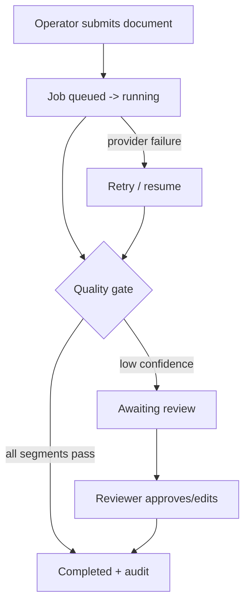

# UX Design: LLM-Agent Document Translation System

> Worked example output of the `ux-design` skill, produced from
> `translation_architecture_example.md` (and the matching blueprint). It is an
> **example**, not a universal recommendation; UX choices are justified for this
> architecture only. It consumes architecture constraints and never re-decides
> architecture, the tech stack, or visual design.

## Contents

- [1. Generation Metadata](#1-generation-metadata)
- [Update History](#update-history)
- [2. Source Architecture Interpretation](#2-source-architecture-interpretation)
- [3. Source Blueprint Interpretation](#3-source-blueprint-interpretation)
- [4. UX Goals and Non-Goals](#4-ux-goals-and-non-goals)
- [5. Skill Operator UX](#5-skill-operator-ux)
- [6. Target Software UX](#6-target-software-ux)
- [7. Users, Roles, and Jobs-to-Be-Done](#7-users-roles-and-jobs-to-be-done)
- [8. UX Decision Summary](#8-ux-decision-summary)
- [9. UX Assumptions](#9-ux-assumptions)
- [10. User Stories](#10-user-stories)
- [11. Core User Journeys](#11-core-user-journeys)
- [12. Surface-Specific UX](#12-surface-specific-ux)
- [13. Human-in-the-Loop UX](#13-human-in-the-loop-ux)
- [14. Trust, Control, and Transparency UX](#14-trust-control-and-transparency-ux)
- [15. Error, Empty, Loading, Degraded, and Recovery States](#15-error-empty-loading-degraded-and-recovery-states)
- [16. Notifications and Feedback](#16-notifications-and-feedback)
- [17. Accessibility and Internationalization](#17-accessibility-and-internationalization)
- [18. UX Observability](#18-ux-observability)
- [19. Acceptance Criteria](#19-acceptance-criteria)
- [20. E2E Scenario Seeds](#20-e2e-scenario-seeds)
- [21. Architecture Feedback / Required Architecture Updates](#21-architecture-feedback--required-architecture-updates)
- [22. Handoff Notes for Implementation Planning](#22-handoff-notes-for-implementation-planning)
- [Appendix A. UX Quality-Gate Self-Check](#appendix-a-ux-quality-gate-self-check)

---

## 1. Generation Metadata

| Field | Value |
|---|---|
| Source architecture design | `translation_architecture_example.md` |
| Source architecture version | 0.6.0 |
| Source blueprint | `translation_blueprint_excerpt.md` |
| Source tech-stack | `translation_tech_stack_example.md` |
| UX skill version | 0.1.0 |
| Generated at | 2026-06-07 |
| Operating mode | hybrid |
| Assumptions made | 3 |
| Output detail | standard |

## Update History

| Date | Source Architecture | UX Version | Change Type | Affected Sections | Notes |
|---|---|---|---|---|---|
| 2026-06-07 | `translation_architecture_example.md` | 0.1.0 | initial | all | First UX design from architecture |

## 2. Source Architecture Interpretation

The architecture is a deterministic translation spine with a single bounded LLM
step, conditional reviewer escalation (MVP-1), append-only tamper-evident audit,
correlation-ID observability, and an `external_allowed` data-egress assumption.
Surfaces: CLI + thin HTTP API (MVP-0), reviewer API (MVP-1); no Web/TUI/MCP yet.

| Architecture Fact | Source (§) | UX Relevance | Present? |
|---|---|---|---|
| Interaction surfaces (CLI + API; reviewer API) | §9/§23.2 | §12 covers CLI + API only | yes |
| State model (queued/running/completed/failed + awaiting_review) | §14/§23.3 | User-visible states | yes |
| Human-review flow | §23.6 | §13 human-review UX | yes |
| Data-egress policy (`external_allowed`) | §17.9 | §14 transparency UX | yes |
| Observability events (job_submitted, review_decided) | §16/§23.8 | §16/§18 feedback | yes |
| Failure/recovery (retry, checkpoint/resume) | §18 | §15 recovery states | yes |

## 3. Source Blueprint Interpretation

Blueprint §9 Product Experience Direction: the product should feel like a
deterministic, auditable backbone — the operator submits a document and trusts
the result is auditable; low-confidence work is reviewable, not silently
auto-accepted; the AI step is invisible except as per-segment confidence. §19
routed `ux-design = DEFER` (produce Experience Architecture + UX handoff first),
which this design now fulfils. UX intent is preserved, not changed.

## 4. UX Goals and Non-Goals

### 4.1 UX Goals
- Make submission and status trivial for a technical operator (CLI/API).
- Make quality risk and review status obvious before the user trusts output.
- Make failures recoverable without data loss.

### 4.2 UX Non-Goals
- No pixel-level visual design, no Web UI in MVP, no final copy.
- No executable tests; no architecture or tech-stack decisions.

## 5. Skill Operator UX

> How the user drives the `ux-design` (and sibling design-chain) skill workflow
> itself. Separate from §6.

- **Invocation:** `ux-design` (auto-discover), or `ux-design <architecture-design.md>`,
  with optional `--blueprint` / `--stack` and `--mode interactive|automatic|hybrid`.
- **Input auto-detection:** searches the working dir, `./docs`, `./design`,
  `./artifacts` for `*-architecture-design.md`; derives the slug by stripping
  `-architecture-design.md`.
- **Missing-input behaviour:** if no architecture design is found, STOP with
  "Run `architecture --mode design` first…"; missing architecture sections are
  reported in §2 as `missing` and the run continues with a warning unless a
  UX-critical fact is absent.
- **Clarification behaviour:** hybrid by default — asks only high-impact UX
  questions one at a time, each with a recommended answer + default.
- **Assumption recording:** assumptions land in §9 with confidence + high-risk
  flags.
- **Resume / update behaviour:** a prior `<slug>-ux-design.md` is updated via
  new / regenerate / patch / resume with an appended Update History row.
- **Output:** `<topic-slug>-ux-design.md`, co-located with the architecture;
  inline fallback if unwritable.
- **Uncertainty / escalation:** ambiguous architecture selection → ASK_USER;
  gaps the UX needs become §21 architecture feedback, never silent invention.

## 6. Target Software UX

> How the operator, reviewer, and API clients interact with the translation
> product. Each behaviour maps to an architecture fact.

| Concern | Experience | Architecture Fact (§) |
|---|---|---|
| Job submission | Operator runs one CLI command (or POSTs) with the document + domain profile; gets a job ID + correlation ID | §12 API contract / §23.2 |
| Progress | Operator polls status; sees % segments complete | §16 observability / §14 states |
| Output review | On completion, operator gets the translation + a quality summary + an audit link | §23.4/§16 |
| Quality-risk surfacing | Quality summary states "review required" or "no review required" (simplified by default; `--verbose` for technical scores) | §23.3 |
| Human review | Reviewer opens the review queue, sees flagged segments, approves/edits | §23.6 |
| Error recovery | On provider failure the job retries; on hard failure the operator sees the failed reason and can resubmit/resume | §18 |
| Audit / egress inspection | Operator can fetch the per-segment audit and the data-egress record for a job | §16/§17.9 |
| Agent / MCP interaction | n/a — the architecture defers MCP (ADR-0006) | §11/ADR-0006 |

## 7. Users, Roles, and Jobs-to-Be-Done

| User / Role | MVP or Future | Job-to-Be-Done | Success Outcome |
|---|---|---|---|
| Translation operator (technical) | MVP-0 | Translate a long document with an audit trail | Trusted translation + audit, minimal steps |
| Human reviewer | MVP-1 | Resolve low-confidence segments | Escalated segments approved/edited, audited |
| API/automation client | MVP-0 | Submit + poll jobs programmatically | Machine-readable job lifecycle |

## 8. UX Decision Summary

| # | UX Decision | Choice | Source | Reversible? | Review Trigger |
|---|---|---|---|---|---|
| 1 | Primary MVP surface | CLI-first + thin API | architecture §9 | yes | Web demand from non-technical users |
| 2 | Quality-risk display | Simplified by default, `--verbose` technical | clarification | yes | Reviewer feedback |
| 3 | Human review delivery | In-product review queue (not export packet) | clarification | yes | Reviewer tooling needs |

## 9. UX Assumptions

| Assumption | Source | Confidence | Reversible? | Review Trigger |
|---|---|---:|---|---|
| Operators are technical enough for CLI + structured output | inferred | Medium | yes | First non-technical user |
| Human review is an exception path, not the common case | architecture §23.6 | Medium | yes | Review volume data |
| Showing data-egress status on the result (not every prompt) is sufficient | inferred (**high-risk**) | Low | yes | Security review / user objection |

## 10. User Stories

## User Story: Submit a translation job (CLI)

**As a:** translation operator  **I want:** to submit a document and get an audited translation  **So that:** I can trust and defend the result

### Preconditions
- A valid source document and a domain profile exist; external model use is allowed.

### Main Flow
1. Operator submits the document + domain profile via CLI.
2. System creates a job (state `queued` → `running`) and returns a job ID + correlation ID.
3. Operator polls status and sees progress.
4. System completes; operator gets the translation + quality summary + audit link.

### Alternative Flows
- Machine-readable mode: operator passes `--json` and parses the job lifecycle.

### Failure / Recovery Flows
- Provider unavailable → job retries with backoff; operator sees "delayed, retrying".
- Hard failure → state `failed` with a reason; operator resubmits or resumes from the last checkpoint.

### User-Visible States
- Queued → `queued`; Translating → `running`; Completed → `completed`; Failed → `failed` (all from §14).

### Acceptance Criteria
- Given a valid document and allowed egress, when the operator submits, then a job is created and a translation + "review not required" summary + audit record are produced.

### E2E Scenario Seeds
- Successful CLI translation, no review required (see §20).

## User Story: Resolve a low-confidence segment (reviewer)

**As a:** human reviewer  **I want:** to see and resolve flagged segments  **So that:** low-confidence output is corrected before release

### Preconditions
- A completed job has segments below the confidence threshold (`awaiting_review`).

### Main Flow
1. Reviewer opens the review queue and sees flagged segments (source + proposal + issue).
2. Reviewer approves, edits, or rejects each segment.
3. System records each decision as an audit event and clears `awaiting_review`.

### Alternative Flows
- Reviewer requests a rerun of a segment.

### Failure / Recovery Flows
- Reviewer timeout → the job stays `awaiting_review`; it is never silently auto-accepted.

### User-Visible States
- Needs review → `running` + `awaiting_review` flag; Completed → `completed`.

### Acceptance Criteria
- Given a flagged segment, when the reviewer approves it, then an audit event `review_decided` is recorded and the segment is marked resolved.

### E2E Scenario Seeds
- Reviewer approves an escalated segment (see §20).

## 11. Core User Journeys



## 12. Surface-Specific UX

### 12.1 CLI UX
Command groups (conceptually): submit, status, result, audit, review. Human-readable
output by default; `--json` for machine-readable. Progress shown as % segments
complete. Non-zero exit codes for failed/blocked jobs; errors printed with the
correlation ID. No final flag names are fixed here.

### 12.2 Web / GUI UX
Not used in MVP. A future review console is noted in §21 as a Polish item.

### 12.3 TUI UX
Not used by this architecture.

### 12.4 AI Skill UX
The operator may drive the pipeline through the design-chain skills; the skill
auto-detects inputs, asks high-impact questions, records assumptions, and writes
the output document (see §5).

### 12.5 MCP UX
Not used by this architecture (MCP deferred, ADR-0006).

### 12.6 API / Automation UX
Job submission returns a job ID + correlation ID; status is polled; errors are
machine-readable; submission is idempotent by client-supplied key; batch is a
loop over single-job submission in MVP.

## 13. Human-in-the-Loop UX

| Trigger | Reviewer Sees First | Reviewer Can Do | Audit Event (§) | Surface |
|---|---|---|---|---|
| Segment confidence < threshold | Source + proposed translation + the quality issue | approve / edit / reject / request rerun | `review_requested`, `review_decided` (§16) | Reviewer API (MVP-1) |

## 14. Trust, Control, and Transparency UX

| User Trust Need | What the User Sees | When | Architecture Support (§) |
|---|---|---|---|
| "Was my document sent to a third party?" | Data-egress record for the job | On the result (assumption: not every prompt) | §17.9 |
| "Why was this flagged for review?" | The per-segment quality issue | In the review queue | §23.6 |
| "Nothing changed silently" | Per-segment audit (input ref, model, proposal, gate result) | On demand | §13/§17 |

## 15. Error, Empty, Loading, Degraded, and Recovery States

| State / Condition | User Sees | User Can Do | System Does | E2E Scenario? |
|---|---|---|---|---|
| Empty state | "No jobs yet" | Submit a job | — | no |
| Loading / progress | "% segments complete" | Wait / cancel | Stream progress per segment | yes |
| Validation error | "Invalid document/profile" + reason | Fix input, resubmit | Reject before creating a job | yes |
| Provider unavailable | "Delayed, retrying" | Wait / cancel | Retry with backoff; fallback per §18 | yes |
| Quality probe unavailable | "Quality check unavailable — review required" | Wait / accept review path | Force review; never auto-accept | yes |
| Human review required | "N segments awaiting review" | Open review queue | Hold `awaiting_review` | yes |
| Degraded output | "Partial / degraded — review required" | Review / rerun | Mark review-required (architecture policy) | yes |
| Permission denied | "Not permitted" + reason | Request access | Deny + audit | no |

## 16. Notifications and Feedback

| Event | User Feedback | Surface | Architecture Event (§) |
|---|---|---|---|
| Job completed | "Done — review required? yes/no" | CLI/API | `job_completed` (§16) |
| Review needed | "N segments awaiting review" | CLI/API | `review_requested` |
| Provider retry | "Delayed, retrying" | CLI/API | retry metric (§16) |

## 17. Accessibility and Internationalization

CLI output must be screen-reader-friendly and parseable (structured `--json`).
The product translates between languages, so result encoding and text direction
must be preserved; locale of the CLI messages themselves is out of MVP scope.
No visual styling is defined here.

## 18. UX Observability

| Interaction Event | Signal | Where (§16 architecture observability) |
|---|---|---|
| Job submitted | `job_submitted` + correlation ID | audit + metric |
| Review decided | `review_decided` + actor | audit |
| Result fetched | `result_read` | log |

## 19. Acceptance Criteria

| # | User Story | Acceptance Criterion (observable + testable) |
|---|---|---|
| 1 | Submit translation | Given allowed egress + valid input, when submitted, then a job is created and a translation + "review not required" + audit record are produced |
| 2 | Reviewer resolves segment | Given a flagged segment, when approved, then `review_decided` is audited and the segment is resolved |
| 3 | Provider failure | Given a provider outage, when submitting, then the job retries and the operator sees "delayed, retrying" without data loss |

## 20. E2E Scenario Seeds

```gherkin
Feature: Translation job submission

Scenario: Successful CLI translation with no review required
  Given a valid English academic paper
  And a valid academic domain profile
  And external model use is allowed
  When the operator submits a translation job
  Then the system creates a translation job
  And the operator sees progress
  And the system returns a Chinese translation
  And the quality summary says review is not required
  And an audit record is created

Scenario: Low-confidence segment escalates to human review
  Given a document with a low-confidence segment
  When the operator submits a translation job
  Then the job state becomes awaiting review
  And the segment appears in the reviewer queue

Scenario: Reviewer approves an escalated segment
  Given a job awaiting review with one flagged segment
  When the reviewer approves the segment
  Then a review_decided audit event is recorded
  And the job completes

Scenario: Provider outage is recovered without data loss
  Given the external provider is unavailable
  When the operator submits a translation job
  Then the operator sees a retrying status
  And the job resumes from the last checkpoint when the provider recovers
```

## 21. Architecture Feedback / Required Architecture Updates

| Finding | Severity | Architecture Gap | Recommended Architecture Change | Blocks Implementation Planning? |
|---|---|---|---|---|
| Progress UX needs per-segment granularity | Warning | §16 emits job-level progress but the CLI progress UX needs a per-segment progress event | Add a `segment_progressed` observability event | no |
| "Review required because probe unavailable" needs a distinct user-visible reason | Warning | §14 has a `probe-unavailable` condition flag but no user-facing review-reason field | Add a review-reason field to the review artifact | no |
| Web review console deferred | Polish | No Web surface in MVP | Consider a Web review surface post-MVP if review volume grows | no |

**Reconcile decision:** Run `architecture --mode reconcile
translation_architecture_example.md translation-system-ux-design.md` to add the
`segment_progressed` event and the review-reason field. None of the findings
block implementation planning.

## 22. Handoff Notes for Implementation Planning

- **MVP UX slice:** CLI submit → progress → result + quality summary + audit, single document, no reviewer.
- **Surfaces in MVP:** CLI + thin API. Reviewer API at MVP-1.
- **Stories that must become E2E tests:** Submit translation; Provider failure recovery; Reviewer approval (MVP-1) — see §20.
- **Human-review UX readiness:** ready, pending the §21 review-reason field (Warning, non-blocking).
- **Open UX questions deferred:** whether degraded output is ever user-accepted without review.
- **What implementation planning should NOT re-decide:** the §8 UX decisions (CLI-first, simplified quality display, in-product review).

> Stay on the UX side of the boundary: experience, flows, acceptance criteria,
> and E2E seeds are in scope. Executable tests, architecture/tech-stack changes,
> and pixel-level visual design are not.

## Appendix A. UX Quality-Gate Self-Check

| Gate | Status | Finding | Required Action | Blocks Implementation Planning? |
|---|---|---|---|---|
| Source architecture consumed | PASS | §2 reflects surfaces, states, review, egress, observability | — | no |
| Product Experience Direction preserved | PASS | §3 carries the blueprint §9 thesis unchanged | — | no |
| Skill Operator UX defined | PASS | §5 separate from §6 | — | no |
| Target Software UX defined | PASS | §6 maps each behaviour to an architecture fact | — | no |
| User stories defined | PASS | §10 stories have flows, states, acceptance criteria | — | no |
| Failure/recovery flows defined | PASS | §15 + per-story failure flows | — | no |
| Human-review UX defined where needed | PASS | §13 defines the reviewer flow (architecture has review) | — | no |
| E2E scenario seeds generated | PASS | §20 Gherkin seeds, not executable tests | — | no |
| Architecture feedback section present | WARNING | §21 present with two Warning findings | Run `architecture --mode reconcile` to add the progress event + review-reason field | no |

> Status legend: **PASS** (complete + consistent), **WARNING** ("PASS with
> warning" — acceptable direction, needs cleanup; non-blocking but carries a
> required action), **FAIL** (missing/false/out-of-scope).
