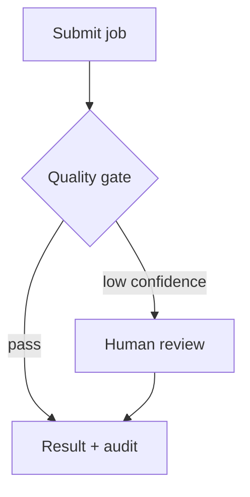

# UX Design: <Project Name>

> Skeleton for the `ux-design` skill output. Replace every `<…>` placeholder.
> Keep the section order and headings. Co-locate the file with the source
> architecture as `<topic-slug>-ux-design.md`.
>
> This is a **user-story-driven** UX design, not a screen-drawing document. It
> consumes architecture constraints and never re-decides architecture or the
> tech stack, writes executable tests, or produces pixel-level visual design.

## Contents

- [1. Generation Metadata](#1-generation-metadata)
- [Update History](#update-history)
- [2. Source Architecture Interpretation](#2-source-architecture-interpretation)
- [3. Source Blueprint Interpretation](#3-source-blueprint-interpretation)
- [4. UX Goals and Non-Goals](#4-ux-goals-and-non-goals)
- [5. Skill Operator UX](#5-skill-operator-ux)
- [6. Target Software UX](#6-target-software-ux)
- [7. Users, Roles, and Jobs-to-Be-Done](#7-users-roles-and-jobs-to-be-done)
- [8. UX Decision Summary](#8-ux-decision-summary)
- [9. UX Assumptions](#9-ux-assumptions)
- [10. User Stories](#10-user-stories)
- [11. Core User Journeys](#11-core-user-journeys)
- [12. Surface-Specific UX](#12-surface-specific-ux)
- [13. Human-in-the-Loop UX](#13-human-in-the-loop-ux)
- [14. Trust, Control, and Transparency UX](#14-trust-control-and-transparency-ux)
- [15. Error, Empty, Loading, Degraded, and Recovery States](#15-error-empty-loading-degraded-and-recovery-states)
- [16. Notifications and Feedback](#16-notifications-and-feedback)
- [17. Accessibility and Internationalization](#17-accessibility-and-internationalization)
- [18. UX Observability](#18-ux-observability)
- [19. Acceptance Criteria](#19-acceptance-criteria)
- [20. E2E Scenario Seeds](#20-e2e-scenario-seeds)
- [21. Architecture Feedback / Required Architecture Updates](#21-architecture-feedback--required-architecture-updates)
- [22. Handoff Notes for Implementation Planning](#22-handoff-notes-for-implementation-planning)
- [Appendix A. UX Quality-Gate Self-Check](#appendix-a-ux-quality-gate-self-check)

---

## 1. Generation Metadata

| Field | Value |
|---|---|
| Artifact Type | ux_design |
| Topic Slug | `<stable-pipeline-slug>` |
| Project Name | `<Project Name>` |
| Skill Name | ux-design |
| Mode | NOT_APPLICABLE |
| Source architecture design | `<filename>` |
| Source architecture version | `<version/hash or unknown>` |
| Source blueprint | `<filename or unknown>` |
| Source tech-stack | `<filename or unknown>` |
| UX skill version | `<from manifest.json version or unknown>` |
| Generated at | `<date>` |
| Operating mode | interactive / automatic / hybrid |
| Assumptions made | `<N>` (= §9 rows) |
| Output detail | concise / standard / detailed |

> Do not invent metadata. Use `unknown` when unavailable.

## Update History

| Date | Source Architecture | UX Version | Change Type | Affected Sections | Notes |
|---|---|---|---|---|---|
| <YYYY-MM-DD> | `<architecture filename>` | 0.1.0 | initial | all | First UX design from architecture |

> New documents include the initial row. Updates append a new row. Never delete
> prior rows. Change Type ∈ {initial, regenerate, patch, resume}.

## Cross-Skill Artifact Contract

> Conforms to the Cross-Skill Artifact Contract
> (`references/artifact-contract.md`).

### Source Artifacts Consumed

| Artifact Role | Path | Required? | How Used |
|---|---|---:|---|
| architecture_design | `<path>` | yes | Surfaces, state model, contracts, review flow, egress |
| product_blueprint | `<path or —>` | no | §9 Product Experience Direction (UX intent) |
| architecture_tech_stack | `<path or —>` | no | Stack constraints (read-only) |

### Resolved Input Artifacts

| Candidate | Selected? | Confidence | Reason |
|---|---:|---:|---|
| `<path>-architecture-design.md` | yes | High | Exact topic slug and expected title |

> `NOT_APPLICABLE — all input artifacts were explicitly supplied by the user.`
> when the user passed every file.

### Contract Field Map

| Contract Field | Where in this document |
|---|---|
| Generation Metadata | §1 |
| Decision Register | §8 UX Decision Summary |
| Assumptions | §9 UX Assumptions |
| Open Questions | §22 Handoff Notes (open UX questions) |
| Recommended Next Stage | §21 Architecture Feedback (reconcile decision) + §22 |
| Quality-Gate Self-Check | Appendix A (incl. the Cross-Skill Artifact Contract Gate) |

## 2. Source Architecture Interpretation

<What this UX design found in the architecture: project name, primary
interaction surfaces, actors/roles, state model, main workflows, human-review
flow, security/trust boundaries, data-egress policy, observability events,
failure/recovery model, the Experience Architecture section, and the UX handoff.
Mark any required section that is `missing`.>

| Architecture Fact | Source (§) | UX Relevance | Present? |
|---|---|---|---|
| Interaction surfaces | §… | Which surfaces UX covers | yes/no/missing |
| State model | §… | User-visible states map here | yes/no/missing |
| Human-review flow | §… | §13 human-review UX | yes/no/missing |
| Data-egress policy | §… | §14 transparency UX | yes/no/missing |
| Observability events | §… | §16/§18 feedback | yes/no/missing |

## 3. Source Blueprint Interpretation

<If the blueprint is present, summarize its §9 Product Experience Direction
(experience thesis, primary user, JTBD, interaction modes, trust/control/
transparency, human-in-the-loop, failure/recovery expectations) and §19
ux-design routing. If no blueprint, state "No blueprint found — UX intent taken
from the architecture's Experience Architecture only" as a recorded warning.>

## 4. UX Goals and Non-Goals

### 4.1 UX Goals
- <goal>

### 4.2 UX Non-Goals
- <e.g. no pixel-level visual design; no executable tests; no architecture/stack
  decisions>

## 5. Skill Operator UX

> How the user drives the **skill workflow itself**. Kept separate from §6.

- **Invocation:** <`ux-design`, explicit forms, `--mode`>
- **Input auto-detection:** <what is detected; search order; slug derivation>
- **Missing-input behaviour:** <STOP message; how missing sections are reported>
- **Clarification behaviour:** <interactive / automatic / hybrid; one question at
  a time>
- **Assumption recording:** <how assumptions + high-risk flags surface>
- **Resume / update behaviour:** <new / regenerate / patch / resume; Update
  History>
- **Output:** <`<topic-slug>-ux-design.md`; inline fallback>
- **Uncertainty / escalation:** <how uncertainty is reported; ASK_USER>

## 6. Target Software UX

> How the end user (and agents / MCP clients) interacts with the **product being
> designed**. Each behaviour maps to an architecture fact.

| Concern | Experience | Architecture Fact (§) |
|---|---|---|
| Job submission | <…> | <surface §> |
| Progress | <…> | <observability / state §> |
| Output review | <…> | <…> |
| Quality-risk surfacing | <…> | <…> |
| Human review | <… or n/a> | <review flow §> |
| Error recovery | <…> | <failure/recovery §> |
| Audit / egress inspection | <…> | <audit / egress §> |
| Agent / MCP interaction | <… or n/a> | <MCP §> |

## 7. Users, Roles, and Jobs-to-Be-Done

| User / Role | MVP or Future | Job-to-Be-Done | Success Outcome |
|---|---|---|---|
| <role> | MVP / Future | <JTBD> | <outcome> |

## 8. UX Decision Summary

| # | UX Decision | Choice | Source | Reversible? | Review Trigger |
|---|---|---|---|---|---|
| 1 | <e.g. primary MVP surface> | <e.g. CLI-first> | architecture / blueprint / clarification | yes/no | <trigger> |

## 9. UX Assumptions

| Assumption | Source | Confidence | Reversible? | Review Trigger |
|---|---|---:|---|---|
| <assumption> | architecture / blueprint / inferred | High / Medium / Low | yes/no | <trigger> |

> Flag high-risk assumptions (e.g. data-egress shown only on request; human
> review is rare; CLI users accept JSON output; MCP users are trusted agents;
> review-packet export is sufficient for MVP).

## 10. User Stories

> See `templates/user-story-template.md`. Each major story has preconditions,
> main + alternative + failure/recovery flows, user-visible states (resolving to
> the architecture state model), acceptance criteria, and E2E seeds.

## User Story: <Story Name>

**As a:** <role>  **I want:** <goal>  **So that:** <value>

### Preconditions
- <…>

### Main Flow
1. <…>

### Alternative Flows
- <…>

### Failure / Recovery Flows
- <…>

### User-Visible States
- <state → architecture lifecycle state / condition flag>

### Acceptance Criteria
- <observable, testable outcome>

### E2E Scenario Seeds
- <one-line pointer; expanded in §20>

## 11. Core User Journeys

<End-to-end journeys across stories/surfaces (e.g. submit → progress → review →
recover → audit). A Mermaid `journey` or `flowchart` is encouraged for the main
journey.>



## 12. Surface-Specific UX

> Include only surfaces the architecture uses. Mark the rest "not used by this
> architecture". See `references/surface-ux-guide.md`.

### 12.1 CLI UX
### 12.2 Web / GUI UX
### 12.3 TUI UX
### 12.4 AI Skill UX
### 12.5 MCP UX
### 12.6 API / Automation UX

## 13. Human-in-the-Loop UX

> Required when the architecture has a human-review flow; otherwise state n/a.

| Trigger | Reviewer Sees First | Reviewer Can Do | Audit Event (§) | Surface |
|---|---|---|---|---|
| <low-confidence segment> | <source / output / issues> | approve / reject / edit / rerun | <audit event> | <surface> |

## 14. Trust, Control, and Transparency UX

| User Trust Need | What the User Sees | When | Architecture Support (§) |
|---|---|---|---|
| <e.g. "was my data sent externally?"> | <egress status> | every job / on request | <egress §> |

## 15. Error, Empty, Loading, Degraded, and Recovery States

| State / Condition | User Sees | User Can Do | System Does | E2E Scenario? |
|---|---|---|---|---|
| Empty state | <…> | <…> | <…> | yes/no |
| Loading / progress | <…> | <…> | <…> | yes/no |
| Validation error | <…> | <…> | <…> | yes/no |
| Provider unavailable | <…> | <…> | <…> | yes/no |
| Quality probe unavailable | <…> | <…> | <…> | yes/no |
| Human review required | <…> | <…> | <…> | yes/no |
| Degraded output | <…> | <…> | <…> | yes/no |
| Permission denied | <…> | <…> | <…> | yes/no |

## 16. Notifications and Feedback

| Event | User Feedback | Surface | Architecture Event (§) |
|---|---|---|---|
| <job completed> | <…> | <…> | <…> |

## 17. Accessibility and Internationalization

<Accessibility expectations (structured output, keyboard navigation, screen-reader
friendliness for any UI) and i18n needs (e.g. translated content direction,
locale). Keep at the UX-requirement level, not styling. State n/a items.>

## 18. UX Observability

| Interaction Event | Signal | Where (§16 architecture observability) |
|---|---|---|
| <job submitted> | <…> | <…> |

> Which user interactions should be observable for UX quality / product
> analytics, mapped onto the architecture's observability events.

## 19. Acceptance Criteria

| # | User Story | Acceptance Criterion (observable + testable) |
|---|---|---|
| 1 | <story> | <criterion> |

## 20. E2E Scenario Seeds

> Gherkin-style seeds, not executable tests. See
> `references/e2e-scenario-seed-guide.md` and
> `templates/e2e-scenario-template.md`. Pipeline: user story → acceptance
> criteria → **E2E scenario seed** → implementation-plan test task → executable
> test.

```gherkin
Feature: <capability>

Scenario: <happy path>
  Given <precondition>
  When <user action>
  Then <observable outcome>
  And an audit record is created
```

## 21. Architecture Feedback / Required Architecture Updates

> **Mandatory section.** See `references/architecture-feedback-guide.md`.

| Finding | Severity | Architecture Gap | Recommended Architecture Change | Blocks Implementation Planning? |
|---|---|---|---|---|
| <finding> | Blocking / Warning / Polish | <gap> | <change> | yes/no |

**Reconcile decision:** <"No architecture reconciliation required." OR "Run
`architecture --mode reconcile <architecture-design.md> <ux-design.md>`".>

## 22. Handoff Notes for Implementation Planning

- **MVP UX slice:** <the smallest end-to-end experience to build first>
- **Surfaces in MVP:** <which surfaces>
- **Stories that must become E2E tests:** <list / link §20>
- **Human-review UX readiness:** <ready / needs reconcile>
- **Open UX questions deferred:** <list>
- **What implementation planning should NOT re-decide:** <UX decisions locked in
  §8>

> Stay on the UX side of the boundary: experience, flows, acceptance criteria,
> and E2E seeds are in scope. Executable tests, architecture/tech-stack changes,
> and pixel-level visual design are not — those belong to later stages.

## Appendix A. UX Quality-Gate Self-Check

| Gate | Status | Finding | Required Action | Blocks Implementation Planning? |
|---|---|---|---|---|
| Source architecture consumed | PASS / WARNING / FAIL | <finding> | <action> | yes/no |
| Product Experience Direction preserved | PASS / WARNING / FAIL | <finding> | <action> | yes/no |
| Skill Operator UX defined | PASS / WARNING / FAIL | <finding> | <action> | yes/no |
| Target Software UX defined | PASS / WARNING / FAIL | <finding> | <action> | yes/no |
| User stories defined | PASS / WARNING / FAIL | <finding> | <action> | yes/no |
| Failure/recovery flows defined | PASS / WARNING / FAIL | <finding> | <action> | yes/no |
| Human-review UX defined where needed | PASS / WARNING / FAIL | <finding> | <action> | yes/no |
| E2E scenario seeds generated | PASS / WARNING / FAIL | <finding> | <action> | yes/no |
| Architecture feedback section present | PASS / WARNING / FAIL | <finding> | <action> | yes/no |

> Status legend: **PASS** (complete + consistent), **WARNING** ("PASS with
> warning" — acceptable direction, needs cleanup; non-blocking but carries a
> required action), **FAIL** (missing/false/out-of-scope). Never mark a section
> PASS when a known gap remains.

### Cross-Skill Artifact Contract Gate

| Gate | Status | Finding | Required Action |
|---|---|---|---|
| Generation metadata present (Artifact Type + Topic Slug) | PASS / WARNING / FAIL | <finding> | <action> |
| Topic slug present and stable | PASS / WARNING / FAIL | <finding> | <action> |
| Source artifacts listed | PASS / WARNING / FAIL | <finding> | <action> |
| Resolved input artifacts recorded (when discovery is used) | PASS / WARNING / FAIL / NOT_APPLICABLE | <finding> | <action> |
| Decisions and assumptions separated | PASS / WARNING / FAIL | §8 decisions vs §9 assumptions | <action> |
| Open questions assigned to a next stage | PASS / WARNING / FAIL | §22 | <action> |
| Recommended next stage present | PASS / WARNING / FAIL | §21 / §22 | <action> |

> See `references/artifact-contract.md`.
